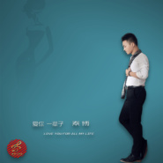

爱你一辈子要爱就爱一辈子
============================

|  |  |
| :--: | :-- |
| [ 爱你一辈子要爱就爱一辈子](https://emumo.xiami.com/album/2102670883) | **艺人**: [秦博](../index.md) **语种**: 国语 **唱片公司**: 秦博音乐工作室 **发行时间**: 2011年02月08日 **专辑类别**: 录音室专辑 **专辑风格**: 国语流行 Mandarin Pop, 流行 Pop **播放数**: 20007 **收藏数**: 3 **评论数**: 0  |

## 简介

 
 

秦博演绎的年度最佳正能量金曲《爱你一辈子》以爱情为主线，主题立意就是爱就真爱，爱就爱一辈子，歌曲阐述了爱的真谛，唯美的旋律是爱的见证，让恋爱中的男男女女领略到艺术之美的同时，从中受到正面教育；一首歌成为流行，是因为它写出了这个时代的影子，网络上此起彼伏的翻唱让这首《爱你一辈子》走入了多少人的心中，因为爱情永远是现代男男女女永恒的主题，听这样一首甜蜜情歌无疑是幸福的；充满无限爱意的浪漫情歌《爱你一辈子》 如阳光般袭来，温暖你我的心。
 

      《爱你一辈子》一经发行，就吸引了大批歌迷的关注，各大网站的点击量也是屡屡被刷新，成为了时下最火爆的歌曲之一；轻柔的曲调与歌词完美的搭配，哼唱出世间美丽的爱情故事！
 

    《爱你一辈子》（又名《要爱就爱一辈子》）已通过国家版权局登记注册、中国音协登记注册以及公证处作品公证保护；《爱你一辈子》著作权所属方秦博音乐工作室独家合法拥有词曲编完整版权，同时对上述作品已经公开出版的录音录像制品享有完整的邻接权；而秦博也是该作品唯一一个合法演唱者！重视音乐人的创作，捍卫保护音乐版权！
 

 

## 曲目

## 评论

|  |  |  |  |
| :-- | :-- | :-- | :-- |
