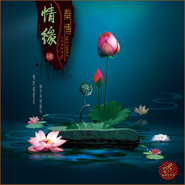

情缘
============================

|  |  |
| :--: | :-- |
| [ 情缘](https://emumo.xiami.com/album/2102853170) | **艺人**: [秦博](../index.md) **语种**: 国语 **唱片公司**: 秦博音乐工作室 **发行时间**: 2017年09月08日 **专辑类别**: 录音室专辑 **专辑风格**: 流行 Pop, 国语流行 Mandarin Pop, 华语唱作人 Chinese Singer-Songwriter **播放数**: 953 **收藏数**: 5 **评论数**: 10  |

## 简介

人生几何，缘起缘灭，转瞬即逝，犹如白驹过隙匆匆掠过，徒留下一串印记，给人回味。着墨在心灵平静，静而后能安，安而后能虑，虑而后能得，放下贪嗔痴念，尘缘杂念，散发慈悲善念；秦博最新心灵音乐曲风《情缘》，带给您宁静与祥和。 

## 曲目

## 评论

|  |  |  |
| :-- | :-- | :-- |
|  [虾米用户](https://emumo.xiami.com/u/337918928)   2017-11-30 10:15 赞(0) 踩(0) | 
佛歌
 |
|  [虾米用户](https://emumo.xiami.com/u/328452466)   2017-10-04 20:45 赞(0) 踩(0) | 
心境常欢乐, 紧握情难播。 少分相思， 多一分拥有。 嗡 阿玛 惹尼 祖文地耶 梭哈。 嗡 阿玛 惹尼 祖文地耶 梭哈。 嗡 阿玛 惹尼 祖文地耶 梭哈。 嗡 阿玛 惹尼 祖文地耶 梭哈。 月儿的圆缺， 划出了你我， 情缘已过， 微风轻吹走， 落叶细说愁， 从容得自由， 情缘已过， 平静人享受。
 |
|  [虾米用户](https://emumo.xiami.com/u/327838033)  2017-10-01 21:49 赞(0) 踩(0) | 
支持
 |
|  [虾米用户](https://emumo.xiami.com/u/327838033)  2017-10-01 21:49 赞(0) 踩(0) | 
男低音好听
 |
|  [虾米用户](https://emumo.xiami.com/u/326186807) 一起走过的日子… 2017-09-28 10:25 赞(0) 踩(0) | 
心境常欢乐
 |
|  [虾米用户](https://emumo.xiami.com/u/325990551)   2017-09-27 10:16 赞(0) 踩(0) | 
一花一世界，一叶一菩提，一方一净土，一笑一尘缘。一些人，一些事，闯进生活，得到了，失去了。驻足的，成了过往；本来的，成了曾经。只是，当我们觉察时，却是再也回不去了。生活中，有些事，注定成为故事；有些人，注定成为故人；有些路，注定要一个人走。从相识、相伴到怨别，也许，经历了，心就坚强了；走多了，路就踏实了；看惯了，心就淡然了.
 |
|  [虾米用户](https://emumo.xiami.com/u/325990551)   2017-09-27 10:10 赞(0) 踩(0) | 
任时光飞逝，我祈祷明天。
 |
|  [虾米用户](https://emumo.xiami.com/u/326873853)  2017-09-26 08:59 赞(1) 踩(0) | 
生命就是一场瘾。上瘾。过瘾。戒瘾。小至一首歌曲，一款网络游戏，大至一段爱恋，一生事业。生命由无数的瘾构成的，只不过是深浅不一。我们逃出一个瘾，又落入另外一个，枉然了挣扎的意义。
 |
|  [虾米用户](https://emumo.xiami.com/u/326186807) 一起走过的日子… 2017-09-22 08:51 赞(1) 踩(0) | 
喜欢秦博的声音
 |
|  [虾米用户](https://emumo.xiami.com/u/325608663)   2017-09-20 19:29 赞(0) 踩(0) | 
喜欢
 |
