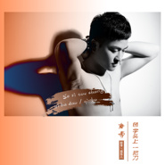

色字头上一把刀
============================

|  |  |
| :--: | :-- |
| [ 色字头上一把刀](https://emumo.xiami.com/album/2102867044) | **艺人**: [秦博](../index.md) **语种**: 国语 **唱片公司**: 秦博音乐工作室 **发行时间**: 2017年10月01日 **专辑类别**: EP, 单曲 **专辑风格**: 国语流行 Mandarin Pop, 华语唱作人 Chinese Singer-Songwriter **播放数**: 3335 **收藏数**: 7 **评论数**: 8  |

## 简介

秦博全新写实单曲【色字头上一把刀】，用歌声折射了色欲与金钱的社会现象，敬劝男人&nbsp;色字头上一把刀，也奉劝着男人别为美色着迷，过分贪恋易被削。很多身陷牢笼的贪官都是被这把刀削进去的，而东窗事发时也是被这把刀削出来的。 
从古到今，色字头上一把刀，色欲是乱骨刚刀，既伤身，更夺慧命。色欲是生死之根，轮回转之本。古色字左边有刀有矢，警示其祸害，中间为自止，提醒人们自行止息色欲之念，右边是三撇，告诉人们色境若现前，切需三思。 
从《要爱就爱一辈子》的甜蜜，《狗眼看人低》的励志，到《痛也是醉》的伤感诠释，秦博穿梭在不同的音乐风格里，宣泄着自己每一面的情感。秦博不但擅长词曲创作，更能够抓住市场所需的音乐风格，一首首脍炙人口的好作品积聚了他的超高人气。

## 曲目

## 评论

|  |  |  |
| :-- | :-- | :-- |
|  [虾米用户](https://emumo.xiami.com/u/337920589)   2017-11-30 10:30 赞(0) 踩(0) | 
男人多听听啊
 |
|  [虾米用户](https://emumo.xiami.com/u/337920589)   2017-11-30 10:30 赞(0) 踩(0) | 
男人多听听
 |
|  [虾米用户](https://emumo.xiami.com/u/337918928)   2017-11-30 10:14 赞(0) 踩(0) | 
超好听     
 |
|  [虾米用户](https://emumo.xiami.com/u/326186807) 一起走过的日子… 2017-11-26 17:44 赞(0) 踩(0) | 
封面给力
 |
|  [虾米用户](https://emumo.xiami.com/u/325990551)   2017-11-21 12:12 赞(0) 踩(0) | 
人帅歌美
 |
|  [虾米用户](https://emumo.xiami.com/u/328452466)   2017-10-04 20:34 赞(0) 踩(0) | 
中秋快乐！
 |
|  [虾米用户](https://emumo.xiami.com/u/327838033)  2017-10-01 21:48 赞(0) 踩(0) | 
正能量歌手，支持
 |
|  [虾米用户](https://emumo.xiami.com/u/326873853)  2017-10-01 21:41 赞(0) 踩(0) | 
好听好看
 |
