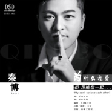

为什么相爱却不能在一起
============================

|  |  |
| :--: | :-- |
| [ 为什么相爱却不能在一起](https://emumo.xiami.com/album/2102906179) | **艺人**: [秦博](../index.md) **语种**: 国语 **唱片公司**: 秦博音乐工作室 **发行时间**: 2017年11月18日 **专辑类别**: EP, 单曲 **专辑风格**: 国语流行 Mandarin Pop, 华语唱作人 Chinese Singer-Songwriter **播放数**: 8693 **收藏数**: 9 **评论数**: 7  |

## 简介

 
 

为什么相爱却不能在一起？回忆里，多少辛酸，多少难过，多少次哭泣，都会变成无尽的怀念，怀念着，即使那时候拼了命似得像末日般仔细的活着，可过去的彼此，终将回不去，只能期待来生再相遇…歌手秦博再次用一曲伤感情歌直面喜欢他的歌迷，用一贯的曲风很好的诠释了这首歌；《为什么相爱却不能在一起》是痛楚的独白，也是爱情的无奈。
 

 

## 曲目

## 评论

|  |  |  |  |
| :-- | :-- | :-- | :-- |
|  [虾米用户](https://emumo.xiami.com/u/338567117) 爱过痛过 2017-12-04 15:30 赞(0) 踩(0) | 
想你想你想到语无伦次，
 |
|  [虾米用户](https://emumo.xiami.com/u/337920589)   2017-11-30 10:29 赞(0) 踩(0) | 
缘分吧
 |
|  [虾米用户](https://emumo.xiami.com/u/337918928)   2017-11-30 10:14 赞(0) 踩(0) | 
超好听，伤感
 |
|  [虾米用户](https://emumo.xiami.com/u/337918928)   2017-11-30 10:13 赞(0) 踩(0) | 
支持歌者 
 |
|  [虾米用户](https://emumo.xiami.com/u/326186807) 一起走过的日子… 2017-11-26 17:44 赞(0) 踩(0) | 
铁分来了哈
 |
|  [虾米用户](https://emumo.xiami.com/u/328452466)   2017-11-26 07:07 赞(0) 踩(0) | 
不够深爱
 |
|  [虾米用户](https://emumo.xiami.com/u/325608663)   2017-11-21 17:36 赞(0) 踩(0) | 
只爱你，
 |
