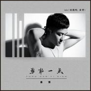

勇敢一点
============================

|  |  |
| :--: | :-- |
| [ 勇敢一点](https://emumo.xiami.com/album/2103904619) | **艺人**: [秦博](../index.md) **语种**: 国语 **唱片公司**: 乐悦传媒 **发行时间**: 2018年08月08日 **专辑类别**: EP, 单曲 **专辑风格**: 流行摇滚 Pop Rock, 国语流行 Mandarin Pop **播放数**: 682 **收藏数**: 2 **评论数**: 0  |

## 简介

人生之光荣，不在能永不失败，而在能屡仆屡起。失败本身不可怕，可怕的是我们没有勇气。如果你再勇敢一点，定会柳暗花明又一村；如果你再勇敢一点，定会直挂云帆济沧海……勇敢，勇敢，再勇敢一点，为了明天不留遗憾，一点脸面又算得了什么，只要，你再勇敢一点。华语流行音乐唱作歌手秦博的最新励志作品《再勇敢一点》，由秦博作词作曲并演唱，他以独特且超高的嗓音将歌曲诠释得淋漓尽致，也道出了人在困难面前应有的态度——再勇敢一点。我相信我只是数以万计听到流泪的其中一个，因为我不过是无数为了奋斗而来到陌生城市的拼博者中的一个，我不过是为了梦想不曾放弃拼搏的人中的一个，我也不过是面对艰辛从不服输的人中普通的一个。为了不同的现实，却为了同一种艰难而感伤；为了不同的境遇，却为了同一份坚持而感动；为了不同的未来，却为了同一个希望而憾动心灵。 

## 曲目

## 评论

