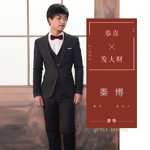

秦博
============================

|  |  |
| :--: | :-- |
| [ 秦博](https://i.xiami.com/bona) | **地区**: China 中国大陆 **风格**: 流行摇滚 Pop Rock, 国语流行 Mandarin Pop, 校园民谣 Campus Folk, 华语唱作人 Chinese Singer-Songwriter **播放数**: 23980657 **粉丝数**: 4547 **评论数**: 43  |

## 档案

秦博；华语男歌手，当红音乐人，演员，导演，香港秦博文化创始人，河南笙歌文化创办人。1988年2月8日出生于河南商丘市，毕业于中国传媒大学，现居浙江台州。2008年发行首张同名专辑《今生最爱》并出道，十年磨一剑，2018年创作的家喻户晓的神曲《好嗨哟》(又名:《好嗨呦》)获得酷狗繁星年度盛典十大金曲奖，并授权给 腾格尔、大张伟等数十位乐坛大咖演唱，于央视、湖南卫视、浙江卫视等各大平台播放；以及授权给多家知名集团公司 作为企业宣传使用金曲。出道至今累计发行单曲数百首，歌友会300多场，曾获得华语流行音乐榜年度最佳音乐人，中国音乐盛典年度最受欢迎歌曲，流行金曲排行榜最流行创作男歌手等荣誉奖项20多次，其创作的大热单曲《好嗨哟》《长得丑活得久》《行星》多次蝉联各大音乐榜单 。 
代表作：《好嗨哟》《好嗨呦》《长得丑活得久》《兄弟干杯》《行星》《要爱就爱一辈子》等。 
中文名：秦博 
英文名：Ab 
国籍：中国 
民族：汉 
血型：A型 
身高：170cm 
体重：58kg 
生日：1988-02-08 
出生地：河南商丘 
现居于：浙江台州 
职业：歌手、音乐人、演员、导演 
经纪公司：秦博文化(香港)传播有限公司 
前经纪公司：香港三国娱乐 
座右铭：抱朴守拙，行稳致远 
代表作品：好嗨哟、长得丑活得久、行星 等 
主要成就：亚洲热歌风云榜盛典获“最佳原创新人奖”，《好嗨哟》华语音乐内地最佳词曲奖、酷狗繁星年度盛典十大金曲奖，并授权给 腾格尔、大张伟等数十位乐坛大咖演唱，于央视、湖南卫视、浙江卫视等各大平台播放；以及授权给多家知名集团公司 作为企业宣传使用金曲。 
人物点评 
秦博，一个用生命在歌唱的高音王子，不论是多年坚持不懈的学习还是现在的演唱生涯，秦博始终坚持在音乐的道路上一步一步前行着，不忘初心的他给华语乐坛奉献了多首好听的音乐，也给喜爱他的歌迷朋友交上了一份满意的答卷。音乐是一扇窗口，折射着人生百态。秦博用音乐打开了一扇通往灵魂的窗户，让我们慢慢品味他音乐世界里的爱恨情仇。跟着秦博的音乐，让音符伴着生命我们一路前行。 
秦博热心公益慈善，多次向灾区捐款捐物，跟随团队下基层，扶贫慰问。 
秦博，一个朴实而亲切的名字，正在广大歌迷中日渐深入人心；秦博，一踏实而多才的艺人，正在随着自己作品的影响，逐渐家喻户晓；秦博，以其勤奋刻苦的敬业精神、开拓进取的追求精神，敢于担当、充满爱心的社会情怀；以其独特磁性的嗓音、横溢的音乐才华，正如一颗烁烁巨星，正在乐坛上冉冉升起…… 
秦博，将凭非凡实力，点燃一片耀眼的音乐星空！

## 专辑

| 名称 | 语种 | 唱片公司 | 发行时间 | 专辑类别 | 专辑风格 |
| :--: | :-- | :-- | :-- | :-- | :-- |
| [ 天空之城](./albums/5022629136.md) | 国语 | 独立发行 | 2021年01月29日 | 录音室专辑 | 独立民谣 Indie Folk |
| [ 牛转乾坤碎银几两](./albums/5022583400.md) | 国语 | 独立发行 | 2021年01月25日 | 录音室专辑 | 国语流行 Mandarin Pop |
| [ 碎银几两](./albums/5022230790.md) | 国语 | 独立发行 | 2020年12月18日 | 录音室专辑 | 国语流行 Mandarin Pop |
| [ 流浪地球39度9](./albums/5021623443.md) | 国语 | 独立发行 | 2020年10月06日 | 录音室专辑 | 流行摇滚 Pop Rock |
| [ 单身汪](./albums/5021349048.md) | 国语 | 独立发行 | 2020年08月25日 | EP, 单曲 | 国语流行 Mandarin Pop |
| [ 一秒一乐坛时长最短单曲《一秒一》](./albums/5021318410.md) | 国语 | 独立发行 | 2020年08月18日 | EP, 单曲 | 流行 Pop |
| [ Boom Pow燥起来](./albums/2108366036.md) | 国语 | 独立发行 | 2020年04月18日 | 录音室专辑 | 电子 Electronic |
| [ 好嗨呦](./albums/2105807892.md) | 国语 | 独立发行 | 2020年01月19日 | EP, 单曲 | 国语流行 Mandarin Pop, 电子舞曲 EDM / Electronic Dance Music |
| [ 您好 再见](./albums/2105807909.md) | 国语 | 独立发行 | 2020年01月01日 | EP, 单曲 | 流行 Pop |
| [ 碎银几两](./albums/5021772340.md) | 国语 | 独立发行 | 2019年10月28日 | 录音室专辑 | 国语流行 Mandarin Pop |
| [ 动力火车](./albums/2105164379.md) | 国语 | 推星传媒 | 2019年07月31日 | EP, 单曲 |  |
| [ 一个你一个我](./albums/2105164382.md) | 国语 | 推星传媒 | 2019年07月31日 | EP, 单曲 |  |
| [ 我该怎么办](./albums/2104999067.md) | 国语 | 推星传媒 | 2019年07月16日 | EP, 单曲 |  |
| [ 流浪的故事](./albums/2104999066.md) | 国语 | 推星传媒 | 2019年07月16日 | EP, 单曲 |  |
| [ 情书·2020](./albums/2104941687.md) | 国语 | 推星传媒 | 2019年06月06日 | EP, 单曲 |  |
| [ 贝贝神曲贝贝](./albums/2104870841.md) | 国语 |  | 2019年05月18日 | 录音室专辑 | 乡村流行 Country Pop |
| [ 好嗨哟 (原版)](./albums/2104814738.md) | 国语 | 掌声文化 | 2019年04月26日 | EP, 单曲 | 国语流行 Mandarin Pop |
| [ 比悲伤更悲伤的故事（电影同名曲）](./albums/2104786510.md) | 国语 | 秦博音乐工作室 | 2019年04月18日 | 录音室专辑 | 民谣 Folk |
| [ 会有那么一天](./albums/2104639845.md) | 国语 | 掌声文化 | 2019年02月28日 | EP, 单曲 | 国语流行 Mandarin Pop |
| [ 嗨歌](./albums/2104638863.md) | 国语 | 乐悦传媒 | 2019年02月27日 | EP, 单曲 | 国语流行 Mandarin Pop |
| [ 起风了](./albums/2104497997.md) | 国语 | 秦博音乐工作室 | 2019年01月19日 | 录音室专辑 | 流行 Pop |
| [ 一百万个可能](./albums/2104495878.md) | 国语 | 秦博音乐工作室 | 2019年01月18日 | 录音室专辑 | 国语流行 Mandarin Pop |
| [ 你一定要幸福](./albums/2104495644.md) | 国语 | 秦博音乐工作室 | 2019年01月08日 | 录音室专辑 | 流行 Pop |
| [ 纸短情长](./albums/2104456637.md) | 国语 | 掌声文化 | 2019年01月08日 | EP, 单曲 | 国语流行 Mandarin Pop |
| [ 对不起 没关系](./albums/2104456626.md) | 国语 | 掌声文化 | 2019年01月08日 | EP, 单曲 | 国语流行 Mandarin Pop |
| [ 永不言弃](./albums/2104367347.md) | 国语 | 秦博音乐工作室 | 2018年12月18日 | 录音室专辑 | 国语流行 Mandarin Pop |
| [ 好嗨哟 (抖音版)](./albums/2104492172.md) | 国语 | 掌声文化 | 2018年12月08日 | EP, 单曲 | 流行 Pop |
| [ 情到深处人孤独](./albums/2104456642.md) | 国语 | 秦博音乐工作室 | 2018年11月18日 | EP, 单曲 | 国语流行 Mandarin Pop |
| [ 再见了 我最亲爱的 (广州演唱会Live)](./albums/2104456620.md) | 国语 | 秦博音乐工作室 | 2018年11月18日 | EP, 单曲 | 国语流行 Mandarin Pop |
| [ 我已经爱上你](./albums/2104190069.md) | 国语 | 秦博音乐工作室 | 2018年11月08日 | 录音室专辑 | 华语唱作人 Chinese Singer-Songwriter, 国语流行 Mandarin Pop |
| [ 比悲伤更悲伤的故事再见了 我最亲爱的](./albums/2104190944.md) | 国语 | 秦博音乐工作室 | 2018年11月08日 | 录音室专辑 | 华语唱作人 Chinese Singer-Songwriter, 国语流行 Mandarin Pop |
| [ 清晨的粥 午夜的酒](./albums/2104127912.md) | 国语 | 秦博音乐工作室 | 2018年10月28日 | 录音室专辑 | 摇滚 Rock & Roll, 流行摇滚 Pop Rock, 国语流行 Mandarin Pop |
| [ DAY BY DAY](./albums/2104117014.md) | 国语 | 秦博音乐工作室 | 2018年10月18日 | 录音室专辑 | 国语流行 Mandarin Pop |
| [ 一百万个可能（Live）](./albums/2104100358.md) | 国语 | 秦博音乐工作室 | 2018年09月18日 | 现场专辑 | 华语唱作人 Chinese Singer-Songwriter, 国语流行 Mandarin Pop |
| [ 说散就散（Live）](./albums/2104038555.md) | 国语 | 秦博音乐工作室 | 2018年09月09日 | 现场专辑 | 国语流行 Mandarin Pop |
| [ 好嗨哟](./albums/2104350029.md) | 国语 | 秦博音乐工作室 | 2018年09月08日 | 录音室专辑 | 国语流行 Mandarin Pop, 电子舞曲 EDM / Electronic Dance Music |
| [ 大海-怀念雨生](./albums/2104010873.md) | 国语 | 乐悦传媒 | 2018年09月08日 | EP, 单曲 | 国语流行 Mandarin Pop |
| [ 把悲伤留给自己](./albums/2103949646.md) | 国语 | 乐悦传媒 | 2018年08月28日 | EP, 单曲 | 流行 Pop |
| [ 往后余生](./albums/2104100365.md) | 国语 | 秦博音乐工作室 | 2018年08月08日 | 录音室专辑 | 华语唱作人 Chinese Singer-Songwriter, 国语流行 Mandarin Pop |
| [ 勇敢一点](./albums/2103904619.md) | 国语 | 乐悦传媒 | 2018年08月08日 | EP, 单曲 | 流行摇滚 Pop Rock, 国语流行 Mandarin Pop |
| [ 忘记](./albums/2104011584.md) | 国语 | 秦博音乐工作室 | 2018年08月08日 | EP, 单曲 | 国语流行 Mandarin Pop |
| [ LOVE.28](./albums/2103878553.md) | 国语 | 乐悦传媒 | 2018年08月06日 | EP, 单曲 | 国语流行 Mandarin Pop, 摇滚 Rock & Roll |
| [ 28+High F死了都要爱](./albums/2103832675.md) | 国语 | 秦博音乐工作室 | 2018年08月01日 | 录音室专辑 | 国语流行 Mandarin Pop, 摇滚 Rock & Roll |
| [ 如果爱如果爱 趁现在](./albums/2103826174.md) | 国语 | 秦博音乐工作室 | 2018年07月18日 | 录音室专辑 | 国语流行 Mandarin Pop, 摇滚 Rock & Roll |
| [ 好想你](./albums/2103781196.md) | 国语 | 秦博音乐工作室 | 2018年07月08日 | 录音室专辑 | 国语流行 Mandarin Pop |
| [ 行星（PLANET中文版）PLANET](./albums/2103749665.md) | 国语 | 秦博音乐工作室 | 2018年06月26日 | 录音室专辑 | 国语流行 Mandarin Pop, 日本流行 J-Pop, 华语唱作人 Chinese Singer-Songwriter |
| [ 怀念青春（扎心版）](./albums/2103734149.md) | 国语 | 秦博音乐工作室 | 2018年06月16日 | 录音室专辑 | 国语流行 Mandarin Pop, 民谣流行 Folk Pop, 流行摇滚 Pop Rock |
| [ 怀念青春怀念青春(Cover刘刚)](./albums/2103741413.md) | 国语 | 秦博音乐工作室 | 2018年06月08日 | 录音室专辑 | 民谣流行 Folk Pop, 华语唱作人 Chinese Singer-Songwriter |
| [ 起风了（Cover 高桥优）起风了（Cover 高桥优）](./albums/2103731497.md) | 国语 | 秦博音乐工作室 | 2018年06月06日 | 录音室专辑 | 国语流行 Mandarin Pop, 民谣流行 Folk Pop |
| [ 行星PLANET](./albums/2103731401.md) | 国语 | 秦博音乐工作室 | 2018年06月06日 | 录音室专辑 | 国语流行 Mandarin Pop, 流行摇滚 Pop Rock, 民谣流行 Folk Pop |
| [ 纸短情长](./albums/2103693615.md) | 国语 | 秦博音乐工作室 | 2018年04月22日 | 录音室专辑 | 国语流行 Mandarin Pop, 民谣 Folk, 独立民谣 Indie Folk |
| [ 噢 爱人为何你不再爱我](./albums/2103702603.md) | 国语 | 秦博音乐工作室 | 2018年03月08日 | 录音室专辑 | 电子舞曲 EDM / Electronic Dance Music |
| [ 坚强的理由（摇滚EP）](./albums/2103561851.md) | 国语 | 秦博音乐工作室 | 2018年02月28日 | EP, 单曲 | 流行摇滚 Pop Rock, 国语流行 Mandarin Pop, 华语唱作人 Chinese Singer-Songwriter |
| [ 恭喜发大财恭喜发财](./albums/2102978762.md) | 国语 | 秦博音乐工作室 | 2018年02月08日 | EP, 单曲 | 国语流行 Mandarin Pop, 华语唱作人 Chinese Singer-Songwriter |
| [ 白色双人床](./albums/2103472194.md) | 国语 | 秦博音乐工作室 | 2018年02月08日 | EP, 单曲 | 流行 Pop, 华语唱作人 Chinese Singer-Songwriter, 国语流行 Mandarin Pop |
| [ 爱情已到尽头](./albums/2103472193.md) | 国语 | 秦博音乐工作室 | 2018年01月28日 | EP, 单曲 | 国语流行 Mandarin Pop, 华语唱作人 Chinese Singer-Songwriter |
| [ 怎么能够无所谓叫我怎么能够无所谓](./albums/2102966061.md) | 国语 | 秦博音乐工作室 | 2018年01月18日 | EP, 单曲 | 流行 Pop, 国语流行 Mandarin Pop, 华语唱作人 Chinese Singer-Songwriter |
| [ 兄弟情歌](./albums/2102945976.md) | 国语 | 秦博音乐工作室 | 2018年01月08日 | EP, 单曲 | 国语流行 Mandarin Pop, 华语唱作人 Chinese Singer-Songwriter |
| [ 逆流成河](./albums/2103731498.md) | 国语 | 秦博音乐工作室 | 2018年01月08日 | 录音室专辑 | 国语流行 Mandarin Pop, 民谣流行 Folk Pop, 华语唱作人 Chinese Singer-Songwriter |
| [ 为什么相爱却不能在一起](./albums/2102906179.md) | 国语 | 秦博音乐工作室 | 2017年11月18日 | EP, 单曲 | 国语流行 Mandarin Pop, 华语唱作人 Chinese Singer-Songwriter |
| [ 色字头上一把刀](./albums/2102867044.md) | 国语 | 秦博音乐工作室 | 2017年10月01日 | EP, 单曲 | 国语流行 Mandarin Pop, 华语唱作人 Chinese Singer-Songwriter |
| [ 情缘](./albums/2102853170.md) | 国语 | 秦博音乐工作室 | 2017年09月08日 | 录音室专辑 | 流行 Pop, 国语流行 Mandarin Pop, 华语唱作人 Chinese Singer-Songwriter |
| [ 孤独情歌情到深处人孤独](./albums/2102818158.md) | 国语 | 秦博音乐工作室 | 2017年08月28日 | 录音室专辑 | 流行 Pop, 民谣 Folk, 华语唱作人 Chinese Singer-Songwriter |
| [ 红尘情歌](./albums/2102810446.md) | 国语 | 秦博音乐工作室 | 2017年08月08日 | 录音室专辑 | 国语流行 Mandarin Pop |
| [ 一亿句对不起](./albums/2102810978.md) | 国语 | 秦博音乐工作室 | 2017年08月08日 | 录音室专辑 | 电子 Electronic |
| [ 最伤情歌最伤心](./albums/2102744400.md) | 国语 | 秦博音乐工作室 | 2017年06月06日 | 录音室专辑 | 国语流行 Mandarin Pop |
| [ 上上之策秦博](./albums/2102817329.md) | 国语 | 秦博音乐工作室 | 2017年05月18日 | 录音室专辑 | 国语流行 Mandarin Pop, 流行摇滚 Pop Rock, 民谣 Folk |
| [ 痛也是醉](./albums/2102724999.md) | 国语 | 秦博音乐工作室 | 2017年03月28日 | 录音室专辑 | 国语流行 Mandarin Pop, 华语唱作人 Chinese Singer-Songwriter |
| [ 秦博铃声专辑秦博歌曲铃声](./albums/2102732802.md) | 国语 | 秦博音乐工作室 | 2017年02月08日 | 录音室专辑 |  |
| [ 要爱就爱一辈子爱你一辈子](./albums/2100380661.md) | 国语 | 秦博音乐工作室 | 2017年02月08日 | EP, 单曲 | 国语流行 Mandarin Pop, 流行 Pop, 华语唱作人 Chinese Singer-Songwriter |
| [ 要爱就爱一辈子DJ要爱就爱一辈子](./albums/2102675455.md) | 国语 | 秦博音乐工作室 | 2017年02月08日 | 录音室专辑 | 国语流行 Mandarin Pop, 电子民谣 Folktronica, 华语唱作人 Chinese Singer-Songwriter |
| [ 只要我过得比你好](./albums/2102735967.md) | 国语 | 秦博音乐工作室 | 2017年01月08日 | 录音室专辑 | 国语流行 Mandarin Pop, 流行 Pop, 电音流行 Electropop |
| [ 最拽情歌只要我过得比你好](./albums/2102675459.md) | 国语 | 秦博音乐工作室 | 2016年12月18日 | 录音室专辑 | 电子民谣 Folktronica, 华语唱作人 Chinese Singer-Songwriter |
| [ 秦博电音舞曲精选集Bona DJ电音舞曲精选集](./albums/2102690351.md) | 国语 | 秦博音乐工作室 | 2016年11月18日 | 精选集 | 国语流行 Mandarin Pop, 电子 Electronic |
| [ 你狗眼看人低狗眼看人低](./albums/2102728391.md) | 国语 | 秦博音乐工作室 | 2016年11月18日 | 录音室专辑 | 国语流行 Mandarin Pop, 流行摇滚 Pop Rock |
| [ 干杯兄弟兄弟干杯](./albums/2102690357.md) | 国语 | 秦博音乐工作室 | 2016年08月28日 | 录音室专辑 | 电子 Electronic, 华语唱作人 Chinese Singer-Songwriter |
| [ 秋天有没有童话](./albums/2100387587.md) | 国语 | 秦博音乐工作室 | 2016年08月18日 | EP, 单曲 | 国语流行 Mandarin Pop, 华语唱作人 Chinese Singer-Songwriter |
| [ 从小到大的兄弟从小到大的兄弟-Bona](./albums/2100380375.md) | 国语 | 秦博音乐工作室 | 2016年08月18日 | 录音室专辑 |  |
| [ 谢谢你让我遇见你谢谢你让我遇见你-秦博](./albums/2102707722.md) | 国语 | 秦博音乐工作室 | 2016年05月08日 | 录音室专辑 | 国语流行 Mandarin Pop, 华语唱作人 Chinese Singer-Songwriter |
| [ 如果来生没有你如果来生拥有你](./albums/2102653840.md) | 国语 | 秦博音乐工作室 | 2016年02月08日 | 录音室专辑 | 流行 Pop, 国语流行 Mandarin Pop, 华语唱作人 Chinese Singer-Songwriter |
| [ 兄弟干杯-DJ candyMix兄弟干一杯](./albums/2100379590.md) | 国语 | 秦博音乐工作室 | 2015年11月18日 | EP, 单曲 |  |
| [ 兄弟干杯干杯兄弟](./albums/2100379447.md) | 国语 | 秦博音乐工作室 | 2015年09月18日 | EP, 单曲 | 国语流行 Mandarin Pop, 电子 Electronic |
| [ 兄弟干杯（电台版）干杯兄弟](./albums/2100380385.md) | 国语 | 秦博音乐工作室 | 2015年08月08日 | EP, 单曲 | 国语流行 Mandarin Pop, 电子 Electronic, 华语唱作人 Chinese Singer-Songwriter |
| [ 痛也是醉DJ](./albums/2102743710.md) | 国语 | 秦博音乐工作室 | 2015年08月08日 | 录音室专辑 | 国语流行 Mandarin Pop |
| [ 真的不愿失去你真的不能没有你](./albums/2102401343.md) | 国语 | 独立发行 | 2015年05月18日 | 录音室专辑 | 国语流行 Mandarin Pop, 华语唱作人 Chinese Singer-Songwriter, 民谣流行 Folk Pop |
| [ 从小到大的兄弟从小到大的兄弟](./albums/2100385533.md) | 国语 | 秦博音乐工作室 | 2015年02月08日 | EP, 单曲 | 国语流行 Mandarin Pop, 华语唱作人 Chinese Singer-Songwriter |
| [ 雨落深深一吻](./albums/2100383880.md) | 国语 | 秦博音乐工作室 | 2014年09月28日 | EP, 单曲 | 国语流行 Mandarin Pop, 民谣流行 Folk Pop, 华语唱作人 Chinese Singer-Songwriter |
| [ 狗眼看人低狗眼看人低](./albums/2102401365.md) | 国语 | 秦博音乐工作室 | 2014年08月08日 | EP, 单曲 | 国语流行 Mandarin Pop, 流行摇滚 Pop Rock, 华语唱作人 Chinese Singer-Songwriter |
| [ 我流浪在城市的旷野流浪-秦博](./albums/2102653839.md) | 国语 | 秦博音乐工作室 | 2014年02月08日 | EP, 单曲 | 国语流行 Mandarin Pop, 流行摇滚 Pop Rock, 华语唱作人 Chinese Singer-Songwriter |
| [ 要爱就爱一辈子爱你一辈子-秦博](./albums/2100380664.md) | 国语 | 秦博音乐工作室 | 2013年08月28日 | EP, 单曲 | 国语流行 Mandarin Pop, 华语唱作人 Chinese Singer-Songwriter |
| [ 伤别离爱的别离-秦博](./albums/2102701487.md) | 国语 | 秦博音乐工作室 | 2013年06月28日 | 录音室专辑 |  |
| [ 怎能无所谓叫我怎么能够无所谓](./albums/2102644548.md) | 国语 | 秦博音乐工作室 | 2013年05月06日 | EP, 单曲 | 流行 Pop, 国语流行 Mandarin Pop, 华语唱作人 Chinese Singer-Songwriter |
| [ 爱的别离叫我怎么能够无所谓](./albums/2102723375.md) | 国语 | 秦博音乐工作室 | 2013年02月08日 | 录音室专辑 | 流行 Pop, 国语流行 Mandarin Pop |
| [ 原以为可以把你忘记以为可以把你忘记](./albums/2102653838.md) | 国语 | 秦博音乐工作室 | 2013年02月08日 | EP, 单曲 | 国语流行 Mandarin Pop, 华语唱作人 Chinese Singer-Songwriter |
| [ 叫我怎么能够无所谓](./albums/2102739353.md) | 国语 | 秦博音乐工作室 | 2012年08月08日 | 录音室专辑 | 国语流行 Mandarin Pop, 华语唱作人 Chinese Singer-Songwriter |
| [ 爱来爱去还是你](./albums/2102723362.md) | 国语 | 秦博音乐工作室 | 2012年02月08日 | 录音室专辑 | 国语流行 Mandarin Pop |
| [ 红尘情歌](./albums/2102810450.md) | 国语 | 秦博音乐工作室 | 2011年08月08日 | 录音室专辑 | 国语流行 Mandarin Pop, 流行 Pop |
| [ 爱你一辈子要爱就爱一辈子](./albums/2102670883.md) | 国语 | 秦博音乐工作室 | 2011年02月08日 | 录音室专辑 | 国语流行 Mandarin Pop, 流行 Pop |
| [ 你是我今生最爱的女孩今生最爱](./albums/2102747765.md) | 国语 | 秦博音乐工作室 | 2007年12月28日 | 录音室专辑 | 国语流行 Mandarin Pop |
| [ 今生最爱你是我今生最爱的女孩](./albums/2102747761.md) | 国语 | 秦博音乐工作室 | 2007年08月08日 | 录音室专辑 | 国语流行 Mandarin Pop |
| [ 天下归德](./albums/5022395343.md) | 国语 | 独立发行 | 不详 | 录音室专辑 | 国语流行 Mandarin Pop |

## 评论

|  |  |  |
| :-- | :-- | :-- |
|  [虾米用户](https://emumo.xiami.com/u/276786607) -|- 2020-09-14 18:31 赞(0) 踩(0) | 
   
 |
|  [虾米用户](https://emumo.xiami.com/u/276786607) -|- 2020-09-14 18:30 赞(0) 踩(0) | 
66661、         ф      卍卍卍||||||    6661 
 |
|  [虾米用户](https://emumo.xiami.com/u/276431230)  2020-06-21 12:43 赞(1) 踩(0) | 
愿你越来越棒。愿你越来越好。
 |
|  [虾米用户](https://emumo.xiami.com/u/435456983)  2020-02-03 22:21 赞(2) 踩(0) | 
我爱听这首歌，百闻不厌。
 |
|  [虾米用户](https://emumo.xiami.com/u/412244039) 注入我灵魂的力量 2019-10-26 17:33 赞(1) 踩(0) | 
一听就能沉浸在美的未来里
 |
|  [虾米用户](https://emumo.xiami.com/u/365437701) 我还没想好要写什么... 2019-09-10 08:15 赞(1) 踩(0) | 
很喜欢听你的歌曲 希望你能继续唱给我们听更多更好听的歌
 |
|  [虾米用户](https://emumo.xiami.com/u/426159910) 人生开心最重要不要被一些... 2019-08-09 18:37 赞(1) 踩(0) | 
好喜欢听你的声音，我会继续关注你
 |
|  [虾米用户](https://emumo.xiami.com/u/426953245)  2019-07-06 11:55 赞(1) 踩(0) | 
 
 |
|  [虾米用户](https://emumo.xiami.com/u/280807290)  2019-05-06 16:39 赞(1) 踩(0) | 
******
 |
|  [虾米用户](https://emumo.xiami.com/u/402398046)  2019-03-04 19:42 赞(1) 踩(0) | 
好听
 |
|  [虾米用户](https://emumo.xiami.com/u/409085146)  2018-11-21 22:50 赞(1) 踩(0) | 
愿你更好
 |
|  [虾米用户](https://emumo.xiami.com/u/408790154)  2018-11-16 17:34 赞(1) 踩(0) | 
好听
 |
|  [虾米用户](https://emumo.xiami.com/u/376906460) 我还没想好要写什么... 2018-06-27 07:43 赞(2) 踩(0) | 
好听
 |
|  [虾米用户](https://emumo.xiami.com/u/358425196)  2018-06-25 00:44 赞(2) 踩(0) | 
好听，带我回到了青春时期，回味我的青春
 |
| ⇒ |  [虾米用户](https://emumo.xiami.com/u/358210701)  2018-09-15 21:58 赞(0) 踩(0) | 
比歌写得太有味了
 |
|  [虾米用户](https://emumo.xiami.com/u/371712913) 我QQ号码6725208... 2018-06-16 11:25 赞(2) 踩(0) | 
考不上高中去抗日         
 |
|  [虾米用户](https://emumo.xiami.com/u/196975577) 不要在我墓前哭泣流泪，因... 2018-06-10 13:11 赞(3) 踩(0) | 
谢谢，你的歌曲，很好听，让我又想起了很多回忆。
 |
|  [虾米用户](https://emumo.xiami.com/u/374389292)  2018-06-02 11:00 赞(4) 踩(0) | 
支持歌者！好听！
 |
|  [虾米用户](https://emumo.xiami.com/u/372218464)  2018-06-01 15:42 赞(4) 踩(0) | 
好听，秦博我们还一秦家呢
 |
| ⇒ |  [虾米用户](https://emumo.xiami.com/u/374685710)  2018-06-05 09:40 赞(0) 踩(0) | 
/
 |
|  [虾米用户](https://emumo.xiami.com/u/355211957)  2018-05-12 16:49 赞(4) 踩(0) | 
好听
 |
|  [虾米用户](https://emumo.xiami.com/u/365892769)  2018-05-11 17:23 赞(5) 踩(0) | 
不用谢
 |
| ⇒ |  [虾米用户](https://emumo.xiami.com/u/374685710)  2018-06-05 09:41 赞(0) 踩(0) | 
 
 |
|  [虾米用户](https://emumo.xiami.com/u/293692544) 你敢给我说话吗？我咬你 2017-12-28 17:22 赞(5) 踩(0) | 
好听
 |
|  [虾米用户](https://emumo.xiami.com/u/338567117) 爱过痛过 2017-12-04 15:24 赞(7) 踩(0) | 
人帅歌美~
 |
|  [虾米用户](https://emumo.xiami.com/u/337920589)   2017-11-30 10:28 赞(7) 踩(0) | 
喜欢你的痛也是醉，要爱就爱一辈子！！永远顶你。
 |
|  [虾米用户](https://emumo.xiami.com/u/337918928)   2017-11-30 10:21 赞(9) 踩(0) | 
         
 |
|  [虾米用户](https://emumo.xiami.com/u/337918928)   2017-11-30 10:21 赞(5) 踩(0) | 
从广场舞听到你的歌，好听
 |
|  [虾米用户](https://emumo.xiami.com/u/331763465)  2017-10-26 08:47 赞(9) 踩(0) | 
愿你越来越好
 |
|  [虾米用户](https://emumo.xiami.com/u/331763465)  2017-10-26 08:47 赞(8) 踩(0) | 
大海因为有了波澜所以更加雄伟壮阔，人生因为有了遗憾所以更加珍惜懂得。倘若未曾有过遗憾的痛。今天也不至于学会懂。倘若未曾有过遗憾的伤，今天也不至于坚强。谁今天的坚强，不是用曾经的那些憾缺构筑起来的成长。
 |
|  [虾米用户](https://emumo.xiami.com/u/328452466)   2017-10-04 20:33 赞(7) 踩(0) | 
中秋快乐！
 |
|  [虾米用户](https://emumo.xiami.com/u/327838033)  2017-10-01 21:47 赞(8) 踩(0) | 
正能量歌手，支持
 |
|  [虾米用户](https://emumo.xiami.com/u/326186807) 一起走过的日子… 2017-09-28 10:25 赞(5) 踩(0) | 
一天又一天
 |
|  [虾米用户](https://emumo.xiami.com/u/325990551)   2017-09-27 20:49 赞(5) 踩(0) | 
      
 |
|  [虾米用户](https://emumo.xiami.com/u/325990551)   2017-09-27 20:49 赞(4) 踩(0) | 
之前有个闺密也给我唱的这歌好感动啊，有感觉。！
 |
|  [虾米用户](https://emumo.xiami.com/u/326873853)  2017-09-26 22:15 赞(4) 踩(0) | 
如果，我们现在还在一起会是怎样，我们是不是还依然深爱着对方，像开始时那样&amp;hellip;&amp;hellip;
 |
|  [虾米用户](https://emumo.xiami.com/u/326873853)  2017-09-26 06:50 赞(4) 踩(0) | 
最喜欢痛也是醉，
 |
|  [虾米用户](https://emumo.xiami.com/u/3476355) 时光未央，岁月静好。 2017-09-22 18:48 赞(5) 踩(0) | 
狗眼看人低，太棒了~~
 |
|  [虾米用户](https://emumo.xiami.com/u/326186807) 一起走过的日子… 2017-09-22 08:47 赞(5) 踩(0) | 
其实，生活无常，青春叫苦不迭，却也回味无穷。将最美的时光，留在最纯真的年纪，任时光荏苒，那岁月依旧安好。
 |
|  [虾米用户](https://emumo.xiami.com/u/326186807) 一起走过的日子… 2017-09-22 08:46 赞(4) 踩(0) | 
雨打樱红，何处诉离殇？
 |
|  [虾米用户](https://emumo.xiami.com/u/325608663)   2017-09-20 19:28 赞(4) 踩(0) | 
喜欢你的歌，永远支持！！
 |
| ⇒ |  [虾米用户](https://emumo.xiami.com/u/371712913) 我QQ号码6725208... 2018-06-16 11:25 赞(0) 踩(0) | 
加油
 |
|  [虾米用户](https://emumo.xiami.com/u/325608663)   2017-09-20 19:28 赞(5) 踩(0) | 
秦博，我爱你！
 |
