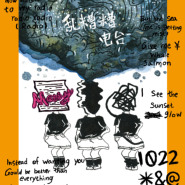

乱糟糟电台
============================

|  |  |
| :--: | :-- |
| [ 乱糟糟电台](https://emumo.xiami.com/album/2108161256) | **艺人**: [1022女声](../index.md) **语种**: 国语 **唱片公司**: 华宇世博 **发行时间**: 2018年12月04日 **专辑类别**: 录音室专辑 **专辑风格**: 流行 Pop **播放数**: 1907 **收藏数**: 4 **评论数**: 2  |

## 简介

## 曲目

## 评论

|  |  |  |  |
| :-- | :-- | :-- | :-- |
|  [虾米用户](https://emumo.xiami.com/u/190196405)  2020-05-20 00:46 赞(1) 踩(0) | 
可爱的三个女孩子，科班出身的声线，有趣的原创曲多么难得的组合啊！。好好地坚持下去，少女音乐市场需要你们呐!!!
 |
|  [虾米用户](https://emumo.xiami.com/u/9391847) 虽然好久不用，虾米还是最... 2020-04-12 21:23 赞(1) 踩(0) | 
请继续唱下去三只
 |
