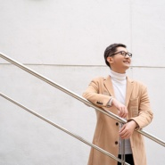

2015—2018录音室演唱作品
============================

|  |  |
| :--: | :-- |
| [ 2015—2018录音室演唱作品](https://emumo.xiami.com/album/2102644297) | **艺人**: [严柏文](../index.md) **语种**: 国语 **唱片公司**: 独立发行 **发行时间**: 2017年07月19日 **专辑类别**: 合集, 杂锦 **专辑风格**: 国语流行 Mandarin Pop **播放数**: 828486 **收藏数**: 22 **评论数**: 5  |

## 简介

个人资料  
严柏文，1991年12月出生于江苏镇江。10岁开始学习声乐。2014年毕业于南京艺术学院音乐学院声乐表演专业。大学期间先后师从女高音教授房亚红女士与男低音歌唱家钱发源先生，大学毕业后师从上海歌剧院首席女中音歌唱家王维倩女士。并曾得到过蒋英(钱学森夫人)弟子-中央音乐学院教授祝爱兰女士的音乐传授指导。 2013年8月，参加首届全国“我唱邓丽君”歌曲大奖赛，进入全国十强并荣获“优秀歌手”奖。2014年2月，参加在香港举行的2014亚洲国际音乐节声乐比赛中，荣获青年职业组金奖。2015年6-10月，参加由温莎KTV举办的“温莎当下，麦克成风”歌唱比赛，南京赛区十强后夺得微信投票冠军，进入全国十强总决赛，荣获“明日之星”奖。  
（附：此合集内所有音频均为贴唱录音，为非正式发行歌曲。）  
&nbsp;

## 曲目

## 评论

|  |  |  |  |
| :-- | :-- | :-- | :-- |
|  [虾米用户](https://emumo.xiami.com/u/356917662) 另一种开始 2020-10-08 10:20 赞(0) 踩(0) | 
话不多说，爱了
 |
| ⇒ |  [虾米用户](https://emumo.xiami.com/u/102749010) 我爱音乐，音乐爱我。 2020-10-09 10:02 赞(0) 踩(0) | 

 |
|  [虾米用户](https://emumo.xiami.com/u/419442646)  2019-02-18 14:09 赞(1) 踩(0) | 
可以让人循环一天的声音
 |
|  [虾米用户](https://emumo.xiami.com/u/274195323)  2017-04-07 21:46 赞(2) 踩(0) | 
超好听的声音  
 |
| ⇒ |  [虾米用户](https://emumo.xiami.com/u/102749010) 我爱音乐，音乐爱我。 2017-04-07 22:39 赞(0) 踩(0) | 

 |
