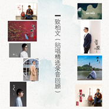

致柏文（贴唱录音精选回顾）
============================

|  |  |
| :--: | :-- |
| [ 致柏文（贴唱录音精选回顾）](https://emumo.xiami.com/album/2105609031) | **艺人**: [严柏文](../index.md) **语种**: 国语 **唱片公司**: 独立发行 **发行时间**: 2019年12月21日 **专辑类别**: EP, 单曲 **专辑风格**: 国语流行 Mandarin Pop, 流行 Pop **播放数**: 446 **收藏数**: 1 **评论数**: 0  |

## 简介

这段音乐由9首歌的片段组成，按照录音时间的排序，记录了15年末至19年初，自己在录音室里灌录的声音。这几首都是自己较为代表性的贴唱作品，有抒情、中国风、爵士、轻摇滚等。这些录音既代表了我这些年来的心路历程，也同样是我最宝贵的音乐财富。在自己28周岁生日的这天，将这段音乐作为礼物送给自己，同时，也献给所有的知音朋友。

## 曲目

## 评论

|  |  |  |  |
| :-- | :-- | :-- | :-- |
