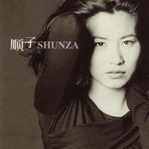

Shunza顺子同名专辑
============================

|  |  |
| :--: | :-- |
| [ Shunza顺子同名专辑](https://emumo.xiami.com/album/32432) | **艺人**: [顺子](../index.md) **语种**: 国语 **唱片公司**: 魔岩唱片 **发行时间**: 1997年11月18日 **专辑类别**: 录音室专辑 **专辑风格**: 当代节奏布鲁斯 Contemporary R&B, 国语流行 Mandarin Pop, 华语唱作人 Chinese Singer-Songwriter **播放数**: 6394235 **收藏数**: 1082 **评论数**: 86  |

## 简介

《Shunza》的经典在于充分发挥歌者几乎完美的嗓音、充分演绎个人化、多元化、国际化的音乐风格、充分伸展创作触觉，其中的一曲《回家》十几年后仍有人深爱兼向往。&nbsp;

 这是顺子的第一张个人专辑，简直就令人惊艳。在1997年的台湾乐坛还很少有人唱R&amp;B，尤其是R&amp;B女歌手，而她婉转的灵歌唱腔让人们真正了解到了这种诱人的西洋曲风。整张专辑中顺子都是在秀自己的歌技，她的声音很甜美，有种泉水中甘甜的味道，而她也是通过这张专辑把R&amp;B唱腔带到了台湾。

 顺子的唱功是没得说，那如九曲盘旋一般的旋律会让人联想到玛丽亚·凯莉，或者是惠特尼·休斯敦，但是顺子却又将R&amp;B融入了本土的特色。音乐的编曲上也是相当讲究，清淡的钢琴成了配器中的主秀，爵士钢琴的音符流动在音乐中甚是迷人，而且今天听来仍然味道醇厚。《回家》这首歌也许再过10年仍然不会让人忘记，仍然会有人轻声吟唱，落差极大的音乐，将人思念的情绪升华到了最高的境界。

## 曲目

- [回家MVCome Home](./32432/wAYM45443.md)
- [不想一个人MVNight Alone Cryin'](./32432/fOyF5b1b9.md)
- [Can't Get EnoughMV](./32432/xL3k4Udd307.md)
- [永远等待MVWhere Did We Go Wrong?](./32432/fOyH899b2.md)
- [玩具MVToys That Went On Strike](./32432/wAYQ26d11.md)
- [太阳MVTai Yang (Sun)](./32432/omGNfc5d4.md)
- [A Bowl of Rice](./32432/omGOef414.md)
- [那那那那Na Na Na Na](./32432/fOyLd4b03.md)
- [C.J.](./32432/ka7Oa5432.md)
- [亲爱的JazzMVMy Dear](./32432/9l0b3dfea.md)
- [Always Sisters](./32432/ka7Ibfde4.md)

## 评论

|  |  |  |
| :-- | :-- | :-- |
|  [虾米用户](https://emumo.xiami.com/u/72985520)  2020-08-09 09:48 赞(1) 踩(0) | 
太棒了。！！！！！
 |
|  [虾米用户](https://emumo.xiami.com/u/12550591) 赤足走上地球花园的小台阶 2020-06-20 19:47 赞(0) 踩(0) | 
1997，下半年刚上高中。那一年香港回归，乐坛大小歌手盛放。但记得有个文案：如果你没有听过顺子的回家，那你就没有跟上时代。非常有水准的专辑，最近读了她母亲的自传，又开始循环！
 |
|  [虾米用户](https://emumo.xiami.com/u/288751807)  2020-04-23 07:50 赞(0) 踩(0) | 
上学时就是顺子的歌迷，那是还是磁带，她的每个专辑我都有，一直留到现在
 |
|  [虾米用户](https://emumo.xiami.com/u/33443995)   2020-03-08 21:20 赞(0) 踩(0) | 
当年在一众偶像派脱颖而出。
 |
|  [虾米用户](https://emumo.xiami.com/u/328348409)  2020-02-12 08:33 赞(1) 踩(0) | 
经典20年，还讲经典20年
 |
|  [虾米用户](https://emumo.xiami.com/u/98423670) 不二女生嘻嘻 2019-12-13 11:50 赞(0) 踩(0) | 
应该是人生中买的第一个卡带。最爱的顺子。创作型歌手
 |
|  [虾米用户](https://emumo.xiami.com/u/9510027)  拥抱虾米音乐，谢幕了，... 2019-08-09 23:20 赞(3) 踩(0) | 
专辑【Shunza~顺子】
 |
|  [虾米用户](https://emumo.xiami.com/u/9178269) 我还没想好要写什么... 2019-04-17 06:24 赞(0) 踩(0) | 
感动的声音！
 |
|  [虾米用户](https://emumo.xiami.com/u/117052428) 我还没想好要写什么... 2019-03-24 21:03 赞(0) 踩(0) | 
顺za 
 |
|  [虾米用户](https://emumo.xiami.com/u/186133406) 口水鸡 2019-02-12 12:45 赞(0) 踩(0) | 
zzz
 |
|  [虾米用户](https://emumo.xiami.com/u/293477411)  2019-01-25 12:30 赞(0) 踩(0) | 
为什么不能下载呢
 |
|  [虾米用户](https://emumo.xiami.com/u/42542853) no music，no ... 2019-01-12 23:01 赞(0) 踩(0) | 
一曲封神
 |
|  [虾米用户](https://emumo.xiami.com/u/340969226)  2018-10-30 17:14 赞(0) 踩(0) | 
记不清是在哪里听到的回家这首歌，然后就买了shunza这张专辑。超级喜欢，超级惊艳。现在听来，满满的回忆。记得那个时期还买了Mariah Carey的一张专辑，封面是黑灰色调的，大长腿。。感谢虾米，还能听到那个时候的歌。。
 |
| ⇒ |  [虾米用户](https://emumo.xiami.com/u/5850497) 暂无签名~ 2019-07-21 15:17 赞(0) 踩(0) | 
你说的是Mariah Carey的独一无二专辑，我听坏了三盘
 |
|  [虾米用户](https://emumo.xiami.com/u/355018910)  2018-06-09 01:20 赞(0) 踩(0) | 
永远的经典，经典的声音
 |
|  [虾米用户](https://emumo.xiami.com/u/169775670) 打不死的小强 2018-03-24 15:33 赞(0) 踩(0) | 
顺子经典的专辑
 |
|  [虾米用户](https://emumo.xiami.com/u/3583995) 一個人的戰爭 2018-03-13 01:01 赞(0) 踩(0) | 
.
 |
|  [虾米用户](https://emumo.xiami.com/u/98423670) 不二女生嘻嘻 2018-02-07 17:26 赞(1) 踩(0) | 
这张专辑我记得是上高中2002年前后偶然听到了电台的回家就跟魔怔一样找遍了我家乡很小城市城市所有音响店，实在太冷门了，老板很好努力找到了可能是全城唯一的一盒卡带。从此成为了自主爱上的歌手。
 |
|  [虾米用户](https://emumo.xiami.com/u/39518556) 撸猫狂魔就是在下。 2018-01-24 21:19 赞(0) 踩(0) | 
神。砖。
 |
|  [虾米用户](https://emumo.xiami.com/u/6721358) 青春不是年华,而是心境。 2018-01-07 22:43 赞(0) 踩(0) | 
本想下一首歌，怎么全都下了 泪哭！
 |
|  [虾米用户](https://emumo.xiami.com/u/7834130)  2017-11-05 19:14 赞(0) 踩(0) | 
英文歌比中文歌好很多。
 |
|  [虾米用户](https://emumo.xiami.com/u/290248224)  2017-10-10 13:42 赞(0) 踩(0) | 
终于上架了
 |
|  [虾米用户](https://emumo.xiami.com/u/140033252)  2017-07-08 13:33 赞(2) 踩(0) | 
中学时代买的最早的几张正版CD，其中就有这张。一直认为顺子的歌就是当时高难度唱功的体现
 |
|  [虾米用户](https://emumo.xiami.com/u/57034248) 无我原非你，从他不解伊。 2017-07-07 22:29 赞(11) 踩(0) | 
那年张国荣复出，顺子出道，王菲那两年出了预言，莫文蔚和伍佰做了一朵金花，黄金盛世
 |
|  [虾米用户](https://emumo.xiami.com/u/9318079) Please respe... 2017-07-01 00:09 赞(20) 踩(0) | 
97年那一年几乎所有的天后都交出来最巅峰的唱片，但是大家都不幸，在年底遇到了华语历史上超级神专 骆驼.飞鸟.鱼 众天后们一年都白玩了  
 |
| ⇒ |  [虾米用户](https://emumo.xiami.com/u/10389225) 头像是前女友选的，不会换... 2018-09-25 22:43 赞(0) 踩(0) | 
骆驼飞鸟鱼，分别是啥？
 |
| ⇒ |  [虾米用户](https://emumo.xiami.com/u/268560934)  2019-02-08 22:48 赞(0) 踩(0) | 
哥们儿：你这是后知后觉的评论，当时的齐豫已经是下坡路了（当然并不影响齐豫的历史地位）。我是那个时代的过来人，专辑我见过但在当时我周围没有一个好朋友购买，本身这张专辑的娱乐性不高。不可和（回家）相提并论。
 |
|  [虾米用户](https://emumo.xiami.com/u/52034644) 身体会跳舞 2017-06-19 08:11 赞(1) 踩(0) | 
和李玟声音好像
 |
| ⇒ |  [虾米用户](https://emumo.xiami.com/u/251108708)  2017-10-28 00:43 赞(0) 踩(0) | 
对。嗓音差不多，而且曲风也近似。
 |
|  [虾米用户](https://emumo.xiami.com/u/46073836) 我还没想好要写什么... 2017-06-03 11:25 赞(0) 踩(0) | 
20年
 |
|  [虾米用户](https://emumo.xiami.com/u/278675963)  2017-03-15 16:08 赞(1) 踩(0) | 
好听的歌
 |
|  [虾米用户](https://emumo.xiami.com/u/106195412) 常驻云村，偶尔来虾米看看 2017-02-17 17:32 赞(3) 踩(0) | 
杜德伟和庾澄庆都是华语早期R&amp;B玩家，顺子李玟后一些，陶喆是大成。
 |
|  [虾米用户](https://emumo.xiami.com/u/81971018)  2016-09-03 15:46 赞(1) 踩(0) | 
叫好又卖座，风格多元但概念统一，那个时候的顺子嗓子是那样让人惊艳！
 |
|  [虾米用户](https://emumo.xiami.com/u/762067) 我还没想好要写什么... 2016-06-25 01:28 赞(2) 踩(0) | 
1997年唱r&amp;amp;B的还有杜德伟
 |
| ⇒ |  [虾米用户](https://emumo.xiami.com/u/81971018)  2016-09-03 15:47 赞(0) 踩(0) | 
还有大陆的朱桦，《梦的翅膀》也是精品专辑！而且唱功更棒！
 |
|  [虾米用户](https://emumo.xiami.com/u/929160) 我还没想好要写什么... 2016-02-12 18:33 赞(11) 踩(0) | 
顺子的第一张专辑，当时我是买了正版的！在那样一个年代这张专辑太前卫了，可现在听依然很牛逼丝毫没有时代距离感！虾米还能听，太棒啦！
 |
| ⇒ |  [虾米用户](https://emumo.xiami.com/u/98423670) 不二女生嘻嘻 2017-03-14 17:22 赞(0) 踩(0) | 
我当年也是跑遍了我们家所有的音像店，直到现在也是最爱这张专辑太洋气了&amp;hellip;&amp;hellip;
 |
| ⇒ |  [虾米用户](https://emumo.xiami.com/u/57034248) 无我原非你，从他不解伊。 2017-07-07 22:31 赞(0) 踩(0) | 
那年我13岁，也买了原版，觉得自己小时候棒棒的
 |
|  [虾米用户](https://emumo.xiami.com/u/35949246) WEI KUO 2015-10-31 16:18 赞(0) 踩(0) | 
始終最愛
 |
|  [虾米用户](https://emumo.xiami.com/u/1163055)  2015-10-06 12:41 赞(2) 踩(0) | 
1997年唱R&amp;amp;B的只有2个人，一个顺子一个陶吉吉
 |
| ⇒ |  [虾米用户](https://emumo.xiami.com/u/282189131)  2017-09-06 13:01 赞(0) 踩(0) | 
李玟也在唱
 |
|  [虾米用户](https://emumo.xiami.com/u/2143883)  2015-09-04 12:38 赞(1) 踩(0) | 
这张专辑对当时二线小城市的我来说，简直魔幻。完全不理解 rice，太阳，cj，玩具。。。都是什么鬼，但还是听。当时还是英语课代表，但是专辑里的歌词读100遍都不懂，但还是听。
 |
|  [虾米用户](https://emumo.xiami.com/u/1182761) 松任谷由实的迷弟 2015-08-28 16:15 赞(0) 踩(0) | 
《玩具》太牛逼了！！！！！！！！！！太黑人了这张专辑
 |
|  [虾米用户](https://emumo.xiami.com/u/8049837) 我还没想好要写什么... 2015-07-15 01:09 赞(1) 踩(0) | 
这里的回家明明是唱的渴望伴侣重修旧好
 |
|  [虾米用户](https://emumo.xiami.com/u/8049837) 我还没想好要写什么... 2015-07-15 01:02 赞(0) 踩(0) | 
北京口音
 |
|  [虾米用户](https://emumo.xiami.com/u/35653329) 虾米下架太厉害已不能忍，... 2015-06-01 00:21 赞(1) 踩(0) | 
shunza，笑死了
 |
|  [虾米用户](https://emumo.xiami.com/u/6095901) Where is my ... 2015-05-12 17:24 赞(0) 踩(0) | 
为什么是shun z a！跟我名字好像！
 |
|  [虾米用户](https://emumo.xiami.com/u/461819)  2015-04-30 01:12 赞(0) 踩(0) | 
回家 明明就是河南口音好伐
 |
|  [虾米用户](https://emumo.xiami.com/u/471335) 在路上 2015-04-28 22:39 赞(0) 踩(0) | 
一出道就是巅峰，然后就是下坡，真是可惜了顺子这么好的声音才情。
 |
|  [虾米用户](https://emumo.xiami.com/u/9699787)  2015-02-19 20:31 赞(0) 踩(0) | 
非常好听。
 |
|  [虾米用户](https://emumo.xiami.com/u/744592) 虾米关了，陪伴了我10年... 2014-12-22 13:29 赞(4) 踩(0) | 
一首回家就足够了，谢谢顺子。
 |
|  [虾米用户](https://emumo.xiami.com/u/7012981) 声音中的故事 2014-12-01 23:47 赞(1) 踩(0) | 
自从离开家乡的那天起，家乡只有冬季，再无春夏秋。
 |
|  [虾米用户](https://emumo.xiami.com/u/11151712)  2014-09-01 12:46 赞(24) 踩(0) | 
Shunza 东北味儿
 |
| ⇒ |  [虾米用户](https://emumo.xiami.com/u/461819)  2015-04-30 01:10 赞(0) 踩(0) | 
哥们儿我专门登陆给你点赞啊 生活的快乐真是无处不在
 |
| ⇒ |  [虾米用户](https://emumo.xiami.com/u/4848734) 虾米重度依赖患者 2021-01-26 12:25 赞(0) 踩(0) | 
不是东北味儿，是北方人。北京也这样叫，出生于北京
 |
|  [虾米用户](https://emumo.xiami.com/u/25692151)  2014-08-26 15:13 赞(1) 踩(0) | 
特别喜欢回家的MV
 |
|  [虾米用户](https://emumo.xiami.com/u/2977661)  2014-05-13 11:27 赞(15) 踩(0) | 
直到今天依然是一张做工精良丝毫没有过时的专辑！
 |
|  [虾米用户](https://emumo.xiami.com/u/8513365)  2014-01-22 16:02 赞(0) 踩(0) | 
順子同名專輯
 |
|  [虾米用户](https://emumo.xiami.com/u/23405517)  2013-12-07 19:30 赞(0) 踩(0) | 
顺子的歌都很耐听。喜欢
 |
|  [虾米用户](https://emumo.xiami.com/u/1548279)  2013-10-02 17:32 赞(0) 踩(0) | 
经典
 |
|  [虾米用户](https://emumo.xiami.com/u/15326239) 离心最近的地方，路途最遥 2013-09-09 22:44 赞(0) 踩(0) | 
让流浪的人回忆那小时候的种种往事
 |
|  [虾米用户](https://emumo.xiami.com/u/3607502)   2013-04-07 20:55 赞(0) 踩(0) | 
经典！
 |
|  [虾米用户](https://emumo.xiami.com/u/8128667)   2013-04-06 23:24 赞(0) 踩(0) | 
回家
 |
|  [虾米用户](https://emumo.xiami.com/u/9301514) 独立唱作人 2012-10-28 11:21 赞(1) 踩(0) | 
童年回忆，送给那些漂泊的游子们，回家吧。
 |
|  [虾米用户](https://emumo.xiami.com/u/8770736)  2012-05-03 11:22 赞(0) 踩(0) | 
感人
 |
|  [虾米用户](https://emumo.xiami.com/u/125247) 文艺青年 2012-04-08 23:50 赞(0) 踩(0) | 
不错
 |
|  [虾米用户](https://emumo.xiami.com/u/4290670) Azagthoth 2012-03-31 16:28 赞(0) 踩(0) | 
经典，那一首回家足够了。
 |
|  [虾米用户](https://emumo.xiami.com/u/8300387)  2012-03-05 02:36 赞(0) 踩(0) | 
超高素质的专辑
 |
|  [虾米用户](https://emumo.xiami.com/u/2557572) 隔离是种很强悍的防御 2012-02-08 11:16 赞(0) 踩(0) | 
童年时陪伴过我的好听专辑
 |
|  [虾米用户](https://emumo.xiami.com/u/5471619)  2012-01-12 17:53 赞(0) 踩(0) | 
分享一张歌手“Shunza” 与顺子同名的专辑。
 |
|  [虾米用户](https://emumo.xiami.com/u/5710594) 以马内利 2011-10-05 10:04 赞(0) 踩(0) | 
最好的顺子。
 |
|  [虾米用户](https://emumo.xiami.com/u/965528)  2011-09-28 17:10 赞(0) 踩(0) | 
回家
 |
|  [虾米用户](https://emumo.xiami.com/u/965528)  2011-09-28 17:10 赞(0) 踩(0) | 
回家
 |
|  [虾米用户](https://emumo.xiami.com/u/5773506)  2011-09-11 09:58 赞(0) 踩(0) | 
顺子
 |
|  [虾米用户](https://emumo.xiami.com/u/1052132)  2011-09-07 16:03 赞(0) 踩(0) | 
好听
 |
|  [虾米用户](https://emumo.xiami.com/u/2278342)  2011-07-26 10:48 赞(0) 踩(0) | 
初中最爱的一张
 |
|  [虾米用户](https://emumo.xiami.com/u/4121541)  2011-06-15 16:04 赞(0) 踩(0) | 
顺子
 |
|  [虾米用户](https://emumo.xiami.com/u/3859431)  2011-06-02 11:37 赞(0) 踩(0) | 
第一张顺子的专辑，值得收藏
 |
|  [虾米用户](https://emumo.xiami.com/u/4031351)  2011-05-29 21:48 赞(0) 踩(0) | 
聲線很美很高質素
 |
|  [虾米用户](https://emumo.xiami.com/u/54518)  2010-02-12 07:06 赞(0) 踩(0) | 
今天是顺子37岁生日 生日快乐啊
 |
|  [虾米用户](https://emumo.xiami.com/u/377180)  2010-02-10 14:36 赞(0) 踩(0) | 
少了一首Can't Get Enough, Shunza 还在里面唱了rap呢...
 |
|  [虾米用户](https://emumo.xiami.com/u/399202)  2009-11-06 14:11 赞(0) 踩(0) | 
真好听
 |
|  [虾米用户](https://emumo.xiami.com/u/179778)  2009-05-25 21:19 赞(0) 踩(0) | 
震撼人心的声音，不是用耳朵来听的，而是需要用心来感受的声音
 |
|  [虾米用户](https://emumo.xiami.com/u/179778)  2009-05-25 21:11 赞(0) 踩(0) | 
喜欢她的声音，更喜欢她说的，世界上没有丑女人。
 |
|  [虾米用户](https://emumo.xiami.com/u/173900)  2009-05-22 16:59 赞(0) 踩(0) | 
顺子的高音太销魂了。这张的确经典，每次听《回家》都感动到不行
 |
|  [虾米用户](https://emumo.xiami.com/u/45750)  2009-02-21 00:11 赞(0) 踩(0) | 
一个经验：首张专辑是最好听的。这张专辑验证了....
 |
