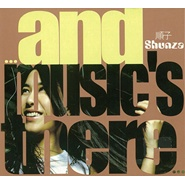
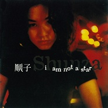

顺子
============================

|  |  |
| :--: | :-- |
| [ 顺子](https://i.xiami.com/shunza) | **播放数**: 28582699 **粉丝数**: 26539 **评论数**: 542 **地区**: United States of America 美国 **风格**: 国语流行 Mandarin Pop, 华语唱作人 Chinese Singer-Songwriter  |

## 档案

顺子，1973年2月12日出生，台湾女歌手。其代表作有《回家》《星星I am not a star》等，尤其1997年的经典之作《回家》被人们广为传唱，被称作“创作歌后”、“灵魂歌后”。 
顺子出生于北京的音乐家庭。其母亲黄爱莲是著名华人钢琴家，父亲是黑管演奏家。家中还有一个姐姐。1979年因父母离婚随母亲和姐姐移居美国旧金山。2012年7月，顺子与美籍男友Jaime交往，两个多月后就在北京完成注册结婚。 
顺子受母亲熏陶，从小学习古典钢琴。在美国成长的顺子也深受黑人音乐如节奏布鲁斯以及爵士乐的影响。顺子先后就读于美国纽约市立大学亨特分校、位于瑞士伯尔尼的瑞士爵士乐学院，并且在瑞士洛桑的爵士乐与现代音乐学院修读音乐制作。 
1992年，顺子组建了一支名为“Duty Free”的乐队，并成为该乐队中唯一的亚洲成员。该乐队在美国、瑞士、法国、意大利、加拿大及奥地利等国，参加过上百场的现场演出。 
1994年的戛纳音乐大展上，顺子的母亲将一卷顺子的DEMO带交给当时参展的滚石唱片，滚石唱片开始关注她的才华。 
1995年，顺子毕业后曾受邀回到爵士乐与现代音乐学院任教。同年，她所在的“Duty Free”在欧洲发行了第一张专辑。 
演艺历程 
1996年，顺子正式签约台湾滚石唱片旗下的魔岩唱片，并只身前往台湾发展。 
1997年，顺子参加魔岩唱片举办的"诞生前夕"六场台湾校园巡回演唱会，初次在媒体上曝光被台湾TVBS-G娱乐新闻评为"惊为天人"。同年发行第一张个人创作同名专辑《顺子SHUNZA》，以主打歌《回家》一鸣惊人，专辑入围台湾金曲奖“最佳演唱”、“最佳新人”、“最佳作曲”三项大奖。 
1998年9月，顺子发行第二张个人创作专辑《I'm Not A Star》，1999年以此专辑荣获第10届台湾金曲奖“最佳国语女歌手”及“最佳作曲”（写一首歌 April 5, 1969）两项大奖；3月发行英文翻唱专辑《Open Up》。2000年，顺子与魔岩唱片合约期满，转与科艺百代（EMI）签约。由于与魔岩合作愉快，虽忙碌于筹配新专辑，顺子仍积极参与旧东家的精选辑制作，并抢先于2001年3月推出自选辑《昨日。唯一。更多》。 
2001年5月，顺子发行跳槽科艺百代的首张专辑《...and music's there...》，为顺子单独主导制作的首张专辑，随后分别于2002年1月、2003年4月发行《Dear Shunza》、《我的朋友Betty Su》两张专辑。2003年9月，以精选《日日夜夜…我最爱的顺子》结束与科艺百代的合约。 
2004年顺子转投台湾种子音乐，并参与台湾电视剧《101次求婚》电视原声带的制作、亲自演唱主题曲《Only One》。2006年1月，发行第二张英语专辑《Songs For Lovers》（中文译名《浪漫恋歌》），重新演绎了10首经典爵士歌曲，其中包含一首法语歌《Les Yeux Ouverts》。 
近几年，顺子和乐队红节奏搭档演出，频繁出现在各大爵士音乐节上。

## 专辑

| 名称 | 语种 | 唱片公司 | 发行时间 | 专辑类别 | 专辑风格 |
| :--: | :-- | :-- | :-- | :-- | :-- |
| [ To The Top超越](./albums/384510111.md) | 国语 | 十一音像 | 2014年04月08日 | 录音室专辑 | 爵士流行 Jazz Pop |
| [ Sunrises](./albums/308901.md) | 国语 | 紫米音乐 | 2008年11月18日 | EP, 单曲 | 国语流行 Mandarin Pop |
| [ 浪漫恋歌](./albums/11482.md) | 英语 | 种子音乐 | 2006年01月19日 | 录音室专辑 | 爵士流行 Jazz Pop |
| [ 日日夜夜…我最爱的顺子Day&Night... My Favorite Shunza](./albums/11484.md) | 国语 | 百代唱片 | 2003年09月19日 | 精选集 | 国语流行 Mandarin Pop, 华语唱作人 Chinese Singer-Songwriter |
| [ 滚石香港黄金十年 顺子精选](./albums/11485.md) | 国语 | 滚石唱片 | 2003年06月07日 | 精选集 | 国语流行 Mandarin Pop |
| [ 我的朋友 Betty Su](./albums/11486.md) | 国语 | 百代唱片 | 2003年04月01日 | 录音室专辑 |  |
| [ and music's there](./albums/11488.md) | 国语 | 百代唱片 | 2001年05月08日 | 录音室专辑 | 当代节奏布鲁斯 Contemporary R&B, 国语流行 Mandarin Pop, 华语唱作人 Chinese Singer-Songwriter |
| [ 昨日·唯一·更多顺子自选集 / Yesterday One More](./albums/11489.md) | 国语 | 魔岩唱片 | 2001年03月01日 | 精选集 | 当代节奏布鲁斯 Contemporary R&B, 国语流行 Mandarin Pop, 华语唱作人 Chinese Singer-Songwriter |
| [ OPEN UPOPEN YOUR MIND](./albums/11490.md) | 英语 | 魔岩唱片 | 1999年03月01日 | 录音室专辑 |  |
| [ Inspiration](./albums/381237.md) | 英语 | Columbia Records | 1999年02月20日 | 录音室专辑 |  |
| [ I Am Not A Star](./albums/11491.md) | 国语 | 魔岩唱片 | 1998年09月24日 | 录音室专辑 | 当代节奏布鲁斯 Contemporary R&B, 国语流行 Mandarin Pop, 华语唱作人 Chinese Singer-Songwriter |
| [ Shunza顺子同名专辑](./albums/32432.md) | 国语 | 魔岩唱片 | 1997年11月18日 | 录音室专辑 | 当代节奏布鲁斯 Contemporary R&B, 国语流行 Mandarin Pop, 华语唱作人 Chinese Singer-Songwriter |

## 评论

|  |  |  |  |
| :-- | :-- | :-- | :-- |
|  [虾米用户](https://emumo.xiami.com/u/199328476)  2021-01-15 13:56 赞(0) 踩(0) | 
顺子 刘沁 曹斐，对世纪初的印象
 |
|  [虾米用户](https://emumo.xiami.com/u/420318571) 音乐让人安静 2020-12-11 17:17 赞(0) 踩(0) | 
最好听最能穿透人心的一首歌。。。回家
 |
|  [虾米用户](https://emumo.xiami.com/u/276944698) 不要自我设限..... 2020-08-13 21:19 赞(0) 踩(0) | 

 |
|  [虾米用户](https://emumo.xiami.com/u/199328476)  2020-07-21 10:58 赞(0) 踩(0) | 

 |
|  [虾米用户](https://emumo.xiami.com/u/199328476)  2020-06-08 19:31 赞(0) 踩(0) | 

 |
|  [虾米用户](https://emumo.xiami.com/u/441820986)  2020-05-13 01:25 赞(1) 踩(0) | 
我的爱神为什么不再出神曲？
 |
|  [虾米用户](https://emumo.xiami.com/u/419026402) 爱做实验，爱唱歌的一个阿... 2020-04-28 12:58 赞(2) 踩(0) | 
很多很多年前，因为一首歌喜欢上顺子的声音，后来买了好几张CD周末在家边做作业一边听 期待顺子以后有更多作品，之前的歌曲旋律和音色都很棒 。
 |
|  [虾米用户](https://emumo.xiami.com/u/441844375) 我还没想好要写什么... 2020-04-04 22:09 赞(0) 踩(0) | 
音乐人！
 |
|  [虾米用户](https://emumo.xiami.com/u/199328476)  2020-03-27 01:28 赞(0) 踩(0) | 

 |
|  [虾米用户](https://emumo.xiami.com/u/329189015) 爱乐人 2020-03-08 00:58 赞(1) 踩(0) | 
您唱的《写一首歌》我不知听了多少遍，您感人歌声让我难忘，这首歌一直保留在我的歌单里，有时还重复播放，推荐给朋友，分享给大家，感谢您给我们带来美好感受   
 |
|  [虾米用户](https://emumo.xiami.com/u/430792759)  2020-02-12 19:40 赞(1) 踩(0) | 
祝顺子生日快乐非常喜欢
 |
|  [虾米用户](https://emumo.xiami.com/u/120482860) 我还没想好要写什么... 2020-02-12 15:39 赞(1) 踩(0) | 
生日快乐
 |
|  [虾米用户](https://emumo.xiami.com/u/311169)  2020-02-12 10:09 赞(1) 踩(0) | 
同一天生日
 |
|  [虾米用户](https://emumo.xiami.com/u/40898752)  2019-11-28 21:43 赞(1) 踩(0) | 
中意咯 
 |
|  [虾米用户](https://emumo.xiami.com/u/338640340)  2019-11-09 05:59 赞(2) 踩(0) | 
最美最感人的声音啊
 |
|  [虾米用户](https://emumo.xiami.com/u/413997866)  2019-10-19 00:12 赞(0) 踩(0) | 
写一首歌真的超耐听，我可以循环一下午
 |
|  [虾米用户](https://emumo.xiami.com/u/29839821) 音樂空間 盡在這裡 2019-08-01 08:14 赞(0) 踩(0) | 
順子會登上《歌手》嗎⋯
 |
| ⇒ |  [虾米用户](https://emumo.xiami.com/u/28225681) rock n ring 2019-08-14 00:16 赞(0) 踩(0) | 
请不要让灾难发生
 |
|  [虾米用户](https://emumo.xiami.com/u/324879742)   2019-06-15 13:54 赞(0) 踩(0) | 
.
 |
|  [虾米用户](https://emumo.xiami.com/u/346165752)  2019-05-24 11:07 赞(0) 踩(0) | 

 |
|  [虾米用户](https://emumo.xiami.com/u/424737303) 陈卓 2019-05-18 21:51 赞(0) 踩(0) | 
顺子唱的歌真是太好听了
 |
|  [虾米用户](https://emumo.xiami.com/u/194640175) 我想要的，都會有的。 2019-05-15 08:12 赞(0) 踩(0) | 
这么多年，你唱歌的时候眼睛里依然闪耀着光那是你对音乐的热爱Love you forever.shunza
 |
|  [虾米用户](https://emumo.xiami.com/u/233419629)   2019-05-05 20:52 赞(0) 踩(0) | 
日日夜夜，我最爱的顺子
 |
|  [虾米用户](https://emumo.xiami.com/u/358104299) 悲观的唯心存在现实解构虚... 2019-05-03 03:12 赞(1) 踩(0) | 
10886
 |
|  [虾米用户](https://emumo.xiami.com/u/6609954) 我还没想好要写什么... 2019-04-28 18:36 赞(5) 踩(0) | 
当年“全能星战”里，金武林 捞仔和孙楠合伙打压陶喆，这节目又出来一个野鸡评委指点顺子唱歌……这只能说明陶喆和顺子太优秀，小人太多[吐]顺子加油！
 |
|  [虾米用户](https://emumo.xiami.com/u/4771536) I like the v... 2019-03-15 02:27 赞(1) 踩(0) | 
我还一直以为她是大陆出道的呀
 |
|  [虾米用户](https://emumo.xiami.com/u/48084409) 我还没想好要写什么.. 2019-03-09 00:18 赞(2) 踩(0) | 
年轻时喜爱过的女神们都已渐渐老了
 |
|  [虾米用户](https://emumo.xiami.com/u/349504713) 幽默风趣的男人 2019-03-08 19:03 赞(1) 踩(0) | 
我喜欢他的嗓音，，，他唱回家很好听。。。我喜欢听回家这个歌。
 |
|  [虾米用户](https://emumo.xiami.com/u/357120470)  2019-02-18 16:05 赞(2) 踩(0) | 
别人唱的叫歌，只有她唱的是自己。
 |
|  [虾米用户](https://emumo.xiami.com/u/1182761) 松任谷由实的迷弟 2019-02-12 11:58 赞(2) 踩(0) | 
生日快乐！
 |
|  [虾米用户](https://emumo.xiami.com/u/275289808) 我还没想好要写什么... 2019-02-12 10:03 赞(3) 踩(0) | 
感谢有您的歌，生日快乐
 |
|  [虾米用户](https://emumo.xiami.com/u/118740670)  2019-02-12 10:02 赞(1) 踩(0) | 
Gipsy woman.
 |
|  [虾米用户](https://emumo.xiami.com/u/227183460) 用心去生活 2019-02-12 10:01 赞(1) 踩(0) | 
喜欢她的歌
 |
|  [虾米用户](https://emumo.xiami.com/u/243387188) 春风十里，不如你 2019-02-08 15:36 赞(2) 踩(0) | 
声线很像李玟
 |
|  [虾米用户](https://emumo.xiami.com/u/412354266)  2019-01-30 08:02 赞(0) 踩(0) | 
闭眼聆听，太享受了
 |
|  [虾米用户](https://emumo.xiami.com/u/194640175) 我想要的，都會有的。 2019-01-08 23:12 赞(2) 踩(0) | 
我的眼泪，我的欢乐我的寂寞，我的痛苦我的未来都有你-顺子
 |
|  [虾米用户](https://emumo.xiami.com/u/66823378)  2019-01-05 10:39 赞(0) 踩(0) | 

 |
|  [虾米用户](https://emumo.xiami.com/u/17717702) 生命有限 音乐无限 2018-12-23 14:00 赞(0) 踩(0) | 
听一辈子都不会厌的歌，只有你顺子(回家)   
 |
|  [虾米用户](https://emumo.xiami.com/u/123246788) Music is my ... 2018-12-20 15:37 赞(4) 踩(0) | 
女神顺子！ 
 |
|  [虾米用户](https://emumo.xiami.com/u/374506949) 今天很残酷，明天更残酷，... 2018-12-15 20:10 赞(0) 踩(0) | 
全能星战看到的
 |
|  [虾米用户](https://emumo.xiami.com/u/224045387)  2018-12-06 23:24 赞(2) 踩(0) | 
顺子，林忆莲非常喜欢的女歌手
 |
|  [虾米用户](https://emumo.xiami.com/u/48625164) “你一定喝过洋酒，你一定... 2018-07-25 01:26 赞(1) 踩(0) | 
大家可以去了解一下她和红乐队合作的一些新歌，有专辑
 |
|  [虾米用户](https://emumo.xiami.com/u/1080926) 我还没想好要写什么... 2018-07-20 04:37 赞(1) 踩(0) | 
依舊好聽，曇花一現實在可惜
 |
|  [虾米用户](https://emumo.xiami.com/u/35589175) 梦想走进现实 2018-07-06 23:21 赞(0) 踩(0) | 
顺子好有才，歌百听不厌
 |
|  [虾米用户](https://emumo.xiami.com/u/86224228)  2018-06-15 12:38 赞(1) 踩(0) | 
读初中时最喜欢的歌手，暴露年纪了。她的声音有一种给人特别舒服的感觉
 |
|  [虾米用户](https://emumo.xiami.com/u/243235072) 我是一棵秋天的树 2018-05-21 02:13 赞(1) 踩(0) | 
多少个青春的夜有顺子歌陪伴，感谢你的歌声。
 |
|  [虾米用户](https://emumo.xiami.com/u/348984752)  2018-05-11 18:27 赞(1) 踩(0) | 
顺子我喜欢你的歌。
 |
|  [虾米用户](https://emumo.xiami.com/u/83591380) 哼一首淡淡的歌。 2018-04-29 23:19 赞(2) 踩(0) | 
顺子最近在忙什么
 |
|  [虾米用户](https://emumo.xiami.com/u/11033528) 盖世英雄 2018-03-27 00:39 赞(1) 踩(0) | 
hi 顺子
 |
|  [虾米用户](https://emumo.xiami.com/u/12221772)  2018-03-06 21:49 赞(0) 踩(0) | 
此刻只要静静地听~~~~~~~~~
 |
|  [虾米用户](https://emumo.xiami.com/u/651086) 一些…还有一些 2018-01-09 08:32 赞(0) 踩(0) | 
有谁一起去听上海演唱会吗
 |
|  [虾米用户](https://emumo.xiami.com/u/334584635) 穷！所以要努力，奋斗！ 2017-12-26 03:11 赞(1) 踩(0) | 
大概差不多在十六七年前听到这首歌，当听到歌词的时候正应对了我哪时的心情，面对现实的情况又那么无可奈何！心里唯一想的只要她能回来我的身边一切都无所谓！只要能在一起任何代价都愿意付出！夏！20年过去了，你能听到我心里一直想对你说的话吗？
 |
| ⇒ |  [虾米用户](https://emumo.xiami.com/u/334584635) 穷！所以要努力，奋斗！ 2017-12-26 03:17 赞(0) 踩(0) | 
男子汉大丈夫流血不流泪，只是未到伤心处！怕什么说出来，你是我第一个为感情流泪的女人！唯一一个，也是最后一个！
 |
|  [虾米用户](https://emumo.xiami.com/u/12719802) lame 2017-12-18 03:16 赞(1) 踩(0) | 
超级爱你啊 ❤️
 |
|  [虾米用户](https://emumo.xiami.com/u/32126406) 身体住了个老灵魂 2017-11-23 23:52 赞(17) 踩(0) | 
台湾唱歌最洋气的一个是COCO一个就是她！
 |
| ⇒ |  [虾米用户](https://emumo.xiami.com/u/375261946) 我还没想好要写什么... 2019-07-16 01:03 赞(0) 踩(0) | 
还有elva
 |
|  [虾米用户](https://emumo.xiami.com/u/332721731)  2017-11-04 18:04 赞(0) 踩(0) | 
这是我最爱的歌
 |
|  [虾米用户](https://emumo.xiami.com/u/662398)  2017-10-28 00:30 赞(3) 踩(0) | 
第一次听回家，上网查顺子的资料，看到她和妈妈在机场准备到美国政治避难，再也见不到吹黑管的爸爸了的时候，正好出到高潮部分，眼泪一下子就掉下来了。。。。
 |
|  [虾米用户](https://emumo.xiami.com/u/1214208)  2017-10-28 00:14 赞(1) 踩(0) | 
最近迷上了顺子 治愈系声音
 |
|  [虾米用户](https://emumo.xiami.com/u/1694047)  2017-10-28 00:12 赞(0) 踩(0) | 
我们一起去寻找心中的那片圣洁之地吧。
 |
|  [虾米用户](https://emumo.xiami.com/u/327329056) 平常心 2017-09-30 12:55 赞(2) 踩(0) | 
每次听《回家》都走心 
 |
|  [虾米用户](https://emumo.xiami.com/u/44242539) 暂无签名~ 2017-09-28 20:06 赞(1) 踩(0) | 
低调的顺子，经典曲目回家
 |
|  [虾米用户](https://emumo.xiami.com/u/288297408)  2017-08-02 03:58 赞(1) 踩(0) | 
beautiful voice
 |
|  [虾米用户](https://emumo.xiami.com/u/288075039)  2017-07-12 11:23 赞(0) 踩(0) | 
以前听过突然又想听了，经典歌曲百听不厌
 |
|  [虾米用户](https://emumo.xiami.com/u/13911932) 暂冇签名~ 2017-06-15 11:22 赞(0) 踩(0) | 
[带墨镜笑]
 |
|  [虾米用户](https://emumo.xiami.com/u/202688615)  2017-06-03 10:39 赞(0) 踩(0) | 
声音好美
 |
|  [虾米用户](https://emumo.xiami.com/u/38463566)  2017-05-24 08:43 赞(0) 踩(0) | 
好声音
 |
|  [虾米用户](https://emumo.xiami.com/u/32076228) …… 2017-05-14 01:01 赞(14) 踩(0) | 
好多年前，音乐之声的颁奖礼，我在现场，听到顺子唱歌时，惊为天人。虽然之前也听过她的《回家》，觉得很好听。但现场听到她的歌声时，瞬间被打动了。忘了她唱的是什么歌，只记得声音很美，仿佛闪耀着光芒的细沙缓缓从夜空中落下&amp;hellip;&amp;hellip;
 |
| ⇒ |  [虾米用户](https://emumo.xiami.com/u/10968439) 心有些乱 2017-08-15 00:20 赞(0) 踩(0) | 
不知道为什么后来不怎么出专辑了，是不是生活重心转移了
 |
| ⇒ |  [虾米用户](https://emumo.xiami.com/u/125372126)  2020-07-24 19:03 赞(0) 踩(0) | 
能在颁奖现场，你也不简单。
 |
|  [虾米用户](https://emumo.xiami.com/u/281616187) 花椒号108457055 2017-05-08 08:51 赞(0) 踩(0) | 
！写一首歌听起来好幸福啊✧٩(ˊ&amp;omega;ˋ*)و✧
 |
|  [虾米用户](https://emumo.xiami.com/u/280657649) 云在青天水在瓶 2017-04-14 17:39 赞(1) 踩(0) | 
若没有她的离开，真没发现回家是那么困难的一件事情，真没发现这是多么真实的一首歌。
 |
|  [虾米用户](https://emumo.xiami.com/u/279224473)  2017-04-14 07:31 赞(1) 踩(0) | 
听这首歌好伤感
 |
|  [虾米用户](https://emumo.xiami.com/u/285995615)  2017-04-06 17:40 赞(0) 踩(0) | 
顺子作品里最好的一首，一把吉他配她的嗓音，绝！
 |
|  [虾米用户](https://emumo.xiami.com/u/279983318)  2017-03-24 21:04 赞(2) 踩(0) | 
听你的歌曲有十多年了，依然记得最早听的是《写一首歌》
 |
|  [虾米用户](https://emumo.xiami.com/u/82351554)  2017-03-15 11:38 赞(1) 踩(0) | 
介绍里面的台湾女歌手是什么鬼
 |
|  [虾米用户](https://emumo.xiami.com/u/280115706)  2017-03-13 17:34 赞(0) 踩(0) | 
想下载无损回家永远保存&amp;hellip;&amp;hellip;
 |
|  [虾米用户](https://emumo.xiami.com/u/106195412) 常驻云村，偶尔来虾米看看 2017-03-11 22:36 赞(0) 踩(0) | 
唉，顺子怎么才这么点专辑，太低调了&amp;hellip;&amp;hellip;
 |
|  [虾米用户](https://emumo.xiami.com/u/122737) 好孩子应该多听音乐 2017-02-25 20:23 赞(0) 踩(0) | 
漏掉了  
 |
|  [虾米用户](https://emumo.xiami.com/u/12426668) 张艺兴张艺兴张艺兴 2017-02-19 23:48 赞(0) 踩(0) | 
从艺兴访问赶过来听原唱，“写一首歌” 果然是小时候就听到过的歌，好听好听
 |
|  [虾米用户](https://emumo.xiami.com/u/260167529) 爱音乐的疯子 2017-01-17 23:22 赞(1) 踩(0) | 
继续玩吧 这才是你 不用考虑市场 听你的人会自然来
 |
| ⇒ |  [虾米用户](https://emumo.xiami.com/u/251485990) 略略略略略 2017-06-18 22:48 赞(0) 踩(0) | 
哟，你的头像是佑的专辑
 |
| ⇒ |  [虾米用户](https://emumo.xiami.com/u/260167529) 爱音乐的疯子 2017-06-19 14:17 赞(0) 踩(0) | 
<q><b>Leo说：</b></q>
 |
| ⇒ |  [虾米用户](https://emumo.xiami.com/u/251485990) 略略略略略 2017-06-19 15:06 赞(0) 踩(0) | 
<q><b>邰颖哲佑说：</b></q>
 |
| ⇒ |  [虾米用户](https://emumo.xiami.com/u/260167529) 爱音乐的疯子 2017-06-19 15:59 赞(0) 踩(0) | 
<q><b>Leo说：</b></q>
 |
| ⇒ |  [虾米用户](https://emumo.xiami.com/u/251485990) 略略略略略 2017-06-19 16:00 赞(0) 踩(0) | 
<q><b>邰颖哲佑说：</b></q>
 |
|  [虾米用户](https://emumo.xiami.com/u/4950583) 我还没想好要写什么... 2017-01-13 20:27 赞(1) 踩(0) | 
我现在顺子现场，感觉顺子唱歌从台风到打扮都有点像tina turner ......
 |
|  [虾米用户](https://emumo.xiami.com/u/202915471) 我是水瓶座♒️ 2017-01-05 01:47 赞(1) 踩(0) | 
歌都是自己写的，才知道，太有才了
 |
|  [虾米用户](https://emumo.xiami.com/u/186396946)  2017-01-02 23:45 赞(0) 踩(0) | 
实在是找不到词来形容了，好听！！！
 |
|  [虾米用户](https://emumo.xiami.com/u/2750410)  2016-12-20 21:23 赞(0) 踩(0) | 
觉得这两年火红的邓紫棋跟顺子有点儿像……实力型歌手
 |
|  [虾米用户](https://emumo.xiami.com/u/124708480)   2016-12-08 11:39 赞(0) 踩(0) | 
without reason
 |
|  [虾米用户](https://emumo.xiami.com/u/11353160)  2016-12-02 00:33 赞(0) 踩(0) | 
你始终欠我一个散场的拥抱。
 |
|  [虾米用户](https://emumo.xiami.com/u/209182250)  2016-09-07 15:13 赞(3) 踩(0) | 
顺子的歌声直通心灵！为数不多的有才华又有好声音的创作女歌手！喜欢你！
 |
|  [虾米用户](https://emumo.xiami.com/u/5853302)  2016-08-25 11:27 赞(1) 踩(0) | 
顺子的歌总能唱进人心里
 |
|  [虾米用户](https://emumo.xiami.com/u/201255410) 叙衷情，追往昔，独宴只陪... 2016-08-11 16:47 赞(0) 踩(0) | 
因为听写一首歌而知道她
 |
|  [虾米用户](https://emumo.xiami.com/u/306476) 我还没想好要写什么... 2016-07-15 00:09 赞(0) 踩(0) | 
姐们儿哪儿去了啊
 |
|  [虾米用户](https://emumo.xiami.com/u/177527028)  2016-05-24 10:56 赞(1) 踩(0) | 
超喜欢顺子的回家
 |
|  [虾米用户](https://emumo.xiami.com/u/47236813) 我还没想好要写什么... 2016-05-11 20:38 赞(0) 踩(0) | 
巴彦格日顺
 |
| ⇒ |  [虾米用户](https://emumo.xiami.com/u/269898413)  2017-02-03 07:15 赞(0) 踩(0) | 
是 巴彦格勒顺~
 |
|  [虾米用户](https://emumo.xiami.com/u/134515924) 逆流的河。 2016-04-19 19:02 赞(1) 踩(0) | 
应该是我是歌手首发阵容之一
 |
|  [虾米用户](https://emumo.xiami.com/u/121598742)  2016-04-17 23:39 赞(2) 踩(0) | 
因为田喜碧唱过写一首歌，所以来听偶像的偶像了。
 |
|  [虾米用户](https://emumo.xiami.com/u/8737417)  2016-03-21 09:46 赞(0) 踩(0) | 
sasa
 |
|  [虾米用户](https://emumo.xiami.com/u/1874519)  2016-02-14 20:59 赞(0) 踩(0) | 
清透
 |
|  [虾米用户](https://emumo.xiami.com/u/7375746) 我还没想好要写什么... 2016-02-12 10:33 赞(0) 踩(0) | 
大？大卫？
 |
|  [虾米用户](https://emumo.xiami.com/u/21753646)   2016-02-10 23:19 赞(0) 踩(0) | 
从初中开始到现在十多年了最喜欢的华语女歌手
 |
|  [虾米用户](https://emumo.xiami.com/u/28215618) 年华都是无效信 2016-01-23 11:11 赞(0) 踩(0) | 
管上。。
 |
|  [虾米用户](https://emumo.xiami.com/u/40951010)  2016-01-13 14:25 赞(0) 踩(0) | 
回家这曲子里唱的好静音
 |
|  [虾米用户](https://emumo.xiami.com/u/40277112) 挑剔的耳朵 2015-12-13 22:20 赞(0) 踩(0) | 
顺子是在Rhythm and blues的浸泡中成长的。再加上她自己对音乐的悟性，写出了这首神曲。
 |
|  [虾米用户](https://emumo.xiami.com/u/1495704) 暂无签名~ 2015-12-13 19:17 赞(1) 踩(0) | 
从《东北一家人》开始就一直喜欢顺子。
 |
|  [虾米用户](https://emumo.xiami.com/u/4127048) 最是一曲忘不了 2015-12-06 23:02 赞(0) 踩(0) | 
好听到不行！
 |
|  [虾米用户](https://emumo.xiami.com/u/46104573) 人生就像一只船～ 2015-11-21 15:09 赞(0) 踩(0) | 
写一首歌。
 |
|  [虾米用户](https://emumo.xiami.com/u/4911436)  2015-11-20 12:43 赞(0) 踩(0) | 
虽然我不知道什么叫灵魂乐，当时我听顺子唱歌好像感觉自己就是在听灵魂乐
 |
|  [虾米用户](https://emumo.xiami.com/u/9842939)  2015-11-19 11:43 赞(1) 踩(0) | 
暮然回听，原来顺子的声音如此之清澈又具有吸引力。虽然歌词~ 真是，，就那样。
 |
|  [虾米用户](https://emumo.xiami.com/u/11980672) 全世界在舞蹈  你躲在哪... 2015-11-16 20:16 赞(0) 踩(0) | 
照片美美哒～
 |
|  [虾米用户](https://emumo.xiami.com/u/34413387)   2015-11-10 08:44 赞(0) 踩(0) | 
后来到大陆来发展，并改名为郭美美
 |
| ⇒ |  [虾米用户](https://emumo.xiami.com/u/102600782) 青春期稍稍长了点…… 2016-06-10 21:18 赞(0) 踩(0) | 
逗……
 |
|  [虾米用户](https://emumo.xiami.com/u/35949246) WEI KUO 2015-10-31 16:25 赞(0) 踩(0) | 
始終最愛，請繼續創作，Please!
 |
|  [虾米用户](https://emumo.xiami.com/u/3070567) 生活在别处 2015-10-31 00:27 赞(0) 踩(0) | 
每首都唱到人心里去…
 |
|  [虾米用户](https://emumo.xiami.com/u/1163055)  2015-10-06 12:36 赞(0) 踩(0) | 
顺子上海演唱会上翻唱飞机场的10：30很棒啊
 |
|  [虾米用户](https://emumo.xiami.com/u/920692)  2015-10-02 22:29 赞(2) 踩(0) | 
最喜欢的女歌手，没有之一。
 |
|  [虾米用户](https://emumo.xiami.com/u/1495704) 暂无签名~ 2015-09-11 22:50 赞(1) 踩(0) | 
越来越像我二姨。
 |
|  [虾米用户](https://emumo.xiami.com/u/1182761) 松任谷由实的迷弟 2015-08-28 16:42 赞(1) 踩(0) | 
玩黑人音乐玩得非常厉害！！！
 |
|  [虾米用户](https://emumo.xiami.com/u/8953203)  2015-08-16 14:22 赞(4) 踩(0) | 
要不起
 |
|  [虾米用户](https://emumo.xiami.com/u/51580374)   2015-08-07 11:27 赞(0) 踩(0) | 
我现在才发现顺子生日和我同一天
 |
|  [虾米用户](https://emumo.xiami.com/u/16774935) 愿漂泊的人都有酒喝，愿孤... 2015-08-01 15:42 赞(0) 踩(0) | 
写一首歌
 |
|  [虾米用户](https://emumo.xiami.com/u/16774935) 愿漂泊的人都有酒喝，愿孤... 2015-08-01 15:42 赞(0) 踩(0) | 
写一首歌
 |
|  [虾米用户](https://emumo.xiami.com/u/8096482)   2015-07-29 11:35 赞(0) 踩(0) | 
歌唱家级别
 |
|  [虾米用户](https://emumo.xiami.com/u/7097746)   2015-07-26 11:07 赞(50) 踩(0) | 
顺子的声音给我一种她是三毛的感觉。。
 |
|  [虾米用户](https://emumo.xiami.com/u/50794030) 最好的一天～ 2015-06-21 00:37 赞(2) 踩(0) | 
让人嫉妒的好嗓音~
 |
|  [虾米用户](https://emumo.xiami.com/u/50335380) 努力 奋斗 2015-05-31 16:40 赞(0) 踩(0) | 
a sing by guitar saying her heart
 |
|  [虾米用户](https://emumo.xiami.com/u/4785468) 好好完成计划！ 2015-05-16 16:27 赞(0) 踩(0) | 
what a beautiful voice
 |
|  [虾米用户](https://emumo.xiami.com/u/44798879) 神秘园 2015-04-13 20:39 赞(1) 踩(0) | 
喜欢dear friend
 |
|  [虾米用户](https://emumo.xiami.com/u/2102200) When you wis... 2015-04-05 18:16 赞(0) 踩(0) | 
声音真好听 为什么我现在才发现
 |
|  [虾米用户](https://emumo.xiami.com/u/38998366)  2015-03-23 21:13 赞(0) 踩(0) | 
太牛了，喜
 |
| ⇒ |  [虾米用户](https://emumo.xiami.com/u/38998366)  2015-03-23 21:13 赞(0) 踩(0) | 
欢
 |
|  [虾米用户](https://emumo.xiami.com/u/16459711)   2015-03-20 14:47 赞(0) 踩(0) | 
顺杂 我喜欢哈哈哈
 |
|  [虾米用户](https://emumo.xiami.com/u/43957799) 我爱他 却不知道他爱不爱... 2015-02-23 19:07 赞(0) 踩(0) | 
每张照片真的好不同
 |
|  [虾米用户](https://emumo.xiami.com/u/32841381) Just listen. 2015-02-16 12:51 赞(2) 踩(0) | 
为什么我觉得顺子在每张照片里都长得不一样…我应该去看眼科了…
 |
| ⇒ |  [虾米用户](https://emumo.xiami.com/u/17514926)  2015-03-12 22:22 赞(0) 踩(0) | 
哈哈，亲好幽默啊
 |
|  [虾米用户](https://emumo.xiami.com/u/2737024) 不是僵尸号，台湾流行乐爱... 2015-01-18 13:07 赞(2) 踩(0) | 
我94年生！非常喜欢顺子，她的声音太美！！！
 |
|  [虾米用户](https://emumo.xiami.com/u/9401640) Music is the... 2015-01-17 23:53 赞(1) 踩(0) | 
特别喜欢《回家》这首歌，顺子的声音很能让人平静下来，感情也不是肆意流淌的那种，很舒服。
 |
|  [虾米用户](https://emumo.xiami.com/u/31690731)  2015-01-06 17:14 赞(0) 踩(0) | 
不知道，老子就是任性~
 |
|  [虾米用户](https://emumo.xiami.com/u/13742910) HarryPotter 2014-12-30 07:59 赞(0) 踩(0) | 
shunzi
 |
|  [虾米用户](https://emumo.xiami.com/u/8833102) 伟❤️375882267 2014-12-25 01:19 赞(1) 踩(0) | 
这里的歌真好听圣诞快乐  ！！！
 |
|  [虾米用户](https://emumo.xiami.com/u/37069013) 不忘初心，方得始终。 2014-12-23 21:30 赞(0) 踩(0) | 
我很喜欢的女歌手，一直很小众，没火起来，可惜了
 |
|  [虾米用户](https://emumo.xiami.com/u/10481134)  2014-12-10 23:47 赞(0) 踩(0) | 
Dear Friend
 |
|  [虾米用户](https://emumo.xiami.com/u/11410422) yuefeng.li 2014-12-05 16:20 赞(2) 踩(0) | 
英文名叫『顺砸儿』？
 |
| ⇒ |  [虾米用户](https://emumo.xiami.com/u/50794030) 最好的一天～ 2015-06-21 00:43 赞(0) 踩(0) | 
 
 |
|  [虾米用户](https://emumo.xiami.com/u/7012981) 声音中的故事 2014-12-04 14:20 赞(0) 踩(0) | 
嗓音低了，少了很多情感在里边。
 |
|  [虾米用户](https://emumo.xiami.com/u/1429342)  2014-12-03 11:53 赞(1) 踩(0) | 
这张蛮小众，不是很懂。其实顺子的质素比好多歌手都好。可惜了，主流市场矛盾了。不过喜欢的人喜欢就好。ENJOY吧。
 |
|  [虾米用户](https://emumo.xiami.com/u/8096482)   2014-12-02 20:28 赞(1) 踩(0) | 
顺子一直是用灵魂在唱歌，绝非只有好嗓子那么简单
 |
|  [虾米用户](https://emumo.xiami.com/u/791555)  2014-12-02 10:52 赞(0) 踩(0) | 
好好听
 |
|  [虾米用户](https://emumo.xiami.com/u/15422043)   2014-12-01 23:35 赞(0) 踩(0) | 
我爱你！你不是一颗寂寞的星星！
 |
|  [虾米用户](https://emumo.xiami.com/u/999506)  2014-12-01 19:43 赞(0) 踩(0) | 
久违的新歌~ 你们都不发片，我都多久没听中文歌了
 |
|  [虾米用户](https://emumo.xiami.com/u/3540495) 两个人共同做的梦便是现实 2014-12-01 18:19 赞(0) 踩(0) | 
我的个亲妈...这头像p的多头了把
 |
|  [虾米用户](https://emumo.xiami.com/u/19256185)   2014-12-01 16:11 赞(0) 踩(0) | 
时隔六年，这张带着爵士风专辑。等的太久。一直都很喜欢顺子的声音~
 |
|  [虾米用户](https://emumo.xiami.com/u/712925) 别扯有的没的 2014-12-01 14:53 赞(1) 踩(0) | 
才注意到可以看顺子的虾米哎。。。
 |
|  [虾米用户](https://emumo.xiami.com/u/8146462) 我是淑女，淑女是我 2014-12-01 14:30 赞(0) 踩(0) | 
回家~~
 |
|  [虾米用户](https://emumo.xiami.com/u/2389786)  2014-12-01 14:14 赞(0) 踩(0) | 
太好了，顺子你又升华了
 |
|  [虾米用户](https://emumo.xiami.com/u/8485170) 乐歇而不止 2014-12-01 11:56 赞(1) 踩(0) | 
这个英文名念起来总是有点不对劲。。。顺砸。。
 |
|  [虾米用户](https://emumo.xiami.com/u/3746453) 谢谢虾米温暖的你们：） 2014-12-01 11:15 赞(0) 踩(0) | 
为啥我印象里一直觉得她是是日本人
 |
|  [虾米用户](https://emumo.xiami.com/u/19462503) 内部装修中…… 2014-12-01 10:45 赞(0) 踩(0) | 
虾米闷声发大财
 |
|  [虾米用户](https://emumo.xiami.com/u/598073)   2014-11-25 09:14 赞(0) 踩(0) | 
声音很醇 态度很淡 非常喜欢~
 |
|  [虾米用户](https://emumo.xiami.com/u/29887370)  2014-11-20 17:12 赞(0) 踩(0) | 
轻轻的、跳跃的声音，似深秋的午后阳光，似冬初的晶莹雪花。听着就惬意～
 |
|  [虾米用户](https://emumo.xiami.com/u/36759911)  2014-11-20 13:17 赞(0) 踩(0) | 
低调婉转 安心自在
 |
|  [虾米用户](https://emumo.xiami.com/u/43744739)  2014-11-17 13:20 赞(1) 踩(0) | 
喜欢顺子很多年很多年..我是个非常挑剔的人.国内的歌曲很少听.但她是一个...最喜欢的是顺子回家那首mv里的表现.观众不多.坐在中间静静悠悠的唱.还有最后那一个云淡风轻的微笑.美极了..能读懂的人.可谓倾国倾城...爱你.愿你幸福.快乐...
 |
|  [虾米用户](https://emumo.xiami.com/u/31955810) 暂无签名~ 2014-10-26 09:54 赞(0) 踩(0) | 
声音很好
 |
|  [虾米用户](https://emumo.xiami.com/u/10617056) 这就是爱 2014-10-06 17:28 赞(0) 踩(0) | 
干净的声音，悠扬而悠长~
 |
|  [虾米用户](https://emumo.xiami.com/u/8159374)  2014-10-04 16:11 赞(0) 踩(0) | 
华语届最顶尖的女歌手！没有之一！
 |
|  [虾米用户](https://emumo.xiami.com/u/13552)  2014-09-16 20:18 赞(0) 踩(0) | 
Dear Friend
 |
|  [虾米用户](https://emumo.xiami.com/u/3664254) 看我的唐诗剑法 2014-09-01 09:31 赞(0) 踩(0) | 
居然是内地的
 |
|  [虾米用户](https://emumo.xiami.com/u/39985689)  2014-08-13 23:28 赞(0) 踩(0) | 
好听
 |
|  [虾米用户](https://emumo.xiami.com/u/35279911)  2014-07-25 22:21 赞(0) 踩(0) | 
好喜欢听的
 |
|  [虾米用户](https://emumo.xiami.com/u/37702850)  2014-07-01 20:06 赞(0) 踩(0) | 
雨天听
 |
|  [虾米用户](https://emumo.xiami.com/u/962934)  2014-06-29 16:59 赞(0) 踩(0) | 
真的很顺。不错
 |
|  [虾米用户](https://emumo.xiami.com/u/849435) 双魚 2014-06-15 09:33 赞(0) 踩(0) | 
为什么顺子的音乐总是那么忧伤 那种冷冷的忧伤 她有过怎样的经历
 |
|  [虾米用户](https://emumo.xiami.com/u/37251620)  2014-06-05 14:57 赞(0) 踩(0) | 
好听
 |
|  [虾米用户](https://emumo.xiami.com/u/18050450) 哇偶 2014-05-16 11:17 赞(0) 踩(0) | 
最爱的回家
 |
|  [虾米用户](https://emumo.xiami.com/u/35825499)  2014-05-11 19:37 赞(0) 踩(0) | 
好听
 |
|  [虾米用户](https://emumo.xiami.com/u/35744863) 天才他爸 2014-05-08 13:28 赞(0) 踩(0) | 
lal
 |
|  [虾米用户](https://emumo.xiami.com/u/25352898)  2014-04-24 22:20 赞(1) 踩(0) | 
想听听Dear friend 顺路点去看看顺子最近都在听什么 没想到一下就点开了新大陆 顺子居然在听郭德纲 原来虾米还有郭德纲2333333333333333
 |
| ⇒ |  [虾米用户](https://emumo.xiami.com/u/2892686) 来吧伴我飞 2014-05-03 01:51 赞(0) 踩(0) | 
顺子还在听古琴曲山居吟呢，新大陆之开阔超越你想象。。。。
 |
| ⇒ |  [虾米用户](https://emumo.xiami.com/u/1709266) 建筑狗 2014-05-04 23:39 赞(0) 踩(0) | 
。。。。。
 |
|  [虾米用户](https://emumo.xiami.com/u/3664254) 看我的唐诗剑法 2014-04-23 12:56 赞(0) 踩(0) | 
今年4月份不是出了新专辑，为什么顺子自己都不上线
 |
|  [虾米用户](https://emumo.xiami.com/u/14417191) smile~ 2014-04-19 16:24 赞(0) 踩(0) | 
声音赞
 |
|  [虾米用户](https://emumo.xiami.com/u/5092273)  2014-03-23 22:15 赞(1) 踩(0) | 
有一段时间，一听回家我就哭成煞笔
 |
|  [虾米用户](https://emumo.xiami.com/u/23460452) 新浪@壹人一叶轻舟 2014-03-21 12:09 赞(0) 踩(0) | 
飘泊在外的夜里！是她把我带回了家。。。。。。。。。
 |
|  [虾米用户](https://emumo.xiami.com/u/24622438) = = 2014-03-20 22:17 赞(0) 踩(0) | 
额。。。。。为什么没有only one，我很喜欢啊！！！！！！！！！
 |
|  [虾米用户](https://emumo.xiami.com/u/9927476)  2014-03-15 16:33 赞(0) 踩(0) | 
声音极富感染力 听 i&amp;#039;m sorry  身上像过电一样
 |
|  [虾米用户](https://emumo.xiami.com/u/12036543) once 。。。 2014-02-23 10:29 赞(0) 踩(0) | 
灵魂女神
 |
|  [虾米用户](https://emumo.xiami.com/u/81933)  2014-02-22 23:42 赞(0) 踩(0) | 
当初，在玩游戏侠盗飞车-圣安迪斯时，将自定音乐设定为顺子，怀念那个时候《dear friend》
 |
|  [虾米用户](https://emumo.xiami.com/u/6638261) 已下架。。。。20200... 2014-02-17 21:33 赞(0) 踩(0) | 
赞
 |
|  [虾米用户](https://emumo.xiami.com/u/6638261) 已下架。。。。20200... 2014-02-17 21:33 赞(0) 踩(0) | 
终于看到歌手了~支持 声音很有old feel
 |
|  [虾米用户](https://emumo.xiami.com/u/968703)   2014-02-13 12:48 赞(0) 踩(0) | 
特别适合雪天听
 |
|  [虾米用户](https://emumo.xiami.com/u/2224206) 青春  像一道划过的航线 2014-02-12 19:27 赞(0) 踩(0) | 
生日快乐！！
 |
|  [虾米用户](https://emumo.xiami.com/u/2480897)  2014-02-12 15:25 赞(0) 踩(0) | 
生日快樂!!
 |
|  [虾米用户](https://emumo.xiami.com/u/7322777) ∮ 2014-02-12 12:54 赞(0) 踩(0) | 
蝦米通知:生日快樂
 |
|  [虾米用户](https://emumo.xiami.com/u/6684451)  2014-02-12 12:43 赞(0) 踩(0) | 
“跟去年说再见 转眼又是冬天才一年看着世界变迁有种沧海桑田 无常的感觉”一年又过去了呢，生日快乐~顺子
 |
|  [虾米用户](https://emumo.xiami.com/u/580965) 来自内心的一点光一点亮 2014-02-12 09:10 赞(0) 踩(0) | 
生日快乐~~来自迷你猫的问候=）
 |
|  [虾米用户](https://emumo.xiami.com/u/1609946) 一即一切 2014-02-12 06:45 赞(0) 踩(0) | 
心 境不二
 |
|  [虾米用户](https://emumo.xiami.com/u/32620273)  2014-02-11 11:37 赞(0) 踩(0) | 
1
 |
|  [虾米用户](https://emumo.xiami.com/u/13837658) 李大国 2014-02-10 19:22 赞(0) 踩(0) | 
好听
 |
|  [虾米用户](https://emumo.xiami.com/u/5664929)  2014-02-05 08:51 赞(0) 踩(0) | 
头像乍一看以为张柏芝呢。管理员是要有多坏。
 |
|  [虾米用户](https://emumo.xiami.com/u/32375428)  2014-02-04 19:38 赞(0) 踩(0) | 
总听顺子，但没听过。今天听听，还不错。
 |
|  [虾米用户](https://emumo.xiami.com/u/10583422)  2014-01-25 20:31 赞(0) 踩(0) | 
顺子，my ferend。在电影苏州河当中，？台词？说如果有一天我走啦，你会像马达一样找我吗，对方说 会，然后他接着说 你骗我。其实找和不找 这个时候承诺都早了一点点，等那一天 发生的时候 我们再来说吧。如果有一天我走了 你会像马达一样找我吗，我是李峙，这是 新不老歌。#110907，03：29：11#
 |
|  [虾米用户](https://emumo.xiami.com/u/31215247)  2014-01-23 20:30 赞(0) 踩(0) | 
这里就像一个爵士构成的社会，充满爵士的音符，你不一定天天听到惊喜，但是总有一个地方够你天天安心的听，爵士小屋（ 130969733）欢迎您的到来。
 |
|  [虾米用户](https://emumo.xiami.com/u/31912387)  2014-01-20 00:48 赞(0) 踩(0) | 
丝丝入扣
 |
|  [虾米用户](https://emumo.xiami.com/u/29793086) 月﹑小古 2014-01-15 19:26 赞(0) 踩(0) | 
2
 |
|  [虾米用户](https://emumo.xiami.com/u/12208979)  2014-01-04 14:47 赞(0) 踩(0) | 
good
 |
|  [虾米用户](https://emumo.xiami.com/u/30947473)  2014-01-02 13:27 赞(0) 踩(0) | 
喜欢你的回家
 |
|  [虾米用户](https://emumo.xiami.com/u/2224206) 青春  像一道划过的航线 2013-12-22 19:51 赞(0) 踩(0) | 
顺子！！爱你！
 |
|  [虾米用户](https://emumo.xiami.com/u/15991072) 暂无签名~ 2013-12-18 00:41 赞(0) 踩(0) | 
因为家里有台湾电视台，所以从小就知道她是很有实力的台湾歌手，但是不知道为什么在大陆的知名度不高
 |
| ⇒ |  [虾米用户](https://emumo.xiami.com/u/2446953)  2014-01-26 15:12 赞(0) 踩(0) | 
其实她应该算是大陆人吧。在大陆我觉得知名度还行。
 |
| ⇒ |  [虾米用户](https://emumo.xiami.com/u/15991072) 暂无签名~ 2014-01-26 23:32 赞(0) 踩(0) | 
<q><b>未知生物说：</b></q>
 |
|  [虾米用户](https://emumo.xiami.com/u/1548279)  2013-12-11 16:54 赞(0) 踩(0) | 
婉转美好的声音
 |
|  [虾米用户](https://emumo.xiami.com/u/580965) 来自内心的一点光一点亮 2013-12-10 14:24 赞(0) 踩(0) | 
顺子姐~还记得在南锣鼓巷偶遇的迷你猫吗？我们上个月刚刚成立四周年了~一直还在努力 谢谢你的鼓励=) 希望早日听到你的新专辑~
 |
|  [虾米用户](https://emumo.xiami.com/u/1596009)  2013-12-10 01:17 赞(0) 踩(0) | 
欢迎顺子来虾米~小的时候就是顺子给我启蒙的流行乐，这张dear Shunza我家里还保存着呢~~
 |
|  [虾米用户](https://emumo.xiami.com/u/1851561)  2013-12-09 23:20 赞(0) 踩(0) | 
女神
 |
|  [虾米用户](https://emumo.xiami.com/u/3267377) 音乐无关歌词。 2013-12-09 21:28 赞(0) 踩(0) | 
从《写一首歌》开始...
 |
|  [虾米用户](https://emumo.xiami.com/u/175623) 树木与花草 2013-12-09 20:28 赞(0) 踩(0) | 
大学时候爱听的女声，现在也是
 |
|  [虾米用户](https://emumo.xiami.com/u/2527832) 超越生命 解放自由 2013-12-09 19:38 赞(0) 踩(0) | 
說句話吧!
 |
|  [虾米用户](https://emumo.xiami.com/u/29045842)  2013-12-04 22:09 赞(0) 踩(0) | 
很喜欢她
 |
|  [虾米用户](https://emumo.xiami.com/u/6666474) shuiruyan 2013-12-03 21:17 赞(0) 踩(0) | 
我是因为《回家》而认识她的
 |
|  [虾米用户](https://emumo.xiami.com/u/23741164)  2013-11-29 15:05 赞(0) 踩(0) | 
舒服
 |
|  [虾米用户](https://emumo.xiami.com/u/25071807)  2013-11-27 19:32 赞(0) 踩(0) | 
like
 |
|  [虾米用户](https://emumo.xiami.com/u/9806268) Awaker 2013-11-17 19:45 赞(0) 踩(0) | 
从小喜欢的。
 |
|  [虾米用户](https://emumo.xiami.com/u/8008346)  2013-11-05 00:26 赞(0) 踩(0) | 
好聽
 |
|  [虾米用户](https://emumo.xiami.com/u/2977661)  2013-10-22 14:18 赞(1) 踩(0) | 
顺子你根本没必要去参加那种所谓歌星擂台，好好继续做你的音乐就好了！
 |
|  [虾米用户](https://emumo.xiami.com/u/853523)  2013-10-20 13:43 赞(28) 踩(0) | 
术业有专攻，让一个爵士歌手唱民歌，没有什么可比性。
 |
| ⇒ |  [虾米用户](https://emumo.xiami.com/u/2977661)  2013-10-22 14:16 赞(0) 踩(0) | 
顺子没必要参加这种节目。
 |
| ⇒ |  [虾米用户](https://emumo.xiami.com/u/23500601)  2014-07-03 00:09 赞(0) 踩(0) | 
<q><b>izuki说：</b></q>
 |
| ⇒ |  [虾米用户](https://emumo.xiami.com/u/1867722)  2019-04-28 08:18 赞(0) 踩(0) | 
哥们，您这个是有先知性的话语啊……
 |
|  [虾米用户](https://emumo.xiami.com/u/4045476)  2013-10-11 18:30 赞(0) 踩(0) | 
回家。。。
 |
|  [虾米用户](https://emumo.xiami.com/u/2145473) 别回复我…你们都很专业 2013-10-09 17:07 赞(1) 踩(0) | 
翻唱的Friend。。。确实很温暖。虽然私以为：玉置浩二作为原唱无法超越。但是这个版本确实很棒啦。。。
 |
|  [虾米用户](https://emumo.xiami.com/u/23638121)  2013-10-04 01:59 赞(0) 踩(0) | 
good
 |
|  [虾米用户](https://emumo.xiami.com/u/2600810)  2013-09-09 20:55 赞(0) 踩(0) | 
就是喜歡她的歌聲....
 |
|  [虾米用户](https://emumo.xiami.com/u/856551) 虾米活下去 用户指责什么... 2013-09-06 00:26 赞(0) 踩(0) | 
同花
 |
|  [虾米用户](https://emumo.xiami.com/u/962146)  2013-08-25 14:32 赞(0) 踩(0) | 
非常有自己的风格
 |
|  [虾米用户](https://emumo.xiami.com/u/18209891)  2013-08-23 03:44 赞(0) 踩(0) | 
good
 |
|  [虾米用户](https://emumo.xiami.com/u/1267474) 二到尽头，覆水难收 2013-07-20 22:04 赞(0) 踩(0) | 
多好一个声音 怎么就消失了
 |
|  [虾米用户](https://emumo.xiami.com/u/8539450) 音乐菜鸟 2013-06-25 12:53 赞(0) 踩(0) | 
静静的，爵士的，R&amp;amp;B
 |
|  [虾米用户](https://emumo.xiami.com/u/4377675)  2013-06-20 14:39 赞(0) 踩(0) | 
知性熟女，火辣！
 |
|  [虾米用户](https://emumo.xiami.com/u/5809458)  2013-06-20 13:01 赞(0) 踩(0) | 
dear friend 每次听到都想哭
 |
| ⇒ |  [虾米用户](https://emumo.xiami.com/u/8728451)   2013-06-21 01:17 赞(0) 踩(0) | 
认同，我也是
 |
|  [虾米用户](https://emumo.xiami.com/u/15459603)  2013-06-14 19:22 赞(0) 踩(0) | 
她是我的菜
 |
|  [虾米用户](https://emumo.xiami.com/u/15896142)  2013-06-07 21:07 赞(0) 踩(0) | 
night watch
 |
|  [虾米用户](https://emumo.xiami.com/u/15742501)  2013-06-04 00:50 赞(0) 踩(0) | 
当然是喜欢《回家》这首歌了。
 |
|  [虾米用户](https://emumo.xiami.com/u/6790650)  2013-05-23 01:17 赞(0) 踩(0) | 
不再想念。天籁啊
 |
|  [虾米用户](https://emumo.xiami.com/u/5085929)  2013-05-16 17:55 赞(0) 踩(0) | 
清唱
 |
|  [虾米用户](https://emumo.xiami.com/u/14205603)  2013-04-28 11:25 赞(0) 踩(0) | 
我爱她的声音
 |
|  [虾米用户](https://emumo.xiami.com/u/13707738) 安静！ 2013-04-27 23:26 赞(0) 踩(0) | 
听听
 |
|  [虾米用户](https://emumo.xiami.com/u/9386375) 落下的是一颗疲倦的心 2013-04-25 02:01 赞(0) 踩(0) | 
喜欢她的清唱，很有感觉，这一点很多歌手都比不了
 |
|  [虾米用户](https://emumo.xiami.com/u/1502142)  2013-04-19 19:32 赞(1) 踩(0) | 
好听
 |
|  [虾米用户](https://emumo.xiami.com/u/9594737) my little un... 2013-04-18 20:47 赞(0) 踩(0) | 
最棒的唱功之一
 |
|  [虾米用户](https://emumo.xiami.com/u/8057872)  2013-04-17 18:02 赞(0) 踩(0) | 
清澈而纯粹~
 |
|  [虾米用户](https://emumo.xiami.com/u/650287)  2013-04-14 21:17 赞(0) 踩(0) | 
清亮的音色，像滴答在青石上一般敲打在心。
 |
|  [虾米用户](https://emumo.xiami.com/u/2016769)  2013-04-11 21:35 赞(0) 踩(0) | 
喜欢你的声音，闪亮而又坚韧
 |
|  [虾米用户](https://emumo.xiami.com/u/13824829)  2013-04-05 12:41 赞(0) 踩(0) | 
歌唱实力 感情 创作 声线 风格 并存！
 |
|  [虾米用户](https://emumo.xiami.com/u/1207107)  2013-03-28 02:44 赞(0) 踩(0) | 
最早是看她在超级女声成都赛区做评委
 |
|  [虾米用户](https://emumo.xiami.com/u/13414935) Angel 2013-03-12 19:18 赞(0) 踩(0) | 
good
 |
|  [虾米用户](https://emumo.xiami.com/u/3765954) 装下那片湖 2013-03-09 19:12 赞(0) 踩(0) | 
回家唱的全是感情，我一个人听可能会哭...
 |
|  [虾米用户](https://emumo.xiami.com/u/1386277) 发乎于情，止乎于情 2013-03-08 18:37 赞(0) 踩(0) | 
顺子？我还金花呢
 |
|  [虾米用户](https://emumo.xiami.com/u/910628) 耳东陈 2013-02-15 17:49 赞(0) 踩(0) | 
快乐，生日。
 |
|  [虾米用户](https://emumo.xiami.com/u/9642224) 小楼一夜听风雨 2013-02-14 20:08 赞(0) 踩(0) | 
生日快乐
 |
|  [虾米用户](https://emumo.xiami.com/u/3836932)  2013-02-14 01:40 赞(0) 踩(0) | 
生日快樂
 |
|  [虾米用户](https://emumo.xiami.com/u/1163055)  2013-02-13 15:49 赞(0) 踩(0) | 
因Dear Friend而喜欢你，可惜我喜欢上你的时候你已经不唱歌了
 |
|  [虾米用户](https://emumo.xiami.com/u/237904)  2013-02-13 10:51 赞(0) 踩(0) | 
生日快樂!!
 |
|  [虾米用户](https://emumo.xiami.com/u/2480897)  2013-02-13 00:39 赞(0) 踩(0) | 
生日快樂!!
 |
|  [虾米用户](https://emumo.xiami.com/u/2224206) 青春  像一道划过的航线 2013-02-12 22:32 赞(0) 踩(0) | 
生日快乐！
 |
|  [虾米用户](https://emumo.xiami.com/u/227968)  2013-02-12 20:59 赞(0) 踩(0) | 
？在这留言她能看到？
 |
|  [虾米用户](https://emumo.xiami.com/u/8634314)  2013-02-12 20:00 赞(0) 踩(0) | 
生日快乐
 |
|  [虾米用户](https://emumo.xiami.com/u/8945) 鱼跃此时海，花开彼岸天。 2013-02-12 15:54 赞(0) 踩(0) | 
生日快乐!
 |
|  [虾米用户](https://emumo.xiami.com/u/11331353) steven lee 2013-02-12 10:07 赞(0) 踩(0) | 
顺子生日快了
 |
|  [虾米用户](https://emumo.xiami.com/u/6684451)  2013-02-12 09:43 赞(21) 踩(0) | 
生日快乐~顺子
 |
|  [虾米用户](https://emumo.xiami.com/u/7322777) ∮ 2013-02-12 09:21 赞(0) 踩(0) | 
生日快樂
 |
|  [虾米用户](https://emumo.xiami.com/u/5427127)  2013-02-12 08:11 赞(0) 踩(0) | 
回家~~生日快乐~
 |
|  [虾米用户](https://emumo.xiami.com/u/8072217)  2013-02-12 06:28 赞(0) 踩(0) | 
最喜欢她的那首回家,生日快乐
 |
|  [虾米用户](https://emumo.xiami.com/u/11331353) steven lee 2013-02-08 00:02 赞(0) 踩(0) | 
顺子的歌听着是一种享受,,,
 |
|  [虾米用户](https://emumo.xiami.com/u/9096172)  2013-02-03 16:47 赞(0) 踩(0) | 
呵呵，喜欢。
 |
|  [虾米用户](https://emumo.xiami.com/u/9833576)  2013-01-26 15:57 赞(0) 踩(0) | 
好
 |
|  [虾米用户](https://emumo.xiami.com/u/8761021)  2013-01-22 17:56 赞(0) 踩(0) | 
唯美的 安静的
 |
|  [虾米用户](https://emumo.xiami.com/u/8732707)  2013-01-18 21:51 赞(0) 踩(0) | 
轻松，好听
 |
|  [虾米用户](https://emumo.xiami.com/u/4317931) 稀饭馒头 2013-01-04 20:23 赞(0) 踩(0) | 
声音好听，饱满
 |
|  [虾米用户](https://emumo.xiami.com/u/5412535)  2012-12-12 22:16 赞(0) 踩(0) | 
好久没有被一个声音感动到了
 |
|  [虾米用户](https://emumo.xiami.com/u/5978235) 寻觅位置的自己。。。。。 2012-12-09 13:00 赞(81) 踩(0) | 
我是因为《回家》而认识她的，不知道大家是怎么认识她的？
 |
| ⇒ |  [虾米用户](https://emumo.xiami.com/u/849435) 双魚 2013-03-16 19:29 赞(0) 踩(0) | 
因为住在我楼下的姐姐认识她的
 |
| ⇒ |  [虾米用户](https://emumo.xiami.com/u/5998313) 杏花春雨江南。 2013-04-25 02:25 赞(0) 踩(0) | 
我是因为玩扎金花认识她的。
 |
| ⇒ |  [虾米用户](https://emumo.xiami.com/u/2446953)  2013-05-26 16:04 赞(0) 踩(0) | 
一样的
 |
| ⇒ |  [虾米用户](https://emumo.xiami.com/u/3723942) 我为自己带盐! 2013-06-26 18:16 赞(0) 踩(0) | 
我在**认识她的。。
 |
| ⇒ |  [虾米用户](https://emumo.xiami.com/u/7215212)  2013-09-13 16:29 赞(0) 踩(0) | 
写一首歌~
 |
| ⇒ |  [虾米用户](https://emumo.xiami.com/u/6933759) 普通文藝的二逼青年 2013-10-30 17:23 赞(0) 踩(0) | 
果然还是……回家……吧……【跪
 |
| ⇒ |  [虾米用户](https://emumo.xiami.com/u/25639638)  2014-12-01 15:57 赞(0) 踩(0) | 
我是《I&amp;#039;m Not a Star》，寂寞的感觉很触动
 |
| ⇒ |  [虾米用户](https://emumo.xiami.com/u/1718747) 签名？ 2014-12-01 16:48 赞(0) 踩(0) | 
一样，97年就很喜欢她，擦，17年了
 |
| ⇒ |  [虾米用户](https://emumo.xiami.com/u/5978235) 寻觅位置的自己。。。。。 2014-12-10 16:35 赞(0) 踩(0) | 
<q><b>流浪宇宙说：</b></q>
 |
| ⇒ |  [虾米用户](https://emumo.xiami.com/u/2174863) 无想 2015-04-27 19:08 赞(0) 踩(0) | 
dearfriend  翻唱玉置浩二的
 |
| ⇒ |  [虾米用户](https://emumo.xiami.com/u/102600782) 青春期稍稍长了点…… 2016-06-10 21:17 赞(0) 踩(0) | 
哈哈，好暴露年龄，凤凰台第一次看她回家的mv那会儿还叫香港卫视中文台……
 |
| ⇒ |  [虾米用户](https://emumo.xiami.com/u/274215894) 细细看遥远的无常这世界，... 2017-02-24 10:40 赞(0) 踩(0) | 
《写一首歌》后来再听《回家》才知道是她唱的
 |
| ⇒ |  [虾米用户](https://emumo.xiami.com/u/315103108)  2017-07-26 12:56 赞(0) 踩(0) | 
当年在印尼从一个叫余观兴的华人朋友手机里听到《回家》现场MV 
 |
| ⇒ |  [虾米用户](https://emumo.xiami.com/u/7093502) 我还没想好要写什么... 2018-01-05 14:47 赞(0) 踩(0) | 
《I'm sorry》是目前为止让我百听不厌的 或者 不知不觉我曾属歌中人！
 |
|  [虾米用户](https://emumo.xiami.com/u/784694)  2012-11-23 17:36 赞(0) 踩(0) | 
才女啊
 |
|  [虾米用户](https://emumo.xiami.com/u/10916964)  2012-11-19 23:50 赞(0) 踩(0) | 
声音很美
 |
|  [虾米用户](https://emumo.xiami.com/u/2340476)  2012-11-16 21:35 赞(0) 踩(0) | 
玉置浩二
 |
|  [虾米用户](https://emumo.xiami.com/u/11441733)  2012-11-15 21:42 赞(0) 踩(0) | 
声线合适我
 |
|  [虾米用户](https://emumo.xiami.com/u/2456832)  2012-11-07 06:22 赞(0) 踩(0) | 
让人舒服的声音
 |
|  [虾米用户](https://emumo.xiami.com/u/2860951)  2012-11-05 12:40 赞(0) 踩(0) | 
久听生恋
 |
|  [虾米用户](https://emumo.xiami.com/u/4356044)  2012-11-04 10:30 赞(0) 踩(0) | 
顺子的声音和歌风都是我喜欢的，哈哈~
 |
|  [虾米用户](https://emumo.xiami.com/u/8491791)  2012-10-30 23:52 赞(0) 踩(0) | 
111
 |
|  [虾米用户](https://emumo.xiami.com/u/6820307)  2012-10-30 12:03 赞(0) 踩(0) | 
haoting
 |
|  [虾米用户](https://emumo.xiami.com/u/11253505)  2012-10-29 01:46 赞(0) 踩(0) | 
MyFavoriteFemaleSinger
 |
|  [虾米用户](https://emumo.xiami.com/u/9301514) 独立唱作人 2012-10-28 11:41 赞(0) 踩(0) | 
爱到不能，好陶醉的声音。写一首歌、回家、I’M NOT A STAR......
 |
|  [虾米用户](https://emumo.xiami.com/u/6500534)  2012-10-23 07:35 赞(0) 踩(0) | 
。。。。。
 |
|  [虾米用户](https://emumo.xiami.com/u/10985699)  2012-10-16 11:51 赞(0) 踩(0) | 
清澈
 |
|  [虾米用户](https://emumo.xiami.com/u/5463535)  2012-10-14 14:03 赞(0) 踩(0) | 
@叫尼扣的小烟发
 |
|  [虾米用户](https://emumo.xiami.com/u/8494523)   2012-10-11 19:12 赞(0) 踩(0) | 
open
 |
|  [虾米用户](https://emumo.xiami.com/u/3515698)  2012-10-08 15:42 赞(0) 踩(0) | 
唱进心
 |
|  [虾米用户](https://emumo.xiami.com/u/10435106) 听靓歌 2012-10-06 00:10 赞(0) 踩(0) | 
喜欢。
 |
|  [虾米用户](https://emumo.xiami.com/u/10859059)  2012-09-30 00:47 赞(0) 踩(0) | 
小学时第一次听她的声音就喜欢了
 |
|  [虾米用户](https://emumo.xiami.com/u/10822119)  2012-09-28 09:41 赞(0) 踩(0) | 
淡然的声音
 |
|  [虾米用户](https://emumo.xiami.com/u/5835983)   2012-09-18 22:54 赞(0) 踩(0) | 
写一首歌很好听。谢谢你的歌。
 |
|  [虾米用户](https://emumo.xiami.com/u/10305783)  2012-09-12 23:27 赞(0) 踩(0) | 
顺子，纯净的声音
 |
|  [虾米用户](https://emumo.xiami.com/u/2913708) 暂无签名~ 2012-09-09 19:45 赞(0) 踩(0) | 
昨天还在东海沙滩音乐节看见你~听你的歌·吹着海风~
 |
|  [虾米用户](https://emumo.xiami.com/u/3784709)  2012-09-05 21:55 赞(0) 踩(0) | 
dear friend
 |
|  [虾米用户](https://emumo.xiami.com/u/530389)  2012-09-01 19:41 赞(0) 踩(0) | 
华语
 |
|  [虾米用户](https://emumo.xiami.com/u/1169657)  2012-08-29 22:08 赞(0) 踩(0) | 
细腻的唱法，而又似泉水，源源不尽
 |
|  [虾米用户](https://emumo.xiami.com/u/5901773)  2012-08-27 09:11 赞(0) 踩(0) | 
好听的声音
 |
|  [虾米用户](https://emumo.xiami.com/u/4397947) 很多收藏整理的专辑都不能... 2012-08-11 23:17 赞(0) 踩(0) | 
写一首歌很好听
 |
|  [虾米用户](https://emumo.xiami.com/u/8631220)  2012-07-28 14:43 赞(0) 踩(0) | 
好听的声音
 |
|  [虾米用户](https://emumo.xiami.com/u/5960645) 灯光再亮也抱住你。 2012-07-23 00:43 赞(0) 踩(0) | 
一直觉得“水瓶范儿”的女子就该是她和蔡健雅这样的，独立、知性、不媚俗，永远在路上。
 |
|  [虾米用户](https://emumo.xiami.com/u/9876023)  2012-07-20 14:45 赞(0) 踩(0) | 
喜欢她的声音。
 |
|  [虾米用户](https://emumo.xiami.com/u/9876023)  2012-07-20 14:45 赞(0) 踩(0) | 
很好听
 |
|  [虾米用户](https://emumo.xiami.com/u/4486645)  2012-07-13 21:03 赞(0) 踩(0) | 
dear  friend，何先生。你了解我正如我了解你一样。我们习惯逃避，你不了解我的对于我们关系的定义，你对我很重要，所以我们不能恋爱，恋人可能分手而朋友却是一辈子。我知道你现在的心情，你了解我的脾气，我们真的可能错过，为何我们不当做好的朋友。dear friend，你知道这首歌好感伤。我写在这你看不到。所以写了
 |
|  [虾米用户](https://emumo.xiami.com/u/8796811)  2012-06-26 10:56 赞(0) 踩(0) | 
自然的声音
 |
|  [虾米用户](https://emumo.xiami.com/u/9513832) 得儿意地笑~ 2012-06-19 14:06 赞(0) 踩(0) | 
陪伴我最久的soulsinger
 |
|  [虾米用户](https://emumo.xiami.com/u/5664929)  2012-06-19 02:58 赞(0) 踩(0) | 
年轻的时候李玟和顺子一起听的，有时候还觉得李玟俗，顺子有品位。但10年以后，无论生活、婚姻、事业，李玟甩开顺子好几条街了。有意思。
 |
| ⇒ |  [虾米用户](https://emumo.xiami.com/u/891989) 我还没想好要写什么... 2012-06-24 21:37 赞(0) 踩(0) | 
你要坚持原来的感觉，她们都追逐她们本来想要的生活……
 |
| ⇒ |  [虾米用户](https://emumo.xiami.com/u/5664929)  2012-06-25 00:12 赞(0) 踩(0) | 
<q><b>F·q说：</b></q>
 |
| ⇒ |  [虾米用户](https://emumo.xiami.com/u/9663595)  2012-07-12 15:50 赞(0) 踩(0) | 
<q><b>这只狐狸未成年说：</b></q>
 |
| ⇒ |  [虾米用户](https://emumo.xiami.com/u/5664929)  2012-07-28 08:02 赞(0) 踩(0) | 
<q><b>阿斯巴甜说：</b></q>
 |
| ⇒ |  [虾米用户](https://emumo.xiami.com/u/5960645) 灯光再亮也抱住你。 2012-07-29 00:15 赞(0) 踩(0) | 
<q><b>这只狐狸未成年说：</b></q>
 |
| ⇒ |  [虾米用户](https://emumo.xiami.com/u/5960645) 灯光再亮也抱住你。 2017-10-27 23:23 赞(0) 踩(0) | 
你的“李玟甩开顺子好几条街了”的结论是从哪儿得出来的呢？据我所知，李玟除了最近嫁人了之外，也没什么作品吧？至于生活，你了解她们的生活吗？如果你所谓的“甩开顺子好几条街了”只是因为李玟结婚这个原因的话，那我也就不说什么了，呵呵后~
 |
|  [虾米用户](https://emumo.xiami.com/u/9142266)  2012-06-16 18:39 赞(0) 踩(0) | 
回家
 |
|  [虾米用户](https://emumo.xiami.com/u/9484292)  2012-06-16 09:30 赞(0) 踩(0) | 
怎么听不到，哪位请指点一下。
 |
|  [虾米用户](https://emumo.xiami.com/u/9335506)  2012-06-15 12:22 赞(0) 踩(0) | 
哦愛
 |
|  [虾米用户](https://emumo.xiami.com/u/1993271) Cool夏days 2012-06-07 10:59 赞(0) 踩(0) | 
声音不是一般的好听
 |
|  [虾米用户](https://emumo.xiami.com/u/8220124)  2012-06-06 22:24 赞(0) 踩(0) | 
好听的声线
 |
|  [虾米用户](https://emumo.xiami.com/u/8394258) 或许一切早已注定，我也要... 2012-05-29 22:27 赞(0) 踩(0) | 
安静的听，适合想念一个人。
 |
|  [虾米用户](https://emumo.xiami.com/u/9271900) savingface 2012-05-26 23:03 赞(0) 踩(0) | 
1ms0rrys0s0rry当爱已远去
 |
|  [虾米用户](https://emumo.xiami.com/u/593128)  2012-05-25 12:45 赞(0) 踩(0) | 
心气平和
 |
|  [虾米用户](https://emumo.xiami.com/u/593128)  2012-05-25 12:43 赞(0) 踩(0) | 
舒服
 |
|  [虾米用户](https://emumo.xiami.com/u/3525400)  2012-05-24 16:19 赞(0) 踩(0) | 
喜欢
 |
|  [虾米用户](https://emumo.xiami.com/u/6689411)  2012-05-13 19:43 赞(0) 踩(0) | 
顺子顺子，最近干嘛去了~~
 |
|  [虾米用户](https://emumo.xiami.com/u/9122717)  2012-05-10 14:43 赞(0) 踩(0) | 
顺子
 |
|  [虾米用户](https://emumo.xiami.com/u/145339)  2012-05-09 20:53 赞(0) 踩(0) | 
这声音无可挑剔吧
 |
|  [虾米用户](https://emumo.xiami.com/u/2495761)  2012-05-06 13:59 赞(0) 踩(0) | 
就是好听
 |
|  [虾米用户](https://emumo.xiami.com/u/8631687)  2012-05-04 08:36 赞(0) 踩(0) | 
beautiful voice
 |
|  [虾米用户](https://emumo.xiami.com/u/1020194)   2012-05-03 21:04 赞(0) 踩(0) | 
dear friend
 |
|  [虾米用户](https://emumo.xiami.com/u/6028520)  2012-04-30 22:19 赞(0) 踩(0) | 
...
 |
|  [虾米用户](https://emumo.xiami.com/u/8818169)  2012-04-30 15:50 赞(0) 踩(0) | 
分享音乐
 |
|  [虾米用户](https://emumo.xiami.com/u/9020262)  2012-04-28 22:48 赞(0) 踩(0) | 
喜欢
 |
|  [虾米用户](https://emumo.xiami.com/u/6940988)  2012-04-19 10:30 赞(0) 踩(0) | 
made ,wenB?
 |
|  [虾米用户](https://emumo.xiami.com/u/1238516) 我还没想好要写什么... 2012-04-16 18:59 赞(0) 踩(0) | 
记得小时候回到家，爸爸若先到家，家里常常放着顺子的歌。今天偶然听到，突然觉得回到了从前，那个时候。爸爸，我想你。
 |
|  [虾米用户](https://emumo.xiami.com/u/125247) 文艺青年 2012-04-08 23:48 赞(0) 踩(0) | 
我喜欢回家
 |
|  [虾米用户](https://emumo.xiami.com/u/125247) 文艺青年 2012-04-08 23:48 赞(0) 踩(0) | 
她声音还是不错的
 |
|  [虾米用户](https://emumo.xiami.com/u/7413752)  2012-04-08 19:32 赞(0) 踩(0) | 
呵呵
 |
|  [虾米用户](https://emumo.xiami.com/u/3094060)  2012-04-03 13:07 赞(0) 踩(0) | 
太美了啊！！！
 |
|  [虾米用户](https://emumo.xiami.com/u/7155858)  2012-03-23 10:23 赞(0) 踩(0) | 
不知道为什么，听到她的声音，好像有阳光洒下来一样。很有质感的感觉。
 |
|  [虾米用户](https://emumo.xiami.com/u/1928096)  2012-03-22 15:32 赞(0) 踩(0) | 
好声音
 |
|  [虾米用户](https://emumo.xiami.com/u/8314821)  2012-03-22 14:00 赞(0) 踩(0) | 
喜欢
 |
|  [虾米用户](https://emumo.xiami.com/u/7585486)  2012-03-06 00:04 赞(0) 踩(0) | 
爱她的温柔~
 |
|  [虾米用户](https://emumo.xiami.com/u/3784676)  2012-03-05 21:56 赞(0) 踩(0) | 
最爱的知性~~~
 |
|  [虾米用户](https://emumo.xiami.com/u/8268438)  2012-03-04 09:41 赞(0) 踩(0) | 
最爱的
 |
|  [虾米用户](https://emumo.xiami.com/u/5690474)  2012-02-27 23:10 赞(0) 踩(0) | 
其实她的声音有更好的叙事性~
 |
|  [虾米用户](https://emumo.xiami.com/u/4301892) 情緒病重度患者 2012-02-25 11:15 赞(0) 踩(0) | 
知己的声音…
 |
|  [虾米用户](https://emumo.xiami.com/u/7288365)  2012-02-14 17:44 赞(0) 踩(0) | 
进入心底的绵语
 |
|  [虾米用户](https://emumo.xiami.com/u/7592847) 暂无签名~ 2012-02-14 11:23 赞(0) 踩(0) | 
恰中心里的旋律
 |
|  [虾米用户](https://emumo.xiami.com/u/3435084)  2012-02-12 15:54 赞(0) 踩(0) | 
Dear Friend. Only one. 干净的，纯粹的，真挚的声音。
 |
|  [虾米用户](https://emumo.xiami.com/u/3093031) 好似没时间 2012-02-10 10:38 赞(0) 踩(0) | 
声线透彻
 |
|  [虾米用户](https://emumo.xiami.com/u/4346805)  2012-02-09 13:50 赞(0) 踩(0) | 
好喜欢
 |
|  [虾米用户](https://emumo.xiami.com/u/64350) 我还没想好要写什么... 2012-02-03 17:07 赞(0) 踩(0) | 
《I‘m Sorry》最为透彻！
 |
|  [虾米用户](https://emumo.xiami.com/u/7706536)  2012-01-26 18:57 赞(0) 踩(0) | 
歌聲太讚了
 |
|  [虾米用户](https://emumo.xiami.com/u/4321549)  2012-01-23 16:19 赞(0) 踩(0) | 
她的声音，忽然好念旧，巡演ing必须挺你
 |
|  [虾米用户](https://emumo.xiami.com/u/2519022)  2012-01-16 19:27 赞(0) 踩(0) | 
有穿透力，能引起共鸣的声音
 |
|  [虾米用户](https://emumo.xiami.com/u/2878864)  2012-01-07 20:21 赞(0) 踩(0) | 
这是那种作为背景音乐响起时能让人流泪的歌
 |
|  [虾米用户](https://emumo.xiami.com/u/1993947)  2012-01-07 12:02 赞(0) 踩(0) | 
順子
 |
|  [虾米用户](https://emumo.xiami.com/u/526750)  2012-01-05 15:23 赞(0) 踩(0) | 
女朋友喜欢，，
 |
|  [虾米用户](https://emumo.xiami.com/u/1820564) 方向比速度更重要 2012-01-04 14:11 赞(0) 踩(0) | 
喜欢！
 |
|  [虾米用户](https://emumo.xiami.com/u/7360795)  2011-12-31 14:19 赞(0) 踩(0) | 
1998魔岩campus tour演唱会上看到的
 |
|  [虾米用户](https://emumo.xiami.com/u/5442265)  2011-12-30 13:02 赞(0) 踩(0) | 
柔和 抒情
 |
|  [虾米用户](https://emumo.xiami.com/u/7443599)  2011-12-28 22:41 赞(0) 踩(0) | 
很是喜欢她独特的嗓音！！！！
 |
|  [虾米用户](https://emumo.xiami.com/u/3923285) 我还没想好要写什么... 2011-12-28 18:36 赞(0) 踩(0) | 
很经典，很美
 |
|  [虾米用户](https://emumo.xiami.com/u/7418131)  2011-12-27 00:19 赞(0) 踩(0) | 
舒服
 |
|  [虾米用户](https://emumo.xiami.com/u/7376188)  2011-12-23 23:58 赞(0) 踩(0) | 
8
 |
|  [虾米用户](https://emumo.xiami.com/u/638460)  2011-12-22 23:09 赞(0) 踩(0) | 
喜欢那个感觉
 |
|  [虾米用户](https://emumo.xiami.com/u/6711626)  2011-12-19 12:15 赞(0) 踩(0) | 
喜欢
 |
|  [虾米用户](https://emumo.xiami.com/u/1726111)  2011-12-17 09:15 赞(0) 踩(0) | 
甜美
 |
|  [虾米用户](https://emumo.xiami.com/u/7232991)  2011-12-17 00:10 赞(0) 踩(0) | 
感觉很静
 |
|  [虾米用户](https://emumo.xiami.com/u/1808278) 我还没想好要写什么... 2011-12-16 02:54 赞(0) 踩(0) | 
赞
 |
|  [虾米用户](https://emumo.xiami.com/u/3946114)  2011-12-14 11:32 赞(0) 踩(0) | 
顺子北京演唱会：<a href="http://www.starpiao.com/products/1314-2011-.aspx" target="_blank" rel="nofollow noreferrer noopener">http://www.starpiao.com/products/1314-2011-.aspx</a>（时间：2011.12.17，场馆：北京国家体育馆）
 |
|  [虾米用户](https://emumo.xiami.com/u/6465227)  2011-12-09 22:42 赞(0) 踩(0) | 
這張照片比剛出道時清瘦變得更有型金曲獎最佳新人獎得主
 |
|  [虾米用户](https://emumo.xiami.com/u/465312) 树和风 2011-12-09 19:56 赞(0) 踩(0) | 
marvelous voice
 |
|  [虾米用户](https://emumo.xiami.com/u/513435) 靠近你温暖你也温暖我 2011-12-05 23:08 赞(0) 踩(0) | 
顺子好像有一首叫做“ ONLY ONE”的歌曲，但是没有看到呢看了看MV才知道是小时候看过的一部中韩明星合拍的电视剧的歌曲<a href="http://v.qq.com/play/d0090o0aLcw.html?ADTAG=INNER.MUSIC.MINIPORTAL" target="_blank" rel="nofollow noreferrer noopener">http://v.qq.com/play/d0090o0aLcw.html?ADTAG=INNER.MUSIC.MINIPORTAL</a>
 |
| ⇒ |  [虾米用户](https://emumo.xiami.com/u/502561)  2011-12-09 16:29 赞(0) 踩(0) | 
我也在找这个歌  这个歌 是经典 歌词 非常好
 |
|  [虾米用户](https://emumo.xiami.com/u/6995150)  2011-11-27 23:20 赞(0) 踩(0) | 
喜欢她的才华以及音乐传达出的豁达
 |
|  [虾米用户](https://emumo.xiami.com/u/4147810)  2011-11-27 22:08 赞(0) 踩(0) | 
一直很爱
 |
|  [虾米用户](https://emumo.xiami.com/u/672279)   2011-11-25 09:15 赞(0) 踩(0) | 
一直在寻觅的吉普赛女人
 |
|  [虾米用户](https://emumo.xiami.com/u/1273059)  2011-11-24 22:12 赞(0) 踩(0) | 
最早接触的拥有世界范儿的大爱的歌者！
 |
|  [虾米用户](https://emumo.xiami.com/u/6845811)  2011-11-18 20:46 赞(0) 踩(0) | 
優
 |
|  [虾米用户](https://emumo.xiami.com/u/6228518)  2011-11-18 15:33 赞(0) 踩(0) | 
優
 |
|  [虾米用户](https://emumo.xiami.com/u/2583716)  2011-11-12 20:27 赞(0) 踩(0) | 
好声音
 |
|  [虾米用户](https://emumo.xiami.com/u/3524366)  2011-11-12 12:43 赞(0) 踩(0) | 
顺子的歌听着总是很畅快，很耐听
 |
|  [虾米用户](https://emumo.xiami.com/u/6634822) go along…be ... 2011-11-05 21:59 赞(0) 踩(0) | 
喜欢
 |
|  [虾米用户](https://emumo.xiami.com/u/3294610) 迷雾 2011-11-04 10:58 赞(0) 踩(0) | 
顺子，就喜欢这样的味道的女人。越老越有味道~
 |
|  [虾米用户](https://emumo.xiami.com/u/6438680)  2011-11-04 09:36 赞(0) 踩(0) | 
温暖
 |
|  [虾米用户](https://emumo.xiami.com/u/6566540)  2011-11-02 13:22 赞(0) 踩(0) | 
嗓音美妙
 |
|  [虾米用户](https://emumo.xiami.com/u/6549686)  2011-11-01 15:39 赞(0) 踩(0) | 
清透
 |
|  [虾米用户](https://emumo.xiami.com/u/1851561)  2011-10-26 18:38 赞(0) 踩(0) | 
呵呵想到了斗地主
 |
|  [虾米用户](https://emumo.xiami.com/u/5623757)  2011-10-25 13:56 赞(0) 踩(0) | 
唱功很好，声音触动情绪
 |
|  [虾米用户](https://emumo.xiami.com/u/6324011)  2011-10-19 10:59 赞(0) 踩(0) | 
声音好舒服
 |
|  [虾米用户](https://emumo.xiami.com/u/805845) Petal 2011-10-17 10:52 赞(0) 踩(0) | 
未变的缱绻
 |
|  [虾米用户](https://emumo.xiami.com/u/6263893)  2011-10-16 16:48 赞(0) 踩(0) | 
听顺子唱回家这首歌，让人感动的有想哭的感觉。声音非常好！
 |
|  [虾米用户](https://emumo.xiami.com/u/609423)  2011-10-11 21:32 赞(0) 踩(0) | 
喜欢她很多年！
 |
|  [虾米用户](https://emumo.xiami.com/u/5813458)  2011-09-30 18:53 赞(0) 踩(0) | 
赞~~
 |
|  [虾米用户](https://emumo.xiami.com/u/5960645) 灯光再亮也抱住你。 2011-09-24 22:14 赞(0) 踩(0) | 
声音超级棒~
 |
|  [虾米用户](https://emumo.xiami.com/u/5124097)  2011-09-21 16:22 赞(0) 踩(0) | 
声音，绝世好声音
 |
|  [虾米用户](https://emumo.xiami.com/u/5644147)  2011-09-10 12:24 赞(0) 踩(0) | 
声音很美
 |
|  [虾米用户](https://emumo.xiami.com/u/5717000)  2011-09-05 19:02 赞(0) 踩(0) | 
实力派
 |
|  [虾米用户](https://emumo.xiami.com/u/5648014)  2011-09-04 18:51 赞(0) 踩(0) | 
高中的陪伴
 |
|  [虾米用户](https://emumo.xiami.com/u/955846)  2011-09-03 23:29 赞(0) 踩(0) | 
很有味道的
 |
|  [虾米用户](https://emumo.xiami.com/u/5540700) 鼻子爱喝罗宋汤 2011-08-23 15:09 赞(0) 踩(0) | 
我喜欢的顺子
 |
|  [虾米用户](https://emumo.xiami.com/u/5491782)  2011-08-20 22:05 赞(0) 踩(0) | 
ss
 |
|  [虾米用户](https://emumo.xiami.com/u/4412454) 我还没想好要写什么... 2011-08-16 15:47 赞(0) 踩(0) | 
just like
 |
|  [虾米用户](https://emumo.xiami.com/u/1315054)  2011-08-09 12:42 赞(0) 踩(0) | 
Dear Friend 回家
 |
|  [虾米用户](https://emumo.xiami.com/u/2519022)  2011-08-09 01:56 赞(0) 踩(0) | 
不记得是几时，从一首回家开始，爱上了这个声音极富感染力的人
 |
|  [虾米用户](https://emumo.xiami.com/u/3832022)  2011-08-07 13:22 赞(0) 踩(0) | 
她的演唱声情并茂，极富艺术感染力。《回家》绝佳的演唱技巧，百听不厌，震撼心灵的好歌曲。
 |
|  [虾米用户](https://emumo.xiami.com/u/5093236)  2011-08-01 14:35 赞(0) 踩(0) | 
好听
 |
|  [虾米用户](https://emumo.xiami.com/u/5024918)   2011-08-01 01:50 赞(0) 踩(0) | 
06年高三，陆子哼唱的“写一首歌”，遂爱之。
 |
|  [虾米用户](https://emumo.xiami.com/u/1387796)  2011-07-31 20:15 赞(0) 踩(0) | 
唱到心里最深处，有让我安静的力量。
 |
|  [虾米用户](https://emumo.xiami.com/u/5036471)  2011-07-27 18:59 赞(0) 踩(0) | 
唱歌很带劲儿
 |
|  [虾米用户](https://emumo.xiami.com/u/4233940)  2011-07-25 18:06 赞(0) 踩(0) | 
极赋磁性的嗓音，多元化的音乐，非常喜欢！
 |
|  [虾米用户](https://emumo.xiami.com/u/4996620)  2011-07-24 15:01 赞(0) 踩(0) | 
她的声音才是真正女人性感的所在
 |
|  [虾米用户](https://emumo.xiami.com/u/4789073)  2011-07-22 12:51 赞(0) 踩(0) | 
舒服
 |
|  [虾米用户](https://emumo.xiami.com/u/4912002) 知黑守白 2011-07-22 01:06 赞(0) 踩(0) | 
灵魂歌后
 |
|  [虾米用户](https://emumo.xiami.com/u/1100845)  2011-07-19 12:43 赞(0) 踩(0) | 
回家·
 |
|  [虾米用户](https://emumo.xiami.com/u/1742284) ♂ 2011-07-18 04:51 赞(0) 踩(0) | 
长这么大了
 |
|  [虾米用户](https://emumo.xiami.com/u/871629)  2011-07-15 12:40 赞(0) 踩(0) | 
不知道怎么就喜欢听老女人的歌...
 |
|  [虾米用户](https://emumo.xiami.com/u/4830019)  2011-07-14 11:31 赞(0) 踩(0) | 
。。。
 |
|  [虾米用户](https://emumo.xiami.com/u/4813162)  2011-07-11 21:28 赞(0) 踩(0) | 
音美美
 |
|  [虾米用户](https://emumo.xiami.com/u/2688685)  2011-07-08 06:45 赞(0) 踩(0) | 
这就是我说的顺子的我觉得很好听的歌 @上了嚼子 @湾区雷总
 |
|  [虾米用户](https://emumo.xiami.com/u/3087759)  2011-07-06 20:39 赞(0) 踩(0) | 
000
 |
|  [虾米用户](https://emumo.xiami.com/u/1290405)  2011-07-03 19:01 赞(0) 踩(0) | 
出乎意料的声音。
 |
|  [虾米用户](https://emumo.xiami.com/u/2424541)  2011-06-27 21:46 赞(0) 踩(0) | 
就是非常喜欢她那种无我的潇洒。
 |
|  [虾米用户](https://emumo.xiami.com/u/1757350)  2011-06-27 07:36 赞(0) 踩(0) | 
不绝于耳 人去楼空
 |
|  [虾米用户](https://emumo.xiami.com/u/142118)  2011-06-26 22:48 赞(0) 踩(0) | 
声线优美
 |
|  [虾米用户](https://emumo.xiami.com/u/2154370) 松岛枫过 2011-06-23 14:26 赞(0) 踩(0) | 
温柔贤惠
 |
|  [虾米用户](https://emumo.xiami.com/u/1553798)  2011-06-16 07:38 赞(0) 踩(0) | 
治愈系的好声音
 |
|  [虾米用户](https://emumo.xiami.com/u/3936898)  2011-06-15 01:07 赞(0) 踩(0) | 
老公喜欢的歌手，我也很喜欢他
 |
|  [虾米用户](https://emumo.xiami.com/u/4032789)  2011-06-10 16:41 赞(0) 踩(0) | 
..
 |
|  [虾米用户](https://emumo.xiami.com/u/1907733)  2011-06-08 15:12 赞(0) 踩(0) | 
清新、柔和的音乐吸引我
 |
|  [虾米用户](https://emumo.xiami.com/u/205979) 我只想听听歌，再想想你 2011-06-03 06:50 赞(0) 踩(0) | 
想念好友的时候就听顺子的歌
 |
|  [虾米用户](https://emumo.xiami.com/u/2651216)  2011-06-02 23:17 赞(0) 踩(0) | 
XH
 |
|  [虾米用户](https://emumo.xiami.com/u/3326234)  2011-05-30 13:30 赞(0) 踩(0) | 
左心房
 |
|  [虾米用户](https://emumo.xiami.com/u/3862238)  2011-05-27 07:43 赞(0) 踩(0) | 
回家我喜欢
 |
|  [虾米用户](https://emumo.xiami.com/u/397345)   2011-05-23 21:21 赞(0) 踩(0) | 
那么女人的声音，那么美。
 |
|  [虾米用户](https://emumo.xiami.com/u/1069538)  2011-05-18 21:32 赞(0) 踩(0) | 
呵呵，好久没听了，特来回味下·
 |
|  [虾米用户](https://emumo.xiami.com/u/279781)  2011-05-18 12:37 赞(0) 踩(0) | 
歌后～
 |
|  [虾米用户](https://emumo.xiami.com/u/544533)  2011-05-17 13:27 赞(0) 踩(0) | 
MY DEAR FRIEND 那是一段充满爬山虎味道记忆的开始
 |
|  [虾米用户](https://emumo.xiami.com/u/2485866)  2011-05-16 12:33 赞(0) 踩(0) | 
安静
 |
|  [虾米用户](https://emumo.xiami.com/u/3661813)  2011-05-13 16:26 赞(0) 踩(0) | 
噢, 那段记忆. 一直都是顺子的歌...
 |
|  [虾米用户](https://emumo.xiami.com/u/3891031)  2011-05-13 13:27 赞(0) 踩(0) | 
大爱
 |
|  [虾米用户](https://emumo.xiami.com/u/3899959)  2011-05-11 09:23 赞(0) 踩(0) | 
才女
 |
|  [虾米用户](https://emumo.xiami.com/u/2198715)  2011-05-09 22:56 赞(0) 踩(0) | 
求顺子姐的高音~
 |
|  [虾米用户](https://emumo.xiami.com/u/3851084)  2011-05-06 16:48 赞(0) 踩(0) | 
非常具个人风采
 |
|  [虾米用户](https://emumo.xiami.com/u/3436450) 我还没想好要写什么... 2011-05-05 14:22 赞(0) 踩(0) | 
他的嗓音真的很美
 |
|  [虾米用户](https://emumo.xiami.com/u/2522530)  2011-05-01 19:15 赞(0) 踩(0) | 
实力气质俱佳的华人女歌手！
 |
|  [虾米用户](https://emumo.xiami.com/u/2672969)  2011-05-01 12:27 赞(0) 踩(0) | 
一位很不错的华语女歌手，推荐“写一首歌”
 |
|  [虾米用户](https://emumo.xiami.com/u/3779186) 阿塔 2011-04-29 21:35 赞(0) 踩(0) | 
\"回家\"\"的感觉真好!
 |
|  [虾米用户](https://emumo.xiami.com/u/3395113)   2011-04-29 07:04 赞(0) 踩(0) | 
支持
 |
|  [虾米用户](https://emumo.xiami.com/u/1085937)  2011-04-25 19:05 赞(0) 踩(0) | 
好女人。
 |
|  [虾米用户](https://emumo.xiami.com/u/3652033)  2011-04-18 14:12 赞(0) 踩(0) | 
温暖家的感觉
 |
|  [虾米用户](https://emumo.xiami.com/u/3621720)  2011-04-18 04:42 赞(0) 踩(0) | 
Dear friend
 |
|  [虾米用户](https://emumo.xiami.com/u/454356) 化作风，自由的旅行…… 2011-04-13 23:09 赞(0) 踩(0) | 
喜欢
 |
|  [虾米用户](https://emumo.xiami.com/u/3536526) Hey...音乐，一直在 2011-04-09 12:20 赞(0) 踩(0) | 
哇哇...
 |
|  [虾米用户](https://emumo.xiami.com/u/1580033)  2011-04-09 09:22 赞(0) 踩(0) | 
顺子的声音真好听~~~
 |
|  [虾米用户](https://emumo.xiami.com/u/3422100) 思思就是大懒虫 2011-04-06 13:23 赞(0) 踩(0) | 
超喜欢
 |
|  [虾米用户](https://emumo.xiami.com/u/1567897)  2011-04-05 14:35 赞(0) 踩(0) | 
声音好
 |
|  [虾米用户](https://emumo.xiami.com/u/2545319) 因为爱所以爱 2011-04-02 20:37 赞(0) 踩(0) | 
喜欢
 |
|  [虾米用户](https://emumo.xiami.com/u/3369628)  2011-03-30 21:29 赞(0) 踩(0) | 
怀旧
 |
|  [虾米用户](https://emumo.xiami.com/u/3378415)  2011-03-29 14:33 赞(0) 踩(0) | 
顺子，淡淡的忧伤，热情的奔放，每个极端都是极致。。。
 |
|  [虾米用户](https://emumo.xiami.com/u/1674004)  2011-03-27 20:58 赞(0) 踩(0) | 
爆发力
 |
|  [虾米用户](https://emumo.xiami.com/u/1337776)  2011-03-26 09:58 赞(0) 踩(0) | 
治愈系声音·····
 |
|  [虾米用户](https://emumo.xiami.com/u/1337776)  2011-03-26 09:58 赞(0) 踩(0) | 
顺子的声音很治愈啊·····
 |
|  [虾米用户](https://emumo.xiami.com/u/3300715)  2011-03-23 16:32 赞(0) 踩(0) | 
好听
 |
|  [虾米用户](https://emumo.xiami.com/u/2249347)  2011-03-20 10:53 赞(0) 踩(0) | 
\'Jazz\'
 |
|  [虾米用户](https://emumo.xiami.com/u/3271545) 一位才华横溢的人。 2011-03-19 23:19 赞(0) 踩(0) | 
亚洲最好的女声，没有唯一。100%我的胃口
 |
|  [虾米用户](https://emumo.xiami.com/u/2644908)  2011-03-17 14:38 赞(0) 踩(0) | 
啊顺子
 |
|  [虾米用户](https://emumo.xiami.com/u/2888100)  2011-03-16 22:32 赞(0) 踩(0) | 
因为我现在很难过 我听一点会好一点
 |
|  [虾米用户](https://emumo.xiami.com/u/3074677)  2011-03-12 12:20 赞(0) 踩(0) | 
真实。
 |
|  [虾米用户](https://emumo.xiami.com/u/2249913)  2011-03-11 11:35 赞(0) 踩(0) | 
nice voice
 |
|  [虾米用户](https://emumo.xiami.com/u/1747033) 跟着音乐去旅行 2011-03-09 11:53 赞(0) 踩(0) | 
听听
 |
|  [虾米用户](https://emumo.xiami.com/u/2102779)  2011-03-06 09:45 赞(0) 踩(0) | 
好声音
 |
|  [虾米用户](https://emumo.xiami.com/u/3093006)  2011-03-06 07:22 赞(0) 踩(0) | 
好听
 |
|  [虾米用户](https://emumo.xiami.com/u/2925048)  2011-03-05 15:35 赞(0) 踩(0) | 
Because of only one
 |
|  [虾米用户](https://emumo.xiami.com/u/155947) 一期一会 2011-03-04 14:55 赞(0) 踩(0) | 
回家
 |
|  [虾米用户](https://emumo.xiami.com/u/612804)  2011-03-03 16:39 赞(0) 踩(0) | 
喜欢
 |
|  [虾米用户](https://emumo.xiami.com/u/3050931)  2011-03-03 01:26 赞(0) 踩(0) | 
天籟女聲
 |
|  [虾米用户](https://emumo.xiami.com/u/916800)  2011-02-28 10:10 赞(0) 踩(0) | 
好听
 |
|  [虾米用户](https://emumo.xiami.com/u/2989098)  2011-02-27 00:22 赞(0) 踩(0) | 
个人感觉，很特别的一位歌手与众不同
 |
|  [虾米用户](https://emumo.xiami.com/u/1905628)  2011-02-24 21:44 赞(0) 踩(0) | 
月亮在你的眼底。太阳在我心。
 |
|  [虾米用户](https://emumo.xiami.com/u/1886263) 有音乐，有生活。 2011-02-24 12:57 赞(0) 踩(0) | 
听她的声音真的一切都是浮云
 |
|  [虾米用户](https://emumo.xiami.com/u/2889033) 唯有音乐象征占据了全部内... 2011-02-23 19:52 赞(0) 踩(0) | 
喜欢顺子的写一首歌，没事就喜欢哼这首O(∩_∩)O~
 |
|  [虾米用户](https://emumo.xiami.com/u/2826072)  2011-02-15 01:35 赞(0) 踩(0) | 
回家。
 |
|  [虾米用户](https://emumo.xiami.com/u/2815151)  2011-02-13 13:26 赞(0) 踩(0) | 
迷人的嗓音呢。
 |
|  [虾米用户](https://emumo.xiami.com/u/2801788)  2011-02-11 15:51 赞(0) 踩(0) | 
百听不厌
 |
|  [虾米用户](https://emumo.xiami.com/u/2724113)  2011-02-08 22:36 赞(0) 踩(0) | 
干净的声音~喜欢~
 |
|  [虾米用户](https://emumo.xiami.com/u/2714485)  2011-02-07 03:37 赞(0) 踩(0) | 
樣靚
 |
| ⇒ |  [虾米用户](https://emumo.xiami.com/u/2688180) 喜新不厌旧 2011-02-08 16:03 赞(0) 踩(0) | 
様靓？唔系哇，把声靓系真！
 |
|  [虾米用户](https://emumo.xiami.com/u/2658171)  2011-02-05 23:24 赞(0) 踩(0) | 
游刃有余
 |
|  [虾米用户](https://emumo.xiami.com/u/2740576)  2011-02-05 17:49 赞(0) 踩(0) | 
真实的感情、华丽的声音，完美融合
 |
|  [虾米用户](https://emumo.xiami.com/u/2740127)  2011-02-05 14:11 赞(0) 踩(0) | 
她很有女人味
 |
|  [虾米用户](https://emumo.xiami.com/u/606670) 哈！某人！ 2011-01-28 21:04 赞(0) 踩(0) | 
My dear friend...我有觉得温暖一些...在这个寒冷的季节...
 |
|  [虾米用户](https://emumo.xiami.com/u/2067646)  2011-01-25 21:40 赞(0) 踩(0) | 
好听如海浪的声音~
 |
|  [虾米用户](https://emumo.xiami.com/u/69647)  2011-01-23 15:44 赞(0) 踩(0) | 
好听
 |
|  [虾米用户](https://emumo.xiami.com/u/2276796)  2011-01-22 23:38 赞(0) 踩(0) | 
ㄒ
 |
|  [虾米用户](https://emumo.xiami.com/u/2324258)  2011-01-21 13:17 赞(0) 踩(0) | 
喜欢。
 |
|  [虾米用户](https://emumo.xiami.com/u/2507096)  2011-01-15 22:00 赞(0) 踩(0) | 
Like
 |
|  [虾米用户](https://emumo.xiami.com/u/193847)  2011-01-15 10:53 赞(0) 踩(0) | 
好听
 |
|  [虾米用户](https://emumo.xiami.com/u/1807400) 我的阁楼 2011-01-09 22:43 赞(0) 踩(0) | 
自由热情的范儿
 |
|  [虾米用户](https://emumo.xiami.com/u/2348808)  2011-01-03 15:57 赞(0) 踩(0) | 
当听到dear friend这首歌，情不自禁的喜欢上，很喜欢的说~~~
 |
|  [虾米用户](https://emumo.xiami.com/u/650450)  2010-12-13 03:11 赞(0) 踩(0) | 
才女
 |
|  [虾米用户](https://emumo.xiami.com/u/1885321) ~\(≧▽≦)/~ 2010-11-16 19:18 赞(0) 踩(0) | 
喜欢她的《回家》~
 |
|  [虾米用户](https://emumo.xiami.com/u/1052461) @blinK4sy- 2010-11-07 14:41 赞(0) 踩(0) | 
Moore
 |
|  [虾米用户](https://emumo.xiami.com/u/1116011)  2010-07-02 00:41 赞(0) 踩(0) | 
顺子的嗓音真是很有磁性，百听不厌！
 |
|  [虾米用户](https://emumo.xiami.com/u/304012) 女人说到做到 2010-01-07 18:27 赞(0) 踩(0) | 
想听《only one》，遗憾没有找到~土豆的MV <a href="http://www.tudou.com/programs/view/iJnKBN8jRuk/" target="_blank" rel="nofollow noreferrer noopener">http://www.tudou.com/programs/view/iJnKBN8jRuk/</a>
 |
| ⇒ |  [虾米用户](https://emumo.xiami.com/u/696558)  2010-03-09 08:20 赞(0) 踩(0) | 
在这里：<a href="http://www.xiami.com/song/386079" target="_blank" rel="nofollow noreferrer noopener">http://www.xiami.com/song/386079</a>
 |
| ⇒ |  [虾米用户](https://emumo.xiami.com/u/766754)  2010-06-20 22:01 赞(0) 踩(0) | 
同上，也是突然想起这首歌，却发现找不到
 |
| ⇒ |  [虾米用户](https://emumo.xiami.com/u/1365509)  2011-01-18 19:01 赞(0) 踩(0) | 
<a href="http://www.xiami.com/song/386079" target="_blank" rel="nofollow noreferrer noopener">http://www.xiami.com/song/386079</a>
 |
| ⇒ |  [虾米用户](https://emumo.xiami.com/u/304012) 女人说到做到 2011-01-18 19:14 赞(0) 踩(0) | 
<q><b>fiona说：</b></q>
 |
| ⇒ |  [虾米用户](https://emumo.xiami.com/u/1365509)  2011-01-20 17:03 赞(0) 踩(0) | 
<q><b>云de妆说：</b></q>
 |
|  [虾米用户](https://emumo.xiami.com/u/36029) ½ 2009-11-25 17:46 赞(0) 踩(0) | 
快出新专辑吧 SHUNZA!也该出了 这时间等的太漫长了
 |
|  [虾米用户](https://emumo.xiami.com/u/399202)  2009-11-06 19:10 赞(0) 踩(0) | 
难得一出的才女她唱的歌很有味道
 |
|  [虾米用户](https://emumo.xiami.com/u/392773) Finding U. 2009-09-18 11:25 赞(0) 踩(0) | 
我非常喜欢顺子的《回家》
 |
|  [虾米用户](https://emumo.xiami.com/u/230382) 趁还来得及文艺 2009-07-23 10:51 赞(0) 踩(0) | 
非常喜欢顺子的声音 超爱~
 |
