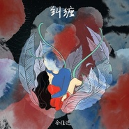

纠缠（Lingering）
============================

|  |  |
| :--: | :-- |
| [ 纠缠（Lingering）](https://emumo.xiami.com/album/2102746133) | **艺人**: [余佳运](../index.md) **语种**: 国语 **唱片公司**: 独立发行 **发行时间**: 2017年05月11日 **专辑类别**: EP, 单曲 **专辑风格**: 节奏布鲁斯 R&B **播放数**: 121161 **收藏数**: 27 **评论数**: 8  |

## 简介

永远不要让自己的音乐停留在一个自己的舒适区域，希望通过各种突破来达到更全面的自己，这是一份纠缠是我满意的答卷，对我个人而言。你们呢？ 

## 曲目

## 评论

|  |  |  |  |
| :-- | :-- | :-- | :-- |
|  [虾米用户](https://emumo.xiami.com/u/319491804) All I Need t... 2019-10-09 11:17 赞(0) 踩(0) | 
太棒了  
 |
|  [虾米用户](https://emumo.xiami.com/u/209208603) 我想快乐 2017-08-16 13:37 赞(0) 踩(0) | 
最近听到 很喜欢你的声音你的歌 加油呀
 |
|  [虾米用户](https://emumo.xiami.com/u/187692570)  2017-05-16 20:06 赞(0) 踩(0) | 
前奏好苏
 |
|  [虾米用户](https://emumo.xiami.com/u/47043578)  Never give ... 2017-05-13 12:13 赞(0) 踩(0) | 
好听
 |
|  [虾米用户](https://emumo.xiami.com/u/230771385)  2017-05-12 17:39 赞(0) 踩(0) | 
收藏为什么这么少？
 |
|  [虾米用户](https://emumo.xiami.com/u/230771385)  2017-05-12 17:39 赞(0) 踩(0) | 
很不错啊
 |
|  [虾米用户](https://emumo.xiami.com/u/267117169) 能吃是福算嘛 2017-05-11 12:38 赞(0) 踩(0) | 
超棒啊 
 |
|  [虾米用户](https://emumo.xiami.com/u/285977264) 你是解药 2017-05-11 11:57 赞(0) 踩(0) | 
沙发
 |
