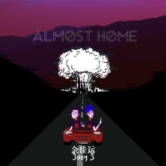

Almost Home
============================

|  |  |
| :--: | :-- |
| [ Almost Home](https://emumo.xiami.com/album/2102822047) | **艺人**: [余佳运](../index.md) **语种**: 国语 **唱片公司**: 独立发行 **发行时间**: 2017年08月29日 **专辑类别**: EP, 单曲 **专辑风格**: 嘻哈 Hip-Hop, 流行 Pop **播放数**: 614951 **收藏数**: 44 **评论数**: 10  |

## 简介

当你们听到这首歌的时候我已经在回家的路上了。  
这首歌也将会是我在美国写的最后一首歌，来为这六年求学生涯画上一个圆满的句号。  
  
以前觉得回忆都是不具象的，但这次希望将我对这个城市的所有不舍和留恋，和对回家的感触和思念，都能存在这首歌里面。  
和JonyJ的合作是默契的，虽然我们来自不一样的音乐风格有着不同的经历，但是对家的感受是一样的，也是有了他的加入，为这首歌添加了更多的色彩。  
  
Home, I'm almost home for you. 

## 曲目

## 评论

|  |  |  |
| :-- | :-- | :-- |
|  [虾米用户](https://emumo.xiami.com/u/329768349) walk in dark 2018-05-21 09:55 赞(0) 踩(0) | 
好听ing
 |
|  [虾米用户](https://emumo.xiami.com/u/5429478) 唯有音乐和亲情不可遗落！ 2017-11-16 12:33 赞(1) 踩(0) | 
余佳运和Jony J可谓天作之合，前者嗓音柔和，后者又铿锵有力，将R&amp;amp;B和嘻哈完美结合。余佳运的声线很温暖，而歌词部分的流露也显现出《Almost Home》所承载的意义。对于同是海外留学的我来说，这首歌唱的不仅仅是余佳运本人，也是我自己的切身感受。
 |
|  [虾米用户](https://emumo.xiami.com/u/66823378)  2017-09-23 13:47 赞(0) 踩(0) | 

 |
|  [虾米用户](https://emumo.xiami.com/u/183166442) rich&ri 2017-09-13 09:26 赞(0) 踩(0) | 
是rapper也是诗人
 |
|  [虾米用户](https://emumo.xiami.com/u/320570074)  2017-09-08 04:36 赞(0) 踩(0) | 
单曲循环，好喜欢好喜欢，在我留学快一年半的时间里，期待着明年回家的时候。
 |
|  [虾米用户](https://emumo.xiami.com/u/232280903) 悲伤，就是沉入河底的那颗... 2017-09-06 19:07 赞(0) 踩(0) | 
加油↖(^&amp;omega;^)↗加油
 |
|  [虾米用户](https://emumo.xiami.com/u/251031299) 再见 2017-09-04 21:51 赞(0) 踩(0) | 
豆芽
 |
|  [虾米用户](https://emumo.xiami.com/u/17146554) weibo：@L1RRO... 2017-09-04 16:30 赞(1) 踩(0) | 
什么时候发
 |
|  [虾米用户](https://emumo.xiami.com/u/59000814)   2017-09-01 09:30 赞(1) 踩(0) | 
听不了
 |
|  [虾米用户](https://emumo.xiami.com/u/225773374)  2017-08-29 20:09 赞(0) 踩(0) | 
怎么是未发布呢
 |
