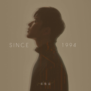
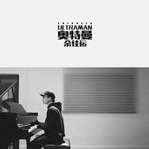
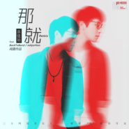
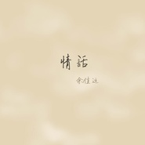
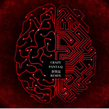

余佳运
============================

|  |  |
| :--: | :-- |
| [ 余佳运](https://i.xiami.com/yjy) | **播放数**: 11716621 **粉丝数**: 8001 **评论数**: 192 **地区**: China 中国大陆 **风格**: 节奏布鲁斯 R&B, 流行 Pop  |

## 档案

浙江宁波人，出生于1994年，11岁参加浙江卫视《新声夺人》获全国20强，与五月天同台演唱。13岁自学钢琴，16岁自学吉他开始创作。 
2014年秋季考入伯克利音乐学院，开始真正地接触音乐。2015春节第一次站在伯克利新春音乐会地舞台上带来自己的一首原创作品《It's Been So Long》，2015年参加江苏卫视举办的《唱游天下》并参与波士顿站的录影，和方大同，胡彦斌，阿兰等艺人合作。 
现是一名唱作音乐人，擅长写歌、编曲、制作，最擅长的曲风是流行、R&B、Neo-Soul。

## 专辑

| 名称 | 语种 | 唱片公司 | 发行时间 | 专辑类别 | 专辑风格 |
| :--: | :-- | :-- | :-- | :-- | :-- |
| [ 余佳运SINCE1994](./albums/2105256014.md) | 国语 |  | 2019年09月02日 | 录音室专辑 | 国语流行 Mandarin Pop, 当代节奏布鲁斯 Contemporary R&B, 节奏布鲁斯 R&B |
| [ 九月底](./albums/2104784022.md) | 国语 |  | 2018年11月20日 | EP, 单曲 | 流行 Pop, 节奏布鲁斯 R&B |
| [ 了解(Knowing)](./albums/2104784019.md) | 国语 |  | 2018年10月04日 | EP, 单曲 | 流行 Pop, 节奏布鲁斯 R&B |
| [ 最好的朋友在身边（电影《爱情公寓》主题曲）](./albums/2108142335.md) | 国语 | 海蝶 | 2018年08月14日 | EP, 单曲 | 新世纪音乐 New Age |
| [ 段子手](./albums/2103657603.md) | 国语 | 独立发行 | 2018年04月01日 | EP, 单曲 | 流行 Pop |
| [ 奥特曼(Ultraman)](./albums/2103641489.md) | 国语 | 独立发行 | 2018年03月26日 | EP, 单曲 | 流行 Pop |
| [ 那就](./albums/2103619547.md) | 国语 | 索雅音乐 | 2018年03月21日 | EP, 单曲 |  |
| [ MATILDA](./albums/2102964842.md) | 国语 | 独立发行 | 2017年12月01日 | EP, 单曲 | 电音流行 Electropop |
| [ 12AM](./albums/2102871447.md) | 国语 | 独立发行 | 2017年10月12日 | EP, 单曲 | 节奏布鲁斯 R&B, 国语流行 Mandarin Pop |
| [ Almost Home](./albums/2102822047.md) | 国语 | 独立发行 | 2017年08月29日 | EP, 单曲 | 嘻哈 Hip-Hop, 流行 Pop |
| [ 情话](./albums/2102816034.md) | 国语 | 独立发行 | 2017年07月19日 | EP, 单曲 | 流行 Pop |
| [ 小红(Ms.Red)](./albums/2102775870.md) | 国语 | 独立发行 | 2017年07月02日 | EP, 单曲 | 流行 Pop |
| [ 纠缠（Lingering）](./albums/2102746133.md) | 国语 | 独立发行 | 2017年05月11日 | EP, 单曲 | 节奏布鲁斯 R&B |
| [ Crazy(Jiayun Yu Remix)](./albums/2102735564.md) | 英语 | 独立发行 | 2017年04月21日 | EP, 单曲 | 电子 Electronic |
| [ 妈妈说 (Mom Said)](./albums/2102713558.md) | 国语 | 独立发行 | 2017年03月16日 | EP, 单曲 | 节奏布鲁斯 R&B, 国语流行 Mandarin Pop |
| [ Jiayun's Live Recording](./albums/2102709073.md) | 英语 | 独立发行 | 2016年11月07日 | 现场专辑 | 流行 Pop |
| [ 幸福三部曲](./albums/2102700431.md) | 国语 | 独立发行 | 2016年08月09日 | EP, 单曲 | 节奏布鲁斯 R&B, 流行 Pop |
| [ 你](./albums/2102706554.md) | 国语 | 独立发行 | 2016年05月06日 | 录音室专辑 | 流行 Pop, 节奏布鲁斯 R&B |
| [ 我想](./albums/2102700272.md) | 国语 | 独立发行 | 2016年03月21日 | EP, 单曲 | 节奏布鲁斯 R&B, 国语流行 Mandarin Pop |
| [ 小明](./albums/2102706547.md) | 国语 | 独立发行 | 2016年01月14日 | EP, 单曲 | 流行 Pop, 节奏布鲁斯 R&B |
| [ It's Been So Long](./albums/2102706537.md) | 国语 | 独立发行 | 2015年05月20日 | EP, 单曲 | 流行 Pop, 节奏布鲁斯 R&B |

## 评论

|  |  |  |  |
| :-- | :-- | :-- | :-- |
|  [虾米用户](https://emumo.xiami.com/u/358104299) 悲观的唯心存在现实解构虚... 2021-01-08 11:37 赞(0) 踩(0) | 
45941
 |
|  [虾米用户](https://emumo.xiami.com/u/215379991) 簽名不重要重要的是你聽什... 2020-10-22 16:00 赞(0) 踩(0) | 
ﻌﻌﻌ❤︎
 |
|  [虾米用户](https://emumo.xiami.com/u/377345865) WE ARE ONE. 2020-09-12 08:33 赞(0) 踩(0) | 
宝藏宝藏！！！！
 |
|  [虾米用户](https://emumo.xiami.com/u/339456446) 我还没想好要写什么... 2020-08-30 14:55 赞(0) 踩(0) | 
我想，和你，在一起
 |
|  [虾米用户](https://emumo.xiami.com/u/8881464) 要做幸福小女人~Dan 2020-06-07 05:53 赞(0) 踩(0) | 
晚安前听到好暖心 
 |
|  [虾米用户](https://emumo.xiami.com/u/427842087)  2020-05-17 17:15 赞(0) 踩(0) | 
祝余老师越来越红
 |
|  [虾米用户](https://emumo.xiami.com/u/356763773) 我还没想好要写什么... 2020-04-04 11:54 赞(0) 踩(0) | 
和你
 |
|  [虾米用户](https://emumo.xiami.com/u/255558076) 我们再见。 2020-03-08 21:24 赞(1) 踩(0) | 
您的歌真的太浪漫了。音符跳动到胸口，轻柔地依偎在温暖中。
 |
|  [虾米用户](https://emumo.xiami.com/u/425657867) 再见一万遍，我的朋友。 2020-02-14 08:29 赞(0) 踩(0) | 

 |
|  [虾米用户](https://emumo.xiami.com/u/15379098)   2020-01-23 07:55 赞(0) 踩(0) | 
宁波小哥哥诶 加油加油
 |
|  [虾米用户](https://emumo.xiami.com/u/423947424) Wnt to be ma... 2020-01-08 17:43 赞(0) 踩(0) | 
声音很好
 |
|  [虾米用户](https://emumo.xiami.com/u/96960270) 天，将降大任于斯人。 2020-01-08 12:51 赞(0) 踩(0) | 
可以
 |
|  [虾米用户](https://emumo.xiami.com/u/332292411)  2020-01-04 12:57 赞(0) 踩(0) | 
很甜的男孩子！！！
 |
|  [虾米用户](https://emumo.xiami.com/u/279671271)  2019-11-10 12:30 赞(1) 踩(0) | 
越来越多人知道你了，但是又有几个人真的懂r&amp;b，不希望r&amp;b大众
 |
|  [虾米用户](https://emumo.xiami.com/u/23638641) 我还没想好要写什么... 2019-10-10 14:32 赞(0) 踩(0) | 
本来想看看是哪里人，看到是宁波人！激动！加油小伙子！ 
 |
|  [虾米用户](https://emumo.xiami.com/u/2269240) 主啊我愛你❤在你路上我奔... 2019-08-24 11:56 赞(0) 踩(0) | 
美丽 快乐 深情 韵味十足的歌喉 多才 感情丰富的曲调歌词也太好听
 |
|  [虾米用户](https://emumo.xiami.com/u/139811716)  2019-08-19 15:58 赞(2) 踩(0) | 
因为我女神而听，确实有东西！
 |
|  [虾米用户](https://emumo.xiami.com/u/342038768) pucikaka don... 2019-08-17 20:01 赞(0) 踩(0) | 

 |
|  [虾米用户](https://emumo.xiami.com/u/280156741) 希望你永远知道自己在做什... 2019-07-19 22:32 赞(2) 踩(0) | 
每一首都喜欢怎么办 
 |
|  [虾米用户](https://emumo.xiami.com/u/7377731)  2019-07-06 12:37 赞(1) 踩(0) | 
你是大同的徒弟吧 
 |
|  [虾米用户](https://emumo.xiami.com/u/52582843) 我还没想好要写什么... 2019-05-23 22:09 赞(2) 踩(0) | 
加油呀！喜欢你的歌曲！
 |
|  [虾米用户](https://emumo.xiami.com/u/313452716) 离群索居的怪人 2019-05-12 20:52 赞(1) 踩(0) | 
对这声音一听钟情
 |
|  [虾米用户](https://emumo.xiami.com/u/25972737)  2019-04-21 10:13 赞(2) 踩(0) | 
细细品味的声线～
 |
|  [虾米用户](https://emumo.xiami.com/u/408376267) 一言以蔽之 2019-04-15 01:09 赞(1) 踩(0) | 
理想型
 |
|  [虾米用户](https://emumo.xiami.com/u/212001614) 风格很杂，喜欢的感觉很多 2019-03-30 19:01 赞(1) 踩(0) | 
情话超绝好听了
 |
|  [虾米用户](https://emumo.xiami.com/u/45385073) 爱虾米期待再相遇为新：t... 2019-03-29 00:01 赞(1) 踩(0) | 
声音太好听了吧也
 |
|  [虾米用户](https://emumo.xiami.com/u/406737135)  2019-03-22 01:38 赞(1) 踩(0) | 
今天又是爱你的一天鸭❤
 |
|  [虾米用户](https://emumo.xiami.com/u/341184650) 长风破浪会有时，直挂云帆... 2019-03-06 16:35 赞(0) 踩(0) | 
为什么我才发现。
 |
|  [虾米用户](https://emumo.xiami.com/u/250678876) 暑假不知不觉离开青春场景... 2019-02-15 04:04 赞(3) 踩(0) | 
没有什么技术流分析！就声音音乐都听着很放松很舒服呀！
 |
|  [虾米用户](https://emumo.xiami.com/u/250278874)  2019-01-27 18:49 赞(1) 踩(0) | 
余佳运同志 不知道你希不希望自己能红，总而言之很喜欢你希望你加油冲鸭！   
 |
|  [虾米用户](https://emumo.xiami.com/u/212154854) 学生    00后 2019-01-26 18:29 赞(1) 踩(0) | 
从我想开始喜欢他的声音特别好听！！！！！
 |
|  [虾米用户](https://emumo.xiami.com/u/695890) 爱音乐爱泡泡 2019-01-23 15:17 赞(4) 踩(0) | 
天呐～这简直就是小方大同啊～太喜欢了！！
 |
|  [虾米用户](https://emumo.xiami.com/u/408833994) 难过。难是难但始终是会过... 2019-01-15 13:27 赞(2) 踩(0) | 
认识你的第一首歌是《你》
 |
|  [虾米用户](https://emumo.xiami.com/u/408833994) 难过。难是难但始终是会过... 2019-01-15 13:26 赞(0) 踩(0) | 
很希望你能大火，但是还是有点偏心的想你只属于我们这六千个关注你的人
 |
|  [虾米用户](https://emumo.xiami.com/u/400086424)  2019-01-06 14:10 赞(1) 踩(0) | 
可以收录一下佳运的梦里吗  
 |
|  [虾米用户](https://emumo.xiami.com/u/337136817)  2019-01-01 18:43 赞(0) 踩(0) | 

 |
|  [虾米用户](https://emumo.xiami.com/u/200794012) 无 2019-01-01 16:59 赞(1) 踩(0) | 
余佳运的歌都挺好听的，但是听久了会腻
 |
|  [虾米用户](https://emumo.xiami.com/u/408849641)  2018-12-22 20:53 赞(0) 踩(0) | 
听到第一反应就是觉得像方大同的声 
 |
|  [虾米用户](https://emumo.xiami.com/u/4164054)   2018-12-11 13:06 赞(1) 踩(0) | 
新歌好多都没上，好可惜。余佳运是2018年给我的惊喜。情歌太动人。表白。优质。
 |
|  [虾米用户](https://emumo.xiami.com/u/336709260) 爱唱爱跳一小孩~ 2018-11-30 19:28 赞(1) 踩(0) | 
哇哦！
 |
|  [虾米用户](https://emumo.xiami.com/u/50022913) 何日再何日 问何日君再来... 2018-11-29 10:35 赞(3) 踩(0) | 
好似大同，不过声音各有千秋，加油！
 |
|  [虾米用户](https://emumo.xiami.com/u/255449097) 我永恒的灵魂，注视着你的... 2018-11-13 23:37 赞(0) 踩(0) | 
喜欢
 |
|  [虾米用户](https://emumo.xiami.com/u/328657369) 风格随心而变、 2018-11-11 19:09 赞(0) 踩(0) | 
Get了
 |
|  [虾米用户](https://emumo.xiami.com/u/321083313) nxjbdndn 2018-11-10 23:52 赞(1) 踩(0) | 
看见你上音乐公告牌了，唱的超级好听，加油＾０＾~
 |
|  [虾米用户](https://emumo.xiami.com/u/357896997)  2018-10-30 21:51 赞(1) 踩(0) | 
没有原因就是喜欢你的声音，要是以后的男朋友有这种嗓音该有多幸福啊(～￣▽￣)→))*￣▽￣*)o
 |
|  [虾米用户](https://emumo.xiami.com/u/281475612)  2018-10-26 20:47 赞(1) 踩(0) | 
唱了好多超级超级好听的歌，现在才发现是宁波人诶*罒▽罒*离我很近呢 
 |
|  [虾米用户](https://emumo.xiami.com/u/72622294) 爱音乐 爱狗狗 爱美食 2018-10-15 22:12 赞(0) 踩(0) | 
一听你的歌就喜欢上了  
 |
|  [虾米用户](https://emumo.xiami.com/u/49411295) ·．．·．．· 2018-10-07 03:47 赞(0) 踩(0) | 

 |
|  [虾米用户](https://emumo.xiami.com/u/279237228) / 2018-09-25 10:49 赞(0) 踩(0) | 
超好听的声音
 |
|  [虾米用户](https://emumo.xiami.com/u/243160840)  2018-09-09 08:45 赞(2) 踩(0) | 
我想，是我人生中的第一首最有意义的歌&amp;hearts; 
 |
|  [虾米用户](https://emumo.xiami.com/u/312255162) 少发脾气按时睡觉 不要多... 2018-08-26 23:47 赞(0) 踩(0) | 
群答案&amp;hellip;&amp;hellip;什么&amp;hellip;&amp;hellip;
 |
|  [虾米用户](https://emumo.xiami.com/u/356890875)  2018-08-13 15:02 赞(0) 踩(0) | 
带我离开这星球
 |
|  [虾米用户](https://emumo.xiami.com/u/212154854) 学生    00后 2018-07-14 18:22 赞(2) 踩(0) | 
嗯，喜欢你的声音，贼好听
 |
|  [虾米用户](https://emumo.xiami.com/u/334381986)  2018-06-21 14:50 赞(0) 踩(0) | 
帅帅哒
 |
|  [虾米用户](https://emumo.xiami.com/u/287821301) 我还没想好要写什么... 2018-06-16 13:42 赞(3) 踩(0) | 
昨天真的太帅了！！！陪老余从疆进酒到鸟巢！！！！！！
 |
|  [虾米用户](https://emumo.xiami.com/u/12996076) 我还没想好要写什么... 2018-06-11 01:49 赞(2) 踩(0) | 
好喜欢好喜欢 声音太温柔心要化了
 |
|  [虾米用户](https://emumo.xiami.com/u/285049473) 剛拿起酒杯想和你碰杯 才... 2018-06-06 14:36 赞(2) 踩(0) | 
好溫柔的聲音
 |
|  [虾米用户](https://emumo.xiami.com/u/50873037)   2018-05-30 16:56 赞(0) 踩(0) | 
今晚见～
 |
|  [虾米用户](https://emumo.xiami.com/u/261106947)  2018-05-27 08:30 赞(13) 踩(0) | 
听你的声音感觉像谈恋爱
 |
|  [虾米用户](https://emumo.xiami.com/u/94413458) 狮子狮子!! 2018-05-25 13:12 赞(0) 踩(0) | 
今晚见
 |
|  [虾米用户](https://emumo.xiami.com/u/187896806)  2018-05-23 16:42 赞(2) 踩(0) | 
可以让人沉溺其中无法自拔的声音超喜欢 
 |
|  [虾米用户](https://emumo.xiami.com/u/38512657) 我还没想好要写什么... 2018-05-23 09:23 赞(0) 踩(0) | 
加油  
 |
|  [虾米用户](https://emumo.xiami.com/u/128356126) 点点星辉  照亮你我 丝... 2018-05-20 16:34 赞(0) 踩(0) | 
是我喜欢的，赞
 |
|  [虾米用户](https://emumo.xiami.com/u/290858359) 老了也要浪 2018-05-02 17:00 赞(3) 踩(0) | 
我喜欢你，就跟我喜欢郭顶，宫阁一样
 |
|  [虾米用户](https://emumo.xiami.com/u/340767935)  2018-04-26 12:15 赞(0) 踩(0) | 
喜欢你的声音，加油哦(&amp;acute;-&amp;omega;-`)
 |
|  [虾米用户](https://emumo.xiami.com/u/38964687) 我还没想好要写什么... 2018-04-26 09:29 赞(0) 踩(0) | 
只能说很有sense哦
 |
|  [虾米用户](https://emumo.xiami.com/u/10000610) 有人造屋 有人绣花 有人... 2018-04-22 21:40 赞(0) 踩(0) | 
 
 |
|  [虾米用户](https://emumo.xiami.com/u/349784622)  2018-04-14 11:34 赞(1) 踩(0) | 
有巡演啊 望周知
 |
|  [虾米用户](https://emumo.xiami.com/u/341071160) 我还没想好要写什么... 2018-04-13 14:29 赞(0) 踩(0) | 
唱给真好听
 |
|  [虾米用户](https://emumo.xiami.com/u/305575285)   2018-04-04 14:03 赞(3) 踩(0) | 
想让你红，但是不想让大家发现你啊啊啊啊好纠结
 |
|  [虾米用户](https://emumo.xiami.com/u/356330215)  2018-04-01 08:49 赞(0) 踩(0) | 

 |
|  [虾米用户](https://emumo.xiami.com/u/309939024)  2018-03-22 11:26 赞(3) 踩(0) | 
第一次听他的声音真的是被迷住了 睡觉都听着呢 很有磁性啊～ 
 |
|  [虾米用户](https://emumo.xiami.com/u/79804154)  2018-03-18 03:47 赞(0) 踩(0) | 
声音超好听啊
 |
| ⇒ |  [虾米用户](https://emumo.xiami.com/u/264595711) 原来我才是那具该被嘲笑的... 2018-04-07 15:29 赞(0) 踩(0) | 
墙？
 |
| ⇒ |  [虾米用户](https://emumo.xiami.com/u/79804154)  2018-04-11 18:30 赞(0) 踩(0) | 
<q><b>逾清说：</b></q>
 |
| ⇒ |  [虾米用户](https://emumo.xiami.com/u/264595711) 原来我才是那具该被嘲笑的... 2018-04-11 22:53 赞(0) 踩(0) | 
<q><b>恰恰说：</b></q>
 |
| ⇒ |  [虾米用户](https://emumo.xiami.com/u/79804154)  2018-04-15 19:22 赞(0) 踩(0) | 
<q><b>逾清说：</b></q>
 |
|  [虾米用户](https://emumo.xiami.com/u/43133444) 我还没想好要写什么... 2018-03-17 01:11 赞(0) 踩(0) | 
声音真的太温柔太好听了，你要火啊
 |
|  [虾米用户](https://emumo.xiami.com/u/278978502) 朴donkey的小迷妹~ 2018-03-11 15:13 赞(0) 踩(0) | 
那个qq群咋的找不到
 |
| ⇒ |  [虾米用户](https://emumo.xiami.com/u/312255162) 少发脾气按时睡觉 不要多... 2018-08-26 23:47 赞(0) 踩(0) | 
找得到，问题是不知道答案&amp;hellip;&amp;hellip;
 |
|  [虾米用户](https://emumo.xiami.com/u/49043688)   2018-03-10 23:22 赞(0) 踩(0) | 
知道他老听她分享的歌。我好伤心啊。
 |
|  [虾米用户](https://emumo.xiami.com/u/224850430) 过好眼前的每一天 2018-03-08 11:25 赞(0) 踩(0) | 
一听你开口，就把所有歌下载啦 好听！！
 |
|  [虾米用户](https://emumo.xiami.com/u/288013826) 请大家一起养小虾米帮助听... 2018-03-07 07:44 赞(3) 踩(0) | 
一 定 會 火 :)
 |
|  [虾米用户](https://emumo.xiami.com/u/279517935) 毒爱九锥 2018-02-26 22:16 赞(2) 踩(0) | 
18年等你新歌
 |
|  [虾米用户](https://emumo.xiami.com/u/279517935) 毒爱九锥 2018-02-26 22:02 赞(0) 踩(0) | 
反正就是超喜欢你的歌 不想你被别人知道唉qwq
 |
|  [虾米用户](https://emumo.xiami.com/u/36868710)  2018-02-22 21:09 赞(0) 踩(0) | 
请你一定要红！歌太棒啦！好喜欢啊！
 |
|  [虾米用户](https://emumo.xiami.com/u/264406197)  2018-02-21 13:02 赞(0) 踩(0) | 
温柔的声音
 |
|  [虾米用户](https://emumo.xiami.com/u/334329768) 一个固执独行于偌大宇宙的... 2018-02-20 11:24 赞(0) 踩(0) | 
喜欢的声线，浪漫的调调 
 |
|  [虾米用户](https://emumo.xiami.com/u/348305472) 喜欢听音乐的girl.. 2018-02-14 12:01 赞(0) 踩(0) | 
偷偷的把你藏起来
 |
|  [虾米用户](https://emumo.xiami.com/u/337241043)  2018-02-13 16:25 赞(0) 踩(0) | 
不吵不闹不炫耀
 |
|  [虾米用户](https://emumo.xiami.com/u/71178106) 塵世や 酒、風呂を抜け ... 2018-02-09 03:14 赞(2) 踩(0) | 
♡
 |
|  [虾米用户](https://emumo.xiami.com/u/95253180)  2018-01-20 10:53 赞(0) 踩(0) | 
哇塞，我的菜，太好听了
 |
|  [虾米用户](https://emumo.xiami.com/u/99586286) 歌单停滞在2017 2018-01-19 21:00 赞(2) 踩(0) | 
为什么每一首都这么好听
 |
|  [虾米用户](https://emumo.xiami.com/u/45986814) Why so serio... 2018-01-16 23:22 赞(0) 踩(0) | 
你真的好浪漫(//&amp;nabla;//)
 |
|  [虾米用户](https://emumo.xiami.com/u/18480366) 我还没想好要写什么... 2018-01-10 22:15 赞(0) 踩(0) | 
好听
 |
|  [虾米用户](https://emumo.xiami.com/u/220521772) я люблю тебя 2018-01-05 11:14 赞(0) 踩(0) | 
火
 |
|  [虾米用户](https://emumo.xiami.com/u/220521772) я люблю тебя 2018-01-05 11:14 赞(0) 踩(0) | 
必
 |
|  [虾米用户](https://emumo.xiami.com/u/2763753) The best is ... 2018-01-04 23:08 赞(0) 踩(0) | 
马克～
 |
|  [虾米用户](https://emumo.xiami.com/u/52034644) 身体会跳舞 2018-01-01 10:16 赞(0) 踩(0) | 
好帅的小哥！
 |
|  [虾米用户](https://emumo.xiami.com/u/37939232) 我是100% 2017-12-28 16:47 赞(0) 踩(0) | 
我想和你再一起窒息
 |
|  [虾米用户](https://emumo.xiami.com/u/98653276) 吾也 2017-12-27 22:40 赞(0) 踩(0) | 
害怕你太红，又想让大家都能听到你的声音
 |
|  [虾米用户](https://emumo.xiami.com/u/194506469)  2017-12-20 20:24 赞(2) 踩(0) | 
感谢余佳运，今天我告白了
 |
|  [虾米用户](https://emumo.xiami.com/u/185333751)  2017-12-16 12:51 赞(0) 踩(0) | 
歌都很好听耶
 |
|  [虾米用户](https://emumo.xiami.com/u/337389989)  2017-12-06 18:45 赞(0) 踩(0) | 
好听   期待更多的歌
 |
|  [虾米用户](https://emumo.xiami.com/u/25972737)  2017-12-03 01:11 赞(0) 踩(0) | 
声音磁性
 |
|  [虾米用户](https://emumo.xiami.com/u/191475414) 我还没想好要写什么... 2017-12-02 07:13 赞(1) 踩(0) | 
发现一个很好听，很温柔的声音
 |
|  [虾米用户](https://emumo.xiami.com/u/46329562) If a song co... 2017-11-30 19:35 赞(0) 踩(0) | 
哈哈哈我名是韵佳
 |
|  [虾米用户](https://emumo.xiami.com/u/3762677) 我还没想好要写什么... 2017-11-24 21:35 赞(1) 踩(0) | 
梦里怎么不见啦？
 |
|  [虾米用户](https://emumo.xiami.com/u/132608156)   2017-11-20 20:12 赞(2) 踩(0) | 
等你红的那天！
 |
|  [虾米用户](https://emumo.xiami.com/u/32001838)   2017-11-19 08:21 赞(2) 踩(0) | 
特别喜欢佳运！
 |
|  [虾米用户](https://emumo.xiami.com/u/306742111)  2017-11-18 22:47 赞(1) 踩(0) | 
很棒哦
 |
|  [虾米用户](https://emumo.xiami.com/u/285220979) 一直在经历，一直在学习 2017-11-17 18:00 赞(1) 踩(0) | 
真的很好听    
 |
|  [虾米用户](https://emumo.xiami.com/u/327121785) 我还没想好要写什么... 2017-11-16 17:26 赞(15) 踩(0) | 
学长说，今天学校放了你的歌，主动和我说话啦。
 |
|  [虾米用户](https://emumo.xiami.com/u/248365893) 在所有人事已非的景色里，... 2017-11-12 23:09 赞(0) 踩(0) | 
可以说是很喜欢了
 |
|  [虾米用户](https://emumo.xiami.com/u/117158940) 可爱又迷人的反派角色 2017-10-30 16:31 赞(1) 踩(0) | 
偶然听到 安抚了初冬午后躁动的心 嗯 夸你就要让你看到啊
 |
|  [虾米用户](https://emumo.xiami.com/u/52682108) 我还没想好要写什么... 2017-10-30 13:39 赞(0) 踩(0) | 
❤
 |
|  [虾米用户](https://emumo.xiami.com/u/4347887) ♪若有来生，我必等君。 2017-10-23 22:07 赞(3) 踩(0) | 
李荣浩之后，就数你不想让你红了。。
 |
|  [虾米用户](https://emumo.xiami.com/u/49090973) 听了那么多改写点什么了吧 2017-09-25 22:59 赞(0) 踩(0) | 
昨天比赛唱了你的歌 爱你！
 |
|  [虾米用户](https://emumo.xiami.com/u/17209320) Jane 2017-09-13 22:46 赞(2) 踩(0) | 
太好听了吧！！！！！
 |
|  [虾米用户](https://emumo.xiami.com/u/37775599) 我还没想好要写什么... 2017-09-05 13:44 赞(2) 踩(0) | 
我想 和你 在一起
 |
|  [虾米用户](https://emumo.xiami.com/u/17146554) weibo：@L1RRO... 2017-09-04 16:30 赞(1) 踩(0) | 
luv
 |
|  [虾米用户](https://emumo.xiami.com/u/321796843)  2017-09-01 21:43 赞(1) 踩(0) | 
我是老余的眉毛，团结，紧张，深情 
 |
|  [虾米用户](https://emumo.xiami.com/u/321917113)  2017-08-31 23:10 赞(4) 踩(0) | 
支持余佳运，很少有一个能把歌唱近心坎的歌手。
 |
|  [虾米用户](https://emumo.xiami.com/u/3454200) 音樂即信仰。 2017-08-30 00:12 赞(55) 踩(0) | 
有种想让别人知道他又不想他那么红的心情。
 |
|  [虾米用户](https://emumo.xiami.com/u/3223202) 人生最丰富美好的境界是安... 2017-08-28 07:36 赞(2) 踩(0) | 
棒棒哒佳运
 |
|  [虾米用户](https://emumo.xiami.com/u/312396805)  2017-08-18 13:06 赞(0) 踩(0) | 
未来歌星！
 |
|  [虾米用户](https://emumo.xiami.com/u/289247367) 多遥远多纠结多想念 2017-08-12 05:47 赞(0) 踩(0) | 

 |
|  [虾米用户](https://emumo.xiami.com/u/65306340)   2017-08-03 23:43 赞(0) 踩(0) | 
好听
 |
|  [虾米用户](https://emumo.xiami.com/u/314042546) 五月 2017-07-26 22:03 赞(2) 踩(0) | 
超级好听，相信总有一天会让更多人听到你的歌声，你的好总有人会发现的
 |
|  [虾米用户](https://emumo.xiami.com/u/5087129)   2017-07-24 15:47 赞(0) 踩(0) | 
情话呢T_T
 |
|  [虾米用户](https://emumo.xiami.com/u/232280903) 悲伤，就是沉入河底的那颗... 2017-07-23 18:18 赞(0) 踩(0) | 
他的歌有种特别的味道，期待更好 
 |
|  [虾米用户](https://emumo.xiami.com/u/261744772)  2017-07-21 08:43 赞(1) 踩(0) | 
好听，希望可以一直唱下去
 |
|  [虾米用户](https://emumo.xiami.com/u/75872962) what did not... 2017-07-21 06:03 赞(0) 踩(0) | 
情话呢？只能百度云？
 |
|  [虾米用户](https://emumo.xiami.com/u/13111079) 有缘再见 2017-07-20 12:35 赞(0) 踩(0) | 

 |
|  [虾米用户](https://emumo.xiami.com/u/50546127) 不是我们早熟，是世界逼迫... 2017-07-20 02:06 赞(0) 踩(0) | 
好听好听～
 |
|  [虾米用户](https://emumo.xiami.com/u/18695816) 坐听雨，卧入梦 2017-07-16 16:01 赞(0) 踩(0) | 
好听~~~
 |
|  [虾米用户](https://emumo.xiami.com/u/8819461) 对于没有办法放弃的事情 ... 2017-07-07 01:37 赞(0) 踩(0) | 
声音好听
 |
|  [虾米用户](https://emumo.xiami.com/u/198245168) Fakeuphrosyn... 2017-07-06 07:15 赞(1) 踩(0) | 
你是种不可抗拒的引力
 |
|  [虾米用户](https://emumo.xiami.com/u/199769298) 不想喜欢的歌被烂大街的放... 2017-07-03 18:02 赞(44) 踩(0) | 
对不起这么好的声音 我现在才发现
 |
| ⇒ |  [虾米用户](https://emumo.xiami.com/u/50508457) thanks 2018-11-27 23:05 赞(0) 踩(0) | 
我也是
 |
|  [虾米用户](https://emumo.xiami.com/u/473457)   2017-07-03 17:33 赞(0) 踩(0) | 
聲音棒透
 |
|  [虾米用户](https://emumo.xiami.com/u/39553690) 激流逆流顺流回流，川 2017-06-30 22:01 赞(0) 踩(0) | 
再见。。。祝好。。。
 |
|  [虾米用户](https://emumo.xiami.com/u/39553690) 激流逆流顺流回流，川 2017-06-30 21:56 赞(0) 踩(0) | 
...挺好的。。。没那么好吧。。。
 |
|  [虾米用户](https://emumo.xiami.com/u/49860927)   2017-06-25 11:29 赞(1) 踩(0) | 
为什么虾米还没有《梦里》
 |
|  [虾米用户](https://emumo.xiami.com/u/10128210) 听歌就好 2017-06-22 22:30 赞(3) 踩(0) | 
你一定是那个唱距离的人，我当时就想，这个好声音一定会带来更多惊喜 
 |
| ⇒ |  [虾米用户](https://emumo.xiami.com/u/7115365) 没没没、温度 2018-04-25 19:52 赞(0) 踩(0) | 
还真就是他，最近的直播里他唱了  
 |
|  [虾米用户](https://emumo.xiami.com/u/10128210) 听歌就好 2017-06-22 22:24 赞(2) 踩(0) | 
你唱过距离吗，记得好几年前在方大同的贴吧里听过，印象深刻 
 |
|  [虾米用户](https://emumo.xiami.com/u/299414908)  2017-06-20 22:01 赞(2) 踩(0) | 
大哥你能不能改一下再一起的再改成在一起啊 这是政治任务。
 |
|  [虾米用户](https://emumo.xiami.com/u/157660126) 我宁愿孤独终老的是我 2017-06-18 12:59 赞(0) 踩(0) | 
爱你
 |
|  [虾米用户](https://emumo.xiami.com/u/75872962) what did not... 2017-06-05 09:29 赞(1) 踩(0) | 
最近好喜欢小众歌手！
 |
|  [虾米用户](https://emumo.xiami.com/u/55041981)  2017-05-24 17:50 赞(1) 踩(0) | 
定是新星⭐
 |
|  [虾米用户](https://emumo.xiami.com/u/48678584) universe.  2017-05-23 18:49 赞(0) 踩(0) | 

 |
|  [虾米用户](https://emumo.xiami.com/u/297014771)  2017-05-19 10:15 赞(0) 踩(0) | 
我喜欢你的声音你的歌
 |
|  [虾米用户](https://emumo.xiami.com/u/296141210) 一个不会歌唱的傻瓜 2017-05-16 20:24 赞(0) 踩(0) | 
火火火火火
 |
|  [虾米用户](https://emumo.xiami.com/u/296141210) 一个不会歌唱的傻瓜 2017-05-16 20:24 赞(0) 踩(0) | 
好听哎，怎么办啊，
 |
|  [虾米用户](https://emumo.xiami.com/u/283961096)  2017-05-16 10:57 赞(0) 踩(0) | 
一首歌彻底圈粉表白小哥哥
 |
|  [虾米用户](https://emumo.xiami.com/u/295833242) 所有画面里 我最喜欢你 2017-05-14 23:16 赞(0) 踩(0) | 
希望这个小哥哥一直唱下去，可以有更多的歌儿
 |
|  [虾米用户](https://emumo.xiami.com/u/295833242) 所有画面里 我最喜欢你 2017-05-14 23:15 赞(0) 踩(0) | 
听大同歌的时候还没有那么喜欢节奏布鲁斯这类音乐，可是听你的歌后深深迷上了这种风格，不过小哥哥的歌好少，不够听，无奈的我才回去听了大同的歌
 |
|  [虾米用户](https://emumo.xiami.com/u/45459535)  EXO ME? Wha... 2017-05-13 09:02 赞(0) 踩(0) | 
我覺得挺不錯的呀～ 野生方大同
 |
|  [虾米用户](https://emumo.xiami.com/u/290447101) 啾啾 2017-05-09 23:11 赞(0) 踩(0) | 
超级赞！声音抓耳！
 |
|  [虾米用户](https://emumo.xiami.com/u/77582944)   2017-05-06 13:59 赞(0) 踩(0) | 
完蛋了有男神了，我本来是只属于Hebe的 
 |
|  [虾米用户](https://emumo.xiami.com/u/287388423)  2017-04-21 23:18 赞(2) 踩(0) | 
余佳运，你很棒棒的哦，，《我想》《和你》《在一起》喜欢《你》
 |
|  [虾米用户](https://emumo.xiami.com/u/289995328)  2017-04-21 01:14 赞(0) 踩(0) | 
真好听啊 我以为是无损的原版 
 |
|  [虾米用户](https://emumo.xiami.com/u/99168462) 再见虾米 2017-04-10 15:32 赞(0) 踩(0) | 
怎 么 可 能 不 火
 |
|  [虾米用户](https://emumo.xiami.com/u/273064831)   2017-04-05 10:15 赞(0) 踩(0) | 
好听！
 |
|  [虾米用户](https://emumo.xiami.com/u/51822760)  2017-04-04 12:32 赞(0) 踩(0) | 
喜欢这样的声音
 |
|  [虾米用户](https://emumo.xiami.com/u/252636017) 我还没想好要写什么... 2017-03-30 03:49 赞(0) 踩(0) | 
觉得好像好像方大同 然后歌里有故事ai❤️
 |
|  [虾米用户](https://emumo.xiami.com/u/3762677) 我还没想好要写什么... 2017-03-28 23:07 赞(0) 踩(0) | 
好像方大同
 |
|  [虾米用户](https://emumo.xiami.com/u/20478147) 你 2017-03-23 17:33 赞(0) 踩(0) | 
好听咧！支持你哟
 |
|  [虾米用户](https://emumo.xiami.com/u/199340804)  2017-03-22 23:37 赞(1) 踩(0) | 
余佳运必火
 |
|  [虾米用户](https://emumo.xiami.com/u/273617365)  2017-03-20 17:56 赞(0) 踩(0) | 
我想和你再一起啊
 |
|  [虾米用户](https://emumo.xiami.com/u/43060704) 暂无签名~ 2017-03-19 23:33 赞(0) 踩(0) | 
好听 
 |
|  [虾米用户](https://emumo.xiami.com/u/25639638)  2017-03-19 15:51 赞(0) 踩(0) | 
火钳刘明！！
 |
|  [虾米用户](https://emumo.xiami.com/u/244940245)  2017-03-19 15:31 赞(0) 踩(0) | 
加油！很棒♬  
 |
|  [虾米用户](https://emumo.xiami.com/u/271420153) 爱自己多一点 2017-03-19 01:53 赞(0) 踩(0) | 
祝你找点红起来，歌很好听哦
 |
|  [虾米用户](https://emumo.xiami.com/u/173408392) 是無等等。 2017-03-17 12:48 赞(0) 踩(0) | 
加油！
 |
|  [虾米用户](https://emumo.xiami.com/u/32258060)  2017-03-17 11:53 赞(0) 踩(0) | 
很棒，加油!
 |
|  [虾米用户](https://emumo.xiami.com/u/46154331) 听歌中! 2017-03-16 22:48 赞(0) 踩(0) | 
好听
 |
|  [虾米用户](https://emumo.xiami.com/u/87449596)   2017-03-14 19:41 赞(0) 踩(0) | 
很棒
 |
|  [虾米用户](https://emumo.xiami.com/u/276459848)  2017-03-14 12:48 赞(0) 踩(0) | 
好好听
 |
|  [虾米用户](https://emumo.xiami.com/u/655531) 我还没想好要写什么... 2017-03-12 16:45 赞(0) 踩(0) | 
声音绝对值得期待！
 |
|  [虾米用户](https://emumo.xiami.com/u/270243128)   2017-03-10 17:24 赞(0) 踩(0) | 
听了一句就爱上
 |
|  [虾米用户](https://emumo.xiami.com/u/5429478) 唯有音乐和亲情不可遗落！ 2017-03-08 14:15 赞(108) 踩(0) | 
未来必红的原创新生代音乐人余佳运！
 |
|  [虾米用户](https://emumo.xiami.com/u/203408509) 好好听歌 2017-03-05 21:11 赞(4) 踩(0) | 
居然是浙江人 老乡
 |
|  [虾米用户](https://emumo.xiami.com/u/54665677)  2017-03-04 14:52 赞(3) 踩(0) | 
我想和你再一起
 |
|  [虾米用户](https://emumo.xiami.com/u/2960029) 如果世界太危险 只有音乐... 2017-02-28 03:41 赞(1) 踩(0) | 
终于翻牌虾米了
 |
|  [虾米用户](https://emumo.xiami.com/u/45667129) 我还没想好要写什么... 2017-01-31 23:10 赞(0) 踩(0) | 
/
 |
|  [虾米用户](https://emumo.xiami.com/u/314018)  2017-01-28 02:25 赞(2) 踩(0) | 
《我想》《和你》《梦里》《再一起》
 |
|  [虾米用户](https://emumo.xiami.com/u/5429478) 唯有音乐和亲情不可遗落！ 2017-01-12 15:18 赞(2) 踩(0) | 
虾米等你在入驻
 |
|  [虾米用户](https://emumo.xiami.com/u/91774656)  2016-11-30 13:07 赞(0) 踩(0) | 
我想和你在一起
 |
|  [虾米用户](https://emumo.xiami.com/u/94582490) 爱 要谦卑 2016-11-17 00:08 赞(2) 踩(0) | 
我在给虾米七天 大限 不上你歌 我卸了它 
 |
|  [虾米用户](https://emumo.xiami.com/u/55538100) ️ 2016-11-03 20:23 赞(1) 踩(0) | 
虾米什么时候下能有你的歌 
 |
