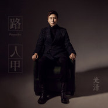
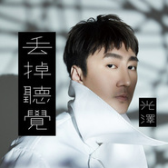
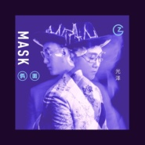
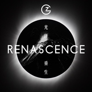

光泽
============================

|  |  |
| :--: | :-- |
| [ 光泽](https://i.xiami.com/guangze) | **播放数**: 4745486 **粉丝数**: 1155 **评论数**: 54 **地区**: China 中国大陆 **风格**: 流行 Pop, 国语流行 Mandarin Pop  |

## 档案

光泽G.Z 
像疯子一般的音乐狂人 
绝无仅有不可思议的惊人音乐履历 
80后，射手座，从小学习声乐和钢琴、吉他，极致彻底的与音乐为伍，一路从西安音乐学院到中央音乐学院， 毕业后再跟随旅台著名制作人Keith Stuart研习流行音乐演唱， 成为信(苏见信)的师弟，接着接受韩国唱片公司培训，后来远赴美国拜师著名歌手平克 (PINK)、黑眼豆豆(The Black Eyed Peas) 、艾米纳姆(Eminem)的御用两届格莱美制作人、美国MI音乐学院教授JON BROWN，继续学习欧美流行乐的音乐制作和编曲，绝无仅有地、全面地、疯狂地学习港台、日韩、欧美的音乐元素，人生超过九成九的时间，都在疯狂的吸取音乐养份，乐此不疲！ 
极致的全能音乐奇才 
能唱会写懂编擅长乐器甚至还授课 
擅长演唱、钢琴、吉他、贝斯、鼓、作曲、作词、编曲及音乐制作，曾于「上海亚洲音乐节歌手大赛」得到中国区冠军、亚洲区最具潜质奖，并因完整且完备的音乐实力，以特殊的80后年轻姿态，热烈受邀参与授课与讲座， 曾受外聘至北京现代音乐学院课座讲座、受邀中国传媒大学公开课讲座，并担任香港英皇艺人、李宇春等知名歌手艺人的专辑音乐制作、演唱会编曲及演唱指导，亦受邀为黄晓明、张静初等知名演员主演的多部电影创作主题曲。因创作能力和唱功，也被喻为陶喆、李宗盛的接班人。 
Keith Stuart曾赞美光泽，「音域广、穿透力强、嗓音高亢嘹亮、有着很强的感染力和穿透力，对歌曲情感的把握也十分恰到好处。」

## 专辑

| 名称 | 语种 | 唱片公司 | 发行时间 | 专辑类别 | 专辑风格 |
| :--: | :-- | :-- | :-- | :-- | :-- |
| [ 路人甲](./albums/5020858631.md) | 国语 | 回声文化 | 2020年06月02日 | 录音室专辑 | 国语流行 Mandarin Pop |
| [ 好聚·好散](./albums/2105088766.md) | 国语 | 星创世纪娱乐 | 2019年08月07日 | EP, 单曲 |  |
| [ 套路](./albums/2105046392.md) | 国语 | 星创世纪娱乐 | 2019年07月31日 | EP, 单曲 |  |
| [ 丢掉听觉](./albums/2105020766.md) | 国语 | 星创世纪娱乐 | 2019年07月25日 | EP, 单曲 |  |
| [ 习惯](./albums/2103519956.md) | 国语 | 星创世纪娱乐 | 2018年02月07日 | EP, 单曲 | 流行 Pop |
| [ 假面](./albums/2103505270.md) | 国语 | 星创世纪娱乐 | 2018年01月29日 | 录音室专辑 | 流行 Pop |
| [ 想你了](./albums/2103497094.md) | 国语 | 星创世纪娱乐 | 2018年01月22日 | 录音室专辑 | 流行 Pop |
| [ 俘虏](./albums/2103489689.md) | 国语 | 星创世纪娱乐 | 2018年01月15日 | EP, 单曲 | 流行 Pop |
| [ 中毒](./albums/2103470730.md) | 国语 | 星创世纪娱乐 | 2018年01月08日 | EP, 单曲 | 流行 Pop |
| [ 重生Renascence](./albums/2102877785.md) | 国语 | 星创世纪娱乐 | 2017年10月20日 | EP, 单曲 | 流行 Pop |
| [ 上瘾](./albums/2102704913.md) | 国语 | 星创世纪娱乐 | 2017年03月06日 | EP, 单曲 |  |
| [ 光泽 首张同名创作专辑](./albums/2102410476.md) | 国语 | 星创世纪娱乐 | 2016年10月21日 | 录音室专辑 | 国语流行 Mandarin Pop, 华语唱作人 Chinese Singer-Songwriter |

## 评论

|  |  |  |  |
| :-- | :-- | :-- | :-- |
|  [虾米用户](https://emumo.xiami.com/u/9879051)  2019-12-05 17:23 赞(1) 踩(0) | 
为啥没有光泽的新专辑？？
 |
|  [虾米用户](https://emumo.xiami.com/u/48153418) 伯克利音乐学院电影配乐/... 2018-12-06 07:48 赞(1) 踩(0) | 
这人前几天到伯克利音乐学院来讲课了，他有什么水平到伯克利讲课？也只能在网易混混，虾米根本混不走
 |
| ⇒ |  [虾米用户](https://emumo.xiami.com/u/11227384) 这个仙儿很懒，啥也没留下... 2019-07-07 18:00 赞(0) 踩(0) | 
伯克利那种有钱有势就能进的网红学校也值得你这么推崇？光泽和伯克利都垃圾，谢谢！
 |
| ⇒ |  [虾米用户](https://emumo.xiami.com/u/48153418) 伯克利音乐学院电影配乐/... 2019-07-07 18:09 赞(0) 踩(0) | 
<q><b>黄林说：</b></q>
 |
|  [虾米用户](https://emumo.xiami.com/u/525562) 青山青水青少年 2018-09-07 17:47 赞(2) 踩(0) | 
像疯子一般的抄袭狂人
 |
|  [虾米用户](https://emumo.xiami.com/u/115659192)   2018-08-02 09:09 赞(0) 踩(0) | 
抄袭狗
 |
|  [虾米用户](https://emumo.xiami.com/u/12732510) 我还没想好要写什么... 2018-07-13 04:06 赞(0) 踩(0) | 
这垃圾谁啊？
 |
|  [虾米用户](https://emumo.xiami.com/u/91655342) 我与世界只差一个你 2018-05-02 00:24 赞(0) 踩(0) | 
就前奏有点像吧
 |
|  [虾米用户](https://emumo.xiami.com/u/23404226)  2018-04-10 06:16 赞(2) 踩(0) | 
看见他在微博里装无辜才是最恶心的，他要是有才华的话早就红了好么，就是因为抄袭才有那么一丁点的关注量而已
 |
|  [虾米用户](https://emumo.xiami.com/u/330646692) 随心 2018-04-09 21:43 赞(1) 踩(0) | 
听这首歌感觉似曾相识，非常爱 
 |
|  [虾米用户](https://emumo.xiami.com/u/48429219) 我还没想好要写什么... 2018-03-30 16:59 赞(0) 踩(0) | 
哎 100年后没有一首歌是原创...各位听众请听细节、动态
 |
|  [虾米用户](https://emumo.xiami.com/u/37511206) 金属小清新 2018-03-22 08:28 赞(1) 踩(0) | 
找了一次捷径 就习惯了一次次找捷径 再见
 |
|  [虾米用户](https://emumo.xiami.com/u/301855296)   2018-03-22 05:05 赞(1) 踩(0) | 
长亭外，古道边，芳草天
 |
|  [虾米用户](https://emumo.xiami.com/u/194362430) 你熬夜你也会 2018-03-18 10:49 赞(2) 踩(0) | 
很多脑子转不过来的。要是他抄的是周杰伦的作品，编曲几乎不变，歌词换一下，加一个忧伤的歌名，发布出来就成了他自己的作品，歌手本人也不作说明，希望瞒天过海。这样对吗？？？对原创公平吗？？？音乐无国界，他抄欧美的也是抄，这种投机取巧的做法就该表起来。
 |
|  [虾米用户](https://emumo.xiami.com/u/26678353)  2018-03-08 22:53 赞(2) 踩(0) | 
被这声音折服了！
 |
|  [虾米用户](https://emumo.xiami.com/u/290393351) 我还没想好要写什么... 2018-03-05 23:30 赞(12) 踩(0) | 
空心和loststars意境完全不一样，一个是轻快一个是忧伤我偏爱忧伤，或许属于无病呻吟的类型，但就是喜欢那种憋着想哭哭不出的感觉，一个人火不火红不红与我并无关系，一首自己喜欢的歌闲暇之余听一听很好！
 |
|  [虾米用户](https://emumo.xiami.com/u/303372121) 且陶陶、乐尽天真 2018-01-13 06:38 赞(18) 踩(0) | 
「空心」抄了「lost Stars」（MV抄的getter的&amp;lt;Forget It&amp;gt;），「光泽」抄的「photograph」，「Santa Monica」抄了「adventure of a lifetime」，「醒来」抄的「the scientist」，「疯了」抄的「creep」。
 |
| ⇒ |  [虾米用户](https://emumo.xiami.com/u/254624354)   2018-01-22 14:46 赞(0) 踩(0) | 
You 行你上，不行别逼逼
 |
| ⇒ |  [虾米用户](https://emumo.xiami.com/u/303372121) 且陶陶、乐尽天真 2018-01-23 03:02 赞(0) 踩(0) | 
<q><b>水木。说：</b></q>
 |
| ⇒ |  [虾米用户](https://emumo.xiami.com/u/14370940) 一个耐心的骗子～ 2018-01-24 11:30 赞(0) 踩(0) | 
<q><b>街道杀死多肉动物说：</b></q>
 |
| ⇒ |  [虾米用户](https://emumo.xiami.com/u/14370940) 一个耐心的骗子～ 2018-01-24 11:31 赞(0) 踩(0) | 
<q><b>街道杀死多肉动物说：</b></q>
 |
| ⇒ |  [虾米用户](https://emumo.xiami.com/u/303372121) 且陶陶、乐尽天真 2018-01-24 15:04 赞(0) 踩(0) | 
<q><b>诗歌和太阳说：</b></q>
 |
| ⇒ |  [虾米用户](https://emumo.xiami.com/u/14370940) 一个耐心的骗子～ 2018-01-25 17:42 赞(0) 踩(0) | 
<q><b>街道杀死多肉动物说：</b></q>
 |
| ⇒ |  [虾米用户](https://emumo.xiami.com/u/52763491) 眼熟我，惊喜我，意外我. 2018-02-11 09:21 赞(0) 踩(0) | 
各个行业都有钻空子抄近道的，不过到也算不算完全的不劳而获在中国你的习惯！还有更多你不知道的，较真只会恶心自己
 |
| ⇒ |  [虾米用户](https://emumo.xiami.com/u/262032456)  2018-02-20 11:30 赞(0) 踩(0) | 
666
 |
| ⇒ |  [虾米用户](https://emumo.xiami.com/u/285049473) 剛拿起酒杯想和你碰杯 才... 2018-03-03 16:50 赞(0) 踩(0) | 
抄的都是我喜欢的歌&amp;hellip;&amp;hellip;
 |
|  [虾米用户](https://emumo.xiami.com/u/326431263) 在真实的梦中旅行 2017-12-16 14:18 赞(0) 踩(0) | 
厉害呀，我也是中央院的 
 |
|  [虾米用户](https://emumo.xiami.com/u/327062296)  2017-12-05 11:21 赞(2) 踩(0) | 
真是好听，哪一首都那么好听
 |
|  [虾米用户](https://emumo.xiami.com/u/189730988) 白白白白白白。 2017-11-28 23:47 赞(1) 踩(0) | 
好听
 |
|  [虾米用户](https://emumo.xiami.com/u/317310860)  2017-11-24 08:45 赞(0) 踩(0) | 

 |
|  [虾米用户](https://emumo.xiami.com/u/286513720) 疯狂成长 2017-11-17 10:25 赞(6) 踩(0) | 
能红?今天在醒来里面看见竟然有人说翻唱也算抄袭?笑死了   还有人说歌词多好  怎么能算抄袭    跪了   请去听听他抄的歌
 |
| ⇒ |  [虾米用户](https://emumo.xiami.com/u/114115014) 我还没想好要写什么... 2018-08-01 23:14 赞(0) 踩(0) | 
那些无脑粉，应该是假的，花钱雇来的吧
 |
|  [虾米用户](https://emumo.xiami.com/u/48386079) 暂无签名~ 2017-09-22 23:36 赞(4) 踩(0) | 
特意来骂人的，抄袭红果果啊！
 |
|  [虾米用户](https://emumo.xiami.com/u/72666568)  2017-08-29 22:18 赞(1) 踩(0) | 
蛮好的
 |
|  [虾米用户](https://emumo.xiami.com/u/247966166) 天真有邪，问心有愧 2017-08-18 08:11 赞(1) 踩(0) | 
很有感触
 |
|  [虾米用户](https://emumo.xiami.com/u/109435980) 若有人嫉妒你，请优雅的保... 2017-08-13 15:46 赞(3) 踩(0) | 
奇才？天才？只有真正的音乐
 |
|  [虾米用户](https://emumo.xiami.com/u/88690660)  2017-07-30 21:13 赞(0) 踩(0) | 
支持
 |
|  [虾米用户](https://emumo.xiami.com/u/308085014)  2017-07-05 11:12 赞(0) 踩(0) | 
最喜欢听你的歌   
 |
|  [虾米用户](https://emumo.xiami.com/u/29927212) 改天一起装逼把。 2017-06-21 14:48 赞(17) 踩(0) | 
本来听空心觉得很有心一个音乐人，从今天路人粉转疯狂黑，抄的一点技术含量都没有，riff和结构都不改？？只要是抄袭的，没有任何开脱的意义，就应该被网路暴力淹没致死！
 |
| ⇒ |  [虾米用户](https://emumo.xiami.com/u/11819173) Find You. 2018-08-23 16:25 赞(0) 踩(0) | 
你唱的还不如人家
 |
| ⇒ |  [虾米用户](https://emumo.xiami.com/u/29927212) 改天一起装逼把。 2018-09-03 21:22 赞(0) 踩(0) | 
<q><b>Hooray说：</b></q>
 |
| ⇒ |  [虾米用户](https://emumo.xiami.com/u/11819173) Find You. 2018-09-04 18:26 赞(0) 踩(0) | 
<q><b>黄闯说：</b></q>
 |
| ⇒ |  [虾米用户](https://emumo.xiami.com/u/29927212) 改天一起装逼把。 2018-09-05 03:28 赞(0) 踩(0) | 
<q><b>Hooray说：</b></q>
 |
|  [虾米用户](https://emumo.xiami.com/u/104224890) Only one 2017-06-04 20:16 赞(0) 踩(0) | 
此人毕红，不红天理难容，首首动人，好听到心。
 |
|  [虾米用户](https://emumo.xiami.com/u/15812499) 我还没想好要写什么... 2017-06-04 03:04 赞(0) 踩(0) | 
抄的好
 |
|  [虾米用户](https://emumo.xiami.com/u/11344784)   2017-06-04 01:53 赞(1) 踩(0) | 
好棒啊！加油！你一定會成功噠？
 |
|  [虾米用户](https://emumo.xiami.com/u/293718546)  2017-05-22 08:11 赞(0) 踩(0) | 
有没有搞错，这么点人 
 |
|  [虾米用户](https://emumo.xiami.com/u/29838318)  2017-05-21 22:07 赞(0) 踩(0) | 
超好听
 |
|  [虾米用户](https://emumo.xiami.com/u/297640570)  2017-05-20 01:19 赞(0) 踩(0) | 
期待神作，希望他能碰到好词
 |
|  [虾米用户](https://emumo.xiami.com/u/284380234)  2017-05-01 11:12 赞(0) 踩(0) | 
爱你，高音最棒，其他歌感觉一般，就我觉得你所有歌最好都带点高音，绝对好听
 |
|  [虾米用户](https://emumo.xiami.com/u/266639019)  2017-04-14 19:33 赞(0) 踩(0) | 
挺好的~~喜欢
 |
|  [虾米用户](https://emumo.xiami.com/u/286414777) 我还没想好要写什么... 2017-04-08 12:23 赞(0) 踩(0) | 
好听 喜欢听
 |
|  [虾米用户](https://emumo.xiami.com/u/5787391) 没有梦想，何必远方。 2017-04-06 00:02 赞(0) 踩(0) | 
祝你早日火起来，期待更好的作品
 |
|  [虾米用户](https://emumo.xiami.com/u/210353221) 一个智障 2017-02-14 05:23 赞(0) 踩(0) | 
煎熬不煎熬...难过不难过...情人节，快乐不快乐
 |
