李晓申
============================

|  |  |
| :--: | :-- |
| [ 李晓申](https://i.xiami.com/lixiaoshen) | **播放数**: 15197935 **粉丝数**: 349 **评论数**: 12 **地区**: China 中国大陆 **风格**: 流行 Pop, 国语流行 Mandarin Pop, 华语唱作人 Chinese Singer-Songwriter  |

## 档案

李晓申（Elison），1992年03月16日生于山东德州，中国大陆男歌手、音乐剧演员。从小极具歌唱及表演天赋，音色独特，情感丰富，唱功了得。2010年加入山东省博艺话剧团，演出首部舞台剧《活着》。2011年辞退剧团工作，全身心投入学习备战高考。2013年，在山东工商学院举办第一场个人演唱会。同年拜师多位著名歌手，并出国深造学习流行音乐表演。2014年取得中国好声音校园推介会前十。2015年为多名歌手朋友和家乡学校创作词曲，及舞台剧剧本《岁月如初》等。2016年在家乡举办第二场个人演唱会。  2016年获得中国流行音乐全国赛冠军。2017年举办第三场个人演唱会。

## 专辑

| 名称 | 语种 | 唱片公司 | 发行时间 | 专辑类别 | 专辑风格 |
| :--: | :-- | :-- | :-- | :-- | :-- |
| [ 劝诫](./albums/5022164707.md) | 国语 | 英曼唱片 | 2020年12月12日 | EP, 单曲 | 国语流行 Mandarin Pop |
| [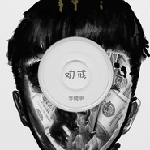 劝诫](./albums/5022043272.md) | 国语 | 英曼唱片 | 2020年11月27日 | EP, 单曲 | 国语流行 Mandarin Pop |
| [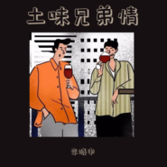 土味兄弟情](./albums/5020786318.md) | 国语 | 维音唱片 | 2020年06月03日 | EP, 单曲 | 流行 Pop |
| [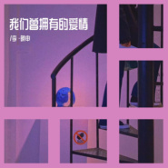 我们曾拥有的爱情](./albums/5020740502.md) | 国语 | 维音唱片 | 2020年05月27日 | EP, 单曲 | 流行 Pop |
| [ 有效距离](./albums/2108238831.md) | 国语 | 维音唱片 | 2020年03月26日 | EP, 单曲 | 流行 Pop |
| [ 你没有错](./albums/2106099084.md) | 国语 | 维音唱片 | 2020年02月19日 | EP, 单曲 | 流行 Pop |
| [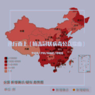 逆行而上](./albums/2106064354.md) | 国语 | 维音唱片 | 2020年02月18日 | EP, 单曲 | 流行 Pop |
| [ 坚信光芒](./albums/2105859854.md) | 国语 | 维音唱片 | 2020年02月10日 | EP, 单曲 | 流行 Pop |
| [ 拉菲](./albums/2105636387.md) | 国语 | 英曼唱片 | 2019年12月26日 | EP, 单曲 | 国语流行 Mandarin Pop |
| [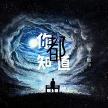 你都知道](./albums/2105537699.md) | 国语 | 恬音文化 | 2019年12月03日 | EP, 单曲 | 国语流行 Mandarin Pop |
| [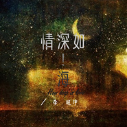 情深如海](./albums/2105413237.md) | 国语 | 英曼唱片 | 2019年11月06日 | EP, 单曲 |  |
| [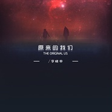 原来的我们](./albums/2105399279.md) | 国语 | 英曼唱片 | 2019年11月01日 | EP, 单曲 |  |
| [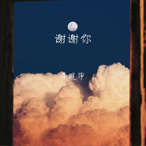 谢谢你](./albums/2105354327.md) | 国语 | 英曼唱片 | 2019年10月18日 | EP, 单曲 |  |
| [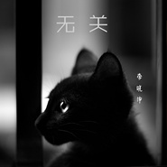 无关](./albums/2105354326.md) | 国语 | 英曼唱片 | 2019年10月18日 | EP, 单曲 |  |
| [ 小仙女](./albums/2105282314.md) | 国语 | 英曼唱片 | 2019年09月25日 | EP, 单曲 |  |
| [ 劝戒](./albums/2104643272.md) | 国语 | 天马电影, 天娱传媒, 华谊兄弟 | 2019年03月01日 | EP, 单曲 | 流行 Pop, 华语唱作人 Chinese Singer-Songwriter, 国语流行 Mandarin Pop |
| [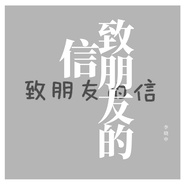 致朋友的信](./albums/2104633317.md) | 国语 | 天马电影, 天娱传媒, 华谊兄弟 | 2019年02月26日 | EP, 单曲 | 流行 Pop, 华语唱作人 Chinese Singer-Songwriter, 国语流行 Mandarin Pop |
| [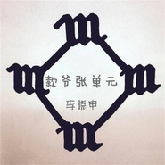 款爷张单元](./albums/2104421501.md) | 国语 | 天马电影, 天娱传媒, 华谊兄弟 | 2018年12月27日 | EP, 单曲 | 流行 Pop, 华语唱作人 Chinese Singer-Songwriter, 国语流行 Mandarin Pop |
| [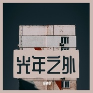 光年之外](./albums/2104416476.md) | 国语 | 天马电影, 天娱传媒, 华谊兄弟 | 2018年12月26日 | EP, 单曲 | 流行 Pop, 华语唱作人 Chinese Singer-Songwriter, 国语流行 Mandarin Pop |
| [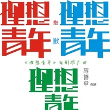 《理想青年》电影推广曲《理想青年》电影推广曲](./albums/2104329696.md) | 国语 | 天马电影, 天娱传媒, 华谊兄弟 | 2018年12月06日 | EP, 单曲 | 流行 Pop, 华语唱作人 Chinese Singer-Songwriter, 国语流行 Mandarin Pop |
| [ 梨花又开放](./albums/2104104188.md) | 国语 | 天马电影, 天娱传媒, 华谊兄弟 | 2018年10月13日 | 录音室专辑 | 流行 Pop, 华语唱作人 Chinese Singer-Songwriter, 国语流行 Mandarin Pop |
| [ 挑战主打歌之金曲捞场外第二期](./albums/2104011378.md) | 国语 | 天马电影, 天娱传媒, 华谊兄弟 | 2018年09月10日 | 现场专辑 | 流行 Pop, 华语唱作人 Chinese Singer-Songwriter, 国语流行 Mandarin Pop |
| [ 2018李晓申“繁星音乐盛典”现场特辑](./albums/2103901850.md) | 国语 | 天马电影, 天娱传媒, 华谊兄弟 | 2018年08月06日 | 现场专辑 | 流行 Pop, 国语流行 Mandarin Pop, 华语唱作人 Chinese Singer-Songwriter |
| [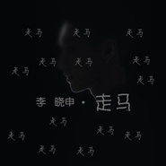 走马](./albums/2103885804.md) | 国语 | 华谊兄弟, 天马电影, 天娱传媒 | 2018年08月01日 | EP, 单曲 | 流行 Pop, 国语流行 Mandarin Pop, 华语唱作人 Chinese Singer-Songwriter |
| [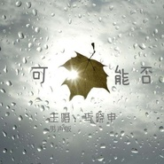 可能否男声版](./albums/2103850166.md) | 国语 | 华谊兄弟, 天马电影, 天娱传媒 | 2018年07月26日 | EP, 单曲 | 流行 Pop, 国语流行 Mandarin Pop, 华语唱作人 Chinese Singer-Songwriter |
| [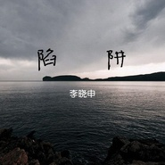 陷阱午夜电台版](./albums/2103843457.md) | 国语 | 华谊兄弟, 天马电影, 天娱传媒 | 2018年07月25日 | EP, 单曲 | 流行 Pop, 国语流行 Mandarin Pop, 华语唱作人 Chinese Singer-Songwriter |
| [ 浮生](./albums/2103826547.md) | 国语 | 华谊兄弟, 天马电影, 天娱传媒 | 2018年07月18日 | EP, 单曲 | 流行 Pop, 国语流行 Mandarin Pop, 华语唱作人 Chinese Singer-Songwriter |
| [ 《我们没有在一起》电影主题曲](./albums/2103702108.md) | 国语 | 华谊兄弟, 天马电影, 天娱传媒 | 2018年05月04日 | 原声带, 影视音乐 | 流行 Pop, 国语流行 Mandarin Pop, 华语唱作人 Chinese Singer-Songwriter |
| [ 《我们没有在一起》电影主题曲纯净版](./albums/2103702114.md) | 国语 | 华谊兄弟, 天马电影, 天娱传媒 | 2018年05月04日 | 原声带, 影视音乐 | 流行 Pop, 国语流行 Mandarin Pop, 华语唱作人 Chinese Singer-Songwriter |
| [ 《来不及的我们》电影主题曲](./albums/2103685537.md) | 国语 | 华谊兄弟, 天马电影, 天娱传媒 | 2018年04月14日 | 原声带, 影视音乐 | 流行 Pop, 国语流行 Mandarin Pop, 华语唱作人 Chinese Singer-Songwriter |
| [ 难堪](./albums/2103683231.md) | 国语 | 华谊兄弟, 天马电影, 天娱传媒 | 2018年04月13日 | EP, 单曲 | 流行 Pop, 国语流行 Mandarin Pop, 华语唱作人 Chinese Singer-Songwriter |
| [ 再见前任](./albums/2103677982.md) | 国语 | 华谊兄弟, 天马电影, 天娱传媒 | 2018年04月11日 | EP, 单曲 | 流行 Pop, 国语流行 Mandarin Pop, 华语唱作人 Chinese Singer-Songwriter |
| [ 没结尾的结尾](./albums/2103678101.md) | 国语 | 华谊兄弟, 天马电影, 天娱传媒 | 2018年04月11日 | EP, 单曲 | 流行 Pop, 国语流行 Mandarin Pop, 华语唱作人 Chinese Singer-Songwriter |
| [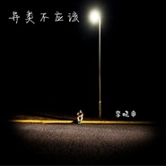 异类不应该](./albums/2103677955.md) | 国语 | 华谊兄弟, 天马电影, 天娱传媒 | 2018年04月11日 | EP, 单曲 | 流行 Pop, 国语流行 Mandarin Pop, 华语唱作人 Chinese Singer-Songwriter |
| [ 微电影《你在我的世界》插曲](./albums/2103674956.md) | 国语 | 华谊兄弟, 天马电影, 天娱传媒 | 2018年04月09日 | 原声带, 影视音乐 | 流行 Pop, 国语流行 Mandarin Pop, 华语唱作人 Chinese Singer-Songwriter |
| [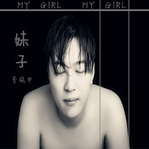 妹子](./albums/2103660628.md) | 国语 | 华谊兄弟, 天马电影, 天娱传媒 | 2018年04月02日 | EP, 单曲 | 流行 Pop, 国语流行 Mandarin Pop, 华语唱作人 Chinese Singer-Songwriter |
| [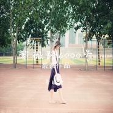 紫薇路6000号](./albums/2103658492.md) | 国语 | 华谊兄弟, 天马电影, 天娱传媒 | 2018年04月02日 | EP, 单曲 | 流行 Pop, 国语流行 Mandarin Pop, 华语唱作人 Chinese Singer-Songwriter |
| [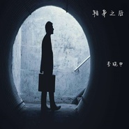 转身之后](./albums/2103649443.md) | 国语 | 华谊兄弟, 天马电影, 天娱传媒 | 2018年03月28日 | EP, 单曲 | 流行 Pop, 国语流行 Mandarin Pop, 华语唱作人 Chinese Singer-Songwriter |
| [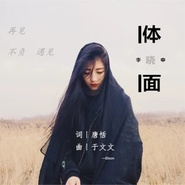 再见前任](./albums/2103637760.md) | 国语 | 华谊兄弟, 天马电影, 天娱传媒 | 2018年03月23日 | EP, 单曲 | 流行 Pop, 国语流行 Mandarin Pop, 华语唱作人 Chinese Singer-Songwriter |
| [ 《前任3:再见前任》电影插曲](./albums/2103490444.md) | 国语 | 华谊兄弟, 天马电影, 天娱传媒 | 2018年03月23日 | EP, 单曲 | 流行 Pop, 国语流行 Mandarin Pop, 华语唱作人 Chinese Singer-Songwriter |
| [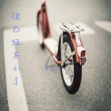 你已经不小了](./albums/2103635286.md) | 国语 | 华谊兄弟, 天马电影, 天娱传媒 | 2018年03月23日 | EP, 单曲 | 流行 Pop, 国语流行 Mandarin Pop, 华语唱作人 Chinese Singer-Songwriter |
| [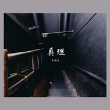 真理](./albums/2103608226.md) | 国语 | 天马电影, 天娱传媒, 华谊兄弟 | 2018年03月14日 | EP, 单曲 | 流行 Pop, 国语流行 Mandarin Pop, 华语唱作人 Chinese Singer-Songwriter |
| [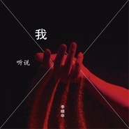 听说我](./albums/2103594504.md) | 国语 | 华谊兄弟, 天马电影, 天娱传媒 | 2018年03月08日 | EP, 单曲 | 流行 Pop, 国语流行 Mandarin Pop, 华语唱作人 Chinese Singer-Songwriter |
| [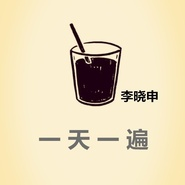 一天一遍](./albums/2103527363.md) | 国语 | 独立发行 | 2018年02月12日 | EP, 单曲 | 流行 Pop, 国语流行 Mandarin Pop, 华语唱作人 Chinese Singer-Songwriter |
| [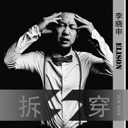 拆穿](./albums/2102978222.md) | 国语 | 华谊兄弟, 天马电影, 天娱传媒 | 2017年12月21日 | EP, 单曲 | 流行 Pop, 国语流行 Mandarin Pop, 华语唱作人 Chinese Singer-Songwriter |
| [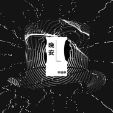 《晚安》电影同名主题曲](./albums/2102966259.md) | 国语 | 华谊兄弟, 天马电影, 天娱传媒 | 2017年12月04日 | EP, 单曲 | 流行 Pop, 国语流行 Mandarin Pop, 华语唱作人 Chinese Singer-Songwriter |
| [ 大牌遇见好声音·八强诞生周](./albums/2102862929.md) | 国语 | 华谊兄弟, 天马电影, 天娱传媒 | 2017年09月25日 | 现场专辑 | 流行 Pop, 国语流行 Mandarin Pop, 华语唱作人 Chinese Singer-Songwriter |
| [ 大牌遇见好声音](./albums/2102861677.md) | 国语 | 灿途音乐, 偶偶娱乐, 金牌大风, 华音鼎天 | 2017年09月21日 | 现场专辑 | 流行 Pop, 国语流行 Mandarin Pop |
| [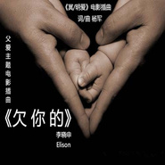 《冥/明爱》电影插曲](./albums/2102858173.md) | 国语 | 华谊兄弟, 天马电影, 天娱传媒 | 2017年09月16日 | EP, 单曲 | 流行 Pop, 国语流行 Mandarin Pop, 华语唱作人 Chinese Singer-Songwriter |
| [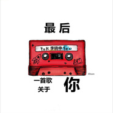 最后一首关于你的歌](./albums/2102935892.md) | 国语 | 独立发行 | 2017年09月05日 | EP, 单曲 | 国语流行 Mandarin Pop, 华语唱作人 Chinese Singer-Songwriter, 流行 Pop |
| [ 网络大电影《火力青春》主题曲](./albums/2102820092.md) | 国语 | 华谊兄弟, 天马电影, 天娱传媒 | 2017年08月24日 | EP, 单曲 | 流行 Pop, 国语流行 Mandarin Pop, 华语唱作人 Chinese Singer-Songwriter |
| [ 初了个恋（《火力青春》电影主题曲）《火力青春》电影主题曲](./albums/2102818962.md) | 国语 | 天马电影, 天娱传媒, 华谊兄弟 | 2017年08月23日 | EP, 单曲 | 流行 Pop, 国语流行 Mandarin Pop, 华语唱作人 Chinese Singer-Songwriter |
| [ 《我的逆向追求》电影主题曲](./albums/2102815601.md) | 国语 | 华谊兄弟, 天马电影, 天娱传媒 | 2017年08月17日 | EP, 单曲 | 流行 Pop, 国语流行 Mandarin Pop, 华语唱作人 Chinese Singer-Songwriter |
| [ 回忆不完整](./albums/2102815192.md) | 国语 | 华谊兄弟, 天马电影, 天娱传媒 | 2017年08月14日 | EP, 单曲 | 流行 Pop, 国语流行 Mandarin Pop, 华语唱作人 Chinese Singer-Songwriter |
| [ 隐藏的悲伤隐藏的悲伤](./albums/2102815213.md) | 国语 | 华谊兄弟, 天马电影, 天娱传媒 | 2017年08月14日 | EP, 单曲 | 流行 Pop, 国语流行 Mandarin Pop, 华语唱作人 Chinese Singer-Songwriter |
| [ 不知道](./albums/2102812655.md) | 国语 | 华谊兄弟, 天马电影, 天娱传媒 | 2017年08月11日 | EP, 单曲 | 流行 Pop, 国语流行 Mandarin Pop, 华语唱作人 Chinese Singer-Songwriter |
| [ 能不能](./albums/2102809517.md) | 国语 | 华谊兄弟, 天马电影, 天娱传媒 | 2017年08月06日 | EP, 单曲 | 流行 Pop, 国语流行 Mandarin Pop, 华语唱作人 Chinese Singer-Songwriter |
| [ 有你的时光feat.马时韵](./albums/2102806778.md) | 国语 | 华谊兄弟, 天马电影, 天娱传媒 | 2017年07月07日 | EP, 单曲 | 流行 Pop, 国语流行 Mandarin Pop, 华语唱作人 Chinese Singer-Songwriter |
| [ 那好吧](./albums/2102661166.md) | 国语 | 华友数码 | 2016年12月08日 | EP, 单曲 |  |
| [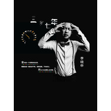 三岁七年](./albums/2102641587.md) | 国语 | 独立发行 | 2016年10月31日 | EP, 单曲 |  |
| [ 2016李晓申“这就是爱”个人演唱会情歌特辑](./albums/2102901850.md) | 国语 | 华谊兄弟, 天马电影, 天娱传媒 | 2016年07月09日 | 现场专辑 | 流行 Pop, 国语流行 Mandarin Pop, 华语唱作人 Chinese Singer-Songwriter |
| [ 爱的生日feat.冯铄](./albums/2102806780.md) | 国语 | 华谊兄弟, 天马电影, 天娱传媒 | 2012年03月23日 | EP, 单曲 | 流行 Pop, 国语流行 Mandarin Pop, 华语唱作人 Chinese Singer-Songwriter |

## 评论

|  |  |  |  |
| :-- | :-- | :-- | :-- |
|  [虾米用户](https://emumo.xiami.com/u/9846802) 时光的拾荒者，即使收拾零... 2020-06-15 22:22 赞(0) 踩(0) | 
唱的不错，不过真的有介绍里说的开过三次演唱会。真有人买票去看吗？
 |
|  [虾米用户](https://emumo.xiami.com/u/28572783) 一首好歌，一段故事。一个... 2020-06-02 10:25 赞(0) 踩(0) | 
声音好听，一次就记住了
 |
|  [虾米用户](https://emumo.xiami.com/u/420661152)  2019-11-21 14:14 赞(0) 踩(0) | 
心情和音乐很配。。伤我
 |
|  [虾米用户](https://emumo.xiami.com/u/266881158)  2019-10-17 22:18 赞(0) 踩(0) | 
歌好听，声音也好听！
 |
|  [虾米用户](https://emumo.xiami.com/u/426265174)  2019-08-26 10:58 赞(1) 踩(0) | 
你是第一个回复我的明星
 |
|  [虾米用户](https://emumo.xiami.com/u/244840341)  2019-07-07 07:30 赞(0) 踩(0) | 
如果是老人理所当然如果是新人我想说你B
 |
|  [虾米用户](https://emumo.xiami.com/u/243981271)  2019-07-05 23:27 赞(0) 踩(0) | 
我对自己开了一枪，你唱的最传神
 |
|  [虾米用户](https://emumo.xiami.com/u/342601586)  2019-06-06 21:45 赞(0) 踩(0) | 
特别的感觉
 |
|  [虾米用户](https://emumo.xiami.com/u/333337107)  2019-05-19 13:06 赞(0) 踩(0) | 
师哥加油
 |
|  [虾米用户](https://emumo.xiami.com/u/423493667)  2019-05-02 07:53 赞(0) 踩(0) | 

 |
|  [虾米用户](https://emumo.xiami.com/u/306065331) 幸福开始有人选 2019-04-21 23:47 赞(0) 踩(0) | 
加油＾０＾~
 |
|  [虾米用户](https://emumo.xiami.com/u/408157069) 他是她的岛 2019-04-08 21:40 赞(1) 踩(0) | 
关注了
 |
