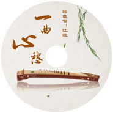

一曲心愁
============================

|  |  |
| :--: | :-- |
| [ 一曲心愁](https://emumo.xiami.com/album/2103994101) | **艺人**: [江波](../index.md) **语种**: 国语 **唱片公司**: 美力星空 **发行时间**: 2018年09月07日 **专辑类别**: EP, 单曲 **专辑风格**:  **播放数**: 706 **收藏数**: 1 **评论数**: 0  |

## 简介

一曲心愁越唱越心伤，红尘万丈何处话凄凉，缕缕愁丝指间流淌，心伤未老又增新伤。半个年华虚度，终了却又是一梦黄粱。

## 曲目

## 评论

|  |  |  |  |
| :-- | :-- | :-- | :-- |
