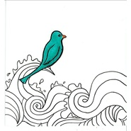

青鸟与诗
============================

|  |  |
| :--: | :-- |
| [ 青鸟与诗](https://emumo.xiami.com/album/2102679602) | **艺人**: [愚青](../index.md) **语种**: 国语 **唱片公司**: 独立发行 **发行时间**: 2016年12月24日 **专辑类别**: 录音室专辑 **专辑风格**: 流行 Pop, 国语流行 Mandarin Pop, 民谣 Folk, 独立民谣 Indie Folk **播放数**: 13543474 **收藏数**: 1349 **评论数**: 52  |

## 简介

《青鸟与诗》是愚青的首张个人专辑。整张专辑七首歌由乌糟兽作词，愚青、蔡青年参与作曲，苏喜度、周成参与编曲，1019录音师共同制作完成。

## 曲目

## 评论

|  |  |  |  |
| :-- | :-- | :-- | :-- |
|  [虾米用户](https://emumo.xiami.com/u/419427940)  2021-01-12 13:04 赞(0) 踩(0) | 
有点东西
 |
|  [虾米用户](https://emumo.xiami.com/u/441165441)  2020-11-26 11:46 赞(0) 踩(0) | 
第一次打分就送给你了，支持一下中国风民谣。声音清澈，曲调幽静舒缓，喜欢。
 |
|  [虾米用户](https://emumo.xiami.com/u/436470048)  2020-03-08 11:40 赞(0) 踩(0) | 
超爱
 |
|  [虾米用户](https://emumo.xiami.com/u/421710246)  2019-12-08 21:30 赞(1) 踩(0) | 
❄️不错
 |
|  [虾米用户](https://emumo.xiami.com/u/430595579) 听虾米是个美好的事 2019-12-03 10:49 赞(0) 踩(0) | 
清新动听
 |
|  [虾米用户](https://emumo.xiami.com/u/210329519) 竹杖芒鞋轻胜马，谁怕，一... 2019-11-24 15:20 赞(0) 踩(0) | 
舒缓，听着就感觉不错，推荐
 |
|  [虾米用户](https://emumo.xiami.com/u/333923784)  2019-10-10 00:44 赞(0) 踩(0) | 
时间没那么大方，它不能抚平所有人的痛。时间只会治愈愿意自渡的人。
 |
|  [虾米用户](https://emumo.xiami.com/u/248267745) 你走出千万人群独行…… 2019-07-30 01:19 赞(1) 踩(0) | 
带着满腔孤勇逆光而行，去走那一条少有人走的路……
 |
|  [虾米用户](https://emumo.xiami.com/u/404608675)  2019-05-07 11:29 赞(0) 踩(0) | 
是恋爱的味道
 |
|  [虾米用户](https://emumo.xiami.com/u/332607748) 微博id:桔子一瓣 2019-04-24 22:48 赞(7) 踩(0) | 
“很难形容愚青的声音。像事大雨过后一尘不染的蓝天，像是微风轻轻吹过十里麦田，像是君子兰盛放冬春失颜。很清脆，很好听。”——耽一
 |
|  [虾米用户](https://emumo.xiami.com/u/357037610) 潺潺而去 2019-04-15 12:26 赞(2) 踩(0) | 
平平淡淡的曲子，却能让我心里非常震撼
 |
|  [虾米用户](https://emumo.xiami.com/u/55069977) 我还没想好要写什么... 2019-04-12 08:55 赞(1) 踩(0) | 
旋律与歌词都上佳
 |
|  [虾米用户](https://emumo.xiami.com/u/4487129)  2019-03-16 09:59 赞(0) 踩(0) | 
！！！
 |
|  [虾米用户](https://emumo.xiami.com/u/406615145)  2019-03-08 12:07 赞(0) 踩(0) | 
旧词比较符合我。
 |
|  [虾米用户](https://emumo.xiami.com/u/37382773)   2019-03-01 23:18 赞(1) 踩(0) | 
宁静、清澈、活泼、可爱！
 |
|  [虾米用户](https://emumo.xiami.com/u/31292254) 我还没想好要写什么... 2019-02-25 09:54 赞(2) 踩(0) | 
希望中国乐坛多些这类干净和纯粹的音乐人
 |
|  [虾米用户](https://emumo.xiami.com/u/11737750)  2019-02-24 12:05 赞(0) 踩(0) | 
不错
 |
|  [虾米用户](https://emumo.xiami.com/u/196313669) 呵呵 2019-02-11 02:33 赞(0) 踩(0) | 
很不错
 |
|  [虾米用户](https://emumo.xiami.com/u/13751634) 抽烟的人永远也闻不到自己... 2019-02-01 19:43 赞(3) 踩(0) | 
喜欢愚青的声音，喜欢她唱歌的方式，反正就是喜欢！这年头太浮躁了，能这样安安静静唱歌的人不多了，且听且珍惜吧！
 |
|  [虾米用户](https://emumo.xiami.com/u/311555298)  2019-02-01 06:52 赞(0) 踩(0) | 
完美
 |
|  [虾米用户](https://emumo.xiami.com/u/204345824)  2019-01-22 17:22 赞(0) 踩(0) | 
这个更好
 |
|  [虾米用户](https://emumo.xiami.com/u/83591380) 哼一首淡淡的歌。 2018-12-21 23:00 赞(1) 踩(0) | 
封面好好看
 |
|  [虾米用户](https://emumo.xiami.com/u/224882800)  2018-11-29 07:01 赞(0) 踩(0) | 
谢谢虾米
 |
|  [虾米用户](https://emumo.xiami.com/u/403232475)  2018-10-27 22:18 赞(2) 踩(0) | 
一听就喜欢了，一整个下午重复播放。一会儿大声，一会儿小声。静静的，最合适的陪伴。
 |
|  [虾米用户](https://emumo.xiami.com/u/326262)  2018-06-24 16:56 赞(1) 踩(0) | 
愚青这名字真好听
 |
|  [虾米用户](https://emumo.xiami.com/u/357118805) 有人与我把酒分. 2018-06-11 12:41 赞(4) 踩(0) | 
最喜欢这落笔生花的词清清澈澈的嗓音恰到好处的调子悠悠的  伴着  入眠梦中是你  梦醒还是你
 |
|  [虾米用户](https://emumo.xiami.com/u/322534709) 我还没想好要写什么... 2018-06-06 10:41 赞(1) 踩(0) | 
是我喜欢的曲风，喜欢
 |
|  [虾米用户](https://emumo.xiami.com/u/322534709) 我还没想好要写什么... 2018-06-06 10:40 赞(1) 踩(0) | 
听着，感觉周围的环境静止了，好干净，忘记....
 |
|  [虾米用户](https://emumo.xiami.com/u/2584885)  2018-04-01 09:12 赞(0) 踩(0) | 
愚青与远方&amp;hellip;&amp;hellip;
 |
|  [虾米用户](https://emumo.xiami.com/u/338130933)  2018-03-17 00:36 赞(0) 踩(0) | 
一个人的夜晚，一听就爱上了这个声音&amp;hellip;
 |
|  [虾米用户](https://emumo.xiami.com/u/196313669) 呵呵 2018-03-08 06:41 赞(1) 踩(0) | 

 |
|  [虾米用户](https://emumo.xiami.com/u/219857416)  2018-02-27 21:03 赞(1) 踩(0) | 
感谢生命中有幸能遇到你
 |
|  [虾米用户](https://emumo.xiami.com/u/306165481)  2018-01-25 12:39 赞(0) 踩(0) | 
真的很好啊  会有更多人接触喜欢你的
 |
|  [虾米用户](https://emumo.xiami.com/u/10472039)   2017-12-02 10:15 赞(0) 踩(0) | 
超好听
 |
|  [虾米用户](https://emumo.xiami.com/u/333789282) 打死唔講 詐傻扮懵 2017-11-23 20:01 赞(2) 踩(0) | 
少了一首同名歌曲，酷狗上就有。
 |
|  [虾米用户](https://emumo.xiami.com/u/325175196) But if you t... 2017-11-10 08:11 赞(0) 踩(0) | 
静
 |
|  [虾米用户](https://emumo.xiami.com/u/16865558) 音乐，你没戏..... 2017-11-04 07:18 赞(0) 踩(0) | 
怎么说呢......真棒实体唱片已经在路上
 |
|  [虾米用户](https://emumo.xiami.com/u/10126201)  2017-10-31 11:31 赞(0) 踩(0) | 
大爱
 |
|  [虾米用户](https://emumo.xiami.com/u/325855058) 要变得很酷呀 2017-09-20 20:23 赞(0) 踩(0) | 
抵不过低声吟唱的民谣更沦陷于沈思吉笔下的世界
 |
|  [虾米用户](https://emumo.xiami.com/u/306747553) 你好，陌生人 2017-08-23 11:38 赞(0) 踩(0) | 
当初就是因为这首歌喜欢上了民谣
 |
|  [虾米用户](https://emumo.xiami.com/u/318592645)  2017-08-21 13:13 赞(3) 踩(0) | 
有故事的人总是藏着内心的温存，给每一个路过的人取暖
 |
|  [虾米用户](https://emumo.xiami.com/u/29233605)   2017-07-31 12:46 赞(1) 踩(0) | 
娓娓道来 岁月的情绪
 |
|  [虾米用户](https://emumo.xiami.com/u/166174628) 欢迎你不爱我 2017-07-24 10:40 赞(3) 踩(0) | 
喜欢乌糟兽作词愚青作曲演唱的每一首歌
 |
|  [虾米用户](https://emumo.xiami.com/u/51627788) 根本就不知道吃什么 2017-07-19 22:01 赞(0) 踩(0) | 
挺好听的
 |
|  [虾米用户](https://emumo.xiami.com/u/85159584) 愿早日遇见一个契合的灵魂 2017-07-09 02:11 赞(0) 踩(0) | 
好棒好棒好棒 好幸运发现了你 
 |
|  [虾米用户](https://emumo.xiami.com/u/247143670) 我只是不想做～ 2017-07-06 20:38 赞(2) 踩(0) | 
民谣我喜欢，走中国风的音乐也不少，可能让我喜欢上的却没几个。刚听到愚青的音乐，我便喜欢上了，清澈的嗓音以及整首歌的编曲做的都不错，一切结合的都很自然，用心听会给人很惊喜的愉悦！并没有那种为了中国风而中国风的做作！支持！ 
 |
|  [虾米用户](https://emumo.xiami.com/u/279853584) 不知云后面是雷雨还是明媚 2017-04-15 17:16 赞(1) 踩(0) | 
一次在咖啡厅里听到的，一听到这个调子就爱上了 
 |
|  [虾米用户](https://emumo.xiami.com/u/13137804) 骨灰級影迷、獨立音樂聽衆... 2017-03-17 14:34 赞(4) 踩(0) | 
内容已删除
 |
| ⇒ |  [虾米用户](https://emumo.xiami.com/u/262255084)   2017-10-26 16:44 赞(0) 踩(0) | 
网易评论下面也是你 差不多行了OK
 |
|  [虾米用户](https://emumo.xiami.com/u/255556501) 如果你不喜欢五月天，那我... 2017-02-28 21:47 赞(2) 踩(0) | 
很治愈的声音，安安静静的，好喜欢。加油
 |
|  [虾米用户](https://emumo.xiami.com/u/41020743) 有没有一首歌会让我想起你 2017-02-25 11:15 赞(1) 踩(0) | 
虽然中国风已经被玩了很久，但现在还做中国风民谣的，肯定是爱着中国风的，支持下。顺便说下，低音很美好。
 |
|  [虾米用户](https://emumo.xiami.com/u/264776328)  2017-02-08 17:46 赞(1) 踩(0) | 
很好听！意外邂逅的感觉
 |
