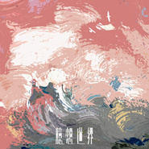

臆想世界
============================

|  |  |
| :--: | :-- |
| [ 臆想世界](https://emumo.xiami.com/album/2103703231) | **艺人**: [愚青](../index.md) **语种**: 国语 **唱片公司**: 唱谣文化 **发行时间**: 2018年05月05日 **专辑类别**: EP, 单曲 **专辑风格**: 国语流行 Mandarin Pop **播放数**: 584 **收藏数**: 21 **评论数**: 3  |

## 简介

一幅描绘想象力将世界支配的奇妙油画。当我们抛开这世界原有的形状和色彩，会得到一个崭新的世界。弥漫着迷幻以太的世界里，你看见什么？

## 曲目

## 评论

|  |  |  |  |
| :-- | :-- | :-- | :-- |
|  [虾米用户](https://emumo.xiami.com/u/290078992)  2019-10-20 14:10 赞(0) 踩(0) | 
怎么没了。
 |
|  [虾米用户](https://emumo.xiami.com/u/306377096) 如是 2019-06-07 09:31 赞(0) 踩(0) | 
期待期待期待
 |
|  [虾米用户](https://emumo.xiami.com/u/313890411) 我还没想好要写什么... 2018-06-09 13:08 赞(0) 踩(0) | 
好想听
 |
