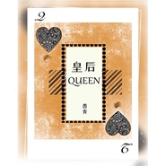

皇后
============================

|  |  |
| :--: | :-- |
| [ 皇后](https://emumo.xiami.com/album/2105354814) | **艺人**: [愚青](../index.md) **语种**: 国语 **唱片公司**: Live Music **发行时间**: 2019年10月20日 **专辑类别**: EP, 单曲 **专辑风格**:  **播放数**: 64911 **收藏数**: 9 **评论数**: 13  |

## 简介

《皇后》由灵动旋律缔造者盒子先生作曲，著名音乐人林乔携手实力作词人野太填词，掠心歌者愚青演唱。循序渐进的旋律，独特魅力的嗓音，富有戏剧化的歌词，如行云流水一般，慢慢悠悠，淌进心底。越是暗沉浮躁的人生，越是要修炼出自己独立的人格，沉淀内在的力量。不轻易臣服，不做提线木偶，多一分笃定与坚韧，成为自己的皇后。执子手，红豆嵌在心口，若是要困住自我，不如放手，水晶和石头送你保留。纵使人生光彩褪去，但也最闪亮。 

## 曲目

## 评论

|  |  |  |
| :-- | :-- | :-- |
|  [虾米用户](https://emumo.xiami.com/u/421902946)  2020-02-15 22:44 赞(0) 踩(0) | 
爱你爱你
 |
|  [虾米用户](https://emumo.xiami.com/u/357037610) 潺潺而去 2020-01-07 18:27 赞(0) 踩(0) | 
喜欢你
 |
|  [虾米用户](https://emumo.xiami.com/u/354079225)  2019-11-19 07:24 赞(0) 踩(0) | 
还是那么的动听
 |
|  [虾米用户](https://emumo.xiami.com/u/427280961)  2019-11-09 17:26 赞(0) 踩(0) | 
很好听，很优美的歌，多听几次让我更喜欢这首歌。
 |
|  [虾米用户](https://emumo.xiami.com/u/326964376) 活着就好 2019-10-23 08:39 赞(1) 踩(0) | 
现在的所谓“专辑”有几个是不止一首歌的，麻烦用单曲，别侮辱专辑两个字。
 |
| ⇒ |  [虾米用户](https://emumo.xiami.com/u/354685768)  2019-10-26 12:06 赞(0) 踩(0) | 
歌你爱听不听，没人让你听是吧，别人说出个专辑怎么了？碍着你了吗？真的是，比起那些抄袭的好多了吧，人家的歌也好，而且唱的那么好听。再说人家也要擦饭的嘛，难道就是为了唱给你听的吗？听了就完事儿是不是，你养她吗？
 |
| ⇒ |  [虾米用户](https://emumo.xiami.com/u/354685768)  2019-10-26 12:15 赞(0) 踩(0) | 
你以为每个人都像你一样年薪百万吗？然后天天就没事坐在那里，然后指指点点，说这个出专辑那个出专辑怎么只有一首歌是吧，就侮辱了专辑两个字。
 |
|  [虾米用户](https://emumo.xiami.com/u/9064901) 不拉帮结派，不妄言置评，... 2019-10-22 09:25 赞(0) 踩(0) | 
在这阴天慵懒的上午，安静的这一刻，这张专植入心扉，与往常不同类别的一张专辑。
 |
|  [虾米用户](https://emumo.xiami.com/u/9064901) 不拉帮结派，不妄言置评，... 2019-10-22 09:25 赞(0) 踩(0) | 
在这阴天慵懒的上午，安静的这一刻，这张专植入心扉，与往常不同类别的一张专辑。
 |
|  [虾米用户](https://emumo.xiami.com/u/344018512) 我还没想好要写什么... 2019-10-20 20:51 赞(0) 踩(0) | 

 |
|  [虾米用户](https://emumo.xiami.com/u/281281326) 一个个正在淡逝的意境，一... 2019-10-20 15:55 赞(0) 踩(0) | 
好听
 |
|  [虾米用户](https://emumo.xiami.com/u/290078992)  2019-10-20 14:06 赞(0) 踩(0) | 
哈，首评。
 |
|  [虾米用户](https://emumo.xiami.com/u/428235557)  2019-10-20 08:10 赞(1) 踩(0) | 
，
 |
