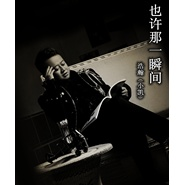

浩瀚（小凯）
============================

|  |  |
| :--: | :-- |
| [ 浩瀚（小凯）](https://i.xiami.com/haohan) | **地区**: China 中国大陆 **风格**: 国语流行 Mandarin Pop **播放数**: 3589182 **粉丝数**: 118 **评论数**: 9  |

## 档案

原名：李锦凯 
艺名：浩瀚（小凯）---凭借唱作一首《分手在那个秋天》让歌迷朋友认识了他， 
主打歌《分手在那个秋天》曾在在各大门户网站：网易音乐腾讯音乐新浪音乐等华语歌曲排行榜排名前10位的好成绩。 
基本资料 
中文名：浩瀚（小凯） 
英文名：LEO 
生日：10-15 
英文名/别名：LEO 
国籍：中国 
出生地：青海 
身高：175 
主要成就：第六届中国金唱片奖提名 
民族：汉 
代表作品：分手在那个秋天 
荣誉记录 
1997年获第六届全国城市职业歌手大奖赛“金地杯”通俗唱法“铜奖” 
1998年8月29日获青海省音乐家协会，青海省经济广播电台，全省歌手大奖赛通俗唱法一等奖 
2000年10月26日获文化部，中国轻音乐学会，北京中央电视台中视演艺中心，北京企歌文化艺术中心，中国人民广播电台文艺中心，北京电视台《中国流行音乐厅》首届优秀“新艺人奖 
2000年单曲《挚爱的人》获中国广播电台听众最喜爱的歌曲 
2003年获深圳市委，深圳音乐家协会，深圳广播电台，深圳市第十六届“荔枝杯”青年歌手大奖赛通俗组最具潜质奖 
2007年9月唱作的《分手在那个秋天》荣誉中国第六届金唱片奖提名 
2010年12月唱作的《很想问你是否爱过我》荣获中国第四届打工歌曲银奖 
2012年12月为玉树地震唱作的《孩子别怕》荣获青海省第九届精神文明建设“五个一工程”奖

## 专辑

| 名称 | 语种 | 唱片公司 | 发行时间 | 专辑类别 | 专辑风格 |
| :--: | :-- | :-- | :-- | :-- | :-- |
| [ 也许那一瞬间](./albums/2103467905.md) | 国语 | 独立发行 | 2018年01月05日 | 录音室专辑 |  |
| [ 你就是我一生的最爱你就是我一生的最爱](./albums/2102693213.md) | 国语 | 独立发行 | 2017年02月14日 | 录音室专辑 |  |
| [ 很想问你是否爱过我分手在那个秋天](./albums/2102654283.md) | 国语 | 独立发行 | 2010年04月01日 | 录音室专辑 | 国语流行 Mandarin Pop |

## 评论

|  |  |  |
| :-- | :-- | :-- |
|  [虾米用户](https://emumo.xiami.com/u/293692544) 你敢给我说话吗？我咬你 2019-04-04 05:21 赞(2) 踩(0) | 
好听
 |
|  [虾米用户](https://emumo.xiami.com/u/355772772) 真诚相待，是做人根本。 2019-01-14 16:35 赞(3) 踩(0) | 
人世间有时候情不由己，留下的是伤感，无奈。
 |
|  [虾米用户](https://emumo.xiami.com/u/131381828) 大龄剩男 2019-01-11 22:30 赞(2) 踩(0) | 
希望听到你的新歌。
 |
|  [虾米用户](https://emumo.xiami.com/u/351319667) 感恩在此相遇！ 2018-08-12 08:11 赞(3) 踩(0) | 
挺你！祝越来越好！
 |
|  [虾米用户](https://emumo.xiami.com/u/289846411)  2017-08-15 22:59 赞(3) 踩(0) | 
你的歌真伤
 |
|  [虾米用户](https://emumo.xiami.com/u/241671027) 阿信玛莎怪兽了！（意思是... 2017-07-20 14:27 赞(1) 踩(0) | 
如果能发布励志的歌就好了！ 
 |
|  [虾米用户](https://emumo.xiami.com/u/241671027) 阿信玛莎怪兽了！（意思是... 2017-07-18 11:31 赞(2) 踩(0) | 
浩瀚就是太重感情了......
 |
|  [虾米用户](https://emumo.xiami.com/u/236625825)  2017-07-16 23:00 赞(1) 踩(0) | 
好听好听
 |
|  [虾米用户](https://emumo.xiami.com/u/223847098) 不忘初心，方得始终 2016-11-18 22:57 赞(3) 踩(0) | 
内容已删除
 |
| ⇒ |  [虾米用户](https://emumo.xiami.com/u/248562206)  2016-11-23 11:46 赞(0) 踩(0) | 
希望能听到你的更多原创音乐   
 |
