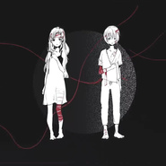

病名は愛だった / 病名为爱
============================

|  |  |
| :--: | :-- |
| [ 病名は愛だった / 病名为爱](https://emumo.xiami.com/album/2102877062) | **艺人**: [豆沙团子AnDango](../index.md) **语种**: 其他 **唱片公司**: 独立发行 **发行时间**: 2017年10月20日 **专辑类别**: EP, 单曲 **专辑风格**: 电子 Electronic, 器乐流行 Instrumental Pop, 日本动漫游戏 Japanese ACG **播放数**: 87323 **收藏数**: 20 **评论数**: 2  |

## 简介

原曲：Neru &amp; z'5  
演奏：豆沙团子AnDango  
 

## 曲目

## 评论

|  |  |  |
| :-- | :-- | :-- |
|  [虾米用户](https://emumo.xiami.com/u/95599564) 你相信并期待的东西便是你... 2017-10-21 11:14 赞(1) 踩(0) | 
与是听完我把原唱下了，纯音也不错啊 
 |
| ⇒ |  [虾米用户](https://emumo.xiami.com/u/7922143) 活着就是为了接触新事物~ 2018-01-30 13:21 赞(0) 踩(0) | 
原唱是谁唱的，版本太多了
 |
