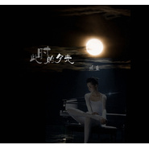

此时月光
============================

|  |  |
| :--: | :-- |
| [ 此时月光](https://emumo.xiami.com/album/2102821387) | **艺人**: [握蓝](../index.md) **语种**: 国语 **唱片公司**: 独立发行 **发行时间**: 2017年08月28日 **专辑类别**: 录音室专辑 **专辑风格**: 民谣流行 Folk Pop **播放数**: 503829 **收藏数**: 40 **评论数**: 10  |

## 简介

用一种久别重逢的眼神 
 

 望月  
一些话  
留给自己
 
<em> </em> 

 
 

 

## 曲目

## 评论

|  |  |  |  |
| :-- | :-- | :-- | :-- |
|  [虾米用户](https://emumo.xiami.com/u/421895837)  2020-06-21 08:41 赞(0) 踩(0) | 
赏月听曲儿
 |
|  [虾米用户](https://emumo.xiami.com/u/327496468)  2020-04-08 16:33 赞(0) 踩(0) | 
强烈推荐！！
 |
|  [虾米用户](https://emumo.xiami.com/u/312126870)  2020-04-04 23:36 赞(0) 踩(0) | 
如此的声线让我沦陷！
 |
|  [虾米用户](https://emumo.xiami.com/u/282117262)  2020-01-08 23:46 赞(0) 踩(0) | 
超好听！
 |
|  [虾米用户](https://emumo.xiami.com/u/8683928) 11 2019-03-21 21:33 赞(0) 踩(0) | 
马上淘宝购买你的唱片。听20年再说
 |
|  [虾米用户](https://emumo.xiami.com/u/276667790)  2018-08-25 11:25 赞(0) 踩(0) | 
强烈推荐！鼓掌&amp;hellip;
 |
|  [虾米用户](https://emumo.xiami.com/u/1808171)   2018-08-23 21:54 赞(0) 踩(0) | 
一面湖水这首歌听了很多版本，只有握蓝能够完全演绎出这首歌的精髓。
 |
|  [虾米用户](https://emumo.xiami.com/u/276667790)  2018-08-18 10:23 赞(0) 踩(0) | 
好听
 |
|  [虾米用户](https://emumo.xiami.com/u/1665678) 我若青帝。 2017-08-30 23:51 赞(0) 踩(0) | 
 
 |
|  [虾米用户](https://emumo.xiami.com/u/276837654)  2017-08-29 01:52 赞(0) 踩(0) | 
沉默在轻轻吟唱里&amp;hellip;&amp;hellip;喜欢你的音乐支持   
 |
