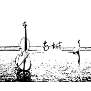

南城
============================

|  |  |
| :--: | :-- |
| [ 南城](https://emumo.xiami.com/album/2103753139) | **艺人**: [握蓝](../index.md) **语种**: 国语 **唱片公司**: 独立发行 **发行时间**: 2018年06月21日 **专辑类别**: 录音室专辑 **专辑风格**: 民谣流行 Folk Pop **播放数**: 507383 **收藏数**: 16 **评论数**: 1  |

## 简介

  
那夜有雨，窗帘微润。  
风说，你有来过。  
 

## 曲目

## 评论

|  |  |  |
| :-- | :-- | :-- |
|  [虾米用户](https://emumo.xiami.com/u/266461620) 这家伙很懒，什么都没有留... 2019-07-23 23:58 赞(0) 踩(0) | 
南城的你
 |
