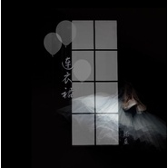
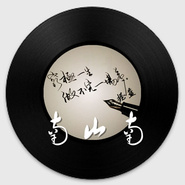
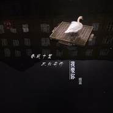

握蓝
============================

|  |  |
| :--: | :-- |
| [ 握蓝](https://i.xiami.com/janeblue) | **地区**: China 中国大陆 **风格**: 民谣流行 Folk Pop **播放数**: 9572805 **粉丝数**: 1834 **评论数**: 95  |

## 档案

一觉醒来，我从所有的地方回来。

## 专辑

| 名称 | 语种 | 唱片公司 | 发行时间 | 专辑类别 | 专辑风格 |
| :--: | :-- | :-- | :-- | :-- | :-- |
| [ 星](./albums/2104854641.md) | 国语 |  | 2019年05月10日 | 录音室专辑 | 城市民谣 Urban Folk |
| [ 麻花姑娘](./albums/2104316515.md) | 国语 |  | 2018年12月03日 | 录音室专辑 | 城市民谣 Urban Folk |
| [ 南城](./albums/2103753139.md) | 国语 | 独立发行 | 2018年06月21日 | 录音室专辑 | 民谣流行 Folk Pop |
| [ 当你老了](./albums/2103670370.md) | 国语 | 独立发行 | 2018年04月04日 | 录音室专辑 | 城市民谣 Urban Folk |
| [ 一生守候](./albums/2103589531.md) | 国语 | 独立发行 | 2018年03月05日 | 录音室专辑 | 城市民谣 Urban Folk, 民谣流行 Folk Pop |
| [ 淡妆](./albums/2103465947.md) | 国语 | 独立发行 | 2018年01月01日 | EP, 单曲 | 民谣流行 Folk Pop |
| [ 安落简单而炽热的难忘](./albums/2102966009.md) | 国语 | 独立发行 | 2017年12月02日 | 精选集 | 民谣流行 Folk Pop |
| [ 我想大声告诉你](./albums/2102941289.md) | 国语 | 独立发行 | 2017年11月17日 | 录音室专辑 | 民谣流行 Folk Pop |
| [ 连衣裙](./albums/2102867416.md) | 国语 | 独立发行 | 2017年10月01日 | 录音室专辑 | 民谣流行 Folk Pop |
| [ 借](./albums/2102859294.md) | 国语 | 独立发行 | 2017年09月18日 | 录音室专辑 | 民谣流行 Folk Pop |
| [ 此时月光](./albums/2102821387.md) | 国语 | 独立发行 | 2017年08月28日 | 录音室专辑 | 民谣流行 Folk Pop |
| [ 安和桥](./albums/2102726578.md) | 国语 | 独立发行 | 2017年04月03日 | 录音室专辑 | 独立民谣 Indie Folk, 民谣 Folk |
| [ 南山南](./albums/2102726576.md) | 国语 | 独立发行 | 2017年04月03日 | 录音室专辑 | 独立民谣 Indie Folk, 民谣流行 Folk Pop |
| [ 突然好想你](./albums/2102726575.md) | 国语 | 独立发行 | 2017年04月03日 | 录音室专辑 | 城市民谣 Urban Folk, 民谣流行 Folk Pop |
| [ 假如我是真的](./albums/2102726577.md) | 国语 | 独立发行 | 2017年04月03日 | 录音室专辑 | 民谣流行 Folk Pop, 城市民谣 Urban Folk |
| [ 我要你](./albums/2102677716.md) | 国语 | 独立发行 | 2017年01月09日 | EP, 单曲 | 国语流行 Mandarin Pop, 流行 Pop, 民谣 Folk |
| [ 风声有风音乐](./albums/2102661113.md) | 国语 | 独立发行 | 2016年11月06日 | 录音室专辑 | 城市民谣 Urban Folk, 民谣流行 Folk Pop |
| [ 你知道我在等你吗？吉他与蓝](./albums/2102662383.md) | 国语 | 独立发行 | 2016年10月10日 | 录音室专辑 | 城市民谣 Urban Folk, 民谣流行 Folk Pop |

## 评论

|  |  |  |
| :-- | :-- | :-- |
|  [虾米用户](https://emumo.xiami.com/u/46732036)  2020-12-09 11:32 赞(0) 踩(0) | 
好棒的声音
 |
|  [虾米用户](https://emumo.xiami.com/u/8337431) 以乐会友 2020-08-21 14:38 赞(1) 踩(0) | 
魅力女声20200821.94
 |
|  [虾米用户](https://emumo.xiami.com/u/276944698) 不要自我设限..... 2020-08-15 20:46 赞(1) 踩(0) | 
❇️❇️❇️
 |
|  [虾米用户](https://emumo.xiami.com/u/356637287)  2020-07-12 13:28 赞(1) 踩(0) | 
从第一次听到她翻唱的《借》就再也忘不了这个声音。安静，温暖，又充满力量。希望可以出唱片，一定会收藏。
 |
|  [虾米用户](https://emumo.xiami.com/u/441165237) In search of... 2020-06-18 13:00 赞(1) 踩(0) | 
我以＂连衣裙＂是今年发现的新歌。听了有几十遍仍不厌。歌星音质清晰的，比较蓝与忧伤，这比较符合我的耳朵与心情。
 |
|  [虾米用户](https://emumo.xiami.com/u/1865674)  不懂音乐，但是不能没有... 2020-06-11 17:38 赞(1) 踩(0) | 
强烈建议出一张DTS碟片
 |
|  [虾米用户](https://emumo.xiami.com/u/1865674)  不懂音乐，但是不能没有... 2020-06-11 17:38 赞(1) 踩(0) | 
喜欢这个嗓音
 |
|  [虾米用户](https://emumo.xiami.com/u/422123181) 人生如戏…… 2020-05-06 00:54 赞(1) 踩(0) | 
如何你能把全部无损音乐录入u反寄给我，我用胆机听更好 
 |
|  [虾米用户](https://emumo.xiami.com/u/2125820)  2020-04-15 01:43 赞(1) 踩(0) | 
爱你
 |
|  [虾米用户](https://emumo.xiami.com/u/2125820)  2020-04-15 01:42 赞(1) 踩(0) | 
不管你是还是女，我只是喜欢你
 |
|  [虾米用户](https://emumo.xiami.com/u/16096993)  2020-04-06 19:08 赞(1) 踩(0) | 
夜深人不静，总在无意中，回想起那些，失恋失意失乐的日子，这时候应该是，缘分的使然，听到了握蓝的声音，那是种一听人就会安静，就想坐下来喝杯咖啡，安安静静的听歌，握蓝的声音就像是有魔力一样，安静，温暖，治愈，直入心灵，带着共鸣，又有故事，歌单从尾听到头，发现握蓝每次更新的一首歌都是进步，加油，希望你能坚持着一直更新歌曲。
 |
|  [虾米用户](https://emumo.xiami.com/u/15477519) 爱  是生命的和弦，而不... 2020-03-05 13:57 赞(1) 踩(0) | 
您好，您能上传一下，您翻唱的《外面的世界》那首歌吗… 我很喜欢你的版本… 谢谢
 |
|  [虾米用户](https://emumo.xiami.com/u/426249406) [null] 2020-02-23 16:32 赞(2) 踩(0) | 
Good music.
 |
|  [虾米用户](https://emumo.xiami.com/u/265107678)  2020-01-29 13:04 赞(2) 踩(0) | 
听歌，喝茶，发呆
 |
|  [虾米用户](https://emumo.xiami.com/u/265107678)  2020-01-29 13:03 赞(2) 踩(0) | 
每夜伴随入眠，治好了我的失眠症
 |
|  [虾米用户](https://emumo.xiami.com/u/13787461)  2020-01-24 10:49 赞(1) 踩(0) | 
唱歌的人是谁
 |
|  [虾米用户](https://emumo.xiami.com/u/21254121)  2019-11-13 00:34 赞(1) 踩(0) | 
听了一夜的不同版本。以为握蓝是个歌手。原来是个懂我的音乐收集人。
 |
|  [虾米用户](https://emumo.xiami.com/u/7151428) 暖暖的～～ 2019-09-13 20:26 赞(1) 踩(0) | 
 
 |
|  [虾米用户](https://emumo.xiami.com/u/32269951) 最早一批的音乐电台DJ现... 2019-09-10 16:09 赞(1) 踩(0) | 
收藏在我的独立华语女声专辑里啦，怎么没有这位女神的更多资料呢？
 |
|  [虾米用户](https://emumo.xiami.com/u/9583028)  2019-09-07 19:12 赞(1) 踩(0) | 
先泡壶茶，静静地让音乐泻下来，包裹起来，不喧噪，挺好。
 |
|  [虾米用户](https://emumo.xiami.com/u/341718528)  2019-08-28 09:30 赞(1) 踩(0) | 
那有CD卖？ 赞
 |
|  [虾米用户](https://emumo.xiami.com/u/9501675) 这家伙很聪明什么也没留下... 2019-08-17 18:17 赞(1) 踩(0) | 

 |
|  [虾米用户](https://emumo.xiami.com/u/167015218) 。。 2019-08-13 10:47 赞(1) 踩(0) | 
加油
 |
|  [虾米用户](https://emumo.xiami.com/u/411202587) 有酒有故事有肉有歌 2019-08-11 22:44 赞(1) 踩(0) | 
很喜欢你唱的这版安静下来,不知道伴奏能不能分享?盼复.
 |
|  [虾米用户](https://emumo.xiami.com/u/354439693)  2019-08-06 15:49 赞(1) 踩(0) | 
这也太好听了吧！！！！！听得想哭
 |
|  [虾米用户](https://emumo.xiami.com/u/320178953) 呼啊 2019-07-12 00:33 赞(1) 踩(0) | 
哎呦，我是第一千呦。 
 |
|  [虾米用户](https://emumo.xiami.com/u/424434543)  ㅤ 2019-05-14 01:18 赞(6) 踩(0) | 
挖到宝了……
 |
|  [虾米用户](https://emumo.xiami.com/u/3495891) 终有一天你我都会沦为彼此... 2019-05-05 19:18 赞(10) 踩(0) | 
这声音能把黄昏拉得更长 这声音能把影子塑得更瘦 这声音能让地铁站的人流都安静下来
 |
|  [虾米用户](https://emumo.xiami.com/u/12663675) 美人不是母胎生 2019-03-26 08:20 赞(1) 踩(0) | 
  
 |
|  [虾米用户](https://emumo.xiami.com/u/12663675) 美人不是母胎生 2019-03-26 08:20 赞(3) 踩(0) | 
治愈型声音
 |
|  [虾米用户](https://emumo.xiami.com/u/8683928) 11 2019-03-21 21:38 赞(1) 踩(0) | 
主人你的唱片有售吗？
 |
|  [虾米用户](https://emumo.xiami.com/u/8683928) 11 2019-03-21 21:34 赞(1) 踩(0) | 
请问唱片哪有卖，我都要找哭了，在哪？？？？？？？？
 |
|  [虾米用户](https://emumo.xiami.com/u/51704973)  2019-03-13 22:31 赞(1) 踩(0) | 
触动灵魂的音乐，加油，每日听一次
 |
|  [虾米用户](https://emumo.xiami.com/u/411733654) 喜欢音乐就是喜欢美好生活 2019-03-05 23:45 赞(2) 踩(0) | 
声音没有装饰 干净 好 
 |
|  [虾米用户](https://emumo.xiami.com/u/11446884) New York MoM... 2019-02-08 19:59 赞(4) 踩(0) | 
好喜欢这个声音，忧伤中带着温度。
 |
|  [虾米用户](https://emumo.xiami.com/u/333543217)  2019-01-30 14:29 赞(1) 踩(0) | 
听你唱的每一首歌都很有味道，会让人放空，很放松，感觉一切都可以放下
 |
|  [虾米用户](https://emumo.xiami.com/u/411551974)  2019-01-27 14:22 赞(2) 踩(0) | 
顺子的水平！
 |
|  [虾米用户](https://emumo.xiami.com/u/216851188) 我还没想好要写什么... 2019-01-21 17:39 赞(1) 踩(0) | 
支持你！！！
 |
|  [虾米用户](https://emumo.xiami.com/u/361287195) 暖暖的幸福(^o^)o甜... 2018-12-29 07:53 赞(1) 踩(0) | 
（）
 |
|  [虾米用户](https://emumo.xiami.com/u/404985711)  2018-12-27 09:01 赞(1) 踩(0) | 
超好听啊，暖暖的声音 
 |
|  [虾米用户](https://emumo.xiami.com/u/253376307)  2018-12-02 22:15 赞(1) 踩(0) | 
声音很好听，有辨识度
 |
|  [虾米用户](https://emumo.xiami.com/u/365499579)  2018-10-26 09:44 赞(3) 踩(0) | 
从第一次听到你的声音，就再也忘不掉了 
 |
|  [虾米用户](https://emumo.xiami.com/u/60753872) 与生活温柔撕杀 2018-10-22 21:50 赞(1) 踩(0) | 
往后余生哪里能听到
 |
|  [虾米用户](https://emumo.xiami.com/u/401737150)  2018-08-20 07:34 赞(2) 踩(0) | 
像爵士的声音
 |
|  [虾米用户](https://emumo.xiami.com/u/334220399)  2018-07-09 15:28 赞(4) 踩(0) | 
让我想起了以前的香港歌手邝美云
 |
|  [虾米用户](https://emumo.xiami.com/u/361932364) 我还没想好要写什么... 2018-07-08 10:20 赞(3) 踩(0) | 
特别有穿透力的声音！
 |
|  [虾米用户](https://emumo.xiami.com/u/314577405) 只要是好听的歌我都会重复... 2018-07-03 10:38 赞(2) 踩(0) | 
握蓝的声音特别另我深刻，那个嗓音一听爱上，不知真人是怎么样的 
 |
|  [虾米用户](https://emumo.xiami.com/u/318963085)  2018-06-13 14:12 赞(1) 踩(0) | 
安抚人心的声音...
 |
|  [虾米用户](https://emumo.xiami.com/u/250901148)  2018-06-11 09:25 赞(1) 踩(0) | 
非常喜欢你的声音，我会一直关注你，支持你！ 
 |
|  [虾米用户](https://emumo.xiami.com/u/349644460)  2018-05-27 19:41 赞(1) 踩(0) | 
握蓝女的还是男的？
 |
|  [虾米用户](https://emumo.xiami.com/u/367694435)  2018-05-15 23:49 赞(4) 踩(0) | 
喜欢你的低吟浅唱
 |
|  [虾米用户](https://emumo.xiami.com/u/293116569) 我还没想好要写什么... 2018-04-17 21:37 赞(1) 踩(0) | 
棒棒哒️
 |
|  [虾米用户](https://emumo.xiami.com/u/336265037) 这家伙很聪明什么也没留下... 2018-04-10 00:54 赞(3) 踩(0) | 
突然喜欢
 |
|  [虾米用户](https://emumo.xiami.com/u/83247394)   2018-04-08 14:40 赞(1) 踩(0) | 
真的好听
 |
|  [虾米用户](https://emumo.xiami.com/u/141027886) 在下还没想好要写什么… 2018-03-08 21:28 赞(2) 踩(0) | 
握蓝是哪里人啊
 |
|  [虾米用户](https://emumo.xiami.com/u/335796780)  2018-03-06 22:30 赞(3) 踩(0) | 
要加油哦！这么好听的声音不应该被淹没的！期待你红的那一天！
 |
|  [虾米用户](https://emumo.xiami.com/u/265320145)  2018-01-28 23:53 赞(3) 踩(0) | 
今天才听到你翻唱的安和桥  我真的特别喜欢 我也下载了你唱过的所有的歌  很喜欢你的音色  加油
 |
|  [虾米用户](https://emumo.xiami.com/u/262696269) 上善若水 2017-12-23 07:22 赞(2) 踩(0) | 
你很棒！希望能在这个大舞台走到底，笑傲群雄，加油加油加油！！！
 |
|  [虾米用户](https://emumo.xiami.com/u/228905078) 资产管理 2017-12-08 16:16 赞(3) 踩(0) | 
好喜欢你的声音 
 |
|  [虾米用户](https://emumo.xiami.com/u/287377374)  2017-11-28 11:26 赞(3) 踩(0) | 
你的声音让我回味，支持多出经典好歌
 |
|  [虾米用户](https://emumo.xiami.com/u/124401058) 在希望的麦田上 2017-11-12 19:21 赞(1) 踩(0) | 
  
 |
|  [虾米用户](https://emumo.xiami.com/u/332713021)  2017-11-04 21:35 赞(3) 踩(0) | 
声音直通心灵打动我
 |
|  [虾米用户](https://emumo.xiami.com/u/141027886) 在下还没想好要写什么… 2017-10-10 21:38 赞(4) 踩(0) | 
求你火！
 |
|  [虾米用户](https://emumo.xiami.com/u/51545742)  2017-09-22 00:57 赞(25) 踩(0) | 
她的声音恬淡中带着力量，忧伤中又满怀深情，像冬天的暖阳，像扯淡的生活中仍有所爱
 |
|  [虾米用户](https://emumo.xiami.com/u/325734377)  2017-09-19 00:42 赞(3) 踩(0) | 
音色真美
 |
|  [虾米用户](https://emumo.xiami.com/u/313349084)  2017-09-09 15:03 赞(4) 踩(0) | 
声音真的好吸引人
 |
|  [虾米用户](https://emumo.xiami.com/u/316373896)  2017-09-03 09:17 赞(5) 踩(0) | 
太喜欢你的歌，能走到内心，爱你握蓝
 |
|  [虾米用户](https://emumo.xiami.com/u/82691962)  2017-08-02 00:32 赞(1) 踩(0) | 
特别的安静，特别的感情
 |
|  [虾米用户](https://emumo.xiami.com/u/242050842)  2017-07-25 07:56 赞(5) 踩(0) | 
被你的歌声撩住了
 |
|  [虾米用户](https://emumo.xiami.com/u/186369049)  2017-07-24 15:21 赞(4) 踩(0) | 
突然发现你的歌，喜欢你的声音，加油
 |
|  [虾米用户](https://emumo.xiami.com/u/246504915) VIP到期时，当立业成家... 2017-07-10 17:54 赞(1) 踩(0) | 
我喜欢那首《我家在那里》，求上传呀嘤嘤嘤！
 |
|  [虾米用户](https://emumo.xiami.com/u/246504915) VIP到期时，当立业成家... 2017-07-10 17:52 赞(2) 踩(0) | 
一直在片刻听，现在找到可下载的资源啦！握蓝真棒！好喜欢你！
 |
|  [虾米用户](https://emumo.xiami.com/u/245328993)  2017-07-06 02:25 赞(4) 踩(0) | 
安和桥听着我哭了，特别那句夏天去了回不来， 
 |
|  [虾米用户](https://emumo.xiami.com/u/248793188) 你来了 一只绿色的月亮 ... 2017-06-28 22:56 赞(11) 踩(0) | 
喜欢握蓝，听你唱歌会想起很久以前的一个朋友，感觉昨日重现，很感动。坚持，加油。
 |
|  [虾米用户](https://emumo.xiami.com/u/275410461)  2017-06-25 03:11 赞(2) 踩(0) | 

 |
|  [虾米用户](https://emumo.xiami.com/u/294384412)  2017-06-24 17:50 赞(3) 踩(0) | 
哇，你的声音好好听
 |
|  [虾米用户](https://emumo.xiami.com/u/549784) 音乐...带你飞 2017-06-15 10:34 赞(2) 踩(0) | 
突然好想你///
 |
|  [虾米用户](https://emumo.xiami.com/u/281087386)  2017-06-13 10:02 赞(4) 踩(0) | 
声音很有感染力
 |
|  [虾米用户](https://emumo.xiami.com/u/297133890)  2017-06-12 22:39 赞(4) 踩(0) | 
一定会火的
 |
|  [虾米用户](https://emumo.xiami.com/u/235775032)  2017-06-12 22:38 赞(2) 踩(0) | 
好听，细节方面还需加强，少了些痞子气 
 |
|  [虾米用户](https://emumo.xiami.com/u/278148098)  2017-06-12 01:19 赞(5) 踩(0) | 
握蓝一定会火的！
 |
|  [虾米用户](https://emumo.xiami.com/u/1500180)  2017-06-06 01:21 赞(3) 踩(0) | 
声音好有感染力！
 |
|  [虾米用户](https://emumo.xiami.com/u/297133890)  2017-05-17 23:00 赞(1) 踩(0) | 
支持你
 |
|  [虾米用户](https://emumo.xiami.com/u/118585176)  2017-05-11 21:37 赞(1) 踩(0) | 
想聽妳唱 野子
 |
|  [虾米用户](https://emumo.xiami.com/u/29135448)  2017-05-01 20:55 赞(1) 踩(0) | 
一股清流，沁人心脾
 |
|  [虾米用户](https://emumo.xiami.com/u/284906917)  2017-03-31 21:56 赞(6) 踩(0) | 
我想听握蓝唱的安和桥 
 |
|  [虾米用户](https://emumo.xiami.com/u/262494697)  2017-03-23 21:17 赞(1) 踩(0) | 
想听假如我是真的 什么时候能放上来呢
 |
|  [虾米用户](https://emumo.xiami.com/u/241743178)  2017-01-09 08:54 赞(1) 踩(0) | 
唱的真好
 |
|  [虾米用户](https://emumo.xiami.com/u/255109608)   2016-12-17 22:41 赞(2) 踩(0) | 
喜欢❤️
 |
|  [虾米用户](https://emumo.xiami.com/u/254677974) 静下来听 2016-12-16 08:22 赞(5) 踩(0) | 
好听的声音
 |
|  [虾米用户](https://emumo.xiami.com/u/254598264)   2016-12-15 20:26 赞(2) 踩(0) | 
你好，请问在哪里可以听到你所有的歌？谢谢！
 |
| ⇒ |  [虾米用户](https://emumo.xiami.com/u/23862455)   2016-12-19 00:06 赞(0) 踩(0) | 
网易云
 |
|  [虾米用户](https://emumo.xiami.com/u/254350977)   2016-12-15 06:58 赞(2) 踩(0) | 
早安 
 |
|  [虾米用户](https://emumo.xiami.com/u/254365343)   2016-12-14 18:55 赞(2) 踩(0) | 
你好
 |
|  [虾米用户](https://emumo.xiami.com/u/254361169)   2016-12-14 18:39 赞(1) 踩(0) | 
你好！请问你知道我在等你？有吉他谱子吗？
 |
