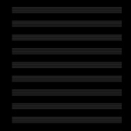

间奏
============================

|  |  |
| :--: | :-- |
| [ 间奏](https://emumo.xiami.com/album/2108390104) | **艺人**: [太一](../index.md) **语种**: 国语 **唱片公司**: 觉得文化 **发行时间**: 2020年04月26日 **专辑类别**: EP, 单曲 **专辑风格**: 国语流行 Mandarin Pop **播放数**: 62685 **收藏数**: 24 **评论数**: 18  |

## 简介

很久以前.  
《间奏》只写了四句.  
孤独对所有人来说本身便是一种常态.  
我一直都无法把它补完.  
甚至不屑于补完.  
如今.  
无关爱情么?  
也许人类需要每次醒来拥有着更多惊醒又摔碎的噩梦.  
此时.  
想把所有能触及的词汇都写进歌词里.  
却更感到无力.  
因为  
“突袭般的呆滞是无法被写出的.”  
  
人不是因为痛苦而长大的.  
是因为爱.  
  
疼会恨.  
爱会悔恨.  
  
——太一 

## 曲目

## 评论

|  |  |  |
| :-- | :-- | :-- |
|  [虾米用户](https://emumo.xiami.com/u/347633999) 我可是有强力后盾的人--... 2020-05-15 08:23 赞(0) 踩(0) | 
4月25日 在四月的尾巴上不知不觉的 十八岁到十九岁 我依旧废物一个  哎。
 |
|  [虾米用户](https://emumo.xiami.com/u/112296532) 我还没想好要写什么... 2020-05-07 03:23 赞(0) 踩(0) | 
好棒的风格
 |
|  [虾米用户](https://emumo.xiami.com/u/442376728) someone like... 2020-05-03 15:43 赞(0) 踩(0) | 
感同身受
 |
|  [虾米用户](https://emumo.xiami.com/u/2250493)  2020-05-02 12:50 赞(0) 踩(0) | 
第一遍聽著沒啥感覺，很容易會被忽略過去。 但多聽幾遍會上頭，哈哈哈 可收入自己的音樂歌單中慢慢循環播放。
 |
|  [虾米用户](https://emumo.xiami.com/u/351957685)  2020-05-01 18:26 赞(0) 踩(0) | 
超好听，超喜欢
 |
|  [虾米用户](https://emumo.xiami.com/u/351957685)  2020-05-01 18:24 赞(1) 踩(0) | 
大爱太一   
 |
|  [虾米用户](https://emumo.xiami.com/u/265154265) “希望大幸运术也能让我拥... 2020-05-01 14:42 赞(0) 踩(0) | 
爱太一爱的不得了了❤️
 |
|  [虾米用户](https://emumo.xiami.com/u/49927103) 克己 2020-04-30 20:25 赞(0) 踩(0) | 
挺好
 |
|  [虾米用户](https://emumo.xiami.com/u/303255395)  2020-04-28 20:37 赞(0) 踩(0) | 
好听
 |
|  [虾米用户](https://emumo.xiami.com/u/260245441) 我们会保护你们 2020-04-28 08:14 赞(0) 踩(0) | 
超好听
 |
|  [虾米用户](https://emumo.xiami.com/u/301208116) 垃圾 2020-04-27 10:02 赞(0) 踩(0) | 
回来啦
 |
|  [虾米用户](https://emumo.xiami.com/u/30934721) 哎呀！要开心 2020-04-27 08:18 赞(0) 踩(0) | 
开心，太一又回虾米
 |
|  [虾米用户](https://emumo.xiami.com/u/342802549)  2020-04-27 00:24 赞(0) 踩(0) | 
葡萄是酸的
 |
|  [虾米用户](https://emumo.xiami.com/u/420439122)  2020-04-27 00:20 赞(0) 踩(0) | 
好听的声音
 |
|  [虾米用户](https://emumo.xiami.com/u/355596645) SMTOWN 2020-04-26 22:44 赞(0) 踩(0) | 
一人一人落单， 一人一人吃饭。
 |
|  [虾米用户](https://emumo.xiami.com/u/318227448)  2020-04-26 22:20 赞(1) 踩(0) | 
太一的每一首歌似乎都有一个故事，都有一种心情，这首歌让我想哭
 |
|  [虾米用户](https://emumo.xiami.com/u/31531934) 恋の道に近道はない 2020-04-26 21:23 赞(0) 踩(0) | 

 |
|  [虾米用户](https://emumo.xiami.com/u/442244128) 铁锅炖大鹅！刀砍脆皮鸭！... 2020-04-26 21:17 赞(2) 踩(0) | 
是在真正的用心干净的做音乐不是浮华的商业大脑
 |
