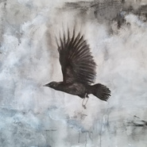
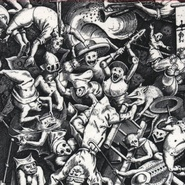
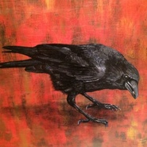
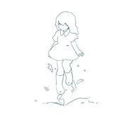
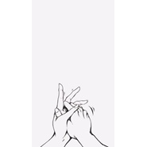

太一
============================

|  |  |
| :--: | :-- |
| [ 太一](https://i.xiami.com/weizhitaiyi) | **播放数**: 1159717 **粉丝数**: 3690 **评论数**: 159 **地区**: China 中国大陆 **风格**: 陷阱舞曲 Trap, 未来贝斯 Future Bass, 流行 Pop  |

## 档案

太一，全能音乐人、词曲唱作人、编曲制作人。  2  年内创作发行  110  多首原创音乐作品，被称为  “  音乐制作妖怪  ”  。  2019  年发行个人全创作专辑《第一次做人》收获众多好评，  “  第一次做人  ”  同名全国  7  站巡演票房口碑双丰收，同年斩获腾讯音乐人  “2019  年度音乐人  ”  。原创音乐《像暗杀似的绕到背后突然拥抱你》《  Lutra  》等作品成为全网大热歌曲。 
基本资料： 
姓名：太一 
出生地：北京 
民族：汉族 
职业：全能音乐人、词曲唱作人、编曲制作人 
代表作：《第一次做人》《玉》《刀，葵，童话》等 
演艺经历： 
2018  年  12  月参加腾讯视频《即刻电音》节目，原创歌曲《刀，葵，童话》惊艳全场； 
2019  年  2  月  23  日在北京举办个人首场音乐专场  “  太一  ·  升焰  ”  ； 
2019  年  5  月  25  日登上  “  麦田音乐节  ”  黄金时段舞台； 
2019  年  7  月  20  日在广州举办  “  大幸运术的礼物  ”  广州音乐专场，在腾讯音乐娱乐三平台同步直播在线人数超过  245  万； 
2019  年  10  月  -11  月太一连登  “  简单生活节  ”  西安、成都两站； 
2019  年  10  月  23  日太一个人全创作专辑《第一次做人》同名主打歌发布；  11  月  9  日专辑同名全国巡演  “  第一次做人  ”  在上海首站开跑，并陆续登陆武汉、成都、长沙、济南、深圳、北京等地； 
2019  年  12  月  23  日太一荣获腾讯音乐人  “2019  年度音乐人  ”  奖项。 
主要作品： 
热门歌曲： 
《玉》 
《第一次做人》 
《刀，葵，童话》 
《  Lutra  》 
《像暗杀似的绕到背后突然拥抱你》 
《  (  笑  )  》 
《负重一万斤长大》 
热门专辑： 
《第一次做人》 
《未妨惆怅是清狂》 
《生而为一》

## 专辑

| 名称 | 语种 | 唱片公司 | 发行时间 | 专辑类别 | 专辑风格 |
| :--: | :-- | :-- | :-- | :-- | :-- |
| [ 魔王与公主](./albums/5021349228.md) | 国语 | 觉得文化 | 2020年08月25日 | EP, 单曲 |  |
| [ 天生恶童 (Dazed China Version)](./albums/5020794770.md) | 其他 | 觉得文化 | 2020年06月01日 | EP, 单曲 |  |
| [ 乱弹国风](./albums/5020757595.md) | 国语 | 华声时代 | 2020年05月28日 | EP, 单曲 |  |
| [ 爱人Lover](./albums/5020681086.md) | 国语 | 制作家 | 2020年05月20日 | EP, 单曲 |  |
| [ 间奏](./albums/2108390104.md) | 国语 | 觉得文化 | 2020年04月26日 | EP, 单曲 | 国语流行 Mandarin Pop |
| [ 锵锵](./albums/2108349027.md) | 国语 | 觉得文化 | 2020年04月16日 | EP, 单曲 | 国语流行 Mandarin Pop |
| [ 第一次做人](./albums/2106059592.md) | 国语 | 觉得文化 | 2019年10月23日 | 录音室专辑 |  |
| [ 5级旋风iQOO Pro 5G 宣传曲](./albums/2105251048.md) | 国语 | 觉得文化 | 2019年09月16日 | EP, 单曲 |  |
| [ 夏](./albums/2103705451.md) | 国语 | 独立发行 | 2018年05月10日 | EP, 单曲 | 电子 Electronic, 嘻哈 Hip-Hop |
| [ 花烟](./albums/2103696728.md) | 国语 | 独立发行 | 2018年04月26日 | EP, 单曲 | 流行 Pop, 国语流行 Mandarin Pop, 民谣 Folk |
| [ 唐诗童话](./albums/2103696717.md) | 国语 | 独立发行 | 2018年04月19日 | 录音室专辑 | 流行说唱 Pop Rap, 流行 Pop, 流行舞曲 Dance-Pop |
| [ 暗淡的是你曾温柔的小动作](./albums/2103678211.md) | 国语 | 独立发行 | 2018年04月12日 | EP, 单曲 | 民谣 Folk, 流行 Pop, 民谣流行 Folk Pop |
| [ 全自动巴雷特](./albums/2103500415.md) | 国语 | 独立发行 | 2018年01月25日 | EP, 单曲 | 陷阱舞曲 Trap, 嘻哈 Hip-Hop, 电子 Electronic |
| [ 非歌曲（Instruments）](./albums/2103491945.md) | 国语 | 独立发行 | 2018年01月16日 | 合集, 杂锦 | 有声书 Audio Book, 胎教音乐 Prenatal Music, 另类唱作人 Alternative Singer-Songwriter |
| [ 紫巷](./albums/2103493869.md) | 国语 | 独立发行 | 2018年01月11日 | EP, 单曲 | 节奏布鲁斯 R&B, 爵士流行 Jazz Pop |
| [ 回旋中指.](./albums/2103493867.md) | 国语 | 独立发行 | 2018年01月04日 | EP, 单曲 | 电子 Electronic, 嘻哈 Hip-Hop, 摇滚 Rock & Roll |
| [ （笑）](./albums/2103464351.md) | 国语 | 独立发行 | 2017年12月28日 | EP, 单曲 | 流行 Pop, 国语流行 Mandarin Pop, 民谣 Folk |
| [ 像暗杀似的绕到背后突然拥抱你](./albums/2108214792.md) | 国语 | 觉得文化 | 2017年11月23日 | EP, 单曲 | 世界音乐 World Music |
| [ GengKaBoom](./albums/2102921821.md) | 国语 | 独立发行 | 2017年11月10日 | EP, 单曲 | 嘻哈 Hip-Hop, 陷阱说唱 Trap Rap, 陷阱舞曲 Trap |
| [ 我贰](./albums/2102905363.md) | 国语 | 独立发行 | 2017年11月03日 | EP, 单曲 | 流行 Pop, 民谣 Folk, 华语唱作人 Chinese Singer-Songwriter |
| [ 我](./albums/2102905352.md) | 国语 | 独立发行 | 2017年11月02日 | EP, 单曲 | 流行 Pop, 流行说唱 Pop Rap, 陷阱说唱 Trap Rap |
| [ 拜托别问](./albums/2102884702.md) | 国语 | 独立发行 | 2017年10月26日 | EP, 单曲 | 电子 Electronic, 电音流行 Electropop |
| [ 可以做我宠物吗](./albums/2102867732.md) | 国语 | 独立发行 | 2017年10月04日 | EP, 单曲 | 节奏布鲁斯 R&B, 爵士 Jazz |
| [ 呲牙的恶意好温暖](./albums/2102862450.md) | 国语 | 独立发行 | 2017年09月23日 | 录音室专辑 | 民谣 Folk, 陷阱舞曲 Trap |
| [ 库拉玛塔那库拉库库拉玛塔那](./albums/2102857784.md) | 国语 | 独立发行 | 2017年09月15日 | 录音室专辑 | 陷阱舞曲 Trap, 回响贝斯 Dubstep |
| [ 调大音量](./albums/2102820982.md) | 国语 | 独立发行 | 2017年08月27日 | 录音室专辑 | 缓拍 Downtempo, 民谣 Folk |
| [ 囍](./albums/2102812094.md) | 国语 | 独立发行 | 2017年08月10日 | 录音室专辑 | 缓拍 Downtempo, 流行说唱 Pop Rap, 陷阱舞曲 Trap |
| [ 英雄](./albums/2102771469.md) | 国语 | 独立发行 | 2017年06月24日 | 录音室专辑 | 回响贝斯 Dubstep, 缓拍 Downtempo, 独立民谣 Indie Folk |
| [ 谓之太一](./albums/2102765633.md) | 国语 | 独立发行 | 2017年06月14日 | EP, 单曲 | 缓拍 Downtempo, 独立民谣 Indie Folk, 陷阱舞曲 Trap |
| [ 甜氧](./albums/2102760781.md) | 国语 | 独立发行 | 2017年06月06日 | 录音室专辑 | 陷阱舞曲 Trap, 独立民谣 Indie Folk, 缓拍 Downtempo |
| [ 抹泪抹掉了皮就会有人看见你](./albums/2102739212.md) | 国语 | 独立发行 | 2017年04月27日 | EP, 单曲 | 电音流行 Electropop, 民谣流行 Folk Pop, 缓拍 Downtempo |
| [ 请死](./albums/2102738408.md) | 国语 | 独立发行 | 2017年04月26日 | 录音室专辑 | 缓拍 Downtempo, 陷阱舞曲 Trap, 民谣流行 Folk Pop |
| [ 这你也信](./albums/2102728748.md) | 国语 | 独立发行 | 2017年04月07日 | 录音室专辑 | 缓拍 Downtempo, 民谣流行 Folk Pop, 陷阱舞曲 Trap |
| [ 你疯了抱抱我](./albums/2102715704.md) | 国语 | 独立发行 | 2017年03月11日 | 录音室专辑 | 缓拍 Downtempo, 民谣流行 Folk Pop, 陷阱舞曲 Trap |
| [ 拨无因果](./albums/2102715695.md) | 国语 | 独立发行 | 2017年02月20日 | 录音室专辑 | 缓拍 Downtempo, 民谣流行 Folk Pop, 陷阱舞曲 Trap |
| [ 冬天到此为止](./albums/2102715686.md) | 国语 | 独立发行 | 2017年01月23日 | 录音室专辑 | 缓拍 Downtempo, 民谣流行 Folk Pop, 陷阱舞曲 Trap |
| [ 灰无常](./albums/2102659378.md) | 国语 | 独立发行 | 2016年10月29日 | EP, 单曲 |  |

## 评论

|  |  |  |  |
| :-- | :-- | :-- | :-- |
|  [虾米用户](https://emumo.xiami.com/u/446323503)  2021-01-28 14:35 赞(1) 踩(0) | 
特别喜欢你的声音 
 |
|  [虾米用户](https://emumo.xiami.com/u/376998464) Faith 2021-01-21 14:34 赞(0) 踩(0) | 
在异国他乡的我能听到你的歌曲让我想起了很多。谢谢你！加油！
 |
|  [虾米用户](https://emumo.xiami.com/u/423958940)  2021-01-04 10:13 赞(1) 踩(0) | 
华为上过来的
 |
| ⇒ |  [虾米用户](https://emumo.xiami.com/u/423958940)  2021-01-04 10:14 赞(0) 踩(0) | 
因为这两个音乐我都在用
 |
|  [虾米用户](https://emumo.xiami.com/u/362083809) 尘归尘 2020-12-28 12:32 赞(0) 踩(0) | 
补个爪，其实你知道的有很多喜欢你，就像我一样，并不会留下太多足迹，但是你必须要相信你永远都会有欣赏你的人在呢。
 |
|  [虾米用户](https://emumo.xiami.com/u/406631241) 桀骜不羁的温柔 2020-11-18 21:58 赞(1) 踩(0) | 
虾米的版权太少了&amp;ldquo;太一&amp;rdquo;只有三首歌鸭 多想听《我要我要坏》
 |
|  [虾米用户](https://emumo.xiami.com/u/418507280)  2020-11-15 01:43 赞(0) 踩(0) | 
听到&amp;quot;三月&amp;quot;那首，就愛上了....
 |
|  [虾米用户](https://emumo.xiami.com/u/4849372) 「无暇失恋」. 2020-10-11 23:38 赞(0) 踩(0) | 
宝藏. 被我发现你惹. 好特别的男孩子.音乐很棒. ///被你害羞的样子 软化.
 |
|  [虾米用户](https://emumo.xiami.com/u/444548793)  2020-10-02 22:09 赞(2) 踩(0) | 
啊啊啊啊啊虾米的笑还没有下架！
 |
|  [虾米用户](https://emumo.xiami.com/u/445176262) 唯之太一 2020-10-02 17:56 赞(1) 踩(0) | 
终于有空来瞎密看你啦
 |
|  [虾米用户](https://emumo.xiami.com/u/410212283)  2020-10-02 13:41 赞(3) 踩(0) | 
 &amp;quot;太一的温柔会发光&amp;quot;  
 |
|  [虾米用户](https://emumo.xiami.com/u/237522351) 今年主打   青峰绿  ... 2020-09-30 23:58 赞(1) 踩(0) | 
就来虾米看看  有没有你     
 |
|  [虾米用户](https://emumo.xiami.com/u/2796166) 最爱莫文蔚..... 2020-09-12 00:58 赞(3) 踩(0) | 
宝藏男孩~ 加油~不错哦！
 |
|  [虾米用户](https://emumo.xiami.com/u/332592007) 从没想过，最好的虾米要说... 2020-08-12 17:15 赞(4) 踩(0) | 
发现宝藏男孩了，又帅又稳
 |
|  [虾米用户](https://emumo.xiami.com/u/376629382) 山河远阔，人间烟火，无一... 2020-07-31 21:47 赞(3) 踩(0) | 
真的很喜欢你 
 |
|  [虾米用户](https://emumo.xiami.com/u/36496136) 草长莺飞，南来北往 2020-07-18 15:49 赞(3) 踩(0) | 
在B站准备看《万国志》，然后片头曲《破晓》惊了，真的非常出色。于是我动画片也不看了，跑来找他，虾米版权也太少了吧 ，练破晓都没有。太一的歌曲跨度很大，处处安排，每首歌都有一个世界在里边。每首歌都能感受到他的用心和充沛情感，很灵！希望他能保持这种音乐里的新鲜感和全心全意。
 |
|  [虾米用户](https://emumo.xiami.com/u/405273707) 我很好，很优秀，也值得 2020-06-13 21:07 赞(2) 踩(0) | 
太一好酷好酷！他对做音乐，还有面对问题时的态度，舞台上做音乐那种沉迷的样子真的好吸引我。果然，人在做自己喜欢的事情时是会发光的。我只在歌手上看过一次太一的舞台，但也就是一次真的吸引住我了。真的是宝藏！太一殿，就住下了，然后我陪着你一点一点发光，加油，太一，你一定会成为去掉点的玉，你也一定会成为群星皆环绕的太一殿下！
 |
|  [虾米用户](https://emumo.xiami.com/u/291547129) black is the... 2020-06-11 21:11 赞(1) 踩(0) | 
世界は私たちを歓迎しませんが、私と一緒に生きてください
 |
|  [虾米用户](https://emumo.xiami.com/u/242496586) 善听 2020-05-18 22:27 赞(3) 踩(0) | 
听着太一的歌 是会听着听着涌起特明的感受 那些经历的加成  抓住了内心
 |
|  [虾米用户](https://emumo.xiami.com/u/442919186)  2020-05-16 16:30 赞(1) 踩(0) | 
老大好可爱！！！
 |
|  [虾米用户](https://emumo.xiami.com/u/932368) 狸奴_贝贝 2020-05-02 17:00 赞(3) 踩(0) | 
什么时候白月光搞个完整版啊，超喜欢那个呢
 |
|  [虾米用户](https://emumo.xiami.com/u/418990097)  2020-04-28 10:45 赞(0) 踩(0) | 
宝藏男孩
 |
|  [虾米用户](https://emumo.xiami.com/u/27623985)  2020-04-25 18:29 赞(2) 踩(0) | 
不会在虾米发了，好伤心呀
 |
|  [虾米用户](https://emumo.xiami.com/u/32506216) 铜铃声声，声声凌统 2020-04-21 21:01 赞(0) 踩(0) | 
被你圈粉惹！！！！！你好可爱！！！！！！你是不是吃可爱多长大的啊！！！！咋这么可爱呐你！！！！！！！
 |
|  [虾米用户](https://emumo.xiami.com/u/331407416) winner&防弹家的小... 2020-04-18 20:02 赞(0) 踩(0) | 
太一值得我们去爱这个宝藏男孩真的很努力也很有魅力
 |
|  [虾米用户](https://emumo.xiami.com/u/2796166) 最爱莫文蔚..... 2020-04-17 00:41 赞(1) 踩(0) | 
加油，太一~~~
 |
|  [虾米用户](https://emumo.xiami.com/u/2796166) 最爱莫文蔚..... 2020-04-17 00:39 赞(0) 踩(0) | 
加油~~~~~太一~
 |
|  [虾米用户](https://emumo.xiami.com/u/2796166) 最爱莫文蔚..... 2020-04-17 00:39 赞(0) 踩(0) | 
加油~~~~~太一~
 |
|  [虾米用户](https://emumo.xiami.com/u/296091128) 请勿打扰，本人正在打扰别... 2020-04-14 03:42 赞(1) 踩(0) | 
火起来！被人发现！关注度直线上涨！宝藏男孩！！！好幸运啊啊啊啊！哈哈哈哈哈哈哈哈哈哈哈哈哈哈哈哈哈哈哈哈哈！被我发现了！！！不枉我来人间一遭！！！哈哈哈哈哈哈哈哈哈哈哈哈哈！！
 |
| ⇒ |  [虾米用户](https://emumo.xiami.com/u/296091128) 请勿打扰，本人正在打扰别... 2020-04-14 03:43 赞(0) 踩(0) | 
是心动呀！！！血槽已空！！！
 |
|  [虾米用户](https://emumo.xiami.com/u/317971707) 音乐，开心的时候入耳，伤... 2020-04-10 22:12 赞(1) 踩(0) | 
感觉发现了一个宝藏。
 |
|  [虾米用户](https://emumo.xiami.com/u/401394612)  2020-04-08 16:20 赞(4) 踩(0) | 
有个问题一直想问，太一是不是有个弟弟叫太二？ 
 |
|  [虾米用户](https://emumo.xiami.com/u/40467004)   2020-04-04 20:40 赞(0) 踩(0) | 
太一真是一个太太太有趣的宝藏男孩了！！
 |
|  [虾米用户](https://emumo.xiami.com/u/40467004)   2020-04-04 20:04 赞(0) 踩(0) | 
宝藏！！！
 |
|  [虾米用户](https://emumo.xiami.com/u/441950358)  2020-04-03 20:45 赞(1) 踩(0) | 
感觉太一的音乐是电音界兼流行界的一股清流，好听！
 |
|  [虾米用户](https://emumo.xiami.com/u/441861284)  2020-03-30 17:41 赞(0) 踩(0) | 
太一!
 |
|  [虾米用户](https://emumo.xiami.com/u/166302128) 冷冷清清的风风火火. 2020-03-29 20:14 赞(5) 踩(0) | 
介绍上是说在网易云发歌，以后不在虾米发了吗 
 |
| ⇒ |  [虾米用户](https://emumo.xiami.com/u/55276548)  2020-04-13 00:34 赞(0) 踩(0) | 
放心，阿里收购了网易云。
 |
|  [虾米用户](https://emumo.xiami.com/u/166302128) 冷冷清清的风风火火. 2020-03-29 17:41 赞(0) 踩(0) | 
虾米竟然有太一！！！宝藏歌手
 |
|  [虾米用户](https://emumo.xiami.com/u/423373698) 浅望幸福，不写忧伤， 红... 2020-03-29 00:31 赞(2) 踩(0) | 
今天看了歌手过来，听了你的歌后，粉了粉了！不过你的粉丝有点少，希望越来越多的人喜欢你的歌，加油！
 |
|  [虾米用户](https://emumo.xiami.com/u/441813347) 碎至茉莉谓之你 2020-03-28 21:57 赞(0) 踩(0) | 
爱您
 |
|  [虾米用户](https://emumo.xiami.com/u/440686695) 积极不起来的日子，我没什... 2020-03-28 01:33 赞(0) 踩(0) | 
你就是玉 
 |
|  [虾米用户](https://emumo.xiami.com/u/440686695) 积极不起来的日子，我没什... 2020-03-28 01:25 赞(0) 踩(0) | 
你很棒！！！
 |
|  [虾米用户](https://emumo.xiami.com/u/728392) SHCJ。而立。 2020-03-27 22:43 赞(37) 踩(0) | 
2020到今天为止，最值得开心的就是发现了太一。我们这群三十代的人如今都奔波在生活中，不知道三十代的朋友能不能体会到这种开心：连着几天开车都是全程听这张专辑，为什么会反复的听呢？因为我在这张专辑里竟然找到了当年听杰伦从2000年到2007年间的几张专辑的感觉。不是说作品相似，而是说作品的编曲、配器、声部组合、音效、对音乐的自我理解和呈现&amp;hellip;各方面，和当年的杰伦太像了！太像了啊！让我这个&amp;ldquo;老人&amp;rdquo;真的忍不住雀跃欢呼。2010年后的歌手都再也不能经历唱片界的黄金年代，太多人被狠狠的淹没在时代的浪潮中，但我觉得，太一或许会用自己的力量在现在至未来的华语流行乐坛中脱颖而出，看好且祝福。
 |
|  [虾米用户](https://emumo.xiami.com/u/354840625) 我还没想好要写什么... 2020-03-27 10:13 赞(1) 踩(0) | 
你很棒！！！
 |
|  [虾米用户](https://emumo.xiami.com/u/430456758)  2020-03-24 12:59 赞(0) 踩(0) | 
中国需要你这样做音乐的人火起来
 |
|  [虾米用户](https://emumo.xiami.com/u/376679831)  2020-03-22 11:31 赞(1) 踩(0) | 
我2G网了，太一上歌手啦！！！
 |
|  [虾米用户](https://emumo.xiami.com/u/432734019)  2020-03-22 00:19 赞(0) 踩(0) | 
好听
 |
|  [虾米用户](https://emumo.xiami.com/u/47065698) 什么都能戒，音乐不行！ 2020-03-21 22:57 赞(1) 踩(0) | 
喜欢喜欢喜欢
 |
|  [虾米用户](https://emumo.xiami.com/u/47065698) 什么都能戒，音乐不行！ 2020-03-21 22:57 赞(1) 踩(0) | 
看了当打之年才发现高手在民间啊
 |
|  [虾米用户](https://emumo.xiami.com/u/47065698) 什么都能戒，音乐不行！ 2020-03-21 22:57 赞(1) 踩(0) | 
快来找他签约，这是个即将要火的歌手
 |
|  [虾米用户](https://emumo.xiami.com/u/286785478) 我还没想好要写什么... 2020-03-21 13:20 赞(1) 踩(0) | 
在酷狗！！！幸好我app多！
 |
|  [虾米用户](https://emumo.xiami.com/u/350654379)  2020-03-20 23:53 赞(0) 踩(0) | 
啊啊啊啊啊啊啊啊啊！！突然被圈粉，很可爱的小男生呀
 |
|  [虾米用户](https://emumo.xiami.com/u/49927103) 克己 2020-03-20 23:11 赞(1) 踩(0) | 
100很帅气 很棒 加油
 |
|  [虾米用户](https://emumo.xiami.com/u/85371808)   2020-03-20 21:52 赞(0) 踩(0) | 
爱！！！！！！！！
 |
|  [虾米用户](https://emumo.xiami.com/u/10354415) 天地有时尽，宇宙亦轮回 2020-03-20 21:42 赞(1) 踩(0) | 
刚听完歌手第七期，喜欢上了，来关注一波，本来我在虾米是只听金属来着
 |
| ⇒ |  [虾米用户](https://emumo.xiami.com/u/423373698) 浅望幸福，不写忧伤， 红... 2020-03-29 00:28 赞(0) 踩(0) | 
看到你的评论，先是一愣，我以为是我的号，仔细看了一下内容和头像，发现不是。我常用的名字也是轮回，有缘
 |
| ⇒ |  [虾米用户](https://emumo.xiami.com/u/10354415) 天地有时尽，宇宙亦轮回 2020-04-05 14:57 赞(0) 踩(0) | 
<q><b>我在等.说：</b></q>
 |
|  [虾米用户](https://emumo.xiami.com/u/3910130) 我还没想好要写什么... 2020-03-20 21:06 赞(0) 踩(0) | 
这家伙有个自言自语的趣多多多重人格 
 |
|  [虾米用户](https://emumo.xiami.com/u/441193605)  2020-03-08 10:20 赞(2) 踩(0) | 
华为自带的系统音乐软件竟然全有，太一的歌都能找到，太赞了
 |
|  [虾米用户](https://emumo.xiami.com/u/441108612) 一个一点都不可爱的乙太. 2020-03-05 09:48 赞(0) 踩(0) | 
一起登顶.
 |
|  [虾米用户](https://emumo.xiami.com/u/318627388) 是波澜或是惊涛骇浪，最终... 2020-02-29 11:06 赞(0) 踩(0) | 
回来了？！
 |
|  [虾米用户](https://emumo.xiami.com/u/435283406)  2020-01-07 20:32 赞(0) 踩(0) | 
等你呀
 |
|  [虾米用户](https://emumo.xiami.com/u/187697037) 天长地久金茶蛋♡九锥盛世 2019-12-08 21:49 赞(18) 踩(0) | 
很久没上网易 发现太一以前的歌没了 却发现虾米有 太一！！！！
 |
| ⇒ |  [虾米用户](https://emumo.xiami.com/u/326264927)  2020-03-22 23:21 赞(0) 踩(0) | 
nice
 |
|  [虾米用户](https://emumo.xiami.com/u/328390946) 我是萬年的四月天 2019-11-23 18:30 赞(1) 踩(0) | 
太一啊 拜托继续继续更好更好的生活吧！！
 |
|  [虾米用户](https://emumo.xiami.com/u/418644248)  2019-10-28 19:45 赞(0) 踩(0) | 
一定要坚持自我啊。
 |
|  [虾米用户](https://emumo.xiami.com/u/199828160)  2019-10-20 20:16 赞(1) 踩(0) | 
一起逃命来的
 |
|  [虾米用户](https://emumo.xiami.com/u/430781355)  2019-10-18 06:58 赞(2) 踩(0) | 
请继续任性.继续疯狂. 继续嚣张. 这才是我横冲直撞爱你的模样.. 一切如风..未来马上会出现.那些流言. 都是你我脚下的苟且. 我要和你登顶.没错.
 |
|  [虾米用户](https://emumo.xiami.com/u/429548350)  2019-10-12 20:32 赞(0) 踩(0) | 
一直一直 陪着你哦
 |
|  [虾米用户](https://emumo.xiami.com/u/429719403)  2019-09-12 21:09 赞(0) 踩(0) | 
太一!!！！！
 |
|  [虾米用户](https://emumo.xiami.com/u/9239226)   2019-08-19 22:04 赞(2) 踩(0) | 
啥时候能买来版权咧
 |
|  [虾米用户](https://emumo.xiami.com/u/315388654)  2019-08-15 13:20 赞(1) 踩(0) | 
太一鸽鸽…不管是生而为一还是生而为乙我们都有同一个闪亮亮的目标“一起登顶！”
 |
|  [虾米用户](https://emumo.xiami.com/u/427576020) 我还没想好要写什么... 2019-07-21 17:01 赞(2) 踩(0) | 
只有三首[大哭]
 |
|  [虾米用户](https://emumo.xiami.com/u/244776664)  2019-07-18 00:05 赞(3) 踩(0) | 
网易云的版权也没了
 |
|  [虾米用户](https://emumo.xiami.com/u/322404572)  2019-07-16 14:15 赞(2) 踩(0) | 
一直追随太一
 |
|  [虾米用户](https://emumo.xiami.com/u/427069517)  2019-07-09 11:16 赞(0) 踩(0) | 
老大！！阿柔来晚了
 |
|  [虾米用户](https://emumo.xiami.com/u/427069517)  2019-07-09 11:12 赞(1) 踩(0) | 
太一！！
 |
|  [虾米用户](https://emumo.xiami.com/u/331867300)  2019-07-04 11:23 赞(0) 踩(0) | 
大幸运术
 |
|  [虾米用户](https://emumo.xiami.com/u/426274527) 我爱听我喜欢听的~ 2019-06-21 07:26 赞(1) 踩(0) | 
即使你不在瞎密了，我也会关注你太一，答应我，一定要好好的啊~
 |
|  [虾米用户](https://emumo.xiami.com/u/2662856) 听什么音乐也不代表你比别... 2019-05-09 09:08 赞(4) 踩(0) | 
艺人介绍有点意思
 |
|  [虾米用户](https://emumo.xiami.com/u/318627388) 是波澜或是惊涛骇浪，最终... 2019-05-04 14:26 赞(0) 踩(0) | 
我想知道简介说的是什么东西？我怎么不太看得懂... 
 |
| ⇒ |  [虾米用户](https://emumo.xiami.com/u/211959342)  2019-05-05 13:54 赞(0) 踩(0) | 
怎么感觉有点污
 |
| ⇒ |  [虾米用户](https://emumo.xiami.com/u/99201456) 一家人就系要齐齐整整 2019-05-13 20:47 赞(0) 踩(0) | 
应该长大了就懂了
 |
|  [虾米用户](https://emumo.xiami.com/u/197493114) 如自由无尽头 2019-04-04 19:13 赞(0) 踩(0) | 
来辽
 |
|  [虾米用户](https://emumo.xiami.com/u/214521910)  2019-03-30 03:49 赞(1) 踩(0) | 
发现宝藏5天了。诶嘿嘿(๑•ั็ω•็ั๑)宝藏!大宝藏!
 |
|  [虾米用户](https://emumo.xiami.com/u/421522275) 顾凯 宝宝 [许你大爷！... 2019-03-27 18:07 赞(0) 踩(0) | 
太一 为什么 为什么这里只有三首歌！？
 |
|  [虾米用户](https://emumo.xiami.com/u/265154265) “希望大幸运术也能让我拥... 2019-03-24 21:11 赞(1) 踩(0) | 
太一万岁
 |
|  [虾米用户](https://emumo.xiami.com/u/354672669)  2019-03-17 02:17 赞(0) 踩(0) | 
太一，加油噢
 |
|  [虾米用户](https://emumo.xiami.com/u/419280218)  2019-03-07 18:45 赞(0) 踩(0) | 
太一必红！
 |
|  [虾米用户](https://emumo.xiami.com/u/50820292) 常常在线 2019-03-01 00:42 赞(0) 踩(0) | 
好听
 |
|  [虾米用户](https://emumo.xiami.com/u/27047624)  2019-02-27 20:07 赞(3) 踩(0) | 
啊虾米只有三首太一的歌吗
 |
| ⇒ |  [虾米用户](https://emumo.xiami.com/u/305244293) 像暗杀似的绕到背后突然拥... 2019-03-05 14:43 赞(0) 踩(0) | 
他下架了
 |
| ⇒ |  [虾米用户](https://emumo.xiami.com/u/256710312) 览洲 2019-03-26 23:12 赞(0) 踩(0) | 
<q><b>情绪战争说：</b></q>
 |
| ⇒ |  [虾米用户](https://emumo.xiami.com/u/52581211)  2019-11-13 06:24 赞(0) 踩(0) | 
<q><b>揽洲说：</b></q>
 |
|  [虾米用户](https://emumo.xiami.com/u/108525466) 多多用功 别发脾气 好好... 2019-02-27 14:22 赞(0) 踩(0) | 
只剩下三首了。。。哭唧唧。敲爱那些消失的歌啊！！！！
 |
|  [虾米用户](https://emumo.xiami.com/u/306267136) forever 2019-02-25 23:37 赞(0) 踩(0) | 
太一必红！！
 |
|  [虾米用户](https://emumo.xiami.com/u/189729428) 希望遇见有趣的人，过有趣... 2019-02-24 10:59 赞(1) 踩(0) | 
丑蜥蜴很好听呀，没有没有，
 |
|  [虾米用户](https://emumo.xiami.com/u/9589589) Light on 2019-02-22 23:38 赞(1) 踩(0) | 
请在虾米发更多的歌吧！
 |
|  [虾米用户](https://emumo.xiami.com/u/313257865) Lay and Carr... 2019-02-20 02:09 赞(4) 踩(0) | 
希望虾米给力一些 补一补太一的歌
 |
|  [虾米用户](https://emumo.xiami.com/u/77720438) 努力努力再努力x 2019-01-16 09:53 赞(3) 踩(0) | 
太一 乙太都要好好的
 |
|  [虾米用户](https://emumo.xiami.com/u/288940175) 打死也不吃香菜 2019-01-01 12:51 赞(4) 踩(0) | 
太一的歌都没了？!
 |
| ⇒ |  [虾米用户](https://emumo.xiami.com/u/77720438) 努力努力再努力x 2019-01-16 09:52 赞(0) 踩(0) | 
网易云有
 |
|  [虾米用户](https://emumo.xiami.com/u/409358477)  2018-12-25 21:07 赞(1) 踩(0) | 

 |
|  [虾米用户](https://emumo.xiami.com/u/98853832)  2018-12-23 13:21 赞(1) 踩(0) | 
加油。。。
 |
|  [虾米用户](https://emumo.xiami.com/u/2548738) 爱音乐，爱游戏~ 2018-12-22 23:18 赞(1) 踩(0) | 
喜欢
 |
|  [虾米用户](https://emumo.xiami.com/u/324160767)  2018-12-21 21:11 赞(2) 踩(0) | 
超优秀！加油鸭！
 |
|  [虾米用户](https://emumo.xiami.com/u/214972591) ≧∇≦ 2018-12-21 20:20 赞(1) 踩(0) | 
没办法哟，但是也不需要放大来看呀
 |
|  [虾米用户](https://emumo.xiami.com/u/10902092) 今天的 屏幕 依旧很干净 2018-12-18 00:10 赞(2) 踩(0) | 
从 即刻电音过来的  你真的很棒！很有才华！
 |
|  [虾米用户](https://emumo.xiami.com/u/258136397) 我还没想好要写什么... 2018-12-16 21:09 赞(2) 踩(0) | 
宝藏男孩 我超喜欢你的音乐
 |
|  [虾米用户](https://emumo.xiami.com/u/356429601) 假装可以共度余生 2018-12-16 19:02 赞(1) 踩(0) | 
来看你
 |
|  [虾米用户](https://emumo.xiami.com/u/344661676) 好好拉屎 天天拉屎 2018-12-16 14:50 赞(1) 踩(0) | 
有意思有意思
 |
|  [虾米用户](https://emumo.xiami.com/u/159140) 我还没想好要写什么... 2018-12-15 23:59 赞(3) 踩(0) | 
看着节目就摸过来啦，必须得红
 |
|  [虾米用户](https://emumo.xiami.com/u/331186043) 没有光明是不幸的吗，需要... 2018-12-05 22:08 赞(2) 踩(0) | 
就是这样的，所有人都会成长，都必定会成为所谓世俗的模样
 |
|  [虾米用户](https://emumo.xiami.com/u/337254352)  2018-11-21 23:51 赞(1) 踩(0) | 
暴风哭泣 别走啊
 |
|  [虾米用户](https://emumo.xiami.com/u/122019540)  2018-11-21 13:01 赞(3) 踩(0) | 
所以你把歌全部下了??
 |
|  [虾米用户](https://emumo.xiami.com/u/52300480)  2018-11-20 23:26 赞(2) 踩(0) | 
******
 |
|  [虾米用户](https://emumo.xiami.com/u/108525466) 多多用功 别发脾气 好好... 2018-09-29 19:28 赞(3) 踩(0) | 
何以解忧愁，只有太一能.
 |
|  [虾米用户](https://emumo.xiami.com/u/108525466) 多多用功 别发脾气 好好... 2018-09-13 12:58 赞(0) 踩(0) | 
每天日常表白小哥哥，奈斯（求混眼熟）.
 |
|  [虾米用户](https://emumo.xiami.com/u/108525466) 多多用功 别发脾气 好好... 2018-09-13 00:08 赞(0) 踩(0) | 
遇到你才知道听着一个人的歌睡觉是什么感觉，后悔没早点遇到你.
 |
|  [虾米用户](https://emumo.xiami.com/u/54378601) 以你的陌生 2018-08-28 04:27 赞(9) 踩(0) | 
内容已删除
 |
| ⇒ |  [虾米用户](https://emumo.xiami.com/u/54378601) 以你的陌生 2018-08-28 04:46 赞(0) 踩(0) | 
翻了下微博原来真滴就是vocal！
 |
| ⇒ |  [虾米用户](https://emumo.xiami.com/u/47521642) 啊  吗的 2018-08-30 20:58 赞(0) 踩(0) | 
是一个人
 |
| ⇒ |  [虾米用户](https://emumo.xiami.com/u/427069517)  2019-07-09 11:10 赞(0) 踩(0) | 
是的是一个人！！！
 |
| ⇒ |  [虾米用户](https://emumo.xiami.com/u/265154265) “希望大幸运术也能让我拥... 2019-11-01 23:30 赞(0) 踩(0) | 
就是一个人呢
 |
|  [虾米用户](https://emumo.xiami.com/u/255676624)  2018-08-26 22:17 赞(0) 踩(0) | 
日推了一首，淘到宝了 
 |
|  [虾米用户](https://emumo.xiami.com/u/108525466) 多多用功 别发脾气 好好... 2018-08-24 16:02 赞(1) 踩(0) | 
太一小哥哥什么时候发新歌啊，着急.
 |
|  [虾米用户](https://emumo.xiami.com/u/52300480)  2018-08-23 21:30 赞(1) 踩(0) | 
******
 |
|  [虾米用户](https://emumo.xiami.com/u/197481148) 代马望北  狐死首丘 2018-08-22 12:43 赞(0) 踩(0) | 
谢谢太一   让我在这个世间找到我自己
 |
|  [虾米用户](https://emumo.xiami.com/u/300881048) 这里就像地狱和天堂  听... 2018-08-06 00:46 赞(4) 踩(0) | 
我觉得听你歌的人，不管听没听懂，都肯定是想了解你，我觉得一定会有更多人喜欢你，喜欢你的曲风，喜欢神明的太一，喜欢感觉有故事的太一。而且我也开始面临人生中挺重要的决定了，每次心情难过都想听你的歌哈，感觉就会有不同的感触，这个决定，我的朋友都后悔了，只有我一个人默默在坚持我想改变他们的看法，那也会是一条出路我会走出来给他们看，不过幸亏有一个人还默默陪着我，她也放弃了很多，很感谢她还陪着我❤晚安太一
 |
|  [虾米用户](https://emumo.xiami.com/u/108525466) 多多用功 别发脾气 好好... 2018-07-27 18:50 赞(0) 踩(0) | 
小哥哥什么时候再发新歌啊，超期待！！
 |
|  [虾米用户](https://emumo.xiami.com/u/37709442)   2018-07-22 22:43 赞(0) 踩(0) | 
耳朵爆炸啦 太太太好听啦
 |
|  [虾米用户](https://emumo.xiami.com/u/108525466) 多多用功 别发脾气 好好... 2018-07-16 23:08 赞(3) 踩(0) | 
想知道小哥哥的QQ或者是微信（捂脸）（*/&amp;nabla;＼*）
 |
|  [虾米用户](https://emumo.xiami.com/u/108525466) 多多用功 别发脾气 好好... 2018-07-16 23:00 赞(2) 踩(0) | 
小哥哥的歌超级好听啊，支持，小哥哥必火！！
 |
|  [虾米用户](https://emumo.xiami.com/u/300881048) 这里就像地狱和天堂  听... 2018-06-24 23:32 赞(2) 踩(0) | 
一周七天，一丧一整天，嗯今天很丧，莫名其妙不开心觉得自己没必要佯装开心啦，嗯没人心疼你啦，没人会陪你啦嗯太一晚安
 |
|  [虾米用户](https://emumo.xiami.com/u/300881048) 这里就像地狱和天堂  听... 2018-06-21 23:52 赞(2) 踩(0) | 
突然发现啊，人就是这样莫名其妙的不开心，你会不会有这样的心情呢？你的歌好特别的啊，很治愈啊，最近不开心，听你的歌开心起来哈哈哈嗝希望明天好一点。晚安，神一样的太一❤
 |
|  [虾米用户](https://emumo.xiami.com/u/300881048) 这里就像地狱和天堂  听... 2018-06-20 00:50 赞(3) 踩(0) | 
谢谢你啊，让我有勇气深夜哭了出来，十几的傻瓜，我懂什么呀，为什么还这么幼稚啊，希望你真的可以像神一样嗯谢谢你，十几岁的傻瓜别怕热量多吃沙拉嗯加油谢谢你你会越来越好的谢谢你晚安你的新的小迷妹.
 |
|  [虾米用户](https://emumo.xiami.com/u/16047370)  2018-05-15 19:46 赞(2) 踩(0) | 
等我疗伤疗好了再听
 |
|  [虾米用户](https://emumo.xiami.com/u/343095747)  2018-05-07 20:03 赞(2) 踩(0) | 
镜子
 |
|  [虾米用户](https://emumo.xiami.com/u/10222359)  2018-05-07 17:12 赞(2) 踩(0) | 
很好听呀  加油
 |
|  [虾米用户](https://emumo.xiami.com/u/345266333) 我还没想好要写什么... 2018-04-13 12:00 赞(2) 踩(0) | 
噗 歌名好有毒好听～谢谢分享
 |
|  [虾米用户](https://emumo.xiami.com/u/352478428) 想好了又要怎么说… 2018-04-08 00:21 赞(50) 踩(0) | 
预言一下 发现宝藏太一两周 等宝藏被发现 爱侬
 |
| ⇒ |  [虾米用户](https://emumo.xiami.com/u/409884970) 人望山 鱼窥荷 2019-01-09 04:07 赞(0) 踩(0) | 
9个月后 宝藏男孩被越来越多的人发现了
 |
|  [虾米用户](https://emumo.xiami.com/u/8062047) 条条大路通罗马 2018-04-07 23:30 赞(8) 踩(0) | 
内容已删除
 |
| ⇒ |  [虾米用户](https://emumo.xiami.com/u/256710312) 览洲 2019-05-20 22:25 赞(0) 踩(0) | 
无神教不懂
 |
| ⇒ |  [虾米用户](https://emumo.xiami.com/u/426420612) 千里星河 太一值得 2019-06-23 22:29 赞(0) 踩(0) | 
太一所做的一切努力绝对配得上叫太一（笑）.吾王太一.太一万岁.
 |
|  [虾米用户](https://emumo.xiami.com/u/305244293) 像暗杀似的绕到背后突然拥... 2018-03-24 21:48 赞(21) 踩(0) | 
希望你红
 |
|  [虾米用户](https://emumo.xiami.com/u/38964100)  2018-03-23 09:23 赞(4) 踩(0) | 
好听
 |
|  [虾米用户](https://emumo.xiami.com/u/122019540)  2018-02-14 05:18 赞(4) 踩(0) | 
你为啥子这么牛逼
 |
|  [虾米用户](https://emumo.xiami.com/u/7448001) 订阅号：恩赐与勇气 2018-01-22 22:13 赞(3) 踩(0) | 
不错，兄弟，风格挺多
 |
|  [虾米用户](https://emumo.xiami.com/u/5098357)  2017-10-05 09:37 赞(4) 踩(0) | 
呀觉得唱慢歌的时候声音有些像朴树
 |
|  [虾米用户](https://emumo.xiami.com/u/40624265) 野生嗲b 2017-07-14 13:44 赞(4) 踩(0) | 
你女朋友真的好他妈可爱
 |
| ⇒ |  [虾米用户](https://emumo.xiami.com/u/201745794)  2019-07-16 21:54 赞(0) 踩(0) | 
天呐~这么可爱的小姐姐吗！！
 |
|  [虾米用户](https://emumo.xiami.com/u/1765259) 抽你抽的烟 2017-07-01 16:31 赞(3) 踩(0) | 
坐等你火。这次寻光发现的宝藏。
 |
|  [虾米用户](https://emumo.xiami.com/u/197102267) 比心 2017-06-03 20:58 赞(3) 踩(0) | 
特别喜欢你女朋友和你  赞哦  加油
 |
| ⇒ |  [虾米用户](https://emumo.xiami.com/u/404337452)  2018-09-17 21:50 赞(0) 踩(0) | 
小姐姐，你还记得他的女朋友是谁吗，我找了半天了
 |
|  [虾米用户](https://emumo.xiami.com/u/3054590) 爱与和平！ 2017-06-02 22:38 赞(1) 踩(0) | 
炸！你不火，天理难容！我又说一遍！
 |
|  [虾米用户](https://emumo.xiami.com/u/247987705)   2017-03-18 15:45 赞(44) 踩(0) | 
&amp;middot;
 |
| ⇒ |  [虾米用户](https://emumo.xiami.com/u/441167480) 将所有温柔设为仅你可见  2020-03-31 08:55 赞(0) 踩(0) | 
.......
 |
| ⇒ |  [虾米用户](https://emumo.xiami.com/u/647365)    2020-04-05 09:26 赞(0) 踩(0) | 
喜欢你的音乐，好多年没这么喜欢过的感觉。
 |
| ⇒ |  [虾米用户](https://emumo.xiami.com/u/270078007) 我见青山多妩媚，料青山见... 2020-10-29 16:18 赞(0) 踩(0) | 
哇   抓到真人了
 |
