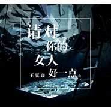
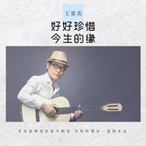
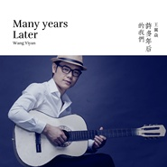
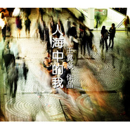

王翼焱
============================

|  |  |
| :--: | :-- |
| [ 王翼焱](https://i.xiami.com/wyy) | **地区**: China 中国大陆 **风格**: 国语流行 Mandarin Pop, 民谣流行 Folk Pop, 独立民谣 Indie Folk, 流行摇滚 Pop Rock, 城市民谣 Urban Folk **播放数**: 3199519 **粉丝数**: 302 **评论数**: 4  |

## 档案

王翼焱 
原名 王钧 
曾用艺名：君臣 
原创音乐唱作人 
以创作歌手身份出道，2006年创作奥运歌曲《2008相逢北京》荣获第三届奥运歌曲征集评选十大奥运金曲奖，参加上海东方卫视“我型我秀”音乐比赛获天津赛区十强，参赛原创作品《因为有你》成为当时热门原创单曲，同年凭借原创单曲《因为有你》入围CCTV中国音乐电视歌坛十大新人获16名，于2008年发行首张个人原创EP《日月情歌》，2008年与词作家乔鲸合作为青岛奥帆委创作歌曲《离不开你》并获得奥帆委歌曲征集十大优秀歌曲奖。 
创作歌曲三百余首，创作风格涵盖流行、民族，作品曾被：林志炫、解晓东、尚雯婕、庞龙、腾格尔、成方圆、常思思、李昱和、张美晨、张书姚、CD哥龙飞、双子组合等歌手演唱。 
2010年将工作重心转移幕后为歌手扬墨量身打造个性单曲《哪儿凉快哪儿呆》在网络走红 
2011年 为李昱和打造海峡两岸歌曲.《思念如海》，歌曲MV在中央电视台及各地方卫视展播 
为李昱和打造时尚新民歌《村庄梦》，并登上央视栏目《我要上春晚》，获第四轮第七场人气王票选第二名。 
为网络歌手苏小红打造神曲《老公你真讨厌》 
2012年成立中鹰星宇国际文化传媒（北京）有限公司推出网络歌曲《微信微信我爱你》 
推出“男人三十组合”《妈妈说你都三十了》 
为浙江乐清市创作城市旅游形象歌曲《乐清湾之恋》（作曲）、. 
为儿童公益电雏影鹰创作主题曲《让爱飞翔》（作曲） 
受邀为中国伦理学会慈孝文化委员会创作孝道歌曲《中华孝道》（该作品荣获河南省委宣传部孝道文化歌曲银奖）， 
为海政文工团著名青年歌唱家常思思创作新民歌《雪花姑娘》、《青春的花样年华》（作曲） 
为民歌新生代歌手张美晨创作歌曲《美丽大中国》、《美好的时代》、《和和美美》、《老地方》、《幸福歌》（作曲）等，歌曲MV均于央视播出， 
2014年受邀参加北京申办2022年冬奥会申办歌曲创作论坛 
年底在湖北荆州古城成立“楚美文化传播有限公司”致力于发扬荆楚文化。 
2015年作品《美丽大中国》入选由中宣部组织开展CCTV-3天天把歌唱栏目及全国各卫视配合播出的“中国梦歌曲展播” 
为男人三十组合创作《我心如莲》、《致我们回不去的青春》 
为青年歌唱家李昱和创作献礼劳动节歌曲《快乐的你》、中秋歌曲《月儿圆家团圆》、一路一带歌曲《与梦同路》 
为歌手张书姚打造发行个人“三天：天黑、天亮、天晴”慨念专辑《天黑了你还记得我吗》 
发行个人原创EP 《何以笙箫默记》 
为荆州电视台《舞动荆州栏目》创作主题曲《妈妈今天不见了》 
为荆州电视台中秋晚会创作主题曲《明月今圆》 
为李昱和乐清个人演唱会打造歌曲《受命治水，答友人》 
为知名广告模特“吕梓铷”打造发行个人首张EP《一个人一颗心一个家》 
曾获奖项: 
2006年 荣获“第三届奥运歌曲征集”十大奥运金曲奖 获奖作品《2008相逢北京》 
2006年 CCTV歌坛十大新人16强 代表作品《因为有你》 
2006年 雪碧我型我秀天津赛区10强 代表作品《因为有你》 
2008年 荣获青岛奥帆委优秀歌曲奖 获奖作品《离不开你》 
2008年 荣获“第五届诸葛亮杯”2008最具实力男歌手奖 
2014年 作品《中华孝道》荣获河南省委宣传部颁发的“中国梦.敬老情”歌曲评选银奖

## 专辑

| 名称 | 语种 | 唱片公司 | 发行时间 | 专辑类别 | 专辑风格 |
| :--: | :-- | :-- | :-- | :-- | :-- |
| [ 恋爱排骨汤](./albums/5021224901.md) | 国语 | 塑星文化 | 2020年08月07日 | EP, 单曲 | 流行 Pop |
| [ 小执着](./albums/5021178413.md) | 国语 | 塑星文化 | 2020年07月31日 | EP, 单曲 | 国语流行 Mandarin Pop |
| [ 请对你的女人好一点](./albums/5021155012.md) | 国语 | 塑星文化 | 2020年07月25日 | EP, 单曲 | 国语流行 Mandarin Pop |
| [ 请对你的女人好一点（独白版）](./albums/5021149513.md) | 国语 | 塑星文化 | 2020年07月25日 | EP, 单曲 | 国语流行 Mandarin Pop |
| [ 人生难得是朋友](./albums/5021072992.md) | 国语 | 塑星文化 | 2020年07月18日 | EP, 单曲 | 国语流行 Mandarin Pop |
| [ 遗世梅花](./albums/5020883994.md) | 国语 | 塑星文化 | 2020年06月18日 | EP, 单曲 | 国语流行 Mandarin Pop |
| [ 好好珍惜今生的缘](./albums/5020844457.md) | 国语 | 塑星文化 | 2020年06月12日 | EP, 单曲 | 国语流行 Mandarin Pop |
| [ 改写人生（DJ版）](./albums/5020793986.md) | 国语 | 塑星文化 | 2020年06月04日 | EP, 单曲 | 国语流行 Mandarin Pop |
| [ 催泪情书](./albums/5020704276.md) | 国语 | 塑星文化 | 2020年05月27日 | EP, 单曲 | 国语流行 Mandarin Pop |
| [ 改写人生](./albums/5020655117.md) | 国语 | 塑星文化 | 2020年05月24日 | EP, 单曲 | 流行 Pop |
| [ 许多年后的我们](./albums/2108409005.md) | 国语 | 塑星文化 | 2020年05月03日 | EP, 单曲 | 流行 Pop |
| [ 湖北加油，我们与你一起](./albums/2105809411.md) | 国语 | 塑星文化 | 2020年02月03日 | EP, 单曲 | 流行 Pop |
| [ 这扯淡的人生](./albums/2105584237.md) | 国语 | 塑星文化 | 2019年12月14日 | EP, 单曲 | 国语流行 Mandarin Pop |
| [ 这扯淡的人生](./albums/2105575018.md) | 国语 | 塑星文化 | 2019年12月11日 | EP, 单曲 | 国语流行 Mandarin Pop |
| [ 爱上你是吃饱了撑的](./albums/2105538357.md) | 国语 | 塑星文化 | 2019年12月05日 | EP, 单曲 | 流行 Pop |
| [ 逆袭歌](./albums/2105238910.md) | 国语 | 塑星文化 | 2019年09月12日 | EP, 单曲 |  |
| [ 我们不再是我们](./albums/2104984448.md) | 国语 | 海茗文化 | 2019年07月11日 | EP, 单曲 |  |
| [ 没有女生的聚会不要喊我](./albums/2104650415.md) | 国语 |  | 2019年03月04日 | EP, 单曲 | 阳光流行 Sunshine Pop |
| [ 人海中的我](./albums/2104590957.md) | 国语 |  | 2019年02月11日 | EP, 单曲 | 流行 Pop |
| [ 迷路的风筝](./albums/2104555669.md) | 国语 |  | 2019年01月29日 | EP, 单曲 | 阳光流行 Sunshine Pop, 民谣流行 Folk Pop |
| [ 感谢](./albums/2104444251.md) | 国语 |  | 2019年01月04日 | EP, 单曲 | 流行 Pop |
| [ 最爱的地方](./albums/2104429872.md) | 国语 |  | 2018年12月30日 | EP, 单曲 | 流行 Pop |
| [ 长港路的夜](./albums/2104106196.md) | 国语 | 独立发行 | 2018年10月14日 | EP, 单曲 | 流行 Pop, 民谣流行 Folk Pop |
| [ 单身的女人](./albums/2104084259.md) | 国语 | 独立发行 | 2018年10月08日 | EP, 单曲 | 流行 Pop, 城市民谣 Urban Folk, 民谣流行 Folk Pop |
| [ 爱你的天空](./albums/2104041789.md) | 国语 | 独立发行 | 2018年09月20日 | EP, 单曲 | 民谣流行 Folk Pop |
| [ PAPA怕怕](./albums/2104034182.md) | 国语 | 独立发行 | 2018年09月16日 | EP, 单曲 | 民谣 Folk, 流行 Pop, 流行说唱 Pop Rap |
| [ 诚信之歌](./albums/2103697955.md) | 国语 | 海茗文化 | 2018年04月27日 | EP, 单曲 | 流行 Pop |
| [ 散场](./albums/2103597454.md) | 国语 | 独立发行 | 2018年03月09日 | EP, 单曲 | 流行 Pop |
| [ 捉妖记](./albums/2103591628.md) | 国语 | 独立发行 | 2018年03月07日 | EP, 单曲 | 摇滚 Rock & Roll, 流行摇滚 Pop Rock |
| [ 离别在深秋](./albums/2102973019.md) | 国语 | 海茗文化 | 2017年12月12日 | EP, 单曲 |  |
| [ 学习之歌](./albums/2103464250.md) | 国语 | 信庭网络科技 | 2017年11月08日 | EP, 单曲 |  |
| [ 爱到浓时](./albums/2103464253.md) | 国语 | 独立发行 | 2017年09月30日 | EP, 单曲 | 嘻哈 Hip-Hop |
| [ 致80后的小伙伴](./albums/2103464254.md) | 国语 | 独立发行 | 2017年09月15日 | EP, 单曲 |  |
| [ 等爱](./albums/2103464256.md) | 国语 | 独立发行 | 2017年08月16日 | EP, 单曲 |  |
| [ 午夜街头](./albums/2102805833.md) | 国语 | 独立发行 | 2017年07月31日 | EP, 单曲 | 流行 Pop, 国语流行 Mandarin Pop |
| [ 新世上只有妈妈好王翼焱送给妈妈的歌](./albums/2102774004.md) | 国语 | 独立发行 | 2017年06月29日 | EP, 单曲 | 流行 Pop |
| [ 沙市，愿你一切安好沙市的歌](./albums/2102774029.md) | 国语 | 独立发行 | 2017年06月29日 | EP, 单曲 | 流行 Pop |
| [ 何小婷](./albums/2102761024.md) | 国语 | 独立发行 | 2017年06月07日 | EP, 单曲 | 流行 Pop, 国语流行 Mandarin Pop |
| [ 壹河壹湾](./albums/2102751211.md) | 国语 | 独立发行 | 2017年05月20日 | EP, 单曲 | 电子 Electronic, 中国风 China-Wave |
| [ 今夜有泪](./albums/2102748727.md) | 国语 | 独立发行 | 2017年05月16日 | EP, 单曲 | 流行 Pop |
| [ 敦煌](./albums/2102732637.md) | 国语 | 独立发行 | 2017年04月15日 | 录音室专辑 | 艺术流行 Art Pop |
| [ 她](./albums/2102706110.md) | 国语 | 独立发行 | 2017年03月07日 | 录音室专辑 | 流行 Pop |
| [ 大荆州王翼焱荆州方言说唱](./albums/2102678501.md) | 国语 | 独立发行 | 2017年01月10日 | EP, 单曲 | 流行说唱 Pop Rap |
| [ 荆州关公](./albums/2102658659.md) | 国语 | 独立发行 | 2016年12月01日 | EP, 单曲 | 流行 Pop |
| [ 民兵谣](./albums/2104926068.md) | 国语 |  | 不详 | EP, 单曲 | 军旅歌曲 Military Songs |
| [ 王翼焱的专辑](./albums/5022625297.md) | 其他 |  | 不详 |  |  |

## 评论

|  |  |  |
| :-- | :-- | :-- |
|  [虾米用户](https://emumo.xiami.com/u/339710707)  2020-05-01 12:33 赞(2) 踩(0) | 
 
 |
|  [虾米用户](https://emumo.xiami.com/u/20723111)  2020-02-19 18:42 赞(2) 踩(0) | 
你好，可以交个朋友吗
 |
|  [虾米用户](https://emumo.xiami.com/u/333573567) 中国内地男歌手,独立音乐... 2017-11-08 21:08 赞(4) 踩(0) | 
有机会合作,
 |
