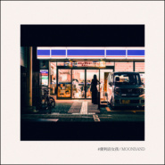

便利店女孩
============================

|  |  |
| :--: | :-- |
| [ 便利店女孩](https://emumo.xiami.com/album/2102956249) | **艺人**: [悶餅MOONBAND](../index.md) **语种**: 国语 **唱片公司**: 独立发行 **发行时间**: 2017年10月15日 **专辑类别**: 录音室专辑 **专辑风格**: 独立摇滚 Indie Rock, 独立流行 Indie Pop **播放数**: 290743 **收藏数**: 232 **评论数**: 36  |

## 简介

 

女孩再也无法入睡，独自一人徘徊在便利店

男孩循着光，走進了便利店...

## 曲目

## 评论

|  |  |  |  |
| :-- | :-- | :-- | :-- |
|  [虾米用户](https://emumo.xiami.com/u/55094882) ｉｄ９１ｏｍｏ＞Ｉ wy... 2020-07-27 22:50 赞(0) 踩(0) | 
♡
 |
|  [虾米用户](https://emumo.xiami.com/u/11936704) 不听音乐你别跟我说话 2020-02-28 10:06 赞(3) 踩(0) | 
天天守在便利店也没等到女孩
 |
|  [虾米用户](https://emumo.xiami.com/u/30800139) 我在低俗与高雅间活的很尴... 2019-06-01 22:12 赞(0) 踩(0) | 
。
 |
|  [虾米用户](https://emumo.xiami.com/u/9504881) 探索、改变、更好！ 2019-03-27 23:02 赞(0) 踩(0) | 
俏皮，充满了恋爱感。
 |
|  [虾米用户](https://emumo.xiami.com/u/19157007)  2019-03-14 21:32 赞(0) 踩(0) | 
【演出预告：鹿酊剂Vol.3"祛湿"】3月16日，Moonband联手回声公园和鲸浪，在这个潮湿的季节与大家一起"祛湿"。购票 <a href="https://www.showstart.com/event/80074" target="_blank" rel="nofollow noreferrer noopener">https://www.showstart.com/event/80074</a>
 |
|  [虾米用户](https://emumo.xiami.com/u/8109588) Post Rock & ... 2019-02-25 19:29 赞(0) 踩(0) | 
今天在 711 遇到了便利店女孩
 |
|  [虾米用户](https://emumo.xiami.com/u/15294243) 文青的末世 2018-11-19 15:07 赞(2) 踩(0) | 
惊觉 实在是惊艳
 |
|  [虾米用户](https://emumo.xiami.com/u/41313413)   2018-10-24 20:20 赞(1) 踩(0) | 
过分
 |
|  [虾米用户](https://emumo.xiami.com/u/47494497) 李志、陈升，“虾米也没有... 2018-10-22 17:57 赞(0) 踩(0) | 
女孩再也无法入睡，独自一人徘徊在便利店男孩循着光，走進了便利店...简介有故事 
 |
|  [虾米用户](https://emumo.xiami.com/u/13159213) 罐子罐子 2018-10-14 12:13 赞(0) 踩(0) | 
哈哈哈可喜欢啦ww
 |
|  [虾米用户](https://emumo.xiami.com/u/2279444) 爱在左，同情在右。 2018-10-13 21:09 赞(2) 踩(0) | 
要不是有粤语，你说这不是一支台湾的乐队，我是无法相信的
 |
| ⇒ |  [虾米用户](https://emumo.xiami.com/u/8759414)  2019-02-09 23:58 赞(0) 踩(0) | 
是的震惊了！！！
 |
|  [虾米用户](https://emumo.xiami.com/u/32611434)  2018-10-12 14:50 赞(1) 踩(0) | 
好好听！支持广东本土啊。
 |
|  [虾米用户](https://emumo.xiami.com/u/996277) ‏‏ 2018-10-06 22:36 赞(0) 踩(0) | 
啤嗑
 |
|  [虾米用户](https://emumo.xiami.com/u/53745958) 我还没想好要写什么... 2018-05-26 11:53 赞(0) 踩(0) | 
好喜欢！！！
 |
|  [虾米用户](https://emumo.xiami.com/u/42457016) 结束在这吧 2018-04-02 17:51 赞(0) 踩(0) | 
新晋挚爱
 |
|  [虾米用户](https://emumo.xiami.com/u/45308299) 我还没想好要写什么... 2018-03-19 23:50 赞(0) 踩(0) | 
本女孩無誤了
 |
|  [虾米用户](https://emumo.xiami.com/u/215911403) もも 2018-02-01 17:36 赞(0) 踩(0) | 
喜欢
 |
|  [虾米用户](https://emumo.xiami.com/u/20356480)  2018-01-05 06:19 赞(0) 踩(0) | 
有点小伤心。本来以为是粤语&amp;hellip;&amp;hellip;
 |
|  [虾米用户](https://emumo.xiami.com/u/71178106) 塵世や 酒、風呂を抜け ... 2018-01-03 01:57 赞(1) 踩(0) | 
♡
 |
|  [虾米用户](https://emumo.xiami.com/u/53779803) 我还没想好要写什么... 2017-12-30 18:48 赞(1) 踩(0) | 
很棒❤️在巴黎的地铁上一直循环
 |
|  [虾米用户](https://emumo.xiami.com/u/3170339)  2017-12-09 17:25 赞(1) 踩(0) | 
主音是不是蘇打綠粉？
 |
|  [虾米用户](https://emumo.xiami.com/u/5100773) life is colo... 2017-12-07 13:52 赞(2) 踩(0) | 
好有才气的乐队！
 |
|  [虾米用户](https://emumo.xiami.com/u/115421496) bug用户 2017-11-25 00:03 赞(0) 踩(0) | 
耶!放上虾米了!
 |
|  [虾米用户](https://emumo.xiami.com/u/296790882) 肇庆本土乐队  闷饼Mo... 2017-11-23 11:05 赞(1) 踩(0) | 
微笑
 |
|  [虾米用户](https://emumo.xiami.com/u/36057872) 网易/BC: Breat... 2017-11-22 23:17 赞(0) 踩(0) | 
~
 |
|  [虾米用户](https://emumo.xiami.com/u/32125734) weibo：白菜y少女  2017-11-22 21:45 赞(0) 踩(0) | 
~
 |
|  [虾米用户](https://emumo.xiami.com/u/36131275) 喜欢妃阿甦 2017-11-22 20:38 赞(1) 踩(0) | 
我生日同一天发的！！开心ヽ(○^㉨^)ﾉ♪
 |
| ⇒ |  [虾米用户](https://emumo.xiami.com/u/234716982) 不断朝着，别停跑！ 2017-11-22 20:52 赞(0) 踩(0) | 
生日快乐
 |
| ⇒ |  [虾米用户](https://emumo.xiami.com/u/36131275) 喜欢妃阿甦 2017-11-23 21:30 赞(0) 踩(0) | 
<q><b>悶餅说：</b></q>
 |
|  [虾米用户](https://emumo.xiami.com/u/14265718) wx:osakarock... 2017-11-22 20:25 赞(1) 踩(0) | 
可爱
 |
|  [虾米用户](https://emumo.xiami.com/u/669746) 神思恍惚 2017-11-22 19:50 赞(1) 踩(0) | 
几时巡演呢 
 |
|  [虾米用户](https://emumo.xiami.com/u/9029590) 享受着他钟情的音乐 2017-11-22 19:47 赞(0) 踩(0) | 
终于肯上虾米啦！！
 |
|  [虾米用户](https://emumo.xiami.com/u/50306056)  2017-11-22 19:46 赞(0) 踩(0) | 
我要做第一！！！
 |
| ⇒ |  [虾米用户](https://emumo.xiami.com/u/234716982) 不断朝着，别停跑！ 2017-11-22 19:49 赞(0) 踩(0) | 
哦
 |
| ⇒ |  [虾米用户](https://emumo.xiami.com/u/50306056)  2017-11-22 19:51 赞(0) 踩(0) | 
<q><b>悶餅说：</b></q>
 |
