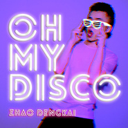

Oh My Disco
============================

|  |  |
| :--: | :-- |
| [ Oh My Disco](https://emumo.xiami.com/album/2102813409) | **艺人**: [赵登凯](../index.md) **语种**: 国语 **唱片公司**: 独立发行 **发行时间**: 2017年08月14日 **专辑类别**: EP, 单曲 **专辑风格**: 迪斯科 Disco, 电子迪斯科 Electro-Disco **播放数**: 216 **收藏数**: 2 **评论数**: 0  |

## 简介

 
 

那个年代的歌总是那么热情四溢
 

那个年代的人依旧年轻依旧可爱
 

 
 

最值得期待的唱作新人赵登凯首支复古电子舞曲
 

一个热情四溢的90后与复古摩登的80年代新鲜碰撞
 

 
 

总是听父母讲起80年代的生活，那是一个刚刚步入自由的时代
 

街上的小姑娘成群结队的烫着满头的卷儿
 

街角的一处总是有一堆懒洋洋青年小伙儿扛着巨大的录音机
 

听着新买的磁带，每个人都悠闲的生活在一个美好时代的转折点
 

 
 

那个时代，身边的每一个事物都是那么新鲜
 

那个时代，每一个人都渴望一切迅速的改变
 

那个时代，他们没有智能手机，没有满城的灯光秀
 

那个时代，在热闹的四合院住宅里，每个人之间似乎都没有距离
 

 
 

也许我们生活的这个时代，很时髦，很自由，很疯狂
 

但他们所经过的那个时代，也是同样的年轻，和充满希望
 

 

## 曲目

## 评论

