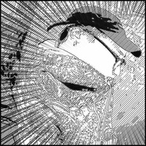
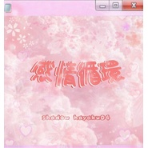
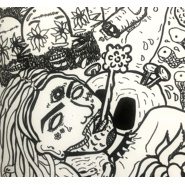
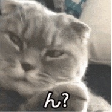
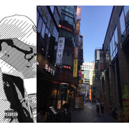
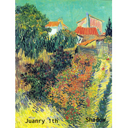

Dowyy
============================

|  |  |
| :--: | :-- |
| [ Dowyy](https://i.xiami.com/shadow) | **播放数**: 30930649 **粉丝数**: 467 **评论数**: 43 **地区**:  **风格**: 流行说唱 Pop Rap, 地下说唱 Underground Hip Hop, 陷阱说唱 Trap Rap  |

## 档案

## 专辑

| 名称 | 语种 | 唱片公司 | 发行时间 | 专辑类别 | 专辑风格 |
| :--: | :-- | :-- | :-- | :-- | :-- |
| [ 幻影](./albums/5022205469.md) | 粤语 | 独立发行 | 2020年12月18日 | EP, 单曲 | 粤语流行 Cantopop, 流行说唱 Pop Rap |
| [ 新一天New day](./albums/5021239991.md) | 粤语 | 独立发行 | 2020年08月07日 | EP, 单曲 | 粤语流行 Cantopop, 爵士嘻哈 Jazz Hip Hop, 流行说唱 Pop Rap |
| [ 感情循環](./albums/5021056797.md) | 粤语 | 独立发行 | 2020年07月09日 | EP, 单曲 | 粤语流行 Cantopop, 流行说唱 Pop Rap |
| [ 失魂夢](./albums/5020633514.md) | 粤语 | 独立发行 | 2020年05月11日 | EP, 单曲 | 粤语流行 Cantopop, 流行说唱 Pop Rap |
| [ 花](./albums/2108145219.md) | 粤语 | 独立发行 | 2020年03月09日 | EP, 单曲 | 嘻哈 Hip-Hop, 流行说唱 Pop Rap |
| [ 戀人未滿](./albums/2105423582.md) | 粤语 |  | 2019年11月09日 | EP, 单曲 | 粤语流行 Cantopop |
| [ 冰山Ice](./albums/2105364517.md) | 粤语 |  | 2019年10月21日 | EP, 单曲 | 粤语流行 Cantopop, 流行说唱 Pop Rap, 嘻哈 Hip-Hop |
| [ 離別預告](./albums/2104802713.md) | 粤语 |  | 2019年04月24日 | EP, 单曲 | 粤语流行 Cantopop, 流行说唱 Pop Rap, 嘻哈 Hip-Hop |
| [ 8 0 年 代](./albums/2104777990.md) | 粤语 |  | 2019年04月14日 | EP, 单曲 | 都市流行 City Pop |
| [ 唔 想 你 走](./albums/2104724782.md) | 粤语 |  | 2019年03月28日 | EP, 单曲 | 爵士嘻哈 Jazz Hip Hop, 粤语流行 Cantopop, 流行说唱 Pop Rap |
| [ 普通的dissgo我們普通的搖](./albums/2104653819.md) | 粤语 |  | 2019年03月06日 | EP, 单曲 | 嘻哈 Hip-Hop |
| [ 每當雨落下](./albums/2104635145.md) | 粤语 |  | 2019年02月26日 | EP, 单曲 | 流行说唱 Pop Rap, 嘻哈 Hip-Hop |
| [ Want a c我想要一個C](./albums/2104530505.md) | 粤语 |  | 2019年01月24日 | EP, 单曲 | 陷阱说唱 Trap Rap, 流行说唱 Pop Rap, 嘻哈 Hip-Hop |
| [ HeyaheCover](./albums/2104523114.md) | 韩语 |  | 2019年01月22日 | EP, 单曲 | 韩国流行 K-Pop, 流行说唱 Pop Rap |
| [ 世界末日](./albums/2104458433.md) | 粤语 |  | 2019年01月08日 | EP, 单曲 | 流行说唱 Pop Rap |
| [ 我們之間](./albums/2103934011.md) | 国语 | 独立发行 | 2018年08月18日 | EP, 单曲 | 流行 Pop |
| [ Dow's 翻唱集](./albums/2103926873.md) | 韩语 | 独立发行 | 2018年08月16日 | 合集, 杂锦 | 流行 Pop |
| [ 暗](./albums/2103902136.md) | 粤语 | 独立发行 | 2018年08月07日 | EP, 单曲 | 流行说唱 Pop Rap, 嘻哈 Hip-Hop, 中国地下说唱 Chinese Underground Hip Hop |
| [ 愛是毒藥](./albums/2103896335.md) | 韩语 | 独立发行 | 2018年08月03日 | EP, 单曲 | 陷阱说唱 Trap Rap, 意识说唱 Conscious Hip Hop, 说唱摇滚 Rap Rock |
| [ 顏色Purple yellow pink or gray or maybe blue](./albums/2103886593.md) | 国语 | 独立发行 | 2018年08月01日 | EP, 单曲 | 流行 Pop, 国语流行 Mandarin Pop, 节奏布鲁斯 R&B |
| [ 浪費感情Wasted](./albums/2103664298.md) | 粤语 | 独立发行 | 2018年04月03日 | EP, 单曲 | 流行说唱 Pop Rap, 嘻哈 Hip-Hop, 陷阱说唱 Trap Rap |
| [ 其實毒撚一個更開心翻唱集](./albums/2103613096.md) | 粤语 | 独立发行 | 2018年03月16日 | 录音室专辑 | 流行 Pop, 粤语流行 Cantopop |
| [ 凍Cold](./albums/2103610536.md) | 粤语 | 独立发行 | 2018年03月15日 | EP, 单曲 | 嘻哈 Hip-Hop, 流行说唱 Pop Rap, 陷阱说唱 Trap Rap |
| [ 凌晨三點3.A.M](./albums/2103599342.md) | 粤语 | 独立发行 | 2018年03月10日 | EP, 单曲 | 嘻哈 Hip-Hop, 地下说唱 Underground Hip Hop, 陷阱说唱 Trap Rap |
| [ Feel the taste试味](./albums/2103595156.md) | 粤语 | 独立发行 | 2018年03月09日 | EP, 单曲 | 嘻哈 Hip-Hop, 地下说唱 Underground Hip Hop, 陷阱说唱 Trap Rap |
| [ 寶礦力水特](./albums/2103579862.md) | 粤语 | 独立发行 | 2018年03月03日 | EP, 单曲 | 嘻哈 Hip-Hop, 陷阱说唱 Trap Rap |
| [ Fallin'](./albums/2103498086.md) | 粤语 | 独立发行 | 2018年01月22日 | EP, 单曲 | 流行说唱 Pop Rap, 流行 Pop, 粤语流行 Cantopop |
| [ Comeback2meCome back to me](./albums/2103514362.md) | 粤语 | 独立发行 | 2018年01月17日 | EP, 单曲 | 嘻哈 Hip-Hop, 流行说唱 Pop Rap, 爵士说唱 Jazz Rap |
| [ No Romance(REMIX)](./albums/2103492033.md) | 粤语 | 独立发行 | 2018年01月17日 | EP, 单曲 | 陷阱说唱 Trap Rap, 嘻哈 Hip-Hop, 地下说唱 Underground Hip Hop |
| [ Comeback2me](./albums/2103492021.md) | 粤语 | 独立发行 | 2018年01月16日 | EP, 单曲 | 流行说唱 Pop Rap, 嘻哈 Hip-Hop, 陷阱说唱 Trap Rap |
| [ Bank AccountRemix](./albums/2103514360.md) | 粤语 | 独立发行 | 2018年01月09日 | EP, 单曲 | 陷阱说唱 Trap Rap, 地下说唱 Underground Hip Hop |
| [ BANK ACCOUNT(REMIX)Prod by $uihill X $hadow From FAMOUSHOOD](./albums/2103472881.md) | 粤语 | 独立发行 | 2018年01月09日 | EP, 单曲 | 南方说唱 Southern Hip Hop, 嘻哈 Hip-Hop, 陷阱说唱 Trap Rap |
| [ 一月一日Don't let me go](./albums/2102677334.md) | 国语 | 独立发行 | 2017年01月07日 | 录音室专辑 | 流行 Pop, 流行说唱 Pop Rap, 爵士说唱 Jazz Rap |
| [ 时差Time](./albums/2102677120.md) | 国语 | 独立发行 | 2017年01月01日 | EP, 单曲 |  |
| [ 鬼怪oststay with me](./albums/2102672863.md) | 韩语 | 独立发行 | 2016年12月27日 | EP, 单曲 | 韩国流行 K-Pop |
| [ 步步惊心-丽](./albums/2102672680.md) | 韩语 | 独立发行 | 2016年10月26日 | EP, 单曲 | 韩国流行 K-Pop |
| [ 漩渦](./albums/5021646517.md) | 粤语 | 独立发行 | 不详 | EP, 单曲 | 粤语流行 Cantopop, 爵士嘻哈 Jazz Hip Hop, 流行说唱 Pop Rap |

## 评论

|  |  |  |  |
| :-- | :-- | :-- | :-- |
|  [虾米用户](https://emumo.xiami.com/u/44648524) 我还没想好要写什么... 2021-01-05 15:16 赞(0) 踩(0) | 
步步惊心丽的这个版本是我听过最好听的，虾米不玩要转去网易了，老大能把这首曲子发我不    
 |
|  [虾米用户](https://emumo.xiami.com/u/408678603)  2020-01-28 14:06 赞(0) 踩(0) | 
粤语rap真舒服
 |
|  [虾米用户](https://emumo.xiami.com/u/116516164)  2018-11-27 20:27 赞(0) 踩(0) | 
那个日本旋死乐队呢？
 |
|  [虾米用户](https://emumo.xiami.com/u/329682330) ·noʎ ʞɔnɟ 2018-06-04 21:36 赞(0) 踩(0) | 

 |
|  [虾米用户](https://emumo.xiami.com/u/304073427) 我还没想好要写什么... 2017-11-13 19:32 赞(0) 踩(0) | 
熊铭铭在哪
 |
|  [虾米用户](https://emumo.xiami.com/u/307375102)  2017-07-11 22:09 赞(2) 踩(0) | 
我已经无法自拔，深深中毒
 |
|  [虾米用户](https://emumo.xiami.com/u/279792248)  2017-06-03 11:49 赞(3) 踩(0) | 
对你唱的stay with me中毒很深(&amp;lowast;ᵒ̶̶̷̀&amp;omega;˂̶́&amp;lowast;)੭₎₎̊₊♡
 |
|  [虾米用户](https://emumo.xiami.com/u/293958660)  2017-06-02 21:09 赞(1) 踩(0) | 
超级好听诶，喜欢哈哈
 |
|  [虾米用户](https://emumo.xiami.com/u/286919921)  2017-05-10 12:43 赞(0) 踩(0) | 
    
 |
|  [虾米用户](https://emumo.xiami.com/u/286919921)  2017-05-10 12:43 赞(0) 踩(0) | 
       
 |
|  [虾米用户](https://emumo.xiami.com/u/214770701) 边伯贤小迷妹 2017-05-07 14:33 赞(0) 踩(0) | 
和原唱一样啊 
 |
|  [虾米用户](https://emumo.xiami.com/u/214770701) 边伯贤小迷妹 2017-05-07 14:32 赞(0) 踩(0) | 
这里面的歌不都是原版嘛？
 |
|  [虾米用户](https://emumo.xiami.com/u/293522548)  2017-05-03 15:01 赞(0) 踩(0) | 
唱的真好
 |
|  [虾米用户](https://emumo.xiami.com/u/21334832)  2017-04-17 23:04 赞(0) 踩(0) | 
好听
 |
|  [虾米用户](https://emumo.xiami.com/u/224927056) 唯仁俊是道。 2017-04-08 20:57 赞(1) 踩(0) | 
。。。
 |
|  [虾米用户](https://emumo.xiami.com/u/261146290)  2017-04-05 13:54 赞(0) 踩(0) | 
hhh
 |
|  [虾米用户](https://emumo.xiami.com/u/279926355) 长得漂亮不如活的漂亮 2017-03-14 15:58 赞(0) 踩(0) | 
超喜欢，设置为铃声了
 |
|  [虾米用户](https://emumo.xiami.com/u/258751187)  偷得浮生半日闲 2017-02-28 20:52 赞(0) 踩(0) | 
很好听！！！！！！(*/&amp;omega;＼*)
 |
|  [虾米用户](https://emumo.xiami.com/u/17670665)  2017-02-27 00:30 赞(0) 踩(0) | 
 
 |
|  [虾米用户](https://emumo.xiami.com/u/274537389)  2017-02-26 20:33 赞(0) 踩(0) | 
真的很好听，加油加油
 |
|  [虾米用户](https://emumo.xiami.com/u/274003079)  2017-02-20 01:57 赞(1) 踩(0) | 
真的好听，听不到原版的，就一直在听你的！！
 |
|  [虾米用户](https://emumo.xiami.com/u/222156277) 不忘初心，方得始终。 2017-02-15 09:27 赞(0) 踩(0) | 
好听
 |
|  [虾米用户](https://emumo.xiami.com/u/144543286)  2017-02-05 17:52 赞(0) 踩(0) | 
麼麼噠   
 |
|  [虾米用户](https://emumo.xiami.com/u/261316138)  2017-02-04 15:18 赞(0) 踩(0) | 
6
 |
|  [虾米用户](https://emumo.xiami.com/u/47051437) Find the El ... 2017-01-28 23:04 赞(1) 踩(0) | 
真的很好听
 |
|  [虾米用户](https://emumo.xiami.com/u/265619644)   2017-01-27 22:44 赞(0) 踩(0) | 
棒棒搭
 |
|  [虾米用户](https://emumo.xiami.com/u/267994066) 사랑해요! EXO&L 2017-01-26 19:37 赞(0) 踩(0) | 
唱歌很赞(≧▽≦)사랑해요
 |
|  [虾米用户](https://emumo.xiami.com/u/168590828) 2019bbh请solo 2017-01-20 16:38 赞(0) 踩(0) | 
爱你
 |
|  [虾米用户](https://emumo.xiami.com/u/200541687) My eyes on y... 2017-01-18 21:24 赞(2) 踩(0) | 
男声听声音应该是个帅哥
 |
|  [虾米用户](https://emumo.xiami.com/u/122688364) 生在愤坑，长在赤圈；挣脱 2017-01-15 17:23 赞(0) 踩(0) | 
7212
 |
|  [虾米用户](https://emumo.xiami.com/u/43838497) 陈奕迅神经研究所 2017-01-14 00:32 赞(0) 踩(0) | 

 |
|  [虾米用户](https://emumo.xiami.com/u/241134508)   2017-01-11 20:43 赞(4) 踩(0) | 
你们真的唱的好听
 |
|  [虾米用户](https://emumo.xiami.com/u/187498721)  2017-01-10 23:50 赞(1) 踩(0) | 
求唱EXO的歌
 |
|  [虾米用户](https://emumo.xiami.com/u/210517377) 我还没想好要写什么... 2017-01-08 00:10 赞(2) 踩(0) | 
求唱EXO或防弹少年团的歌
 |
|  [虾米用户](https://emumo.xiami.com/u/250638302)  2017-01-07 01:12 赞(4) 踩(0) | 
好听
 |
|  [虾米用户](https://emumo.xiami.com/u/34371730) 人 2017-01-06 17:08 赞(14) 踩(0) | 
thanks
 |
| ⇒ |  [虾米用户](https://emumo.xiami.com/u/263267208)  2017-02-10 15:11 赞(0) 踩(0) | 

 |
|  [虾米用户](https://emumo.xiami.com/u/168733584) 最帅的人 2017-01-06 09:29 赞(2) 踩(0) | 
求唱步步惊心丽泰妍ost
 |
|  [虾米用户](https://emumo.xiami.com/u/43981488) .. oh。 2017-01-03 21:40 赞(0) 踩(0) | 
谢谢！
 |
|  [虾米用户](https://emumo.xiami.com/u/33971186)  2016-12-31 21:13 赞(0) 踩(0) | 
沉醉
 |
|  [虾米用户](https://emumo.xiami.com/u/255598238)  2016-12-31 11:39 赞(0) 踩(0) | 
  
 |
|  [虾米用户](https://emumo.xiami.com/u/46329562) If a song co... 2016-12-30 21:32 赞(1) 踩(0) | 
谢谢
 |
|  [虾米用户](https://emumo.xiami.com/u/23794844) 喜欢任何音乐梦想是成为 ... 2016-12-30 16:15 赞(0) 踩(0) | 
 
 |
