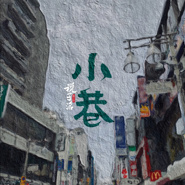

小巷
============================

|  |  |
| :--: | :-- |
| [ 小巷](https://emumo.xiami.com/album/5021044778) | **艺人**: [税子洺](../index.md) **语种**: 国语 **唱片公司**: 独立发行 **发行时间**: 2020年07月06日 **专辑类别**: EP, 单曲 **专辑风格**: 国语流行 Mandarin Pop **播放数**: 105 **收藏数**: 0 **评论数**: 2  |

## 简介

孩提时光，儿时小巷，承载旧月纯真与期望；  
院里花香，少年来往，深巷中总有说故事的嬢嬢；  
后来奔忙，月光所及，皆是梓里，从此他乡即故乡……&nbsp;  
由税子洺、唐森作曲，章洽嘉作词的《小巷》带我们重温那个嬉戏欢乐的童年时光。

## 曲目

## 评论

|  |  |  |
| :-- | :-- | :-- |
|  [虾米用户](https://emumo.xiami.com/u/424501256) 没啥好说的，听歌来的 2020-07-12 17:55 赞(0) 踩(0) | 
可太好听了吧，爱了爱了爱了爱了爱了爱了爱了爱了
 |
|  [虾米用户](https://emumo.xiami.com/u/56920882) 我只是个听歌的 2020-07-07 06:19 赞(0) 踩(0) | 
认真唱歌的人
 |
