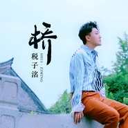

税子洺
============================

|  |  |
| :--: | :-- |
| [ 税子洺](https://i.xiami.com/shuiziming) | **播放数**: 4059090 **粉丝数**: 209 **评论数**: 13 **地区**: China 中国大陆 **风格**: 国语流行 Mandarin Pop, 流行 Pop  |

## 档案

姓名：税子洺 
祖籍：四川 
身高：177cm 
教育背景：上海音乐学院 硕士 声乐歌剧系 民族声乐专业 
个人履历 
2014年至今  中国歌剧舞剧院男高音独唱演员 
2015年      参演中国民族歌剧《彝红》并饰演男一号“天红”。同年6月，在国家大剧院      首演，并进行全国巡演。 
2014年      获得中央电视台《星光大道》栏目，周冠军、月冠军、年分赛冠军及年度总决赛第四名。 
2013年3月  在宁波音乐厅举行《洲海灵韵》独唱音乐会 
2012年8月  演唱由著名音乐制作人頌今创作的单曲《舌尖上的中国》 
2012年6月  演唱青春偶像剧《初恋时光》主题曲 
2005年      以全国第五名四川省第一名的成绩考入上海音乐学院本科，师从常留住、方琼、  赵勇。并于2012年，以全国第一名的成绩考入上海音乐学院硕士研究生

## 专辑

| 名称 | 语种 | 唱片公司 | 发行时间 | 专辑类别 | 专辑风格 |
| :--: | :-- | :-- | :-- | :-- | :-- |
| [ 翻唱合集](./albums/5021064098.md) | 国语 | 独立发行 | 2020年07月08日 | 合集, 杂锦 | 国语流行 Mandarin Pop |
| [ 小巷](./albums/5021044778.md) | 国语 | 独立发行 | 2020年07月06日 | EP, 单曲 | 国语流行 Mandarin Pop |
| [ 桥](./albums/2104857542.md) | 国语 | 独立发行 | 2019年05月12日 | EP, 单曲 | 流行 Pop |
| [ 小半](./albums/2104693851.md) | 国语 |  | 2019年03月21日 | 现场专辑 | 民谣流行 Folk Pop |
| [ 等待圣诞季](./albums/2104389711.md) | 国语 |  | 2018年12月18日 | 录音室专辑 | 阳光流行 Sunshine Pop |
| [ 耳边](./albums/2104458656.md) | 国语 | 刍音文化 | 2018年11月14日 | EP, 单曲 | 阳光流行 Sunshine Pop |
| [ 筷子](./albums/2104485395.md) | 国语 |  | 2018年09月23日 | EP, 单曲 | 流行舞曲 Dance-Pop |
| [ 如果我税子洺](./albums/2104458658.md) | 国语 |  | 2018年09月04日 | EP, 单曲 | 流行舞曲 Dance-Pop |
| [ 流浪的红舞鞋](./albums/2103871357.md) | 国语 | 独立发行 | 2018年07月20日 | 录音室专辑 | 流行 Pop |
| [ 《明日，再见》](./albums/2103794219.md) | 国语 | 独立发行 | 2018年07月11日 | EP, 单曲 | 国语流行 Mandarin Pop, 流行 Pop, 艺术流行 Art Pop |
| [ 我爱你](./albums/2102733195.md) | 国语 | 独立发行 | 2017年04月17日 | EP, 单曲 |  |
| [ 税子洺作品集](./albums/2102733199.md) | 国语 | 独立发行 | 2016年09月23日 | 合集, 杂锦 | 流行 Pop |

## 评论

|  |  |  |  |
| :-- | :-- | :-- | :-- |
|  [虾米用户](https://emumo.xiami.com/u/348411959)  2020-12-20 10:44 赞(0) 踩(0) | 
ꕥ᭄ঞ☊♪♩♪我是金牛座♉️&amp;hellip;&amp;hellip;&amp;hellip;☕☕加油
 |
|  [虾米用户](https://emumo.xiami.com/u/427010940)  2019-08-17 12:23 赞(0) 踩(0) | 
被天使吻过的声音
 |
|  [虾米用户](https://emumo.xiami.com/u/38548310)  2019-08-02 21:55 赞(0) 踩(0) | 
赞，不错
 |
|  [虾米用户](https://emumo.xiami.com/u/427010940)  2019-07-25 09:20 赞(0) 踩(0) | 
继续涨粉
 |
|  [虾米用户](https://emumo.xiami.com/u/20177386) 感谢一切美好的遇见❤️ 2019-07-20 02:26 赞(0) 踩(0) | 
期待新作品 
 |
|  [虾米用户](https://emumo.xiami.com/u/424501256) 没啥好说的，听歌来的 2019-05-13 21:41 赞(0) 踩(0) | 
棒
 |
|  [虾米用户](https://emumo.xiami.com/u/369042510)  2018-07-06 20:23 赞(0) 踩(0) | 
这个cover已经很棒了
 |
|  [虾米用户](https://emumo.xiami.com/u/74290616) 对于自己就像是对于世界一... 2018-04-30 09:19 赞(0) 踩(0) | 
大遂宁的
 |
|  [虾米用户](https://emumo.xiami.com/u/20177386) 感谢一切美好的遇见❤️ 2018-04-15 01:44 赞(2) 踩(0) | 
怎么不出点歌T_T   虽然去歌剧舞剧院了   嗯 可能想专心走艺术这条路吧 希望小伙子好好的 
 |
|  [虾米用户](https://emumo.xiami.com/u/114374088) 不存在彻头彻尾的绝望 2017-10-19 00:41 赞(0) 踩(0) | 
(๑´ㅂ`๑)
 |
|  [虾米用户](https://emumo.xiami.com/u/48896344) 自闭 2017-04-27 13:30 赞(0) 踩(0) | 
(ง &amp;bull;̀_&amp;bull;́)ง
 |
|  [虾米用户](https://emumo.xiami.com/u/17806314) 以梦为马 以己为光 2017-04-19 01:23 赞(0) 踩(0) | 
&amp;ang;( ᐛ 」&amp;ang;)_
 |
