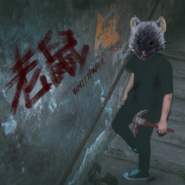

老鼠
============================

|  |  |
| :--: | :-- |
| [ 老鼠](https://emumo.xiami.com/album/2104158338) | **艺人**: [白皮书乐队](../index.md) **语种**: 国语 **唱片公司**: 年轻的枪 **发行时间**: 2018年10月30日 **专辑类别**: EP, 单曲 **专辑风格**: 后朋克 Post-Punk **播放数**: 77188 **收藏数**: 29 **评论数**: 4  |

## 简介

要说白皮书乐队的现场演出代表曲目，那必然是这首《老鼠》。混合8-bit电子元素与后朋克内涵的无赖曲风，配上自嘲、怪诞、自我癫狂的现场表现力，这首歌的现场绝对能让您过目不忘。主唱老刘：“在表演这首歌的时候我最沉醉的时刻便是间奏的通鼓演奏，因为这能将我精疲力尽坐地铁把通鼓运往演出场地的疲惫与怨气统统还给通鼓本身，而我与樵哥的友谊也使得我多次提出，希望樵哥在这段通鼓演奏期间远离我，以免误伤。”贝斯手樵哥：“我最沉醉的时刻应该是唱我唯一且最喜爱的那句“mXther FXcker”的时候吧”。鼓手虫子：“我大概没有什么沉醉的，就是中间国际歌采样时可以站起来歇歇腰让我挺开心的”。主唱老刘称，自己当时写这首歌从灵感乍现到上电脑制作完毕demo一共只花了40分钟，这比他全力喝完一瓶燕京鲜啤的时间还短。而也常常有歌迷表示，刚听这首歌时曾单曲循环到内分泌失调，这也许也说明了老鼠有成为让大家听到吐的洗脑神曲的潜质。无论您如何定义这首歌，我只能悄悄说：“全新制作的《老鼠》正式版奉上” 

## 曲目

## 评论

|  |  |  |  |
| :-- | :-- | :-- | :-- |
|  [虾米用户](https://emumo.xiami.com/u/4868843)  2020-08-28 18:30 赞(1) 踩(0) | 
无限循环中 
 |
|  [虾米用户](https://emumo.xiami.com/u/261301937) 摇滚文青 2020-08-27 11:20 赞(1) 踩(0) | 
《乐夏2》认识的他们，《老鼠》前奏一响，电音十足，节奏强劲。有自己独立的音乐思考和态度主张。加油(ง &amp;bull;̀_&amp;bull;́)ง。
 |
|  [虾米用户](https://emumo.xiami.com/u/38883178) “” 2020-08-24 15:28 赞(1) 踩(0) | 
7
 |
|  [虾米用户](https://emumo.xiami.com/u/415000620) Feed me  2020-08-14 10:44 赞(2) 踩(0) | 
真的有循环到不能自已
 |
