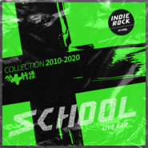

SCHOOL十周年纪念合辑《操行十分》之INDIE ROCK合辑
============================

|  |  |
| :--: | :-- |
| [ SCHOOL十周年纪念合辑《操行十分》之INDIE ROCK合辑](https://emumo.xiami.com/album/5020473378) | **艺人**: [白皮书乐队](../index.md) **语种**: 国语 **唱片公司**: 麦田音乐 **发行时间**: 2020年04月27日 **专辑类别**: 合集, 杂锦 **专辑风格**: 摇滚 Rock & Roll, 独立摇滚 Indie Rock **播放数**: 112688 **收藏数**: 415 **评论数**: 45  |

## 简介

这是SCHOOL送给自己的十周岁生日礼物。 从2010到2020年，十年间，平均每年有400组乐队或音乐人，登上过我们那个30公分高，不到8平米的舞台。而这张唱片里收录的20支乐队，仅是SCHOOL主角们的二百分之一。 这20支乐队，可能并不是SCHOOL出现过的最好的乐队，但确是当下最能代表SCHOOL的乐队，是来自SCHOOL的ROCK STAR！当然，还有太多优秀的乐队因各种原因无法收入到这张唱片中，不完美，有遗憾。但这只是我们的第一张唱片，一切才刚刚开始。 特别感谢老狼和王迪两位老前辈，若没有他们的鼎力支持，这张唱片可能还只是停留在口头上和想象中。也要感谢太合及麦田音乐，愿意给这些年轻人们一条跑道。 所以，《操行十分》不是SCHOOL过去十年的回忆录，而是下个十年的发令枪。“学校”里的操行分数评定，满分十分。那么就来听听这些十分激动，十分鲜活，十分骄傲的声音吧，他们值得被更多人听到！ 我们也希望，下个十年，会有更多年轻人因这张唱片，拿起乐器，玩乐队；继续在SCHOOL的舞台上，写青春！ ----刘非 SCHOOL联合创始人/主理人

## 曲目

## 评论

|  |  |  |
| :-- | :-- | :-- |
|  [虾米用户](https://emumo.xiami.com/u/427840279) 购买诗集《落日飞奔术》电... 2020-12-21 15:13 赞(0) 踩(0) | 

 |
|  [虾米用户](https://emumo.xiami.com/u/427384237) 我还没想好要写什么... 2020-08-23 09:55 赞(0) 踩(0) | 
➕
 |
|  [虾米用户](https://emumo.xiami.com/u/38129793) 这个家伙很拽什么都不留下... 2020-05-09 10:24 赞(0) 踩(0) | 
即便生活如此真实，我们也不要丢了乌托邦。
 |
|  [虾米用户](https://emumo.xiami.com/u/442842113) 我还没想好要写什么... 2020-05-09 09:16 赞(3) 踩(0) | 
这便是摇滚的力量，将生活中最卑微的角落无限放大，用令人窒息的音乐将情绪刻画。
 |
|  [虾米用户](https://emumo.xiami.com/u/291255897) 放弃不难，但坚持一定很酷... 2020-05-09 06:15 赞(0) 踩(0) | 
发现原来还是有同龄人坚持做自己的……
 |
|  [虾米用户](https://emumo.xiami.com/u/4421444) 侧耳倾听 2020-05-08 21:46 赞(0) 踩(0) | 
后海大鲨鱼，必须的
 |
|  [虾米用户](https://emumo.xiami.com/u/345802905)  2020-05-08 13:16 赞(0) 踩(0) | 
耶耶耶
 |
|  [虾米用户](https://emumo.xiami.com/u/165940246) respect and ... 2020-05-08 10:24 赞(0) 踩(0) | 
趁年轻肆无忌惮的摇  [文字cool]！
 |
|  [虾米用户](https://emumo.xiami.com/u/2056387)  2020-05-08 09:47 赞(1) 踩(0) | 
一代人终将老去，但总有人正年轻。
 |
|  [虾米用户](https://emumo.xiami.com/u/7294023) 这家伙很聪明什么也没留下... 2020-05-08 09:15 赞(0) 踩(0) | 
坏学生不在乎操行十分，高中毕业就去耍摇滚
 |
|  [虾米用户](https://emumo.xiami.com/u/22890) 我还没想好要写什么... 2020-05-08 02:08 赞(0) 踩(0) | 
不管乐队做了几年 听到的是年轻的躁动和用心的声音 今天突然看到Andy Gill2月去世了 去年11月北京的巡演脑子中还有回响 老爷子60多岁觉得比我一30多岁的人还年轻 年轻真好
 |
| ⇒ |  [虾米用户](https://emumo.xiami.com/u/7031762) 电影厨房食物烹制采样～A... 2020-05-08 09:01 赞(0) 踩(0) | 
看的上海场 老头子太酷了 祖传砸微波炉送戏下乡
 |
|  [虾米用户](https://emumo.xiami.com/u/223066941) 管住嘴，迈开腿 2020-05-08 00:16 赞(1) 踩(0) | 
idealism
 |
|  [虾米用户](https://emumo.xiami.com/u/48014753) 失去了是痛苦_得到了是无... 2020-05-07 21:12 赞(1) 踩(0) | 
当初就是在school看的刺猬 优秀毕业生
 |
|  [虾米用户](https://emumo.xiami.com/u/46446466) 我还没想好要写什么... 2020-05-07 19:39 赞(0) 踩(0) | 
，
 |
|  [虾米用户](https://emumo.xiami.com/u/298087727) 摇滚因果 2020-05-07 18:27 赞(0) 踩(0) | 
物是人非 时间解释
 |
|  [虾米用户](https://emumo.xiami.com/u/2791514) 此处禁言 2020-05-07 16:43 赞(1) 踩(0) | 
如果感到快乐，你就school一下，如果感到难过，你也school一下。
 |
|  [虾米用户](https://emumo.xiami.com/u/52452667) 青春的人兒啊，想想一個人... 2020-05-07 16:27 赞(1) 踩(0) | 
永远的乌托邦
 |
|  [虾米用户](https://emumo.xiami.com/u/40239953)   2020-05-07 16:16 赞(0) 踩(0) | 
资词！
 |
|  [虾米用户](https://emumo.xiami.com/u/47448978) 今晚月色真美 2020-05-07 14:38 赞(1) 踩(0) | 
摇滚能够让我们永远年轻，永远热泪盈眶
 |
| ⇒ |  [虾米用户](https://emumo.xiami.com/u/13529947) 请大家通过【个人中心】-... 2020-05-22 15:20 赞(0) 踩(0) | 
恭喜获得SCHOOL操行十分定制的纪念t一件，请私信歌单君您的邮寄详情信息！
 |
|  [虾米用户](https://emumo.xiami.com/u/323786166)  2020-05-07 12:33 赞(0) 踩(0) | 
总有声音，唤醒自己。
 |
|  [虾米用户](https://emumo.xiami.com/u/334038982)  2020-05-07 11:27 赞(1) 踩(0) | 
爱摇滚，爱生活！
 |
|  [虾米用户](https://emumo.xiami.com/u/245290764) 阿岳阿岳 2020-05-07 11:22 赞(0) 踩(0) | 
10分school
 |
|  [虾米用户](https://emumo.xiami.com/u/31213633) I DON'T UNDE... 2020-05-07 11:16 赞(0) 踩(0) | 
整理这张专辑的人我给ta（们）10分
 |
|  [虾米用户](https://emumo.xiami.com/u/315412260) kind regards 2020-05-07 09:07 赞(0) 踩(0) | 
你们的音乐太好听了！操行O分的孩子可以拥有一件操行十分冲冲面儿么
 |
|  [虾米用户](https://emumo.xiami.com/u/297062561)  2020-05-07 08:37 赞(0) 踩(0) | 
永远躁动的热血
 |
|  [虾米用户](https://emumo.xiami.com/u/31057870)  2020-05-07 08:24 赞(0) 踩(0) | 
永远的乌托邦，永远的摇滚乐，我爱摇滚乐！！！
 |
|  [虾米用户](https://emumo.xiami.com/u/366344068) 听歌是一件很私人的事情 2020-05-07 07:19 赞(0) 踩(0) | 
希望国内的乐队发展的越来越好，进入到大众的视野中，让大家都意识到：哦，原来咱们也有这么多这么棒的乐队啊
 |
|  [虾米用户](https://emumo.xiami.com/u/434777661)  2020-05-07 01:11 赞(1) 踩(0) | 
摇滚的时代✌️ 图看着真喜欢
 |
|  [虾米用户](https://emumo.xiami.com/u/44743196) 听虾米记得收藏～ 2020-05-07 00:39 赞(0) 踩(0) | 
不容易每支乐队都配了张照片，&amp;ldquo;优秀毕业生展&amp;rdquo;有点意思 
 |
|  [虾米用户](https://emumo.xiami.com/u/440925493) 摇滚乐确实拯救了我们 2020-05-06 18:29 赞(0) 踩(0) | 
摇滚乐的时代，不能断。来日方长，疫情过后我们把酒言欢
 |
|  [虾米用户](https://emumo.xiami.com/u/440527066)  2020-05-06 16:57 赞(1) 踩(0) | 
哇哦～热浪 
 |
|  [虾米用户](https://emumo.xiami.com/u/369150) ♥︎stay hunge... 2020-05-03 16:39 赞(0) 踩(0) | 
优秀
 |
|  [虾米用户](https://emumo.xiami.com/u/17691156) あなたに出会えて よかっ... 2020-04-29 22:11 赞(0) 踩(0) | 
沙发！
 |
|  [虾米用户](https://emumo.xiami.com/u/3506625) 偏爱类型：Rock N'... 2020-04-28 16:58 赞(0) 踩(0) | 
school啊！希望这些乐队都能秉持初心，越来越好
 |
|  [虾米用户](https://emumo.xiami.com/u/44743196) 听虾米记得收藏～ 2020-04-28 00:26 赞(2) 踩(0) | 
不好意思，是十支乐队
 |
| ⇒ |  [虾米用户](https://emumo.xiami.com/u/44224657) 你不认识我 2020-04-28 13:26 赞(0) 踩(0) | 
还有一张专辑哦
 |
| ⇒ |  [虾米用户](https://emumo.xiami.com/u/44743196) 听虾米记得收藏～ 2020-04-28 22:35 赞(0) 踩(0) | 
<q><b>甜甜的味道说：</b></q>
 |
| ⇒ |  [虾米用户](https://emumo.xiami.com/u/44224657) 你不认识我 2020-04-29 10:27 赞(0) 踩(0) | 
<q><b>枫剑寒说：</b></q>
 |
|  [虾米用户](https://emumo.xiami.com/u/49106584) 我还没想好要写什么... 2020-04-27 12:53 赞(1) 踩(0) | 
[带墨镜笑]
 |
|  [虾米用户](https://emumo.xiami.com/u/290900338) 吃了那花儿 2020-04-27 12:47 赞(1) 踩(0) | 
去年四姑的封箱，守望在上边儿演得忘我，下边儿台子浅，我右脚顶着台阶和朋友们一起pogo。演完大家伙儿去南疆开始胡吹海喝，那晚非同寻常的开心。
 |
| ⇒ |  [虾米用户](https://emumo.xiami.com/u/36938932) 倒霉的小伙子比洞還潮濕的... 2020-04-27 13:07 赞(0) 踩(0) | 
北京再會
 |
|  [虾米用户](https://emumo.xiami.com/u/2472729) 嘘 2020-04-27 11:48 赞(1) 踩(0) | 
看了非总的长文 支持一下
 |
|  [虾米用户](https://emumo.xiami.com/u/1618810) 毙 2020-04-27 11:25 赞(0) 踩(0) | 
&amp;radic;
 |
