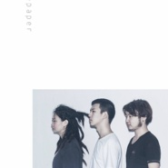
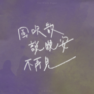
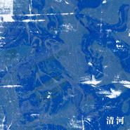
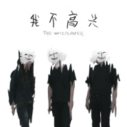

白皮书乐队
============================

|  |  |
| :--: | :-- |
| [ 白皮书乐队](https://i.xiami.com/whitepaper) | **地区**: China 中国大陆 **风格**: 后朋克 Post-Punk **播放数**: 2086231 **粉丝数**: 3951 **评论数**: 99  |

## 档案

外文名：WhitePaper  国籍：中国  地区：北京  团员组成：刘家辉、虫子、赵彦樵  团员人数：3  音乐风格：后朋克 / 流行 / 独立音乐 / 民族  音乐流派：摇滚 Rock    简介：白皮书是一种官方文件，讲究事实清楚、立场明确、行文规范、文字简练，没有文学色彩，乐队因此得名，是想通过克制压抑的音乐想尽可能传达给听众一些理性的思想和声音，风格以后朋实验世界音乐为主。想了不会说，说了没人听，听了没人懂，懂了又沉默，这就是白皮书。2020年7月，参加音乐综艺节目《乐队的夏天第二季》。

## 专辑

| 名称 | 语种 | 唱片公司 | 发行时间 | 专辑类别 | 专辑风格 |
| :--: | :-- | :-- | :-- | :-- | :-- |
| [ 风吹散 说晚安 不再见](./albums/5022297641.md) | 国语 | 独立发行 | 2020年12月28日 | EP, 单曲 | 摇滚 Rock & Roll |
| [ 清河](./albums/5021336783.md) | 国语 | 赛力思幕 | 2020年08月24日 | EP, 单曲 | 独立摇滚 Indie Rock |
| [ SCHOOL十周年纪念合辑《操行十分》之INDIE ROCK合辑](./albums/5020473378.md) | 国语 | 麦田音乐 | 2020年04月27日 | 合集, 杂锦 | 摇滚 Rock & Roll, 独立摇滚 Indie Rock |
| [ 我不高兴](./albums/2104202314.md) | 国语 | 独立发行 | 2018年11月13日 | 录音室专辑 | 后朋克 Post-Punk |
| [ 24H](./albums/2104177988.md) | 国语 | 年轻的枪 | 2018年11月06日 | EP, 单曲 | 后朋克 Post-Punk |
| [ 老鼠](./albums/2104158338.md) | 国语 | 年轻的枪 | 2018年10月30日 | EP, 单曲 | 后朋克 Post-Punk |

## 评论

|  |  |  |
| :-- | :-- | :-- |
|  [虾米用户](https://emumo.xiami.com/u/7931218) 我还没想好要写什么... 2021-01-19 15:40 赞(0) 踩(0) | 
下次巡演啥时候
 |
|  [虾米用户](https://emumo.xiami.com/u/238171221) 野草飞啊飞 2021-01-08 16:08 赞(0) 踩(0) | 
宝藏乐队啊！
 |
|  [虾米用户](https://emumo.xiami.com/u/358104299) 悲观的唯心存在现实解构虚... 2021-01-06 00:37 赞(1) 踩(0) | 
45325
 |
|  [虾米用户](https://emumo.xiami.com/u/48138891) 因为我不放心我自己⋯ 2021-01-01 23:08 赞(0) 踩(0) | 

 |
|  [虾米用户](https://emumo.xiami.com/u/379162683) 我想要记住你们，我想要你... 2020-12-31 13:58 赞(0) 踩(0) | 

 |
|  [虾米用户](https://emumo.xiami.com/u/427840279) 购买诗集《落日飞奔术》电... 2020-12-21 15:14 赞(0) 踩(0) | 
&amp;quot;
 |
|  [虾米用户](https://emumo.xiami.com/u/47265486)  2020-12-11 11:14 赞(0) 踩(0) | 
女鼓真强！
 |
|  [虾米用户](https://emumo.xiami.com/u/33495734) 我曾愿景活得好似佛门清净 2020-12-02 08:15 赞(0) 踩(0) | 
居然只有90个评论，快点来发现宝藏呀
 |
|  [虾米用户](https://emumo.xiami.com/u/594931) 趴间:巴尔鲁克歌舞厅 2020-11-28 20:59 赞(0) 踩(0) | 
丄
 |
|  [虾米用户](https://emumo.xiami.com/u/9062060) 此生没拿一个亿来爱虾米是... 2020-11-28 14:40 赞(0) 踩(0) | 
ash怎么找不到&amp;hellip;
 |
|  [虾米用户](https://emumo.xiami.com/u/7111610)  2020-11-23 22:12 赞(0) 踩(0) | 
那首Bottle Of Bleed虽然听出中文的感觉 但是就是好听 好听 好听
 |
|  [虾米用户](https://emumo.xiami.com/u/27061286) 云ID:韩沐熙 2020-11-23 08:30 赞(0) 踩(0) | 
，蒽
 |
|  [虾米用户](https://emumo.xiami.com/u/8241728) 张开你的双腿让空气流动起... 2020-11-04 22:58 赞(0) 踩(0) | 
很喜欢的乐队，但现场总是垮掉
 |
| ⇒ |  [虾米用户](https://emumo.xiami.com/u/351595602) 我还没想好要写什么... 2021-01-07 07:41 赞(0) 踩(0) | 
真的么 有点哀伤
 |
|  [虾米用户](https://emumo.xiami.com/u/288613182) 白水慰风尘 2020-10-26 13:25 赞(0) 踩(0) | 
并不会因为参加什么综艺节目就特意来关注来喜欢，要我说，乐队还是音乐受欢迎才最重要，哪怕主唱面目模糊，哪怕队名记不清楚，但记得这音乐，这就是好乐队好音乐。
 |
|  [虾米用户](https://emumo.xiami.com/u/1115247) @Nebula_7293 2020-10-23 19:49 赞(1) 踩(0) | 
/
 |
|  [虾米用户](https://emumo.xiami.com/u/45407926) 笨拙如你 温暖如你 2020-09-30 15:43 赞(0) 踩(0) | 
黑马
 |
|  [虾米用户](https://emumo.xiami.com/u/245280261) 要能做到:不以物喜不以己... 2020-09-18 11:05 赞(2) 踩(0) | 
主唱符合我的审美诶，喜欢喜欢
 |
|  [虾米用户](https://emumo.xiami.com/u/405858695) 快乐听歌 2020-09-17 12:25 赞(0) 踩(0) | 
名字好聽
 |
|  [虾米用户](https://emumo.xiami.com/u/444930979)  2020-09-14 09:25 赞(0) 踩(0) | 
好好听
 |
|  [虾米用户](https://emumo.xiami.com/u/338076280) 祝每一个能看到这的人天天... 2020-09-07 15:05 赞(0) 踩(0) | 
你们要相信你们真的很棒
 |
|  [虾米用户](https://emumo.xiami.com/u/121702052) 超脱 2020-09-05 09:20 赞(1) 踩(0) | 
:)
 |
|  [虾米用户](https://emumo.xiami.com/u/232216014) ᵇᵒʳⁿ ᵗᵒ ᵇᵉ ᵇ... 2020-09-05 01:19 赞(2) 踩(0) | 
我要变成小鸟把虫子吃掉
 |
|  [虾米用户](https://emumo.xiami.com/u/517352)  2020-09-01 20:37 赞(0) 踩(0) | 
期待你们能有更多更好的音乐。
 |
|  [虾米用户](https://emumo.xiami.com/u/47246035) 我还没想好要写什么... 2020-08-30 16:20 赞(1) 踩(0) | 
清河特别好听，放佛回到了一个人在北京的那段时间里，却没有一丝孤独，因为发现诺大城市里许多一样的同类。
 |
|  [虾米用户](https://emumo.xiami.com/u/7166023)  2020-08-27 21:48 赞(0) 踩(0) | 
喜欢清河，真的有听到灵魂的声音。
 |
|  [虾米用户](https://emumo.xiami.com/u/152262)  2020-08-25 11:46 赞(1) 踩(0) | 
主唱眉宇间像窦唯
 |
| ⇒ |  [虾米用户](https://emumo.xiami.com/u/3449737) ww 2020-09-17 00:04 赞(0) 踩(0) | 
更像陈陈陈
 |
|  [虾米用户](https://emumo.xiami.com/u/10021509)  2020-08-24 22:33 赞(1) 踩(0) | 
清河真是听哭了
 |
|  [虾米用户](https://emumo.xiami.com/u/32720137) slow but kin... 2020-08-24 17:39 赞(1) 踩(0) | 
乐夏2的宝藏
 |
|  [虾米用户](https://emumo.xiami.com/u/561819) 自律 2020-08-24 17:20 赞(1) 踩(0) | 
喜欢
 |
|  [虾米用户](https://emumo.xiami.com/u/1048450)  2020-08-24 13:54 赞(0) 踩(0) | 
鼓手相对有些弱
 |
|  [虾米用户](https://emumo.xiami.com/u/690288) 虚情假意 2020-08-24 13:47 赞(0) 踩(0) | 
能捞回来不
 |
| ⇒ |  [虾米用户](https://emumo.xiami.com/u/271129034)  2020-08-26 19:58 赞(0) 踩(0) | 
试试吧 
 |
|  [虾米用户](https://emumo.xiami.com/u/6597618) 哈哈哈哈哈~ 2020-08-24 12:11 赞(4) 踩(0) | 
才成立了两年?不错不错。
 |
|  [虾米用户](https://emumo.xiami.com/u/427384237) 我还没想好要写什么... 2020-08-23 22:40 赞(0) 踩(0) | 
➕
 |
|  [虾米用户](https://emumo.xiami.com/u/212185504) 街边孩童嬉闹，抬眼花自笑 2020-08-23 16:00 赞(4) 踩(0) | 
变换风格需要勇气，展露内心需要真诚，热忱的你们拥有摇滚的本质内核！
 |
|  [虾米用户](https://emumo.xiami.com/u/17307488)   2020-08-23 11:23 赞(0) 踩(0) | 
你们一定会大红大紫的
 |
|  [虾米用户](https://emumo.xiami.com/u/327916398)  2020-08-23 10:56 赞(4) 踩(0) | 
等待《清河》，要无限循环！
 |
|  [虾米用户](https://emumo.xiami.com/u/610625) 暮雪朝霜，毋改英雄意气 2020-08-23 10:54 赞(2) 踩(0) | 
清河！清河！！清河！！！
 |
|  [虾米用户](https://emumo.xiami.com/u/2201295)  2020-08-23 03:22 赞(2) 踩(0) | 
鼓手真不错！真的
 |
|  [虾米用户](https://emumo.xiami.com/u/472261) 别跟我讲道理 2020-08-23 02:57 赞(1) 踩(0) | 
可不可以不在每首歌的段落结束的地方吼一声，每首歌都这样真的会像在做数学题了 - 套公式
 |
|  [虾米用户](https://emumo.xiami.com/u/2519272)  2020-08-22 23:56 赞(3) 踩(0) | 
&lt;太爱清河！就是好听，喜欢，不停循环！[url=/u/336333256]@白皮书乐队 [/url]&gt;&lt;336333256&gt;
 |
|  [虾米用户](https://emumo.xiami.com/u/2661299) 不虚 2020-08-20 10:18 赞(2) 踩(0) | 
好难听的乐队
 |
| ⇒ |  [虾米用户](https://emumo.xiami.com/u/5984701) 活在当下 2020-08-24 21:32 赞(0) 踩(0) | 
你方p
 |
| ⇒ |  [虾米用户](https://emumo.xiami.com/u/242122890) 木结构空间设计 2020-09-28 00:51 赞(0) 踩(0) | 
你难看
 |
|  [虾米用户](https://emumo.xiami.com/u/426604140)  2020-08-19 09:21 赞(0) 踩(0) | 
为你们打
 |
|  [虾米用户](https://emumo.xiami.com/u/47441196) 我还没想好要写什么... 2020-08-18 12:29 赞(2) 踩(0) | 
像窦唯的风格
 |
| ⇒ |  [虾米用户](https://emumo.xiami.com/u/52680066) 唯音乐与爱不可或缺！ 2020-08-20 11:03 赞(0) 踩(0) | 
也有这种感觉，主唱确有当年小窦的影子。
 |
|  [虾米用户](https://emumo.xiami.com/u/39029181) 多情却似总无情 2020-08-16 17:22 赞(0) 踩(0) | 
太喜欢了！！     
 |
|  [虾米用户](https://emumo.xiami.com/u/760301) 慈。 2020-08-16 01:26 赞(0) 踩(0) | 
赞
 |
|  [虾米用户](https://emumo.xiami.com/u/182455666) 及时止损 2020-08-15 17:52 赞(0) 踩(0) | 
爱你们
 |
|  [虾米用户](https://emumo.xiami.com/u/307758771) 有灵魂、有本事、有血性、... 2020-08-12 16:15 赞(4) 踩(0) | 
我也是在乐夏2被白皮书给震到了！非常棒的乐队！中国摇滚新生代！加油
 |
|  [虾米用户](https://emumo.xiami.com/u/1928563) 在看得见整个天空的地方，... 2020-08-12 10:24 赞(1) 踩(0) | 
tqltqltqltql
 |
|  [虾米用户](https://emumo.xiami.com/u/9172387) 我还没想好要写什么... 2020-08-11 15:08 赞(0) 踩(0) | 
你们都是搞艺术的人
 |
|  [虾米用户](https://emumo.xiami.com/u/7661454) 为宝我的爱 2020-08-11 00:33 赞(0) 踩(0) | 
炸到了
 |
|  [虾米用户](https://emumo.xiami.com/u/2279444) 爱在左，同情在右。 2020-08-10 12:53 赞(0) 踩(0) | 
重塑也是和他们学习了很多，都是同时代的乐队
 |
| ⇒ |  [虾米用户](https://emumo.xiami.com/u/281643) 活下去没有希望 2020-08-11 09:41 赞(0) 踩(0) | 
放屁
 |
| ⇒ |  [虾米用户](https://emumo.xiami.com/u/576651)  2020-08-12 16:09 赞(0) 踩(0) | 
excuse me？
 |
| ⇒ |  [虾米用户](https://emumo.xiami.com/u/3145035) 吃瓜听众 2020-08-14 13:04 赞(0) 踩(0) | 
<q><b>蕉客漏酒栈泥说：</b></q>
 |
| ⇒ |  [虾米用户](https://emumo.xiami.com/u/9327987) as u r 2020-08-15 12:58 赞(0) 踩(0) | 
同时代？？ 
 |
| ⇒ |  [虾米用户](https://emumo.xiami.com/u/128124) 祝你身体健康 2020-08-19 14:47 赞(0) 踩(0) | 
what? ！
 |
| ⇒ |  [虾米用户](https://emumo.xiami.com/u/223589)  2020-08-20 16:20 赞(0) 踩(0) | 
請不要開玩笑了好嗎
 |
| ⇒ |  [虾米用户](https://emumo.xiami.com/u/610625) 暮雪朝霜，毋改英雄意气 2020-08-23 10:56 赞(0) 踩(0) | 
认真的么？！重塑自己知道不？ 
 |
| ⇒ |  [虾米用户](https://emumo.xiami.com/u/13934156) 我的照片里都是风景 2020-08-24 23:15 赞(0) 踩(0) | 
哈哈哈哈哈
 |
| ⇒ |  [虾米用户](https://emumo.xiami.com/u/123987172)   2020-08-28 18:52 赞(0) 踩(0) | 
互相学习嘛，辈分还是要有的吧 
 |
|  [虾米用户](https://emumo.xiami.com/u/1638792) 我们将不负所活… 2020-08-10 10:46 赞(0) 踩(0) | 
都挺厉害的。加油
 |
|  [虾米用户](https://emumo.xiami.com/u/6166350) 只有音乐最安全 2020-08-09 20:35 赞(2) 踩(0) | 
这头像，是向重塑学习吗 
 |
|  [虾米用户](https://emumo.xiami.com/u/34594671) hakuna matat... 2020-08-09 16:01 赞(0) 踩(0) | 
喜欢
 |
|  [虾米用户](https://emumo.xiami.com/u/217651282) 我还没想好要写什么... 2020-08-09 15:40 赞(12) 踩(0) | 
女鼓手有点惊艳 
 |
| ⇒ |  [虾米用户](https://emumo.xiami.com/u/331497918)  2020-09-01 01:49 赞(0) 踩(0) | 
乍一看有菊地凛子的感觉
 |
|  [虾米用户](https://emumo.xiami.com/u/22890) 我还没想好要写什么... 2020-08-09 14:03 赞(0) 踩(0) | 
世界音乐是什么鬼
 |
|  [虾米用户](https://emumo.xiami.com/u/18292078) 漠里尘嚣·寞里成笑 2020-08-09 13:34 赞(0) 踩(0) | 
老鼠这个认识你们，特别棒。后起之秀
 |
|  [虾米用户](https://emumo.xiami.com/u/43182804) 最孤独的人 2020-08-09 12:45 赞(0) 踩(0) | 
不粗不粗
 |
|  [虾米用户](https://emumo.xiami.com/u/3357649) 我还没想好要写什么... 2020-08-09 11:38 赞(0) 踩(0) | 
前途无量
 |
|  [虾米用户](https://emumo.xiami.com/u/996277) ‏‏ 2020-08-09 11:24 赞(0) 踩(0) | 
去年没去现场  现在后悔惨了
 |
|  [虾米用户](https://emumo.xiami.com/u/103443266) 等人 2020-08-09 07:19 赞(0) 踩(0) | 
强悍
 |
|  [虾米用户](https://emumo.xiami.com/u/441631194)  2020-08-09 07:01 赞(0) 踩(0) | 
之前没听过，乐夏第一次听，太惊艳了！
 |
|  [虾米用户](https://emumo.xiami.com/u/3716642) 悄悄取代我 散漫的今天 ... 2020-08-09 00:13 赞(2) 踩(0) | 
老刘，太喜歡你了
 |
|  [虾米用户](https://emumo.xiami.com/u/38662280) 不懂装懂中度患者 2020-08-08 23:48 赞(2) 踩(0) | 
卧槽，之前真的没听过，可能描述有点矛盾，全队给我一种冷冽的，但又是很舒服的棱角，乐夏2巨大收获
 |
|  [虾米用户](https://emumo.xiami.com/u/46910832)   2020-08-08 23:45 赞(0) 踩(0) | 
厉害
 |
|  [虾米用户](https://emumo.xiami.com/u/3961475)   2020-08-08 23:30 赞(0) 踩(0) | 
太厉害，你们太有化学反应了
 |
|  [虾米用户](https://emumo.xiami.com/u/41843325)   2020-08-08 23:28 赞(0) 踩(0) | 
简直
 |
|  [虾米用户](https://emumo.xiami.com/u/415000620) Feed me  2020-08-08 23:16 赞(0) 踩(0) | 

 |
|  [虾米用户](https://emumo.xiami.com/u/5669721) 享受生活，生命不悔 2020-08-08 21:36 赞(1) 踩(0) | 
今年的乐夏，记住的不多，白皮书算是一个特点突出的乐队
 |
|  [虾米用户](https://emumo.xiami.com/u/8251803) 这家伙很笨什么也没留下.... 2020-08-08 21:33 赞(0) 踩(0) | 
来了
 |
|  [虾米用户](https://emumo.xiami.com/u/8094301) Bye bye wx n... 2020-08-08 21:08 赞(0) 踩(0) | 
棒棒
 |
|  [虾米用户](https://emumo.xiami.com/u/7975683)   2020-08-05 22:14 赞(1) 踩(0) | 
爱你们么么哒
 |
|  [虾米用户](https://emumo.xiami.com/u/328169428) 破碎就破碎 要什麼完美 2020-07-23 13:32 赞(0) 踩(0) | 
爱你们哦
 |
|  [虾米用户](https://emumo.xiami.com/u/9972139) -Welcome to ... 2020-07-22 18:23 赞(0) 踩(0) | 

 |
|  [虾米用户](https://emumo.xiami.com/u/38878352) 妈妈 一起飞吧 2020-06-30 23:01 赞(0) 踩(0) | 
现场太牛逼了
 |
|  [虾米用户](https://emumo.xiami.com/u/13934354) 人民艺术家 2020-06-17 09:17 赞(2) 踩(0) | 
很像几年前的秘密行动，但他们在电子化一去不复返，不知道白皮书会怎么走。
 |
|  [虾米用户](https://emumo.xiami.com/u/317674) 地狱的秘密就是我的秘密。 2020-06-15 22:50 赞(2) 踩(0) | 
走后朋和合成器流行中和的路子不错
 |
|  [虾米用户](https://emumo.xiami.com/u/376417905)  2020-01-15 00:51 赞(0) 踩(0) | 
现场很棒
 |
|  [虾米用户](https://emumo.xiami.com/u/404943222) 我还没想好要写什么... 2020-01-05 12:06 赞(1) 踩(0) | 
卧槽 我爱他们 昨天现场爱上这个乐队了
 |
|  [虾米用户](https://emumo.xiami.com/u/10078892) 垃圾。 2020-01-05 02:23 赞(1) 踩(0) | 
昨天的現場太牛逼了！夠躁！
 |
| ⇒ |  [虾米用户](https://emumo.xiami.com/u/404943222) 我还没想好要写什么... 2020-01-05 12:07 赞(0) 踩(0) | 
牛 昨天嗨死了
 |
|  [虾米用户](https://emumo.xiami.com/u/343892312) 不想再见 却又作别 2019-06-16 20:23 赞(0) 踩(0) | 
好听的
 |
|  [虾米用户](https://emumo.xiami.com/u/10448092)  2018-01-12 23:15 赞(0) 踩(0) | 
牛逼 咋不传歌
 |
