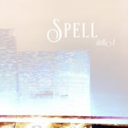

Stella-L
============================

|  |  |
| :--: | :-- |
| [ Stella-L](https://i.xiami.com/stella-l) | **播放数**: 4516729 **粉丝数**: 245 **评论数**: 15 **地区**: China 中国大陆 **风格**: 国语流行 Mandarin Pop, 欧美流行 Western Pop, 电音流行 Electropop, 流行 Pop, 爵士 Jazz  |

## 档案

来自上海的90后女生~

## 专辑

| 名称 | 语种 | 唱片公司 | 发行时间 | 专辑类别 | 专辑风格 |
| :--: | :-- | :-- | :-- | :-- | :-- |
| [ 和你（Cover 余佳运）](./albums/2102778351.md) | 国语 | 独立发行 | 2017年07月06日 | 录音室专辑 | 爵士 Jazz, 节奏布鲁斯 R&B |
| [ 我喜欢上你时的内心活动](./albums/2102769766.md) | 国语 | 独立发行 | 2017年06月22日 | 录音室专辑 | 国语流行 Mandarin Pop |
| [ 心动](./albums/2102749087.md) | 国语 | 独立发行 | 2017年05月16日 | 录音室专辑 | 流行 Pop, 国语流行 Mandarin Pop |
| [ Spell](./albums/2102694879.md) | 英语 | 独立发行 | 2017年02月16日 | 录音室专辑 | 欧美流行 Western Pop, 轻音乐 Easy Listening |
| [ Let me hold u（Cover）](./albums/2102693708.md) | 英语 | 独立发行 | 2017年02月15日 | 录音室专辑 | 流行 Pop, 欧美流行 Western Pop, 电音流行 Electropop |
| [ I'm still loving u](./albums/2102686688.md) | 英语 | 独立发行 | 2017年01月29日 | 录音室专辑 | 流行 Pop |
| [ 从此以后](./albums/2102686231.md) | 国语 | 独立发行 | 2017年01月27日 | 录音室专辑 | 国语流行 Mandarin Pop, 流行 Pop |
| [ Stella's cover](./albums/2102680190.md) | 其他 | 独立发行 | 2016年12月31日 | 录音室专辑 |  |

## 评论

|  |  |  |  |
| :-- | :-- | :-- | :-- |
|  [虾米用户](https://emumo.xiami.com/u/442644319) 一个喜欢电音，纯音乐，动... 2020-08-08 13:30 赞(0) 踩(0) | 
希望像你这样的音乐人能够更多一点
 |
|  [虾米用户](https://emumo.xiami.com/u/4487129)  2020-05-29 05:42 赞(0) 踩(0) | 
！！！
 |
|  [虾米用户](https://emumo.xiami.com/u/356763773) 我还没想好要写什么... 2020-03-18 22:55 赞(0) 踩(0) | 
和你
 |
|  [虾米用户](https://emumo.xiami.com/u/81360686)  回首向来萧瑟处，也无风... 2020-03-01 08:11 赞(0) 踩(0) | 
唱的很好听啊！
 |
|  [虾米用户](https://emumo.xiami.com/u/13526130) 答えのない日々に 溜め息... 2019-12-09 16:41 赞(0) 踩(0) | 
心动很好听
 |
| ⇒ |  [虾米用户](https://emumo.xiami.com/u/243510500) 我还没想好要写什么... 2020-05-05 10:13 赞(0) 踩(0) | 
谢谢 
 |
|  [虾米用户](https://emumo.xiami.com/u/429184166)  2019-11-16 09:49 赞(0) 踩(0) | 
加油(ง •̀_•́)ง
 |
|  [虾米用户](https://emumo.xiami.com/u/293692544) 你敢给我说话吗？我咬你 2019-03-15 17:31 赞(2) 踩(0) | 
好听
 |
|  [虾米用户](https://emumo.xiami.com/u/18413229) 我还没想好要写什么... 2018-10-25 23:41 赞(2) 踩(0) | 
真好听❤️
 |
|  [虾米用户](https://emumo.xiami.com/u/10792732)  2018-09-25 12:46 赞(1) 踩(0) | 
每个设计狗都有一颗弹奏吉他的心。 
 |
|  [虾米用户](https://emumo.xiami.com/u/282996366) Every day is... 2018-04-05 19:06 赞(2) 踩(0) | 
声音好棒
 |
|  [虾米用户](https://emumo.xiami.com/u/270654195) 一个有趣的灵魂却没有好看... 2018-01-04 17:11 赞(1) 踩(0) | 
新大陆
 |
|  [虾米用户](https://emumo.xiami.com/u/49598138)   2017-01-13 22:47 赞(1) 踩(0) | 
好听！加油
 |
|  [虾米用户](https://emumo.xiami.com/u/243510500) 我还没想好要写什么... 2017-01-13 21:46 赞(11) 踩(0) | 
我刚入驻了虾米音乐人，欢迎大家来我的个人主页，收听我的最新音乐
 |
| ⇒ |  [虾米用户](https://emumo.xiami.com/u/10549231) 派大星 2020-07-14 01:19 赞(0) 踩(0) | 
很高兴你来过
 |
