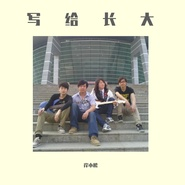

岸小松
============================

|  |  |
| :--: | :-- |
| [ 岸小松](https://i.xiami.com/anxiaosong) | **地区**: China 中国大陆 **风格**: 摇滚 Rock & Roll, 民谣 Folk **播放数**: 1349270 **粉丝数**: 2528 **评论数**: 24  |

## 档案

## 专辑

| 名称 | 语种 | 唱片公司 | 发行时间 | 专辑类别 | 专辑风格 |
| :--: | :-- | :-- | :-- | :-- | :-- |
| [ 这个世界会好吗](./albums/5021654178.md) | 国语 | 独立发行 | 2020年10月10日 | 录音室专辑 | 民谣 Folk, 摇滚 Rock & Roll, 流行 Pop |
| [ 再见少年](./albums/5021619401.md) | 国语 | 独立发行 | 2020年10月05日 | 录音室专辑 | 民谣 Folk, 摇滚 Rock & Roll, 流行 Pop |
| [ 写给长大](./albums/2105408752.md) | 国语 |  | 2019年11月05日 | EP, 单曲 |  |
| [ 岸小松](./albums/2104909758.md) | 国语 |  | 2019年05月29日 | 录音室专辑 | 民谣摇滚 Folk Rock |
| [ Demo辑](./albums/2104851128.md) | 国语 |  | 2019年05月09日 | 录音室专辑 | 摇滚 Rock & Roll |
| [ 爸爸](./albums/2104040079.md) | 国语 | 独立发行 | 2018年09月19日 | EP, 单曲 | 流行摇滚 Pop Rock, 国语流行 Mandarin Pop, 独立民谣 Indie Folk |
| [ 南湖路237号](./albums/2102687800.md) | 国语 | 独立发行 | 2017年04月22日 | 录音室专辑 | 摇滚 Rock & Roll, 独立民谣 Indie Folk, 校园民谣 Campus Folk |

## 评论

|  |  |  |
| :-- | :-- | :-- |
|  [虾米用户](https://emumo.xiami.com/u/8337431) 以乐会友 2020-10-02 21:04 赞(0) 踩(0) | 
单曲循环，纸船。
 |
|  [虾米用户](https://emumo.xiami.com/u/8337431) 以乐会友 2020-08-21 14:41 赞(0) 踩(0) | 
国产民谣魅力男声20200821.23
 |
|  [虾米用户](https://emumo.xiami.com/u/430612512)  2020-03-22 18:55 赞(1) 踩(0) | 
不必客气，歌好好赞
 |
|  [虾米用户](https://emumo.xiami.com/u/343901133) 遇见…… 2020-02-05 10:25 赞(1) 踩(0) | 
不错哦
 |
|  [虾米用户](https://emumo.xiami.com/u/408052580)  2019-08-05 15:57 赞(1) 踩(0) | 
666666666666666666666666666666666666666666666666666666696666 6996666666666666666666666666666666666666666666666666666 6666666666666666666666666666666666666666            6666666666666666     6666   66666666666666    666
 |
|  [虾米用户](https://emumo.xiami.com/u/49895220) 一念静心花开遍世界 2019-06-01 16:51 赞(1) 踩(0) | 
加油
 |
|  [虾米用户](https://emumo.xiami.com/u/378274456)  2019-04-05 14:52 赞(1) 踩(0) | 
你是小可爱吗 求勾搭
 |
|  [虾米用户](https://emumo.xiami.com/u/269372347)  2018-11-24 16:28 赞(1) 踩(0) | 
不错呀小伙，加油
 |
|  [虾米用户](https://emumo.xiami.com/u/402830087)  2018-11-22 11:49 赞(1) 踩(0) | 
我是苏州人，听您这首歌眼前一亮，特别有感觉。
 |
|  [虾米用户](https://emumo.xiami.com/u/333301282) 爱过知情重，醉过知酒浓！... 2018-08-30 06:52 赞(0) 踩(0) | 
沥沥烟雨一季愁，瓣瓣花飞几世情。一场秋雨几度残阳，半卷花事一世离伤，一颗敏感的伤春悲秋之心却是这般伤感，这般无处可逃。我，眼角闪过一滴清泪。愧，于心。 落叶听雨，一方净土真佛境
 |
|  [虾米用户](https://emumo.xiami.com/u/375875467)  2018-06-16 20:10 赞(0) 踩(0) | 
喜欢
 |
|  [虾米用户](https://emumo.xiami.com/u/375248959)  2018-06-10 15:21 赞(0) 踩(0) | 
最喜欢夜莺
 |
|  [虾米用户](https://emumo.xiami.com/u/375248959)  2018-06-10 15:20 赞(0) 踩(0) | 
好听
 |
|  [虾米用户](https://emumo.xiami.com/u/375138128)  2018-06-09 17:23 赞(2) 踩(0) | 
专门为你下载的虾米  
 |
|  [虾米用户](https://emumo.xiami.com/u/375138128)  2018-06-09 16:30 赞(2) 踩(0) | 
加油！前程似锦！  
 |
|  [虾米用户](https://emumo.xiami.com/u/345620159)  2018-03-31 14:52 赞(2) 踩(0) | 
感谢你  很好听 加油
 |
|  [虾米用户](https://emumo.xiami.com/u/1281141) 暂无签名~ 2018-02-01 16:23 赞(3) 踩(0) | 
真心好歌，前途不可限量，加油！
 |
|  [虾米用户](https://emumo.xiami.com/u/345626187)  2018-01-20 22:14 赞(2) 踩(0) | 
歌曲真心不错 
 |
|  [虾米用户](https://emumo.xiami.com/u/345626187)  2018-01-20 22:13 赞(2) 踩(0) | 
看好你 加油  
 |
|  [虾米用户](https://emumo.xiami.com/u/341538469)  2017-12-26 15:00 赞(2) 踩(0) | 
很好听，棒棒的民谣～
 |
|  [虾米用户](https://emumo.xiami.com/u/305875686) 年华 2017-06-22 09:03 赞(2) 踩(0) | 
很好听
 |
|  [虾米用户](https://emumo.xiami.com/u/50483076) 我生命里最大的突破之一，... 2017-03-06 13:00 赞(0) 踩(0) | 
曲风朴实，情感真挚不错的作品！
 |
|  [虾米用户](https://emumo.xiami.com/u/16135450)  2017-02-21 22:47 赞(0) 踩(0) | 
db214
 |
|  [虾米用户](https://emumo.xiami.com/u/80047906)  2017-02-04 17:42 赞(10) 踩(0) | 
很感动，即将离开师院的大四学生，湿润了眼眶。
 |
