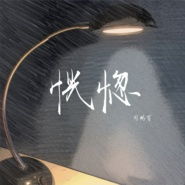

恍惚
============================

|  |  |
| :--: | :-- |
| [ 恍惚](https://emumo.xiami.com/album/2103960675) | **艺人**: [周鹏霄](../index.md) **语种**: 国语 **唱片公司**: 独立发行 **发行时间**: 2018年09月01日 **专辑类别**: EP, 单曲 **专辑风格**: 灵魂乐 Soul, 放克 Funk, 节奏布鲁斯 R&B **播放数**: 107138 **收藏数**: 60 **评论数**: 1  |

## 简介

“这段旅途，终究认输，回望来时路已然只剩恍惚。就算挽留，覆水难收。” 《恍惚》是由杨淼作词，周鹏霄作曲、编曲、制作及演唱的一首单曲。 

## 曲目

## 评论

|  |  |  |  |
| :-- | :-- | :-- | :-- |
|  [虾米用户](https://emumo.xiami.com/u/15791900) 人的社会价值在于少发自拍 2019-12-19 11:47 赞(0) 踩(0) | 
已下载 请下架
 |
