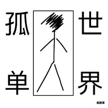

孤单世界
============================

|  |  |
| :--: | :-- |
| [ 孤单世界](https://emumo.xiami.com/album/2104629200) | **艺人**: [周鹏霄](../index.md) **语种**: 国语 **唱片公司**: 声音丛林 **发行时间**: 2019年02月25日 **专辑类别**: EP, 单曲 **专辑风格**: 国语流行 Mandarin Pop **播放数**: 47640 **收藏数**: 1 **评论数**: 6  |

## 简介

“这世界如此孤单，每个人如此不安。” 在这个孤单的世界里，有人来也有人离开，一切正在不断地循环上演。愿我们珍惜当下，不要错失美好。  
  
《孤单世界》是一首周鹏霄和制作人孙一夫合作完成的歌曲，经过了无数次的磨合，最终呈现给大家。  
  
《孤单世界》  
作词：周鹏霄  
作曲：周鹏霄  
编曲：孙一夫 周鹏霄  
混音：孙一夫  
母带：孙一夫  
吉他：孙一夫  
钢琴及合成器：周鹏霄  
贝司：周鹏霄  
鼓：李立楠  
Programming：孙一夫  
 

## 曲目

## 评论

|  |  |  |  |
| :-- | :-- | :-- | :-- |
|  [虾米用户](https://emumo.xiami.com/u/51804712)  2020-02-14 22:17 赞(0) 踩(0) | 
nice kit!
 |
|  [虾米用户](https://emumo.xiami.com/u/12190392)  2020-02-01 07:31 赞(0) 踩(0) | 
喜欢
 |
|  [虾米用户](https://emumo.xiami.com/u/8408765) 我还没想好要写什么... 2019-08-09 14:54 赞(2) 踩(0) | 
希望你坚持自己！
 |
|  [虾米用户](https://emumo.xiami.com/u/47312664) ins：paperclo... 2019-07-14 16:47 赞(1) 踩(0) | 
好听
 |
|  [虾米用户](https://emumo.xiami.com/u/39518556) 撸猫狂魔就是在下。 2019-07-08 21:32 赞(0) 踩(0) | 
能否出个纯伴奏版本
 |
|  [虾米用户](https://emumo.xiami.com/u/20912043)   2019-02-26 08:04 赞(0) 踩(0) | 
人生如轮回，若不相欠，怎会相见
 |
