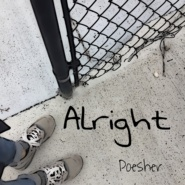
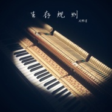

周鹏霄
============================

|  |  |
| :--: | :-- |
| [ 周鹏霄](https://i.xiami.com/poesher) | **地区**: China 中国大陆 **风格**: 节奏布鲁斯 R&B, 放克 Funk, 独立流行 Indie Pop **播放数**: 853630 **粉丝数**: 703 **评论数**: 43  |

## 档案

周鹏霄 制作人、键盘手、唱作人。擅长R&B、Funk风格。于2017年至2019年进修于美国伯克利音乐学院(Berklee College of Music)，主修编曲制作。代表作品有《玩坏》、《你的笑脸》、《星期四》等。

## 专辑

| 名称 | 语种 | 唱片公司 | 发行时间 | 专辑类别 | 专辑风格 |
| :--: | :-- | :-- | :-- | :-- | :-- |
| [ 美梦](./albums/2105194933.md) | 国语 | 声音丛林 | 2019年09月02日 | EP, 单曲 |  |
| [ 一纸门外微电影《禁亦生》主题曲](./albums/2104957819.md) | 国语 |  | 2019年06月22日 | EP, 单曲 | 流行 Pop |
| [ 和有情人做快乐事](./albums/2104844469.md) | 国语 | 声音丛林 | 2019年05月08日 | EP, 单曲 | 国语流行 Mandarin Pop |
| [ 孤单世界](./albums/2104629200.md) | 国语 | 声音丛林 | 2019年02月25日 | EP, 单曲 | 国语流行 Mandarin Pop |
| [ 你的笑脸](./albums/2104307953.md) | 国语 |  | 2018年12月01日 | EP, 单曲 | 合成器放克 Synth Funk, 独立流行 Indie Pop, 节奏布鲁斯 R&B |
| [ 玩坏](./albums/2104179157.md) | 国语 |  | 2018年11月06日 | EP, 单曲 | 合成器流行 Synthpop, 迪斯科 Disco, 独立流行 Indie Pop |
| [ 恍惚](./albums/2103960675.md) | 国语 | 独立发行 | 2018年09月01日 | EP, 单曲 | 灵魂乐 Soul, 放克 Funk, 节奏布鲁斯 R&B |
| [ Hello, Halo](./albums/2103907939.md) | 其他 | 独立发行 | 2018年08月10日 | EP, 单曲 | 未来贝斯 Future Bass, 电子舞曲 EDM / Electronic Dance Music |
| [ 跳一跳](./albums/2103808585.md) | 国语 | 独立发行 | 2018年07月13日 | EP, 单曲 | 独立流行 Indie Pop, 节奏布鲁斯 R&B, 电子 Electronic |
| [ 方拾贰-望月(R&B Remix Version)](./albums/2103751751.md) | 国语 | 独立发行 | 2018年06月17日 | EP, 单曲 | 新灵魂乐 Neo-Soul, 节奏布鲁斯 R&B, 国语流行 Mandarin Pop |
| [ 愚人说](./albums/2103718664.md) | 国语 | 独立发行 | 2018年05月23日 | EP, 单曲 | 国语流行 Mandarin Pop, 灵魂乐 Soul |
| [ Alright](./albums/2103642021.md) | 国语 | 独立发行 | 2018年03月24日 | EP, 单曲 | 放克 Funk, 迪斯科 Disco, 节奏布鲁斯 R&B |
| [ Twilight](./albums/2102969174.md) | 其他 | 独立发行 | 2017年10月09日 | 合集, 杂锦 | 爵士流行 Jazz Pop, 节奏布鲁斯 R&B, 巴萨诺瓦 Bossa Nova |
| [ 生存规则](./albums/2102681750.md) | 国语 | 独立发行 | 2017年01月09日 | 录音室专辑 | 流行 Pop, 节奏布鲁斯 R&B, 放克 Funk |

## 评论

|  |  |  |
| :-- | :-- | :-- |
|  [虾米用户](https://emumo.xiami.com/u/412683582)  2021-01-13 15:40 赞(0) 踩(0) | 
❤️
 |
|  [虾米用户](https://emumo.xiami.com/u/49365982) 当断则断 2021-01-10 16:35 赞(0) 踩(0) | 
♡
 |
|  [虾米用户](https://emumo.xiami.com/u/10372440) 我还没想好要写什么... 2020-12-15 13:03 赞(0) 踩(0) | 
宝藏！！ 
 |
|  [虾米用户](https://emumo.xiami.com/u/347642920) 奔四老阿姨 2020-09-20 22:11 赞(2) 踩(0) | 
才华横溢
 |
|  [虾米用户](https://emumo.xiami.com/u/12334946)  2020-07-27 19:14 赞(2) 踩(0) | 
你应该开通你频道的赞赏功能
 |
|  [虾米用户](https://emumo.xiami.com/u/9062060) 此生没拿一个亿来爱虾米是... 2020-07-18 23:41 赞(1) 踩(0) | 
油菜花
 |
|  [虾米用户](https://emumo.xiami.com/u/314782194) 瞎几把乱听 2020-06-29 23:19 赞(1) 踩(0) | 
好听。
 |
|  [虾米用户](https://emumo.xiami.com/u/349840938) 我还没想好要写什么... 2020-06-05 18:37 赞(2) 踩(0) | 
才子
 |
|  [虾米用户](https://emumo.xiami.com/u/358995000) 散场本是常态 尽兴而归就... 2020-06-02 01:05 赞(4) 踩(0) | 
会看你大火的。
 |
|  [虾米用户](https://emumo.xiami.com/u/375262439) 我还没想好要写什么... 2020-04-25 15:43 赞(2) 踩(0) | 
宝藏男孩
 |
|  [虾米用户](https://emumo.xiami.com/u/6803998) 爱所不当爱 2020-03-17 17:46 赞(1) 踩(0) | 
宝藏男孩 
 |
|  [虾米用户](https://emumo.xiami.com/u/9062060) 此生没拿一个亿来爱虾米是... 2020-03-01 23:20 赞(1) 踩(0) | 
超棒
 |
|  [虾米用户](https://emumo.xiami.com/u/356763773) 我还没想好要写什么... 2020-02-28 11:19 赞(1) 踩(0) | 
~
 |
|  [虾米用户](https://emumo.xiami.com/u/147485008) 我还没想好要写什么... 2020-02-26 00:11 赞(1) 踩(0) | 
伯克利的高材生啊
 |
|  [虾米用户](https://emumo.xiami.com/u/346492287) 虾米不要离开我！ 2020-02-24 09:43 赞(1) 踩(0) | 
支持
 |
|  [虾米用户](https://emumo.xiami.com/u/71178106) 塵世や 酒、風呂を抜け ... 2020-02-11 04:26 赞(2) 踩(0) | 
♡
 |
|  [虾米用户](https://emumo.xiami.com/u/9062060) 此生没拿一个亿来爱虾米是... 2020-02-03 22:39 赞(2) 踩(0) | 
有才华
 |
|  [虾米用户](https://emumo.xiami.com/u/51708894) ʕ•̫͡•ོʔ•̫͡•ཻ... 2019-11-25 05:46 赞(1) 踩(0) | 
55555555粉了粉了！！！
 |
|  [虾米用户](https://emumo.xiami.com/u/11472475) 我还没想好要写什么... 2019-11-12 09:51 赞(2) 踩(0) | 
开培训班我就去学！
 |
|  [虾米用户](https://emumo.xiami.com/u/29937878)  2019-11-09 23:46 赞(1) 踩(0) | 
风格很好，R&amp;amp;amp;B加上蓝调加上Jazz般的魔幻风格，听着很舒服，象靡靡之音一样，好听第一。
 |
|  [虾米用户](https://emumo.xiami.com/u/108363) 不捨蝦米的一切 有意wx... 2019-10-28 00:22 赞(1) 踩(0) | 
优秀
 |
|  [虾米用户](https://emumo.xiami.com/u/50820292) 常常在线 2019-10-19 00:57 赞(1) 踩(0) | 
太好听了！！
 |
|  [虾米用户](https://emumo.xiami.com/u/50820292) 常常在线 2019-10-19 00:56 赞(1) 踩(0) | 
呜呜呜我爱你周鹏宵列表循环
 |
|  [虾米用户](https://emumo.xiami.com/u/590219) 再见了虾米的各位，Q音乐... 2019-10-12 08:25 赞(1) 踩(0) | 
喜欢你的音乐
 |
|  [虾米用户](https://emumo.xiami.com/u/4926807) 你会变成这样都是我害的 2019-09-16 23:18 赞(4) 踩(0) | 
编曲是真的很牛逼了，曲子歌词如果可以多打磨下更好
 |
| ⇒ |  [虾米用户](https://emumo.xiami.com/u/4771470) 暂无签名~ 2020-05-14 14:51 赞(0) 踩(0) | 
编曲确实牛逼
 |
|  [虾米用户](https://emumo.xiami.com/u/47312664) ins：paperclo... 2019-08-10 19:46 赞(2) 踩(0) | 
喜欢你的歌，支持一下！
 |
|  [虾米用户](https://emumo.xiami.com/u/36475786)  2019-07-06 20:37 赞(2) 踩(0) | 
高中的时候文艺汇演第一次听到你唱歌，学长加油，好听
 |
|  [虾米用户](https://emumo.xiami.com/u/2796166) 最爱莫文蔚..... 2019-07-03 00:05 赞(2) 踩(0) | 
加油~~~~
 |
|  [虾米用户](https://emumo.xiami.com/u/3674293) pug lover 2019-06-27 11:48 赞(2) 踩(0) | 
捡到宝的感觉，火前留名
 |
|  [虾米用户](https://emumo.xiami.com/u/297754958)   2019-06-13 11:25 赞(1) 踩(0) | 
你会发光发热的
 |
|  [虾米用户](https://emumo.xiami.com/u/36650495) 我还没想好要写什么... 2019-05-13 12:23 赞(1) 踩(0) | 
相当得行了 真呢
 |
|  [虾米用户](https://emumo.xiami.com/u/12334946)  2019-03-19 20:06 赞(3) 踩(0) | 
我听到你的作品感觉中国音乐有希望了
 |
| ⇒ |  [虾米用户](https://emumo.xiami.com/u/260523338)  2019-03-20 13:16 赞(0) 踩(0) | 
哈哈，谢谢你！中国音乐希望倒不敢当，自己音乐先有希望就好！
 |
|  [虾米用户](https://emumo.xiami.com/u/277434653)  2019-03-05 02:12 赞(0) 踩(0) | 
我发现一件神奇的事！所有不是你自己作词的歌，都么有你自作词作曲好听(个人喜好)！《跳一跳》还有《Aright》等等我都很喜欢~听着半夜能抖起来~《生存规则》砖这名字真是很真实了。感觉更加商业化(还有愚人说)。砖辑同名歌《生存规则》《星期四》是我的菜！(而这两首依然是你自作词曲) ，其他不是自作词曲的歌没那么喜欢，作曲很好听编曲也出色但是，可能因为不是你自己的词我听着觉得唱得没那么带劲儿……(是说可能我思路有点清奇，所以对你唱慢节奏抒情歌不太感冒)  对辽，合作曲都很好听！ 其实想听更多你自作词曲的歌捂脸…… 请你加油！请你一路走下去！ (:哇你的歌真的首首都好听！
 |
| ⇒ |  [虾米用户](https://emumo.xiami.com/u/260523338)  2019-03-05 23:27 赞(0) 踩(0) | 
谢谢你！看来我以后还是多努力写写词了哈哈，不过那些别人帮我写的词我自己也挺喜欢的
 |
|  [虾米用户](https://emumo.xiami.com/u/2709429) 白白米饭、豆腐鸡蛋、青菜... 2019-01-16 11:55 赞(2) 踩(0) | 
你，你，你，好棒！
 |
|  [虾米用户](https://emumo.xiami.com/u/400890173)  2018-10-01 11:48 赞(1) 踩(0) | 
期待新的作品
 |
|  [虾米用户](https://emumo.xiami.com/u/305785723) hello world 2018-06-26 20:50 赞(2) 踩(0) | 
兄弟加个微信交流下哈哈哈 喜欢你的风格
 |
|  [虾米用户](https://emumo.xiami.com/u/11017913) 爵士呆瓜 WeiBo:是... 2018-01-09 08:54 赞(0) 踩(0) | 
呼呼
 |
|  [虾米用户](https://emumo.xiami.com/u/5327138) 2021虾米最后一首新歌... 2017-12-14 19:37 赞(0) 踩(0) | 
顶你顶你小gay
 |
| ⇒ |  [虾米用户](https://emumo.xiami.com/u/260523338)  2017-12-16 11:54 赞(0) 踩(0) | 
哈哈，好兄弟666
 |
|  [虾米用户](https://emumo.xiami.com/u/260523338)  2017-01-17 15:23 赞(3) 踩(0) | 
我刚入驻了虾米音乐人，欢迎大家来我的个人主页，收听我的最新音乐
 |
