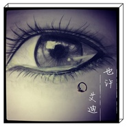
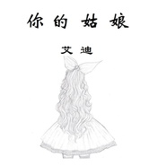

艾迪Eddie
============================

|  |  |
| :--: | :-- |
| [ 艾迪Eddie](https://i.xiami.com/eddierockson) | **地区**: China 中国大陆 **风格**: 流行摇滚 Pop Rock, 流行 Pop **播放数**: 1502898 **粉丝数**: 83 **评论数**: 3  |

## 档案

## 专辑

| 名称 | 语种 | 唱片公司 | 发行时间 | 专辑类别 | 专辑风格 |
| :--: | :-- | :-- | :-- | :-- | :-- |
| [ 夏末](./albums/5022447086.md) | 国语 |  | 2020年09月28日 | EP, 单曲 |  |
| [ 恐婚的人](./albums/5022412186.md) | 国语 |  | 2020年04月30日 | EP, 单曲 |  |
| [ 异乡客](./albums/5022450523.md) | 国语 |  | 2020年03月22日 | EP, 单曲 |  |
| [ 宁愿你不是传奇黑曼巴](./albums/5022420683.md) | 国语 |  | 2020年02月08日 | EP, 单曲 |  |
| [ 对岸的万家灯火](./albums/5022532798.md) | 国语 |  | 2020年01月01日 | EP, 单曲 |  |
| [ 艾迪Demo集](./albums/5022478167.md) | 国语 |  | 2019年10月30日 | EP, 单曲 |  |
| [ 患得患失](./albums/5022542690.md) | 国语 |  | 2019年09月26日 | EP, 单曲 |  |
| [ 杭州如你](./albums/5022460652.md) | 国语 |  | 2019年08月30日 | EP, 单曲 |  |
| [ 再见了，姑娘](./albums/2104967537.md) | 国语 |  | 2019年06月29日 | EP, 单曲 | 民谣流行 Folk Pop |
| [ 也许](./albums/2104917989.md) | 国语 |  | 2019年06月01日 | EP, 单曲 | 英伦摇滚 Britpop |
| [ 晚安](./albums/2104897218.md) | 国语 |  | 2019年05月25日 | EP, 单曲 | 流行 Pop |
| [ 南北厦门的毕业季](./albums/2104854176.md) | 国语 |  | 2019年05月10日 | EP, 单曲 | 民谣 Folk, 流行 Pop |
| [ 你的姑娘](./albums/2104760261.md) | 国语 |  | 2019年04月10日 | EP, 单曲 | 流行 Pop |
| [ 别把我们这个城市炒火](./albums/2104729554.md) | 国语 |  | 2019年03月31日 | EP, 单曲 | 民谣 Folk |
| [ 迷了路](./albums/2104594756.md) | 国语 |  | 2019年02月13日 | EP, 单曲 | 国语流行 Mandarin Pop |
| [ 向阳](./albums/2104167273.md) | 国语 |  | 2018年11月01日 | EP, 单曲 | 民谣 Folk, 民谣流行 Folk Pop |
| [ 青梅2018](./albums/2104085155.md) | 国语 | 独立发行 | 2018年10月08日 | EP, 单曲 | 民谣 Folk |

## 评论

|  |  |  |
| :-- | :-- | :-- |
|  [虾米用户](https://emumo.xiami.com/u/29130310) 萤火的流光 夏夜的微凉 2018-04-27 09:40 赞(0) 踩(0) | 
啦啦啦~
 |
| ⇒ |  [虾米用户](https://emumo.xiami.com/u/95711246) 一首歌，一种感动 2018-04-28 17:37 赞(0) 踩(0) | 
兔子先生
 |
|  [虾米用户](https://emumo.xiami.com/u/95711246) 一首歌，一种感动 2017-01-17 21:54 赞(0) 踩(0) | 
我刚入驻了虾米音乐人，欢迎大家来我的个人主页，收听我的最新音乐
 |
