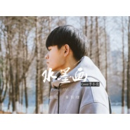
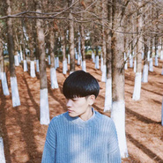

章智捷
============================

|  |  |
| :--: | :-- |
| [ 章智捷](https://i.xiami.com/secondlife) | **地区**: China 中国大陆 **风格**: 流行 Pop, 国语流行 Mandarin Pop **播放数**: 9883243 **粉丝数**: 1287 **评论数**: 65  |

## 档案

章智捷，独立音乐人，唱作人 
95后，苏州人，现读于苏州大学环境艺术专业 
苏州魔方Loft驻唱歌手 
江苏综艺频道“十月歌正红”表演嘉宾 
苏州城市运动宣传曲“跃动苏州”原唱之一 
2016网易云音乐“音乐维他命全国校园歌唱比赛”10强 
2016网易云音乐“第三届全国校园歌手大赛”18强 
2016 TED explorYouth@SuZhou表演嘉宾 
2017年1月1日发行第一首原创单曲《她的梦》

## 专辑

| 名称 | 语种 | 唱片公司 | 发行时间 | 专辑类别 | 专辑风格 |
| :--: | :-- | :-- | :-- | :-- | :-- |
| [ Allfallsdown (中文版)](./albums/2108288385.md) | 国语 | 禾信科技 | 2020年03月31日 | EP, 单曲 | 国语流行 Mandarin Pop |
| [ 词缀](./albums/2104969636.md) | 国语 | 咚吧嗒文化 | 2019年07月01日 | EP, 单曲 |  |
| [ Lemon](./albums/2103833159.md) | 日语 | 独立发行 | 2018年07月22日 | EP, 单曲 | 流行 Pop |
| [ 无非](./albums/2103515245.md) | 国语 | 独立发行 | 2018年02月06日 | EP, 单曲 | 国语流行 Mandarin Pop |
| [ 水墨画](./albums/2103490540.md) | 国语 | 独立发行 | 2018年01月16日 | EP, 单曲 | 国语流行 Mandarin Pop |
| [ 2017翻唱合集](./albums/2103489602.md) | 国语 | 独立发行 | 2018年01月14日 | EP, 单曲 | 国语流行 Mandarin Pop |
| [ 她的梦](./albums/2102682007.md) | 国语 | 独立发行 | 2017年01月01日 | EP, 单曲 | 流行 Pop, 国语流行 Mandarin Pop |

## 评论

|  |  |  |
| :-- | :-- | :-- |
|  [虾米用户](https://emumo.xiami.com/u/361301855) 脚好了，快可以打羽毛球了 2020-12-15 19:45 赞(0) 踩(0) | 
自己唱的？
 |
|  [虾米用户](https://emumo.xiami.com/u/205151039) 新石器时代的非中产外星人 2020-07-03 22:39 赞(0) 踩(0) | 
苏州人!
 |
|  [虾米用户](https://emumo.xiami.com/u/210842120) 我还没想好要写什么... 2020-06-03 12:46 赞(0) 踩(0) | 
还以为是原唱
 |
|  [虾米用户](https://emumo.xiami.com/u/344038935) 我还没想好要写什么... 2020-06-01 15:19 赞(0) 踩(0) | 
阿捷，能不能唱一下《想见你》 
 |
|  [虾米用户](https://emumo.xiami.com/u/430985731) 一打老婆餅，走餅唔該！！... 2020-04-14 10:02 赞(0) 踩(0) | 
怎么拉黑这个人，不想搜到它唱的
 |
|  [虾米用户](https://emumo.xiami.com/u/350424615)  2020-04-02 11:02 赞(0) 踩(0) | 
《sad song 》啥时候在虾米播阿？好喜欢
 |
|  [虾米用户](https://emumo.xiami.com/u/254844573) 来日方长 2020-03-27 13:47 赞(0) 踩(0) | 
半夏[叹号问好]
 |
|  [虾米用户](https://emumo.xiami.com/u/439289253) I am better ... 2020-02-21 19:19 赞(0) 踩(0) | 
lemon唱出了渣男版 
 |
|  [虾米用户](https://emumo.xiami.com/u/421720321)  2019-12-11 23:52 赞(0) 踩(0) | 
还是可以
 |
|  [虾米用户](https://emumo.xiami.com/u/52833239) 四维 2019-09-19 14:12 赞(1) 踩(0) | 
必刷他的作品啊，觉得他扎小辫子的时候很帅很酷
 |
|  [虾米用户](https://emumo.xiami.com/u/8939466) ALL HIGH XXX... 2019-08-27 14:26 赞(4) 踩(0) | 
不建议照搬他人专辑封面，即使是翻唱。
 |
|  [虾米用户](https://emumo.xiami.com/u/38433043) Te amo 2019-08-20 09:52 赞(0) 踩(0) | 
为什么在虾米只上传那么几首歌，其它平台都很多
 |
|  [虾米用户](https://emumo.xiami.com/u/412384371)  2019-08-19 18:21 赞(0) 踩(0) | 
好听好听
 |
|  [虾米用户](https://emumo.xiami.com/u/318121274)  2019-08-07 21:33 赞(2) 踩(0) | 
加油啊太棒了
 |
|  [虾米用户](https://emumo.xiami.com/u/358099758)  2019-07-24 07:04 赞(0) 踩(0) | 
比原唱好听呢
 |
| ⇒ |  [虾米用户](https://emumo.xiami.com/u/318121274)  2019-08-07 21:34 赞(0) 踩(0) | 
这还真没有 可不要拉仇恨黑粉啊
 |
|  [虾米用户](https://emumo.xiami.com/u/332046296) 웨이ui_iu 2019-06-16 17:05 赞(1) 踩(0) | 
小哥哥加油ง 有被你的歌声感动到 
 |
|  [虾米用户](https://emumo.xiami.com/u/406080269) 平凡致极，大概是那种你对... 2019-06-08 07:57 赞(1) 踩(0) | 
厉害
 |
|  [虾米用户](https://emumo.xiami.com/u/346097888) 只爱伯贤❤❤❤❤❤ 2019-04-17 22:19 赞(3) 踩(0) | 
声音很清澈，一听就能把人抓住的那种
 |
|  [虾米用户](https://emumo.xiami.com/u/261098075)  2019-04-16 23:39 赞(3) 踩(0) | 
真的好听啊…
 |
|  [虾米用户](https://emumo.xiami.com/u/288872589) 知音难觅… 2019-04-12 21:30 赞(4) 踩(0) | 
声色很撩，衣品也高，又精通多种语言~
 |
|  [虾米用户](https://emumo.xiami.com/u/93773590) AI永不倒 2019-04-07 00:38 赞(1) 踩(0) | 
我是第700个，哈哈
 |
|  [虾米用户](https://emumo.xiami.com/u/43361709) 我是谁就会遇见谁 2019-04-05 23:45 赞(1) 踩(0) | 
好听，加油
 |
|  [虾米用户](https://emumo.xiami.com/u/36691845) 暂无签名~ 2019-04-02 11:03 赞(0) 踩(0) | 
唱吧唱到骨子裡
 |
|  [虾米用户](https://emumo.xiami.com/u/403983935)  2019-03-31 10:39 赞(0) 踩(0) | 
好听，能让人静下心来
 |
|  [虾米用户](https://emumo.xiami.com/u/226305483)   2019-03-22 13:06 赞(0) 踩(0) | 
超好听
 |
|  [虾米用户](https://emumo.xiami.com/u/38600585) 弱者滔滔不绝，强者毫不在... 2019-03-09 18:30 赞(1) 踩(0) | 
唱的挺好，但是感觉有点气不足，熬夜熬的？
 |
|  [虾米用户](https://emumo.xiami.com/u/30192803) 嘿～ 2019-03-03 21:37 赞(0) 踩(0) | 
哇喔，还是老乡
 |
|  [虾米用户](https://emumo.xiami.com/u/30192803) 嘿～ 2019-03-03 21:36 赞(1) 踩(0) | 
原来是中国人呀，我说日本人怎么这种名字呢 
 |
|  [虾米用户](https://emumo.xiami.com/u/47533266) 暂无签名~ 2019-02-21 05:43 赞(0) 踩(0) | 
我也是环境设计的……哇这样的小哥唱歌还那么好听啊！！！喜欢！！加油！希望多听到你的声音
 |
|  [虾米用户](https://emumo.xiami.com/u/781066)  2019-02-19 05:09 赞(0) 踩(0) | 
好久没听过这种声线，真的好听，加油！
 |
|  [虾米用户](https://emumo.xiami.com/u/407217718)  2019-01-31 15:38 赞(1) 踩(0) | 
远在家乡的思念，难以维持自己需要的生存 ，我背上梦想出发在东南亚，这里的生存机会 机遇很多看到了梦寐以求的水果天堂，一个月也最少一万让我不舍回家我不想放弃生存梦想！有多少人永远活在懦弱当中，害怕现实的残酷，无法面对生活的压力。可以选择和我一起奋斗！远离所有评判的懦弱 可以得到更多的机遇， 扣扣 1764018393
 |
|  [虾米用户](https://emumo.xiami.com/u/379639210) 我还没想好要写什么... 2019-01-24 08:57 赞(20) 踩(0) | 
你唱的lemon我真的好爱！！！！！声音超好听！！！！彻底爱了
 |
|  [虾米用户](https://emumo.xiami.com/u/375818672) 我们高处见！ 2019-01-22 10:29 赞(1) 踩(0) | 
表白表白！  今天听见你的声音，是你翻唱薛之谦的你还要我怎样，感觉和原唱差不多诶，就想知道是什么神仙声音啊，进主页听了所有歌曲，声音多是给了我清澈的感觉，（钟爱民谣）还有啊，我喜欢五月天，看见你收藏了五月天的歌曲好感度又加一啦！哈哈哈哈 要是翻唱民谣就好了。
 |
|  [虾米用户](https://emumo.xiami.com/u/412645526)  2019-01-20 11:25 赞(0) 踩(0) | 
我80后，工作忙碌，家庭孩子，很少听到让自己喜欢的声音了，喜欢你
 |
|  [虾米用户](https://emumo.xiami.com/u/412645526)  2019-01-20 11:23 赞(0) 踩(0) | 
在哪里找你唱你莫妮卡完整版
 |
|  [虾米用户](https://emumo.xiami.com/u/304896641) 我以为…很好 2019-01-11 10:35 赞(0) 踩(0) | 
很好听
 |
|  [虾米用户](https://emumo.xiami.com/u/18659878) 暂无签名~ 2019-01-08 22:20 赞(0) 踩(0) | 
棒棒哒
 |
|  [虾米用户](https://emumo.xiami.com/u/4723388) 我还没想好要写什么... 2018-11-14 19:26 赞(20) 踩(0) | 
对日文发音极其苛刻的我很久没有听到过翻唱日文听不出一丝破绽的歌手了，前途无量！加油！
 |
|  [虾米用户](https://emumo.xiami.com/u/7758352) 我还没想好要写什么... 2018-11-11 08:35 赞(0) 踩(0) | 
偶然进来 感觉还蛮棒的！
 |
|  [虾米用户](https://emumo.xiami.com/u/94908784) 我永远爱五月天！ 2018-10-21 15:58 赞(1) 踩(0) | 
大五迷
 |
|  [虾米用户](https://emumo.xiami.com/u/402902133)  2018-10-19 08:07 赞(2) 踩(0) | 
翻唱的日文歌，没找到
 |
|  [虾米用户](https://emumo.xiami.com/u/188842549)  2018-10-15 00:30 赞(1) 踩(0) | 
在破站关注到你，原来你是在虾米呀  
 |
|  [虾米用户](https://emumo.xiami.com/u/190050802)  2018-10-13 09:47 赞(1) 踩(0) | 
呐 喜欢你❤️
 |
|  [虾米用户](https://emumo.xiami.com/u/403174895)  2018-09-04 23:14 赞(15) 踩(0) | 
坐等东京吃货   
 |
|  [虾米用户](https://emumo.xiami.com/u/231520812)  2018-08-28 20:24 赞(1) 踩(0) | 
你好
 |
|  [虾米用户](https://emumo.xiami.com/u/101862356)  2018-08-27 18:43 赞(2) 踩(0) | 
听完薛之谦的，你还要我怎样，直接进来把所有歌听一遍
 |
|  [虾米用户](https://emumo.xiami.com/u/363019917)  2018-08-11 03:04 赞(2) 踩(0) | 
阿捷还来虾米么？
 |
|  [虾米用户](https://emumo.xiami.com/u/379219766)  2018-07-22 23:31 赞(1) 踩(0) | 
哈哈哈，好喜欢你的
 |
|  [虾米用户](https://emumo.xiami.com/u/369877468)  2018-07-11 19:31 赞(1) 踩(0) | 
为了你特地下了虾米音乐
 |
|  [虾米用户](https://emumo.xiami.com/u/336135144)  2018-06-28 22:45 赞(1) 踩(0) | 
听了男孩 圈粉了 在考虑要不要下抖音 只为了你
 |
|  [虾米用户](https://emumo.xiami.com/u/361265095) 我还没想好要写什么... 2018-04-30 11:13 赞(1) 踩(0) | 
阴天快乐唱得真好.稳.支持你
 |
|  [虾米用户](https://emumo.xiami.com/u/304505709)  2018-03-27 21:17 赞(2) 踩(0) | 
我想听   一个又一个， 
 |
|  [虾米用户](https://emumo.xiami.com/u/20177386) 感谢一切美好的遇见❤️ 2018-03-21 00:01 赞(0) 踩(0) | 

 |
|  [虾米用户](https://emumo.xiami.com/u/346853053)  2018-01-30 23:25 赞(0) 踩(0) | 
好听
 |
|  [虾米用户](https://emumo.xiami.com/u/72666568)  2017-08-04 08:21 赞(0) 踩(0) | 
蛮好的。
 |
|  [虾米用户](https://emumo.xiami.com/u/294972277) 我们一直忘了要搭一座桥 ... 2017-05-22 10:42 赞(1) 踩(0) | 
就知道虾米也有你！感觉你以后的歌也会要钱买
 |
|  [虾米用户](https://emumo.xiami.com/u/256490299)  2017-02-09 10:45 赞(0) 踩(0) | 
喜欢你的声音 啦啦
 |
|  [虾米用户](https://emumo.xiami.com/u/256490299)  2017-02-09 10:45 赞(0) 踩(0) | 
很棒哦 继续加油~
 |
|  [虾米用户](https://emumo.xiami.com/u/244098032)   2017-01-23 11:32 赞(1) 踩(0) | 
好听 可是下载不了 
 |
| ⇒ |  [虾米用户](https://emumo.xiami.com/u/175010744) 期待一趟旅程 2017-01-24 19:25 赞(0) 踩(0) | 
现在可以了❤️
 |
|  [虾米用户](https://emumo.xiami.com/u/23696684)   2017-01-20 16:49 赞(0) 踩(0) | 
第一个 第一个～
 |
| ⇒ |  [虾米用户](https://emumo.xiami.com/u/175010744) 期待一趟旅程 2017-01-21 02:24 赞(0) 踩(0) | 
666
 |
|  [虾米用户](https://emumo.xiami.com/u/175010744) 期待一趟旅程 2017-01-18 00:34 赞(1) 踩(0) | 
我刚入驻了虾米音乐人，欢迎大家来我的个人主页，收听我的最新音乐
 |
| ⇒ |  [虾米用户](https://emumo.xiami.com/u/405217443)  2018-09-30 20:55 赞(0) 踩(0) | 
什么时候能来个完整的Unravel
 |
