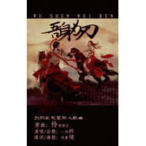

【天策.】
============================

|  |  |
| :--: | :-- |
| [ 【天策.】](https://emumo.xiami.com/album/2102694160) | **艺人**: [一衫衿](../index.md) **语种**: 国语 **唱片公司**: 独立发行 **发行时间**: 2017年02月17日 **专辑类别**: 录音室专辑 **专辑风格**: 同人音乐 DouJin, 国语流行 Mandarin Pop, 古风 GuFeng Music, 现代古典 Modern Classical **播放数**: 166187 **收藏数**: 11 **评论数**: 1  |

## 简介

剑3天策吾身为刃—发发和大魔王主题曲 

## 曲目

## 评论

|  |  |  |
| :-- | :-- | :-- |
|  [虾米用户](https://emumo.xiami.com/u/1833374) nia~nia~风浪太大 2017-06-18 00:53 赞(0) 踩(0) | 
啊啊啊啊啊！！！虾米终于有了啊！！！这首歌太棒啦！！！
 |
