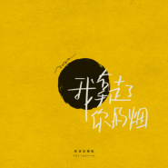

我拿走了你的烟
============================

|  |  |
| :--: | :-- |
| [ 我拿走了你的烟](https://emumo.xiami.com/album/5022320530) | **艺人**: [家雀儿乐队](../index.md) **语种**: 国语 **唱片公司**: StreetVoice, 果实微光 **发行时间**: 2021年01月12日 **专辑类别**: EP, 单曲 **专辑风格**: 摇滚 Rock & Roll **播放数**: 29 **收藏数**: 0 **评论数**: 0  |

## 简介

我拿走了你的烟，我也只能拿走你的烟，在离开你的夜晚。

从此，各找各的渡口，各坐各的归舟。

一时间难以释怀，却不得不洒脱分开。

再见，还不如不相见。

## 曲目

## 评论

