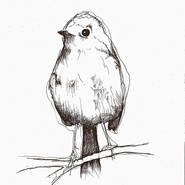

家雀儿乐队
============================

|  |  |
| :--: | :-- |
| [ 家雀儿乐队](https://i.xiami.com/jiaqiaoer) | **播放数**: 90218 **粉丝数**: 216 **评论数**: 10 **地区**: China 中国大陆 **风格**: 独立摇滚 Indie Rock, 摇滚 Rock & Roll, 后摇 Post-Rock, 流行摇滚 Pop Rock  |

## 档案

## 专辑

| 名称 | 语种 | 唱片公司 | 发行时间 | 专辑类别 | 专辑风格 |
| :--: | :-- | :-- | :-- | :-- | :-- |
| [ 我拿走了你的烟](./albums/5022320530.md) | 国语 | StreetVoice, 果实微光 | 2021年01月12日 | EP, 单曲 | 摇滚 Rock & Roll |
| [ 请为我点亮孤独的光](./albums/5022368316.md) | 国语 | StreetVoice, 果实微光 | 2021年01月11日 | EP, 单曲 | 摇滚 Rock & Roll |
| [ 幸福南路没有北](./albums/2102707052.md) | 国语 | 独立发行 | 2017年03月08日 | EP, 单曲 | 独立摇滚 Indie Rock, 流行摇滚 Pop Rock, 摇滚 Rock & Roll |

## 评论

|  |  |  |  |
| :-- | :-- | :-- | :-- |
|  [虾米用户](https://emumo.xiami.com/u/288536407)  2021-01-14 11:18 赞(0) 踩(0) | 
有点意思的乐队
 |
|  [虾米用户](https://emumo.xiami.com/u/52452667) 青春的人兒啊，想想一個人... 2019-01-17 00:30 赞(0) 踩(0) | 
好听
 |
|  [虾米用户](https://emumo.xiami.com/u/536056) 记得下辈子早点来娶我… 2018-11-15 22:09 赞(0) 踩(0) | 
可以多写写自我介绍呀
 |
|  [虾米用户](https://emumo.xiami.com/u/37797684) 我还没想好要写什么... 2017-10-05 05:47 赞(0) 踩(0) | 
南京森林音乐节，爱上你
 |
| ⇒ |  [虾米用户](https://emumo.xiami.com/u/271401237)  2017-10-05 07:31 赞(0) 踩(0) | 
可以在网易听到我们的歌哦 
 |
| ⇒ |  [虾米用户](https://emumo.xiami.com/u/37797684) 我还没想好要写什么... 2017-10-05 08:18 赞(0) 踩(0) | 
<q><b>家雀儿乐队说：</b></q>
 |
| ⇒ |  [虾米用户](https://emumo.xiami.com/u/37797684) 我还没想好要写什么... 2017-10-05 09:22 赞(0) 踩(0) | 
<q><b>家雀儿乐队说：</b></q>
 |
| ⇒ |  [虾米用户](https://emumo.xiami.com/u/271401237)  2017-10-05 10:02 赞(0) 踩(0) | 
<q><b>rosewu9939说：</b></q>
 |
|  [虾米用户](https://emumo.xiami.com/u/47195966) qq音乐同名。 2017-07-01 12:51 赞(0) 踩(0) | 
吼
 |
|  [虾米用户](https://emumo.xiami.com/u/271401237)  2017-02-11 23:38 赞(1) 踩(0) | 
我刚入驻了虾米音乐人，欢迎大家来我的个人主页，收听我的最新音乐
 |
