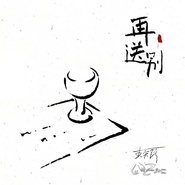
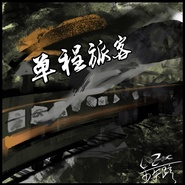
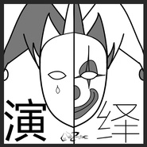
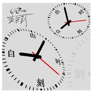
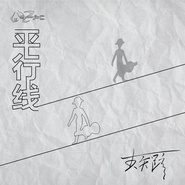

李知蹊
============================

|  |  |
| :--: | :-- |
| [ 李知蹊](https://i.xiami.com/lizhixi) | **播放数**: 5577071 **粉丝数**: 715 **评论数**: 31 **地区**: China 中国大陆 **风格**: 当代民谣 Contemporary Folk, 城市民谣 Urban Folk, 独立民谣 Indie Folk, 国语流行 Mandarin Pop, 流行 Pop  |

## 档案

## 专辑

| 名称 | 语种 | 唱片公司 | 发行时间 | 专辑类别 | 专辑风格 |
| :--: | :-- | :-- | :-- | :-- | :-- |
| [ 桃花赋(LIVE版)](./albums/2104998845.md) | 国语 |  | 2019年07月16日 | EP, 单曲 | 流行 Pop |
| [ 再送别](./albums/2103703939.md) | 国语 | 独立发行 | 2018年05月08日 | EP, 单曲 | 独立民谣 Indie Folk, 民谣流行 Folk Pop, 流行 Pop |
| [ 写不完的歌](./albums/2103661898.md) | 国语 | 独立发行 | 2018年04月03日 | EP, 单曲 | 当代民谣 Contemporary Folk, 独立民谣 Indie Folk, 城市民谣 Urban Folk |
| [ 单程旅客](./albums/2103597709.md) | 国语 | 独立发行 | 2018年03月09日 | EP, 单曲 | 民谣 Folk, 城市民谣 Urban Folk, 独立民谣 Indie Folk |
| [ 风云流转](./albums/2102880893.md) | 国语 | 独立发行 | 2017年10月26日 | EP, 单曲 | 民谣 Folk, 独立民谣 Indie Folk, 流行 Pop |
| [ 演绎](./albums/2102855703.md) | 国语 | 独立发行 | 2017年09月12日 | EP, 单曲 | 当代民谣 Contemporary Folk, 独立民谣 Indie Folk, 国语流行 Mandarin Pop |
| [ 自由时刻](./albums/2102818257.md) | 国语 | 独立发行 | 2017年08月22日 | EP, 单曲 | 民谣 Folk, 摇滚 Rock & Roll |
| [ 平行线](./albums/2102807773.md) | 国语 | 独立发行 | 2017年08月03日 | EP, 单曲 | 流行 Pop, 当代唱作人 Contemporary Singer-Songwriter, 民谣 Folk |
| [ 路没有华丽，没有喧嚣，就这样，在路上缓缓前行。](./albums/2102692774.md) | 国语 | 独立发行 | 2017年02月09日 | 录音室专辑 | 独立民谣 Indie Folk, 城市民谣 Urban Folk, 民谣流行 Folk Pop |

## 评论

|  |  |  |  |
| :-- | :-- | :-- | :-- |
|  [虾米用户](https://emumo.xiami.com/u/8337431) 以乐会友 2020-10-01 00:58 赞(0) 踩(0) | 
20201001.31
 |
|  [虾米用户](https://emumo.xiami.com/u/380107669)  2020-05-17 16:42 赞(2) 踩(0) | 
兄弟，我就靠你这首歌目前从北京自驾到了西藏。下一步从那曲上青藏去青海。
 |
|  [虾米用户](https://emumo.xiami.com/u/432650569)   2020-03-20 02:34 赞(1) 踩(0) | 
牛逼
 |
|  [虾米用户](https://emumo.xiami.com/u/1721418)  2020-02-16 14:35 赞(0) 踩(0) | 
我也觉得声音蛮好听的 
 |
|  [虾米用户](https://emumo.xiami.com/u/16696912) kiss rain 2020-02-10 20:00 赞(0) 踩(0) | 
加油
 |
|  [虾米用户](https://emumo.xiami.com/u/16696912) kiss rain 2020-02-10 20:00 赞(0) 踩(0) | 
被战栗吸引而来  曲风挺有意思的
 |
|  [虾米用户](https://emumo.xiami.com/u/411757515)  2019-12-13 22:22 赞(0) 踩(0) | 
唱腔条件不好，词也写的差点意思，文学功底稍逊。
 |
|  [虾米用户](https://emumo.xiami.com/u/422058306) silence  is ... 2019-12-07 18:26 赞(1) 踩(0) | 
喜欢所有的歌曲！期待更多的作品加油！
 |
|  [虾米用户](https://emumo.xiami.com/u/376592886) 来，干了这碗鸡汤！ 2019-03-24 08:14 赞(3) 踩(0) | 
好喜欢他的歌，所有的歌！
 |
|  [虾米用户](https://emumo.xiami.com/u/15670731) 相信自己。 2019-01-05 10:17 赞(3) 踩(0) | 
唱的不错写的深意会更加棒。
 |
|  [虾米用户](https://emumo.xiami.com/u/408035215)  2018-12-07 19:02 赞(0) 踩(0) | 

 |
|  [虾米用户](https://emumo.xiami.com/u/247192823)  2018-11-05 09:44 赞(0) 踩(0) | 
加油
 |
|  [虾米用户](https://emumo.xiami.com/u/330290962)  2018-09-28 14:55 赞(0) 踩(0) | 

 |
|  [虾米用户](https://emumo.xiami.com/u/375283005) 天南地北四方客  万水千... 2018-07-22 15:00 赞(1) 踩(0) | 
加油，中间代。
 |
|  [虾米用户](https://emumo.xiami.com/u/342250068) 听歌，没啥说的 2018-05-26 00:25 赞(0) 踩(0) | 
1900&amp;hellip;&amp;hellip;这样也行？
 |
|  [虾米用户](https://emumo.xiami.com/u/245560002) 我还没想好要写什么... 2018-04-17 22:12 赞(1) 踩(0) | 
确定是00后吗  
 |
|  [虾米用户](https://emumo.xiami.com/u/261463984) 你是生活的勇士，你也是自... 2018-04-17 06:01 赞(1) 踩(0) | 
好音乐，好歌好民谣，词曲都是自己作，欣赏有才情的音乐人。
 |
|  [虾米用户](https://emumo.xiami.com/u/39243662)   2018-04-15 08:49 赞(1) 踩(0) | 
00后？
 |
| ⇒ |  [虾米用户](https://emumo.xiami.com/u/273136374) 用不同的方式谱写人生 2018-04-15 13:08 赞(0) 踩(0) | 
1900后
 |
|  [虾米用户](https://emumo.xiami.com/u/123843716) 坚定 2018-03-20 10:53 赞(0) 踩(0) | 
我来过～
 |
|  [虾米用户](https://emumo.xiami.com/u/1175342) 南瓜不说话，只默默生长着 2018-02-16 04:55 赞(2) 踩(0) | 
感觉和陈鸿宇是一类的，非常舒服的声音和歌词
 |
|  [虾米用户](https://emumo.xiami.com/u/51605091) 三十未立 常梦常醒 2018-01-20 15:43 赞(1) 踩(0) | 
声音很诚实
 |
|  [虾米用户](https://emumo.xiami.com/u/319499629)  2017-09-16 21:45 赞(1) 踩(0) | 
歌词真，声音真
 |
|  [虾米用户](https://emumo.xiami.com/u/8918727)  2017-08-04 18:14 赞(2) 踩(0) | 
词曲写的很好，声音也好听！ 
 |
|  [虾米用户](https://emumo.xiami.com/u/4189102) 我是我。 2017-07-03 09:38 赞(1) 踩(0) | 
公路片都会来找你要版权吧 
 |
| ⇒ |  [虾米用户](https://emumo.xiami.com/u/273136374) 用不同的方式谱写人生 2017-07-03 11:10 赞(0) 踩(0) | 
那我应该设个收费站
 |
| ⇒ |  [虾米用户](https://emumo.xiami.com/u/4189102) 我是我。 2017-07-04 00:36 赞(0) 踩(0) | 
<q><b>李知蹊说：</b></q>
 |
|  [虾米用户](https://emumo.xiami.com/u/302327288)  2017-06-06 15:19 赞(1) 踩(0) | 
好听，生活阅历的呕心之作
 |
|  [虾米用户](https://emumo.xiami.com/u/228437414)  2017-05-29 20:17 赞(2) 踩(0) | 
这么牛掰的艺人，才两个粉丝，好吧算上我一个，三个～
 |
|  [虾米用户](https://emumo.xiami.com/u/4378288)  2017-03-13 18:40 赞(0) 踩(0) | 
喜欢这个声音
 |
|  [虾米用户](https://emumo.xiami.com/u/4378288)  2017-03-13 18:40 赞(0) 踩(0) | 
喜欢这个声音
 |
