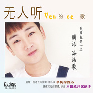

第一次 闽语海话歌 vence无人听的歌vence无人听的歌
============================

|  |  |
| :--: | :-- |
| [ 第一次 闽语海话歌 vence无人听的歌vence无人听的歌](https://emumo.xiami.com/album/2103731668) | **艺人**: [吴国良](../index.md) **语种**: 闽南语 **唱片公司**: 独立发行 **发行时间**: 2018年06月06日 **专辑类别**: 录音室专辑 **专辑风格**: 独立流行 Indie Pop **播放数**: 10416 **收藏数**: 19 **评论数**: 3  |

## 简介

 吴国良第一次，闽语海话系的歌曲，选择自己母语来唱歌，抱着向母语致敬的心理，在海话歌曲中，希望扮演着承先启后的角色，鼓起最大的勇气来让大家认识海话的魅力，首首来自各阶层的心声，唱尽人间的喜怒哀乐，树立海话音乐中的另一种风格，你绝对要知道它、珍惜它、爱护它，作为一个海话歌曲中的见证人、爱护者。

## 曲目

## 评论

|  |  |  |  |
| :-- | :-- | :-- | :-- |
|  [虾米用户](https://emumo.xiami.com/u/376084720) 生米玉米两门报 2019-04-15 12:46 赞(0) 踩(0) | 
很好听
 |
|  [虾米用户](https://emumo.xiami.com/u/235486247) 虾米音乐即将成为历史，不... 2018-06-06 19:19 赞(0) 踩(0) | 
这张我是拿经典歌曲重新改词，用我自己的母语来演唱，我的母语跟福建闽南语是同一个语系不同分支，所以会有点跟闽南语相同
 |
| ⇒ |  [虾米用户](https://emumo.xiami.com/u/376084720) 生米玉米两门报 2019-02-15 20:50 赞(0) 踩(0) | 
我说怎么跟台语不一样
 |
