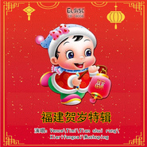

台语贺岁 福建贺岁特辑闽南语新年歌精选
============================

|  |  |
| :--: | :-- |
| [ 台语贺岁 福建贺岁特辑闽南语新年歌精选](https://emumo.xiami.com/album/2104399877) | **艺人**: [吴国良](../index.md) **语种**: 闽南语 **唱片公司**: 独立发行 **发行时间**: 2018年12月21日 **专辑类别**: 录音室专辑 **专辑风格**: 中国传统民歌 Chinese Traditional Folk, 闽南语流行 Bân-lâm-gú Pop **播放数**: 65219 **收藏数**: 55 **评论数**: 16  |

## 简介

编曲：张平福  
伴奏：时代大乐队  
编程：李惠红 

## 曲目

## 评论

|  |  |  |
| :-- | :-- | :-- |
|  [虾米用户](https://emumo.xiami.com/u/49954911)  2019-02-03 22:56 赞(1) 踩(0) | 
唱的真特么的难听
 |
| ⇒ |  [虾米用户](https://emumo.xiami.com/u/358531567)  2019-07-12 13:06 赞(0) 踩(0) | 
说明你没有音乐细胞~~怪物
 |
| ⇒ |  [虾米用户](https://emumo.xiami.com/u/121639856) 丰盛时代歌迷小姐 2020-01-25 14:23 赞(0) 踩(0) | 
<q><b>和赢说：</b></q>
 |
|  [虾米用户](https://emumo.xiami.com/u/121639856) 丰盛时代歌迷小姐 2018-12-26 11:56 赞(1) 踩(0) | 
2018.12.21--19:00
 |
|  [虾米用户](https://emumo.xiami.com/u/246717599) 我很愿意与喜欢可荔歌曲的... 2018-12-24 20:16 赞(2) 踩(0) | 
在CD2中 曲目6翻唱自小凤凤的【互相祝福】及蔡可荔的【看弄狮】 曲目7翻唱自蔡可荔的【新年有缘】 曲目8翻唱自蔡可荔的【新年如意】 曲目9翻唱自小凤凤的【新年打锣鼓】 曲目10翻唱自小凤凤的【弄狮弄龙贺新年】及小凤凤的【大发财】 尽管有些歌不确定是不是小凤凤原唱，不过这里面有些歌可以肯定是蔡可荔的原唱歌曲了。
 |
|  [虾米用户](https://emumo.xiami.com/u/246717599) 我很愿意与喜欢可荔歌曲的... 2018-12-24 20:02 赞(2) 踩(0) | 
其中CD1中 曲目1翻唱自小凤凤的【全家欢喜过好年】 曲目2翻唱自蔡可荔的【新年就好】 曲目3翻唱自蔡可荔的【锣鼓冬冬将】 曲目4翻唱自小凤凤的【五路财神照顾你】 曲目5翻唱自小凤凤的【祝你一年胜一年】及蔡可荔演唱的《头骠二骠三骠入围马赛统统来》
 |
|  [虾米用户](https://emumo.xiami.com/u/121639856) 丰盛时代歌迷小姐 2018-12-22 18:45 赞(2) 踩(0) | 
菜饱啃笑疯疯也是翻唱的，还唱得像车祸现场版！
 |
| ⇒ |  [虾米用户](https://emumo.xiami.com/u/246717599) 我很愿意与喜欢可荔歌曲的... 2018-12-24 20:16 赞(0) 踩(0) | 
其中CD1中 曲目1翻唱自小凤凤的【全家欢喜过好年】 曲目2翻唱自蔡可荔的【新年就好】 曲目3翻唱自蔡可荔的【锣鼓冬冬将】 曲目4翻唱自小凤凤的【五路财神照顾你】 曲目5翻唱自小凤凤的【祝你一年胜一年】及蔡可荔演唱的《头骠二骠三骠入围马赛统统来》 在CD2中 曲目6翻唱自小凤凤的【互相祝福】及蔡可荔的【看弄狮】 曲目7翻唱自蔡可荔的【新年有缘】 曲目8翻唱自蔡可荔的【新年如意】 曲目9翻唱自小凤凤的【新年打锣鼓】 曲目10翻唱自小凤凤的【弄狮弄龙贺新年】及小凤凤的【大发财】 尽管有些歌不确定是不是小凤凤原唱，不过这里面有些歌可以肯定是蔡可荔的原唱歌曲了。
 |
|  [虾米用户](https://emumo.xiami.com/u/121639856) 丰盛时代歌迷小姐 2018-12-21 23:28 赞(3) 踩(0) | 
只听歌，不评论，凡有菜饱啃葬霉岭粉丝来评论，让她一个人自言自语好了！
 |
|  [虾米用户](https://emumo.xiami.com/u/121639856) 丰盛时代歌迷小姐 2018-12-21 20:17 赞(2) 踩(0) | 
与五个女唱将！封面做得真好！ 
 |
|  [虾米用户](https://emumo.xiami.com/u/9359849) 后来我爱的人，都像你。 2018-12-21 19:23 赞(2) 踩(0) | 
預祝您新年快樂！！
 |
| ⇒ |  [虾米用户](https://emumo.xiami.com/u/235486247) 虾米音乐即将成为历史，不... 2018-12-21 19:27 赞(0) 踩(0) | 
祝大家新年快乐
 |
