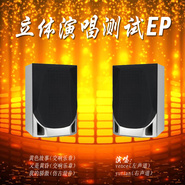

立体演唱测试EP黄色的故事
============================

|  |  |
| :--: | :-- |
| [ 立体演唱测试EP黄色的故事](https://emumo.xiami.com/album/2104732592) | **艺人**: [吴国良](../index.md) **语种**: 国语 **唱片公司**: 卓王文化 **发行时间**: 2019年04月23日 **专辑类别**: EP, 单曲 **专辑风格**: 交响乐 Symphonic Music **播放数**: 8021 **收藏数**: 8 **评论数**: 2  |

## 简介

立体演唱测试ep 

## 曲目

## 评论

